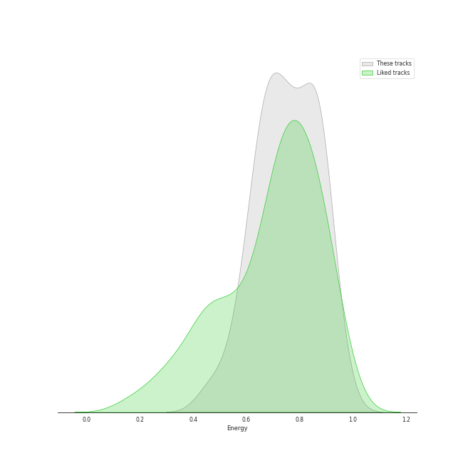
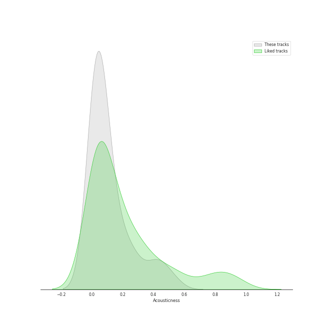
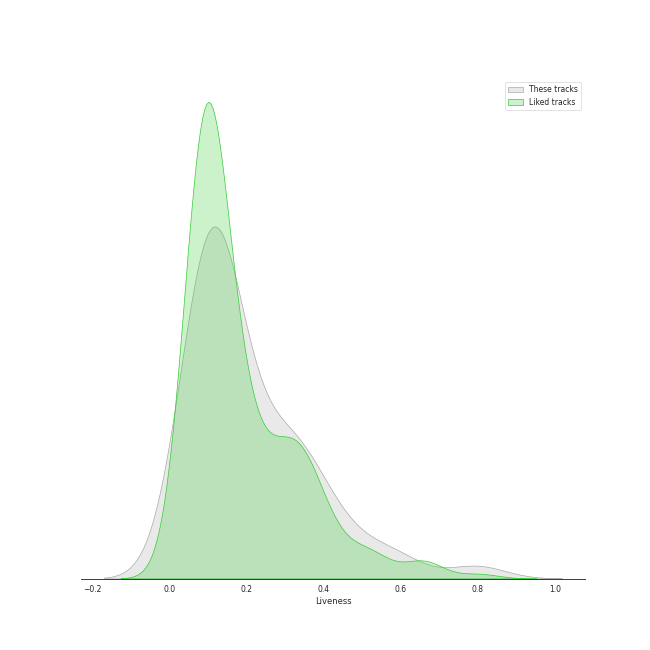
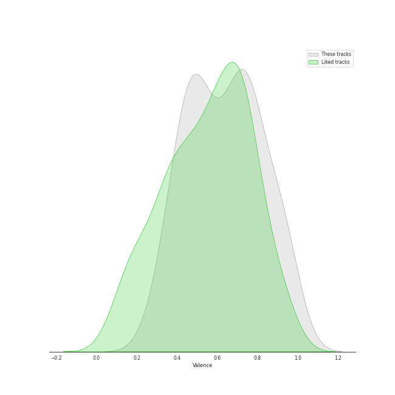
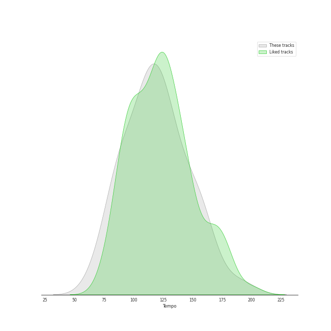

# Audio Features for ENHYPEN

## Danceability

| 10 most Danceable tracks | 10 least Danceable tracks |
|:---|:---|
| 10 Months (0.876) | Just A Little Bit (0.441) |
| Always (0.804) | Let Me In (20 CUBE) (0.483) |
| Go Big or Go Home (0.766) | SHOUT OUT (0.495) |
| Polaroid Love (0.738) | Attention, please! (0.498) |
| ParadoXXX Invasion (0.727) | Tamed-Dashed (0.568) |
| One In A Billion (0.719) | Not For Sale (0.583) |
| TFW (That Feeling When) (0.689) | I Need The Light (0.594) |
| Future Perfect (Pass the MIC) (0.658) | Drunk-Dazed (0.599) |
| Flicker (0.656) | FEVER (0.6) |
| Given-Taken (0.631) | Blessed-Cursed (0.604) |

## Energy

| 10 most Energetic tracks | 10 least Energetic tracks |
|:---|:---|
| One In A Billion (0.952) | Not For Sale (0.589) |
| Mixed Up (0.9) | Just A Little Bit (0.59) |
| Future Perfect (Pass the MIC) (0.9) | Given-Taken (0.649) |
| Blessed-Cursed (0.886) | Polaroid Love (0.67) |
| Upper Side Dreamin’ (0.886) | TFW (That Feeling When) (0.692) |
| Attention, please! (0.871) | FEVER (0.713) |
| I Need The Light (0.869) | 10 Months (0.73) |
| Drunk-Dazed (0.869) | Flicker (0.761) |
| ParadoXXX Invasion (0.863) | Always (0.771) |
| Go Big or Go Home (0.844) | Let Me In (20 CUBE) (0.795) |

## Speechiness

| 10 most Speechy tracks | 10 least Speechy tracks |
|:---|:---|
| Future Perfect (Pass the MIC) (0.264) | TFW (That Feeling When) (0.0354) |
| Mixed Up (0.236) | Given-Taken (0.0377) |
| Not For Sale (0.203) | Polaroid Love (0.0439) |
| Let Me In (20 CUBE) (0.181) | 10 Months (0.0492) |
| Flicker (0.092) | Attention, please! (0.0494) |
| ParadoXXX Invasion (0.0879) | Just A Little Bit (0.0514) |
| Upper Side Dreamin’ (0.0773) | Tamed-Dashed (0.0517) |
| I Need The Light (0.0728) | Go Big or Go Home (0.0575) |
| One In A Billion (0.0674) | Always (0.059) |
| SHOUT OUT (0.0671) | FEVER (0.0592) |

## Acousticness

| 10 most Acoustic tracks | 10 least Acoustic tracks |
|:---|:---|
| Polaroid Love (0.458) | Tamed-Dashed (0.000253) |
| Just A Little Bit (0.242) | Attention, please! (0.000483) |
| One In A Billion (0.197) | Drunk-Dazed (0.000707) |
| Given-Taken (0.17) | Let Me In (20 CUBE) (0.00258) |
| TFW (That Feeling When) (0.113) | SHOUT OUT (0.00315) |
| Blessed-Cursed (0.0925) | Flicker (0.00647) |
| FEVER (0.0642) | Upper Side Dreamin’ (0.0281) |
| I Need The Light (0.0638) | ParadoXXX Invasion (0.0298) |
| Not For Sale (0.0612) | 10 Months (0.0345) |
| Go Big or Go Home (0.0502) | Future Perfect (Pass the MIC) (0.0364) |

## Instrumentalness

| 10 most Instrumental tracks | 10 least Instrumental tracks |
|:---|:---|
| Tamed-Dashed (3.33e-05) | FEVER (0.0) |
| Flicker (3.35e-06) | Drunk-Dazed (0.0) |
| 10 Months (1.11e-06) | ParadoXXX Invasion (0.0) |
| Blessed-Cursed (0.0) | Just A Little Bit (0.0) |
| Upper Side Dreamin’ (0.0) | TFW (That Feeling When) (0.0) |
| Always (0.0) | Not For Sale (0.0) |
| Mixed Up (0.0) | Let Me In (20 CUBE) (0.0) |
| Future Perfect (Pass the MIC) (0.0) | Attention, please! (0.0) |
| Go Big or Go Home (0.0) | SHOUT OUT (0.0) |
| I Need The Light (0.0) | Polaroid Love (0.0) |

## Liveness

| 10 most Live tracks | 10 least Live tracks |
|:---|:---|
| Blessed-Cursed (0.596) | Future Perfect (Pass the MIC) (0.0771) |
| SHOUT OUT (0.459) | Drunk-Dazed (0.0911) |
| Upper Side Dreamin’ (0.446) | Let Me In (20 CUBE) (0.0912) |
| Polaroid Love (0.361) | Not For Sale (0.108) |
| Just A Little Bit (0.349) | Always (0.109) |
| I Need The Light (0.346) | 10 Months (0.11) |
| ParadoXXX Invasion (0.334) | TFW (That Feeling When) (0.134) |
| Given-Taken (0.321) | One In A Billion (0.14) |
| Attention, please! (0.279) | FEVER (0.142) |
| Go Big or Go Home (0.269) | Tamed-Dashed (0.151) |

## Valence

| 10 most Happy tracks | 10 least Happy tracks |
|:---|:---|
| TFW (That Feeling When) (0.902) | Blessed-Cursed (0.401) |
| Go Big or Go Home (0.823) | Just A Little Bit (0.411) |
| I Need The Light (0.802) | One In A Billion (0.446) |
| Upper Side Dreamin’ (0.783) | Drunk-Dazed (0.453) |
| Mixed Up (0.773) | Given-Taken (0.459) |
| Always (0.73) | FEVER (0.471) |
| ParadoXXX Invasion (0.72) | SHOUT OUT (0.486) |
| 10 Months (0.709) | Future Perfect (Pass the MIC) (0.526) |
| Tamed-Dashed (0.709) | Flicker (0.549) |
| Let Me In (20 CUBE) (0.685) | Not For Sale (0.56) |

## Tempo

| 10 most Fast tracks | 10 least Fast tracks |
|:---|:---|
| Not For Sale (192.13) | FEVER (72.999) |
| Let Me In (20 CUBE) (171.853) | Just A Little Bit (84.633) |
| SHOUT OUT (159.989) | Flicker (85.149) |
| Mixed Up (156.889) | ParadoXXX Invasion (94.952) |
| Future Perfect (Pass the MIC) (156.096) | Upper Side Dreamin’ (106.02) |
| Tamed-Dashed (155.029) | Given-Taken (108.07) |
| I Need The Light (152.113) | 10 Months (110.006) |
| Attention, please! (150.035) | Always (110.014) |
| Polaroid Love (138.055) | TFW (That Feeling When) (116.024) |
| Drunk-Dazed (132.889) | One In A Billion (119.957) |
