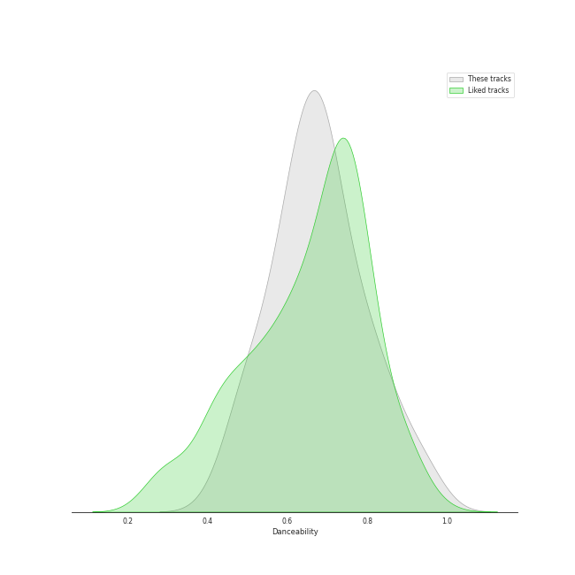
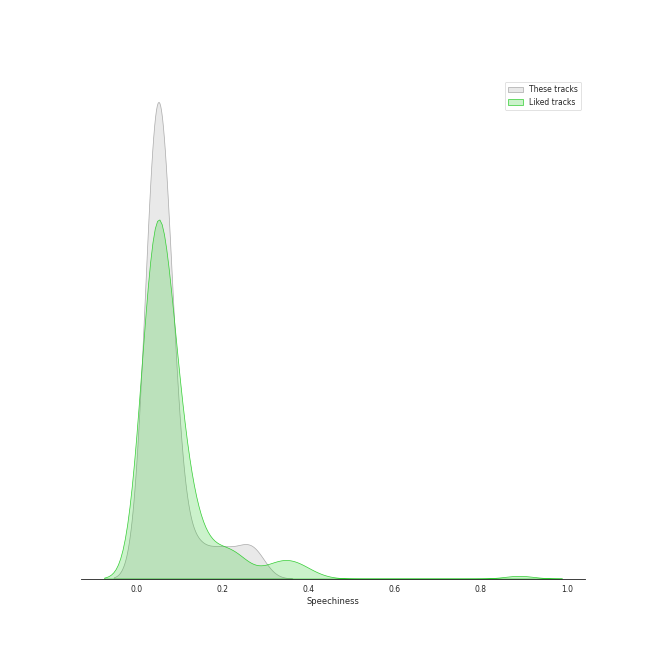
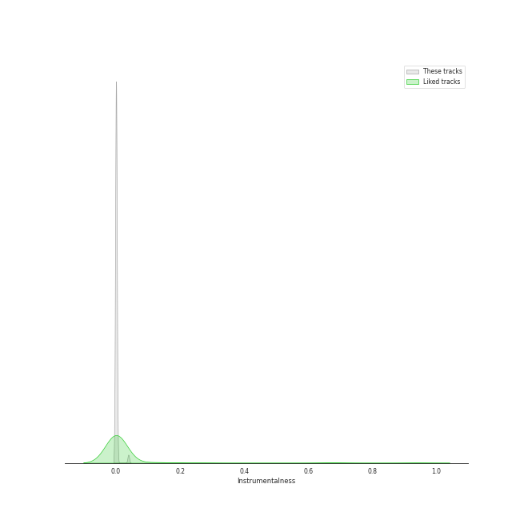

# Track Features for ENHYPEN

## Danceability

| ​ | 10 most Danceable tracks | ​​ | 10 least Danceable tracks |
|:---|:---|:---|:---|
|  | Billy Poco (0.935) |  | Just A Little Bit (0.441) |
|  | 10 Months (0.876) |  | Let Me In (20 CUBE) (0.483) |
|  | Sweet Venom (feat. Bella Poarch) (0.869) |  | SHOUT OUT (0.495) |
|  | Sweet Venom (English Ver.) (0.866) |  | Attention, please! (0.498) |
|  | Sweet Venom (0.84) |  | Sacrifice (Eat Me Up) (0.536) |
|  | Always (0.804) |  | Tamed-Dashed (0.568) |
|  | Bite Me (0.795) |  | Not For Sale (0.583) |
|  | Hey Tayo - Tayo Opening Theme Song (0.785) |  | I Need The Light (0.594) |
|  | Go Big or Go Home (0.766) |  | Drunk-Dazed (0.599) |
|  | Polaroid Love (0.738) |  | FEVER (0.6) |

## Energy

| ​ | 10 most Energetic tracks | ​​ | 10 least Energetic tracks |
|:---|:---|:---|:---|
|  | One In A Billion (0.952) |  | Bills (0.579) |
|  | Mixed Up (0.9) |  | Not For Sale (0.589) |
|  | Future Perfect (Pass the MIC) (0.9) |  | Just A Little Bit (0.59) |
|  | Blessed-Cursed (0.886) |  | Chaconne (0.644) |
|  | Upper Side Dreamin’ (0.886) |  | Given-Taken (0.649) |
|  | Attention, please! (0.871) |  | Sweet Venom (English Ver.) (0.666) |
|  | I Need The Light (0.869) |  | Polaroid Love (0.67) |
|  | Drunk-Dazed (0.869) |  | Hey Tayo - Tayo Opening Theme Song (0.672) |
|  | ParadoXXX Invasion (0.863) |  | Sweet Venom (0.673) |
|  | Keep Swimmin' Through (0.856) |  | Sweet Venom (feat. Bella Poarch) (0.675) |

## Speechiness

| ​ | 10 most Speechy tracks | ​​ | 10 least Speechy tracks |
|:---|:---|:---|:---|
|  | Future Perfect (Pass the MIC) (0.264) |  | Hey Tayo - Tayo Opening Theme Song (0.0306) |
|  | Mixed Up (0.236) |  | Orange Flower (You Complete Me) (0.0324) |
|  | Not For Sale (0.203) |  | TFW (That Feeling When) (0.0354) |
|  | Let Me In (20 CUBE) (0.181) |  | Given-Taken (0.0377) |
|  | Bite Me (0.141) |  | CRIMINAL LOVE (0.0379) |
|  | Flicker (0.092) |  | Sweet Venom (0.0427) |
|  | ParadoXXX Invasion (0.0879) |  | Still Monster (0.0434) |
|  | Sacrifice (Eat Me Up) (0.085) |  | Polaroid Love (0.0439) |
|  | Upper Side Dreamin’ (0.0773) |  | Sweet Venom (feat. Bella Poarch) (0.0473) |
|  | I Need The Light (0.0728) |  | One and Only (0.048) |

## Acousticness

| ​ | 10 most Acoustic tracks | ​​ | 10 least Acoustic tracks |
|:---|:---|:---|:---|
|  | Polaroid Love (0.458) |  | Tamed-Dashed (0.000253) |
|  | Sacrifice (Eat Me Up) (0.444) |  | Attention, please! (0.000483) |
|  | One and Only (0.404) |  | Drunk-Dazed (0.000707) |
|  | Still Monster (0.372) |  | Let Me In (20 CUBE) (0.00258) |
|  | Bite Me (0.285) |  | SHOUT OUT (0.00315) |
|  | Just A Little Bit (0.242) |  | Flicker (0.00647) |
|  | One In A Billion (0.197) |  | Upper Side Dreamin’ (0.0281) |
|  | Given-Taken (0.17) |  | ParadoXXX Invasion (0.0298) |
|  | Orange Flower (You Complete Me) (0.165) |  | 10 Months (0.0345) |
|  | Hey Tayo - Tayo Opening Theme Song (0.119) |  | Billy Poco (0.0355) |

## Instrumentalness

| ​ | 10 most Instrumental tracks | ​​ | 10 least Instrumental tracks |
|:---|:---|:---|:---|
|  | Billy Poco (9.38e-05) |  | CRIMINAL LOVE (0.0) |
|  | Tamed-Dashed (3.33e-05) |  | FEVER (0.0) |
|  | Sweet Venom (feat. Bella Poarch) (8.55e-06) |  | Drunk-Dazed (0.0) |
|  | Sweet Venom (English Ver.) (5.83e-06) |  | Hey Tayo - Tayo Opening Theme Song (0.0) |
|  | Flicker (3.35e-06) |  | Sweet Venom (0.0) |
|  | 10 Months (1.11e-06) |  | Bills (0.0) |
|  | Chaconne (0.0) |  | Keep Swimmin' Through (0.0) |
|  | Bite Me (0.0) |  | ParadoXXX Invasion (0.0) |
|  | Blessed-Cursed (0.0) |  | Just A Little Bit (0.0) |
|  | One and Only (0.0) |  | TFW (That Feeling When) (0.0) |

## Liveness

| ​ | 10 most Live tracks | ​​ | 10 least Live tracks |
|:---|:---|:---|:---|
|  | Keep Swimmin' Through (0.796) |  | Billy Poco (0.0537) |
|  | Blessed-Cursed (0.596) |  | Hey Tayo - Tayo Opening Theme Song (0.0554) |
|  | SHOUT OUT (0.459) |  | Chaconne (0.0581) |
|  | Upper Side Dreamin’ (0.446) |  | Future Perfect (Pass the MIC) (0.0771) |
|  | CRIMINAL LOVE (0.404) |  | Drunk-Dazed (0.0911) |
|  | Polaroid Love (0.361) |  | Let Me In (20 CUBE) (0.0912) |
|  | Just A Little Bit (0.349) |  | One and Only (0.0916) |
|  | I Need The Light (0.346) |  | Sweet Venom (0.0971) |
|  | ParadoXXX Invasion (0.334) |  | Sweet Venom (English Ver.) (0.0975) |
|  | Given-Taken (0.321) |  | Sacrifice (Eat Me Up) (0.102) |

## Valence

| ​ | 10 most Happy tracks | ​​ | 10 least Happy tracks |
|:---|:---|:---|:---|
|  | Billy Poco (0.964) |  | Bills (0.347) |
|  | Keep Swimmin' Through (0.939) |  | Blessed-Cursed (0.401) |
|  | One and Only (0.936) |  | Just A Little Bit (0.411) |
|  | Sweet Venom (0.911) |  | One In A Billion (0.446) |
|  | Sweet Venom (English Ver.) (0.905) |  | Still Monster (0.446) |
|  | TFW (That Feeling When) (0.902) |  | Drunk-Dazed (0.453) |
|  | Sweet Venom (feat. Bella Poarch) (0.896) |  | Given-Taken (0.459) |
|  | Go Big or Go Home (0.823) |  | Chaconne (0.462) |
|  | I Need The Light (0.802) |  | FEVER (0.471) |
|  | Upper Side Dreamin’ (0.783) |  | SHOUT OUT (0.486) |

## Tempo

| ​ | 10 most Fast tracks | ​​ | 10 least Fast tracks |
|:---|:---|:---|:---|
|  | Not For Sale (192.13) |  | Sacrifice (Eat Me Up) (68.985) |
|  | Let Me In (20 CUBE) (171.853) |  | FEVER (72.999) |
|  | SHOUT OUT (159.989) |  | Just A Little Bit (84.633) |
|  | Mixed Up (156.889) |  | Flicker (85.149) |
|  | Future Perfect (Pass the MIC) (156.096) |  | Bills (88.98) |
|  | Tamed-Dashed (155.029) |  | CRIMINAL LOVE (89.995) |
|  | I Need The Light (152.113) |  | ParadoXXX Invasion (94.952) |
|  | Attention, please! (150.035) |  | Bite Me (104.972) |
|  | Chaconne (139.959) |  | Upper Side Dreamin’ (106.02) |
|  | Polaroid Love (138.055) |  | Given-Taken (108.07) |
