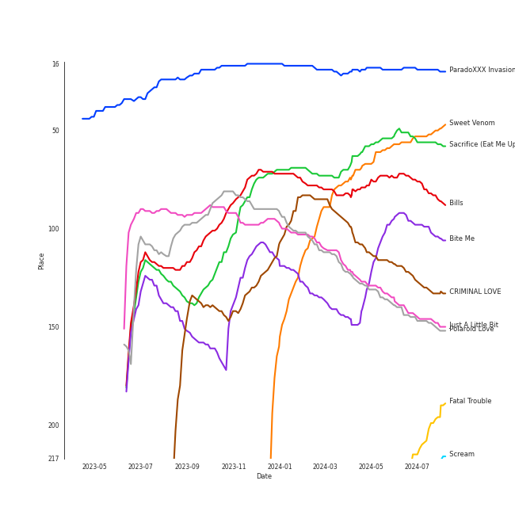

# ENHYPEN

[See Track Features](audio_features.md)

[See Clusters](clusters/overview.md)

## Relationships

ENHYPEN:
- has member JAKE
- has member JAY
- has member 김선우 (Kim, Sun-oo)
- has member 이희승 (Lee, Hee-seung)
- has member NI-KI
- has member 박성훈 (Park, Sung-hoon)
- has member 양정원 (Yang, Jung-won)

## Artist Rank
ENHYPEN is currently:
- The #16 artist of the last month
- The #13 artist of the last 6 months
- The #5 artist of all time

## Top Tracks

- Sacrifice (Eat Me Up) is the #10 track of all time
- Bite Me is the #16 track of all time
- Bills is the #22 track of all time
- Sweet Venom is:
    - the #6 track of the last 6 months
    - the #33 track of all time
- Fatal Trouble is the #14 track of the On Repeat playlist
- Teeth is the #21 track of the On Repeat playlist

### Top tracks, aggregated

### Top tracks of all time over time

### Top tracks of the last 6 months over time

## Featured on Playlists
| Art | Tracks | Playlist |
|:---|---:|:---|
|  | 35 | [K-Pop](../../playlists/k-pop/overview.md) |
|  | 11 | [K-Pop Favorites](../../playlists/k-pop_favorites/overview.md) |
|  | 9 | [Summer](../../playlists/summer/overview.md) |
|  | 8 | [Sharon RPD](../../playlists/sharon_rpd/overview.md) |
|  | 8 | [Workout](../../playlists/workout/overview.md) |
|  | 7 | [Chill](../../playlists/chill/overview.md) |
|  | 6 | [애교！](../../playlists/애교！/overview.md) |
|  | 6 | [Your Top Songs 2023](../../playlists/your_top_songs_2023/overview.md) |
|  | 5 | [Halloween](../../playlists/halloween/overview.md) |
|  | 4 | [Recent Comebacks](../../playlists/recent_comebacks/overview.md) |
|  | 3 | [K-Memes](../../playlists/k-memes/overview.md) |
|  | 3 | [Your Top Songs 2022](../../playlists/your_top_songs_2022/overview.md) |
|  | 2 | [Recommendations for Chris](../../playlists/recommendations_for_chris/overview.md) |
|  | 2 | [On Repeat](../../playlists/on_repeat/overview.md) |
|  | 2 | [Cursed English](../../playlists/cursed_english/overview.md) |
|  | 1 | [Repeat Rewind](../../playlists/repeat_rewind/overview.md) |
|  | 1 | [K-Pop 101](../../playlists/k-pop_101/overview.md) |
|  | 1 | [Funk](../../playlists/funk/overview.md) |

## Top Albums

| Art | Tracks | 💚 | Album | Release Date | 🔗 |
|:---|---:|---:|:---|:---|:---|
|  | 5 | 5 | DIMENSION : DILEMMA | 2021-10-12 | [🔗](https://open.spotify.com/album/5jGRqioNCSWZGBl3QmyuFI) |
|  | 5 | 4 | DARK BLOOD | 2023-05-22 | [🔗](https://open.spotify.com/album/7q65W5gVANjh1j1KXLeU0f) |
|  | 4 | 4 | MANIFESTO : DAY 1 | 2022-07-04 | [🔗](https://open.spotify.com/album/5J8MNLLViH5zqM6VoGErz8) |
|  | 4 | 4 | DARK MOON SPECIAL ALBUM <MEMORABILIA> | 2024-05-13 | [🔗](https://open.spotify.com/album/0OhJwEzXbK9Km6GQSPdmPU) |
|  | 4 | 3 | BORDER : DAY ONE | 2020-11-30 | [🔗](https://open.spotify.com/album/3YxF7jTnpdNepWbO42f8lH) |
|  | 4 | 3 | BORDER : CARNIVAL | 2021-04-26 | [🔗](https://open.spotify.com/album/4LGYBcRsteiXjcPD4QQvxv) |
|  | 4 | 2 | ORANGE BLOOD | 2023-11-17 | [🔗](https://open.spotify.com/album/7dsAlxH9cMgyREm8OLdWWT) |
|  | 2 | 2 | DIMENSION : ANSWER | 2022-01-10 | [🔗](https://open.spotify.com/album/3nOj9hsnptBEDt9ie2lra5) |
|  | 1 | 1 | One and Only | 2023-07-11 | [🔗](https://open.spotify.com/album/5LGe47qZJTNwtM8gUfT7Mx) |
|  | 1 | 1 | One In A Billion | 2022-09-06 | [🔗](https://open.spotify.com/album/19Jm8Jk0zQYs6zMaxhYJFd) |

See all albums

| Art | Tracks | 💚 | Album | Release Date | 🔗 |
|:---|---:|---:|:---|:---|:---|
|  | 1 | 1 | CRIMINAL LOVE | 2023-07-31 | [🔗](https://open.spotify.com/album/6S8BCiVrtzm5TEOnjyyCfJ) |
|  | 1 | 1 | Always | 2022-02-21 | [🔗](https://open.spotify.com/album/0kwAgLzLnzQxaKcdubyaMh) |
|  | 1 | 0 | What Makes You Beautiful [THE SEASONS: Red Carpet with Lee Hyo Ri] | 2024-02-23 | [🔗](https://open.spotify.com/album/3RvguzRz56wqZ9fNldExgn) |
|  | 1 | 0 | Keep Swimmin' Through | 2023-11-03 | [🔗](https://open.spotify.com/album/3DuL4EFBmwfcEle2TTQNY2) |
|  | 1 | 0 | I Need The Light | 2022-08-12 | [🔗](https://open.spotify.com/album/4RAx28on33NHM5FQiFhyvZ) |
|  | 1 | 0 | HEY TAYO | 2021-07-29 | [🔗](https://open.spotify.com/album/2i0irlNjTfYPohsFPIK8J0) |
|  | 1 | 0 | BILLY POCO | 2021-08-11 | [🔗](https://open.spotify.com/album/053egZ9MnXOGmLMQUiFPfZ) |

## Top Record Labels

| Tracks | 💚 | Label |
|---:|---:|:---|
| 34 | 29 | [BELIFT LAB](../../labels/belift_lab/overview.md) |
| 2 | 2 | [Universal Music LLC](../../labels/universal_music_llc/overview.md) |
| 2 | 0 | [Stone Music Entertainment](../../labels/stone_music_entertainment/overview.md) |
| 2 | 0 | ICONIX CO. |
| 2 | 0 | [Genie Music Corporation](../../labels/genie_music_corporation/overview.md) |
| 1 | 0 | Pinkfong |

## Genres

- [anime](../../genres/anime/overview.md)
- [k-pop boy group](../../genres/k-pop_boy_group/overview.md)

## Tracks

| Art | Track | Album | Artists | Label | Rank | 💚 | 🔗 |
|:---|:---|:---|:---|:---|---:|:---|:---|
|  | ParadoXXX Invasion | MANIFESTO : DAY 1 | [ENHYPEN](overview.md) | [BELIFT LAB](../../labels/belift_lab) | 19 | 💚 | [🔗](https://open.spotify.com/track/3OC2C8IpFhbUJTeMe55QYn) |
|  | Sacrifice (Eat Me Up) | DARK BLOOD | [ENHYPEN](overview.md) | [BELIFT LAB](../../labels/belift_lab) | 54 | 💚 | [🔗](https://open.spotify.com/track/58ItBuVuKc03DvqSeZFnH1) |
|  | Sweet Venom | ORANGE BLOOD | [ENHYPEN](overview.md) | [BELIFT LAB](../../labels/belift_lab) | 59 | 💚 | [🔗](https://open.spotify.com/track/2YmfV4lAjrAQvuggKCUX6m) |
|  | Bills | DARK BLOOD | [ENHYPEN](overview.md) | [BELIFT LAB](../../labels/belift_lab) | 73 | 💚 | [🔗](https://open.spotify.com/track/2nfluhFVrO5OBXPzRWlwlz) |
|  | Bite Me | DARK BLOOD | [ENHYPEN](overview.md) | [BELIFT LAB](../../labels/belift_lab) | 98 | 💚 | [🔗](https://open.spotify.com/track/7mpdNiaQvygj2rHoxkzMfa) |
|  | CRIMINAL LOVE | CRIMINAL LOVE | [ENHYPEN](overview.md) | [BELIFT LAB](../../labels/belift_lab) | 116 | 💚 | [🔗](https://open.spotify.com/track/0Eglu3fErlG196PtTwCUPM) |
|  | Just A Little Bit | DIMENSION : DILEMMA | [ENHYPEN](overview.md) | [BELIFT LAB](../../labels/belift_lab) | 133 | 💚 | [🔗](https://open.spotify.com/track/3QdjLOemIcMZovVOnvJP7P) |
|  | Polaroid Love | DIMENSION : ANSWER | [ENHYPEN](overview.md) | [BELIFT LAB](../../labels/belift_lab) | 136 | 💚 | [🔗](https://open.spotify.com/track/5elW2CKSoqjYoJ32AGDxf1) |
|  | FEVER | BORDER : CARNIVAL | [ENHYPEN](overview.md) | [BELIFT LAB](../../labels/belift_lab) | 209 | 💚 | [🔗](https://open.spotify.com/track/0UzymivvUH5s8z4PeWZJaK) |
|  | Chaconne | DARK BLOOD | [ENHYPEN](overview.md) | [BELIFT LAB](../../labels/belift_lab) | 302 | 💚 | [🔗](https://open.spotify.com/track/7nBjhYbLttb9LHZHqNuld5) |

See all tracks

| Art | Track | Album | Artists | Label | Rank | 💚 | 🔗 |
|:---|:---|:---|:---|:---|---:|:---|:---|
|  | Sweet Venom (English Ver.) | ORANGE BLOOD | [ENHYPEN](overview.md) | [BELIFT LAB](../../labels/belift_lab) | 319 | | [🔗](https://open.spotify.com/track/47JqJobasbTT9r0gX8CoE1) |
|  | One and Only | One and Only | [ENHYPEN](overview.md) | [Universal Music LLC](../../labels/universal_music_llc) | 323 | 💚 | [🔗](https://open.spotify.com/track/7dDY45rR3idfeCypFDrk0G) |
|  | Not For Sale | BORDER : CARNIVAL | [ENHYPEN](overview.md) | [BELIFT LAB](../../labels/belift_lab) | 337 | 💚 | [🔗](https://open.spotify.com/track/3dG1jxbfBIZvzyFwAcsmS0) |
|  | Upper Side Dreamin’ | DIMENSION : DILEMMA | [ENHYPEN](overview.md) | [BELIFT LAB](../../labels/belift_lab) | 355 | 💚 | [🔗](https://open.spotify.com/track/6oSCR9n71tmwWL3GFb65Ec) |
|  | Fate | DARK BLOOD | [ENHYPEN](overview.md) | [BELIFT LAB](../../labels/belift_lab) | 444 | | [🔗](https://open.spotify.com/track/0iLyNDLTsBkqB8SLAzNGxF) |
|  | Drunk-Dazed | BORDER : CARNIVAL | [ENHYPEN](overview.md) | [BELIFT LAB](../../labels/belift_lab) | 528 | 💚 | [🔗](https://open.spotify.com/track/1wcr8DjnN59Awev8nnKpQ4) |
|  | Always | Always | [ENHYPEN](overview.md) | [Universal Music LLC](../../labels/universal_music_llc) | 553 | 💚 | [🔗](https://open.spotify.com/track/6bLZ6JV1mAGz4xfS1ZwOMV) |
|  | Given-Taken | BORDER : DAY ONE | [ENHYPEN](overview.md) | [BELIFT LAB](../../labels/belift_lab) | 571 | 💚 | [🔗](https://open.spotify.com/track/69WpV0U7OMNFGyq8I63dcC) |
|  | Teeth | DARK MOON SPECIAL ALBUM <MEMORABILIA> | [ENHYPEN](overview.md) | [BELIFT LAB](../../labels/belift_lab) | 604 | 💚 | [🔗](https://open.spotify.com/track/6JlQqA7FDfqLbnpJBwypPe) |
|  | Tamed-Dashed | DIMENSION : DILEMMA | [ENHYPEN](overview.md) | [BELIFT LAB](../../labels/belift_lab) | 605 | 💚 | [🔗](https://open.spotify.com/track/1zoyteFQmeUUqyOl2Xznpy) |
|  | Fatal Trouble | DARK MOON SPECIAL ALBUM <MEMORABILIA> | [ENHYPEN](overview.md) | [BELIFT LAB](../../labels/belift_lab) | 620 | 💚 | [🔗](https://open.spotify.com/track/6i1PYoUEMHqxAsAUKHkqpe) |
|  | 10 Months | BORDER : DAY ONE | [ENHYPEN](overview.md) | [BELIFT LAB](../../labels/belift_lab) | nan | 💚 | [🔗](https://open.spotify.com/track/3LcFQsZw01tRvjCNLgSmTv) |
|  | Flicker | BORDER : DAY ONE | [ENHYPEN](overview.md) | [BELIFT LAB](../../labels/belift_lab) | nan | | [🔗](https://open.spotify.com/track/3TgPwLFXV6GEIsDZANHktY) |
|  | Let Me In (20 CUBE) | BORDER : DAY ONE | [ENHYPEN](overview.md) | [BELIFT LAB](../../labels/belift_lab) | nan | 💚 | [🔗](https://open.spotify.com/track/4eOcd47wPU3ixxYw0spREl) |
|  | Mixed Up | BORDER : CARNIVAL | [ENHYPEN](overview.md) | [BELIFT LAB](../../labels/belift_lab) | nan | | [🔗](https://open.spotify.com/track/6S0By3u06ttb3kU2XEtWnw) |
|  | Hey Tayo - Tayo Opening Theme Song | HEY TAYO | [ENHYPEN](overview.md) | ICONIX CO., LTD. | nan | | [🔗](https://open.spotify.com/track/2A7A3KF4NHFjW3ygFSt7In) |
|  | Billy Poco | BILLY POCO | [ENHYPEN](overview.md) | ICONIX CO., LTD. | nan | | [🔗](https://open.spotify.com/track/2qxk6ZQyhE6OKHCG448nIt) |
|  | Attention, please! | DIMENSION : DILEMMA | [ENHYPEN](overview.md) | [BELIFT LAB](../../labels/belift_lab) | nan | 💚 | [🔗](https://open.spotify.com/track/59qDYPZPkMPl8qSYRig1xn) |
|  | Go Big or Go Home | DIMENSION : DILEMMA | [ENHYPEN](overview.md) | [BELIFT LAB](../../labels/belift_lab) | nan | 💚 | [🔗](https://open.spotify.com/track/6IqKFke4ZhKbGYULllEezY) |
|  | Blessed-Cursed | DIMENSION : ANSWER | [ENHYPEN](overview.md) | [BELIFT LAB](../../labels/belift_lab) | nan | 💚 | [🔗](https://open.spotify.com/track/7ecbsiAQ6PNdiAq0hplVZo) |
|  | Future Perfect (Pass the MIC) | MANIFESTO : DAY 1 | [ENHYPEN](overview.md) | [BELIFT LAB](../../labels/belift_lab) | nan | 💚 | [🔗](https://open.spotify.com/track/6PRy17C5LiiN7VCLS6IA98) |
|  | SHOUT OUT | MANIFESTO : DAY 1 | [ENHYPEN](overview.md) | [BELIFT LAB](../../labels/belift_lab) | nan | 💚 | [🔗](https://open.spotify.com/track/5Z2DNRAhs6r4VdINVkRhYY) |
|  | TFW (That Feeling When) | MANIFESTO : DAY 1 | [ENHYPEN](overview.md) | [BELIFT LAB](../../labels/belift_lab) | nan | 💚 | [🔗](https://open.spotify.com/track/3bI34Ts8OMPfIpoPqzyZgM) |
|  | I Need The Light | I Need The Light | [ENHYPEN](overview.md) | [Genie Music Corporation](../../labels/genie_music_corporation), [Stone Music Entertainment](../../labels/stone_music_entertainment) | nan | | [🔗](https://open.spotify.com/track/69mhZKG0nDbSK7NoINWEsE) |
|  | One In A Billion | One In A Billion | [ENHYPEN](overview.md) | [BELIFT LAB](../../labels/belift_lab) | nan | 💚 | [🔗](https://open.spotify.com/track/66wQlkJP6zHNOzRkyo5yZS) |
|  | Keep Swimmin' Through | Keep Swimmin' Through | [ENHYPEN](overview.md), The Cast of Baby Shark's Big Movie, Pinkfong | Pinkfong | nan | | [🔗](https://open.spotify.com/track/2uXvTCV3s5LN9mdDW7hAkn) |
|  | Orange Flower (You Complete Me) | ORANGE BLOOD | [ENHYPEN](overview.md) | [BELIFT LAB](../../labels/belift_lab) | nan | | [🔗](https://open.spotify.com/track/5Cb3JSisvjlZhjSfYD6d7C) |
|  | Still Monster | ORANGE BLOOD | [ENHYPEN](overview.md) | [BELIFT LAB](../../labels/belift_lab) | nan | 💚 | [🔗](https://open.spotify.com/track/6tuTpe37ljVcrJeZAAKBE1) |
|  | What Makes You Beautiful | What Makes You Beautiful [THE SEASONS: Red Carpet with Lee Hyo Ri] | [ENHYPEN](overview.md) | [Genie Music Corporation](../../labels/genie_music_corporation), [Stone Music Entertainment](../../labels/stone_music_entertainment) | nan | | [🔗](https://open.spotify.com/track/4NxbUHGeXsQgxvR8YKbHjC) |
|  | Lucifer | DARK MOON SPECIAL ALBUM <MEMORABILIA> | [ENHYPEN](overview.md) | [BELIFT LAB](../../labels/belift_lab) | nan | 💚 | [🔗](https://open.spotify.com/track/7Fq4xDlMtpqca0IyTYXldY) |
|  | Scream | DARK MOON SPECIAL ALBUM <MEMORABILIA> | [ENHYPEN](overview.md) | [BELIFT LAB](../../labels/belift_lab) | nan | 💚 | [🔗](https://open.spotify.com/track/1kgg5vR9QCW72RTNQTaSRH) |

