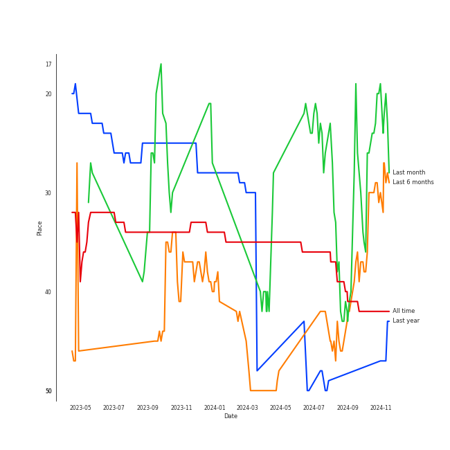

# EVERGLOW

## Artist Rank
EVERGLOW is currently:
- The #27 artist of all time

## Featured on Playlists
| Art | Tracks | Playlist |
|:---|---:|:---|
|  | 7 | [K-Pop](../../playlists/k_pop/overview.md) |
|  | 4 | [Workout](../../playlists/workout/overview.md) |
|  | 2 | [K-Pop Favorites](../../playlists/k_pop_favorites/overview.md) |
|  | 1 | [K-Pop 101](../../playlists/k_pop_101/overview.md) |
|  | 1 | [K-Memes](../../playlists/k_memes/overview.md) |
## Top Albums

| Art | Tracks | 💚 | Album | Release Date | 🔗 |
|:---|---:|---:|:---|:---|:---|
|  | 2 | 2 | Return of The Girl | 2021-12-01 | [🔗](https://open.spotify.com/album/28p4jKCNlbLUXaZ24iYLuD) |
|  | 1 | 1 | reminiscence | 2020-02-03 | [🔗](https://open.spotify.com/album/0zH0C0fkzAjhSnGKLOuxwX) |
|  | 1 | 1 | Last Melody | 2021-05-25 | [🔗](https://open.spotify.com/album/4ZDUTnUO9CDFmwdCUCQ6dG) |
|  | 1 | 1 | HUSH | 2019-08-19 | [🔗](https://open.spotify.com/album/7cGql7l8oRpjGmeDspBMZ2) |
|  | 1 | 1 | -77.82x-78.29 | 2020-09-21 | [🔗](https://open.spotify.com/album/4kMID9cggWEko9mOb1zisI) |
|  | 1 | 0 | ARRIVAL OF EVERGLOW | 2019-03-18 | [🔗](https://open.spotify.com/album/4qFVcLDapqLmjinahsk7U0) |

## Top Record Labels

| Tracks | 💚 | Label |
|---:|---:|:---|
| 6 | 5 | [Stone Music Entertainment](../../labels/stone_music_entertainment/overview.md) |
| 6 | 5 | [Genie Music Corporation](../../labels/genie_music_corporation/overview.md) |
| 1 | 1 | YUEHUA ENTERTAINMENT KOREA |

## Genres

- [k-pop](../../genres/k_pop)
- [k-pop girl group](../../genres/k_pop_girl_group)

## Tracks

| Art | Track | Album | Artists | Label | 💚 | 🔗 |
|:---|:---|:---|:---|:---|:---|:---|
|  | Bon Bon Chocolat | ARRIVAL OF EVERGLOW | [EVERGLOW](overview.md) | [Genie Music Corporation](../../labels/genie_music_corporation), [Stone Music Entertainment](../../labels/stone_music_entertainment) | | [🔗](https://open.spotify.com/track/5XS0GCCIotaI6XtsYcIKeX) |
|  | Adios | HUSH | [EVERGLOW](overview.md) | [Genie Music Corporation](../../labels/genie_music_corporation), [Stone Music Entertainment](../../labels/stone_music_entertainment) | 💚 | [🔗](https://open.spotify.com/track/0sq2QUCf3ykmfYxjCDWcir) |
|  | DUN DUN | reminiscence | [EVERGLOW](overview.md) | [Genie Music Corporation](../../labels/genie_music_corporation), [Stone Music Entertainment](../../labels/stone_music_entertainment) | 💚 | [🔗](https://open.spotify.com/track/3ejAkJLWQSEJDqDXxK3efB) |
|  | LA DI DA | -77.82x-78.29 | [EVERGLOW](overview.md) | YUEHUA ENTERTAINMENT KOREA | 💚 | [🔗](https://open.spotify.com/track/6mIjJONoUMvGPT9Kzrab3L) |
|  | FIRST | Last Melody | [EVERGLOW](overview.md) | [Genie Music Corporation](../../labels/genie_music_corporation), [Stone Music Entertainment](../../labels/stone_music_entertainment) | 💚 | [🔗](https://open.spotify.com/track/021L6LlBBtr34BmFRHd9Ic) |
|  | Don’t Speak | Return of The Girl | [EVERGLOW](overview.md) | [Genie Music Corporation](../../labels/genie_music_corporation), [Stone Music Entertainment](../../labels/stone_music_entertainment) | 💚 | [🔗](https://open.spotify.com/track/4rTXasoYr4RICJeGRk5cnD) |
|  | Pirate | Return of The Girl | [EVERGLOW](overview.md) | [Genie Music Corporation](../../labels/genie_music_corporation), [Stone Music Entertainment](../../labels/stone_music_entertainment) | 💚 | [🔗](https://open.spotify.com/track/0Vu5tjvXZX3qtzRiezxLi1) |