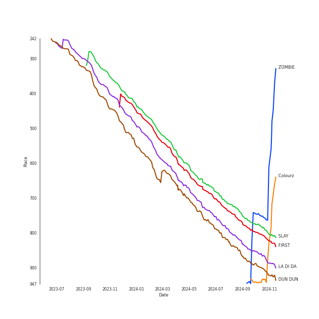
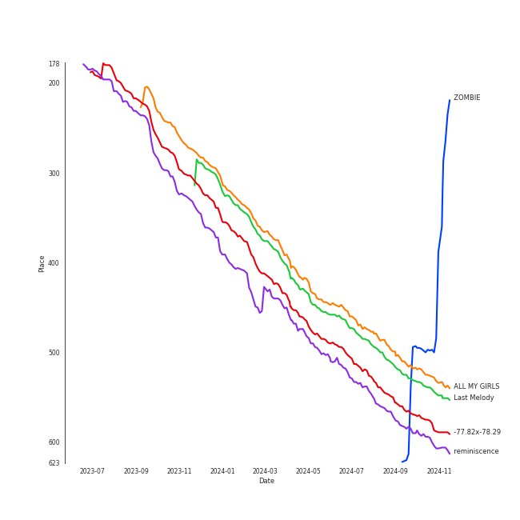

# EVERGLOW

## Relationships

EVERGLOW:
- has member 아샤 (Aisha)
- has member E:U
- has member 미아 (Mia)
- has member 온다 (Onda)
- has member 시현 (Sihyeon)
- has member 王怡人 (Wang, Yiren)

## Artist Rank
EVERGLOW is currently:
- The #27 artist of the last month
- The #46 artist of the last 6 months
- The #37 artist of all time

## Top Tracks

### Top tracks of all time

## Top Albums

| Art | Rank | Tracks | 💚 | Album | Release Date | 🔗 |
|:---|---:|---:|---:|:---|:---|:---|
|  | 610 | 2 | 2 | ZOMBIE | 2024-06-10 | [🔗](https://open.spotify.com/album/6vGrWJmYXU9VqiqpOwPJ2r) |
|  | 610 | 2 | 2 | Return of The Girl | 2021-12-01 | [🔗](https://open.spotify.com/album/28p4jKCNlbLUXaZ24iYLuD) |
|  | 560 | 1 | 1 | reminiscence | 2020-02-03 | [🔗](https://open.spotify.com/album/0zH0C0fkzAjhSnGKLOuxwX) |
|  | 496 | 1 | 1 | Last Melody | 2021-05-25 | [🔗](https://open.spotify.com/album/4ZDUTnUO9CDFmwdCUCQ6dG) |
|  | 610 | 1 | 1 | HUSH | 2019-08-19 | [🔗](https://open.spotify.com/album/7cGql7l8oRpjGmeDspBMZ2) |
|  | 610 | 1 | 1 | ARRIVAL OF EVERGLOW | 2019-03-18 | [🔗](https://open.spotify.com/album/4qFVcLDapqLmjinahsk7U0) |
|  | 480 | 1 | 1 | ALL MY GIRLS | 2023-08-18 | [🔗](https://open.spotify.com/album/2yjigHf9lgspW2K5y99Qr0) |
|  | 536 | 1 | 1 | -77.82x-78.29 | 2020-09-21 | [🔗](https://open.spotify.com/album/4kMID9cggWEko9mOb1zisI) |

## Featured on Playlists
| Art | Tracks | Playlist |
|:---|---:|:---|
|  | 10 | [K-Pop](../../playlists/k-pop/overview.md) |
|  | 5 | [Workout](../../playlists/workout/overview.md) |
|  | 3 | [K-Pop Favorites](../../playlists/k-pop_favorites/overview.md) |
|  | 2 | [Recent Comebacks](../../playlists/recent_comebacks/overview.md) |
|  | 1 | [K-Pop 101](../../playlists/k-pop_101/overview.md) |
|  | 1 | [Your Top Songs 2023](../../playlists/your_top_songs_2023/overview.md) |
|  | 1 | [K-Memes](../../playlists/k-memes/overview.md) |
|  | 1 | [Halloween](../../playlists/halloween/overview.md) |

## Top Record Labels

| Tracks | 💚 | Label |
|---:|---:|:---|
| 9 | 9 | [Stone Music Entertainment](../../labels/stone_music_entertainment/overview.md) |
| 9 | 9 | [Genie Music Corporation](../../labels/genie_music_corporation/overview.md) |
| 1 | 1 | YUEHUA ENTERTAINMENT KOREA |

## Genres

- [k-pop](../../genres/k-pop/overview.md)
- [k-pop girl group](../../genres/k-pop_girl_group/overview.md)

## Credits

### Member Credits

| | E:U |
|:---|---:|
| Lyricist | 1 |
### Production Credits

| Art | Track | Members | Credit Types |
|:---|:---|:---|:---|
|  | LA DI DA | E:U | Lyricist |

## Top Producers

| Art | Producer | Tracks | Credit Types |
|:---|:---|---:|:---|
| | Gavin Jones | 2 | Songwriter |
| | 72 | 2 | Lyricist, Songwriter |
| | Hayley Aitken | 2 | Songwriter |
| | Olof Lindskog | 1 | Songwriter |
| | Ollipop | 1 | Songwriter |
| | 이스란 (Lee, Seran) | 1 | Lyricist |
| | E:U | 1 | Lyricist |
| | [서지음 (Seo, Ji Eum)](../../producers/서지음_(seo,_ji_eum)/overview.md) | 1 | Lyricist |

## Tracks

| Art | Track | Album | Artists | Label | Rank | 💚 | 🔗 |
|:---|:---|:---|:---|:---|---:|:---|:---|
|  | SLAY | ALL MY GIRLS | [EVERGLOW](overview.md) | [Genie Music Corporation](../../labels/genie_music_corporation), [Stone Music Entertainment](../../labels/stone_music_entertainment) | 720 | 💚 | [🔗](https://open.spotify.com/track/32Ao6xLLir3dPOhQGvqgSB) |
|  | FIRST | Last Melody | [EVERGLOW](overview.md) | [Genie Music Corporation](../../labels/genie_music_corporation), [Stone Music Entertainment](../../labels/stone_music_entertainment) | 743 | 💚 | [🔗](https://open.spotify.com/track/021L6LlBBtr34BmFRHd9Ic) |
|  | LA DI DA | -77.82x-78.29 | [EVERGLOW](overview.md) | YUEHUA ENTERTAINMENT KOREA | 804 | 💚 | [🔗](https://open.spotify.com/track/6mIjJONoUMvGPT9Kzrab3L) |
|  | DUN DUN | reminiscence | [EVERGLOW](overview.md) | [Genie Music Corporation](../../labels/genie_music_corporation), [Stone Music Entertainment](../../labels/stone_music_entertainment) | 837 | 💚 | [🔗](https://open.spotify.com/track/3ejAkJLWQSEJDqDXxK3efB) |
|  | Bon Bon Chocolat | ARRIVAL OF EVERGLOW | [EVERGLOW](overview.md) | [Genie Music Corporation](../../labels/genie_music_corporation), [Stone Music Entertainment](../../labels/stone_music_entertainment) | 917 | 💚 | [🔗](https://open.spotify.com/track/5XS0GCCIotaI6XtsYcIKeX) |
|  | Adios | HUSH | [EVERGLOW](overview.md) | [Genie Music Corporation](../../labels/genie_music_corporation), [Stone Music Entertainment](../../labels/stone_music_entertainment) | 917 | 💚 | [🔗](https://open.spotify.com/track/0sq2QUCf3ykmfYxjCDWcir) |
|  | Don’t Speak | Return of The Girl | [EVERGLOW](overview.md) | [Genie Music Corporation](../../labels/genie_music_corporation), [Stone Music Entertainment](../../labels/stone_music_entertainment) | 917 | 💚 | [🔗](https://open.spotify.com/track/4rTXasoYr4RICJeGRk5cnD) |
|  | Pirate | Return of The Girl | [EVERGLOW](overview.md) | [Genie Music Corporation](../../labels/genie_music_corporation), [Stone Music Entertainment](../../labels/stone_music_entertainment) | 917 | 💚 | [🔗](https://open.spotify.com/track/0Vu5tjvXZX3qtzRiezxLi1) |
|  | Colourz | ZOMBIE | [EVERGLOW](overview.md) | [Genie Music Corporation](../../labels/genie_music_corporation), [Stone Music Entertainment](../../labels/stone_music_entertainment) | 917 | 💚 | [🔗](https://open.spotify.com/track/5y6iVRaRIbiLbTj2eUM2WL) |
|  | ZOMBIE | ZOMBIE | [EVERGLOW](overview.md) | [Genie Music Corporation](../../labels/genie_music_corporation), [Stone Music Entertainment](../../labels/stone_music_entertainment) | 917 | 💚 | [🔗](https://open.spotify.com/track/57RkVmnj3b1FUJoUdkSuZD) |
