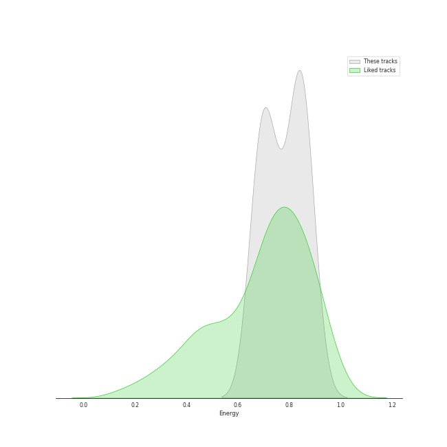
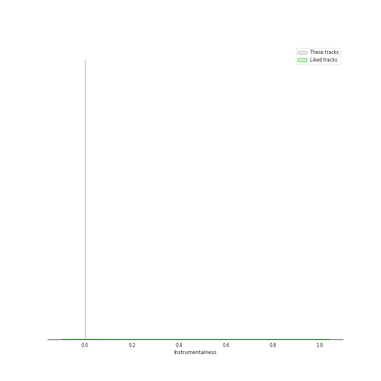
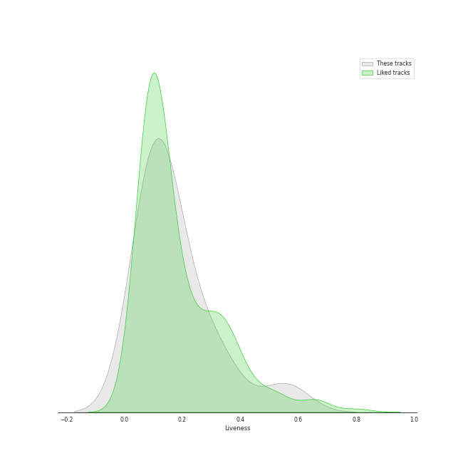
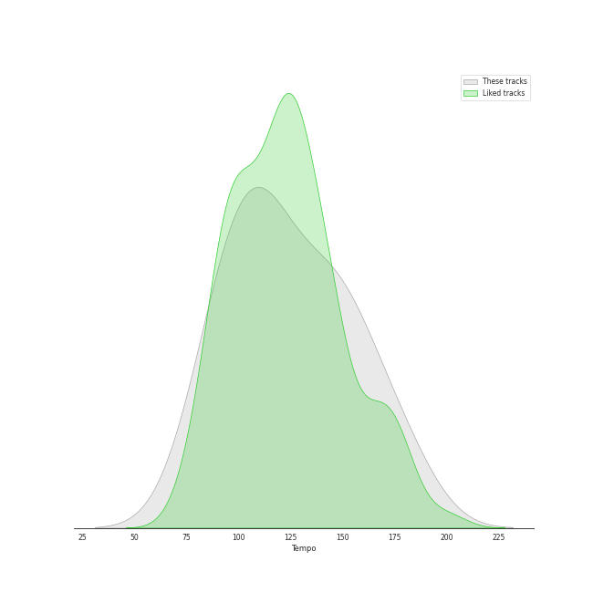

# Audio Features for EXO

## Danceability

| 10 most Danceable tracks | 10 least Danceable tracks |
|:---|:---|
| Paradise (0.799) | Runaway (0.425) |
| Ko Ko Bop (0.749) | The First Snow - Chinese Version (0.592) |
| No matter (0.712) | Monster (0.618) |
| Gravity (0.693) | LOVE ME RIGHT (0.625) |
| CALL ME BABY (0.692) | The First Snow (0.636) |
| Love Shot (0.689) | The Eve (0.636) |
| Tempo (0.686) | 첫 눈 (0.636) |
| Growl (0.681) | Growl (0.681) |
| 첫 눈 (0.636) | Tempo (0.686) |
| The Eve (0.636) | Love Shot (0.689) |

## Energy

| 10 most Energetic tracks | 10 least Energetic tracks |
|:---|:---|
| CALL ME BABY (0.886) | The First Snow (0.674) |
| Gravity (0.864) | 첫 눈 (0.674) |
| Ko Ko Bop (0.85) | Love Shot (0.678) |
| Tempo (0.842) | The First Snow - Chinese Version (0.678) |
| No matter (0.837) | The Eve (0.702) |
| LOVE ME RIGHT (0.83) | Runaway (0.723) |
| Growl (0.814) | Paradise (0.731) |
| Monster (0.76) | Monster (0.76) |
| Paradise (0.731) | Growl (0.814) |
| Runaway (0.723) | LOVE ME RIGHT (0.83) |

## Speechiness

| 10 most Speechy tracks | 10 least Speechy tracks |
|:---|:---|
| Love Shot (0.119) | The Eve (0.0334) |
| Tempo (0.1) | The First Snow (0.0444) |
| Gravity (0.0807) | 첫 눈 (0.0444) |
| LOVE ME RIGHT (0.0764) | Ko Ko Bop (0.0468) |
| Paradise (0.0743) | CALL ME BABY (0.0519) |
| Runaway (0.0685) | The First Snow - Chinese Version (0.0535) |
| Growl (0.0603) | No matter (0.0539) |
| Monster (0.0596) | Monster (0.0596) |
| No matter (0.0539) | Growl (0.0603) |
| The First Snow - Chinese Version (0.0535) | Runaway (0.0685) |

## Acousticness

| 10 most Acoustic tracks | 10 least Acoustic tracks |
|:---|:---|
| Paradise (0.351) | LOVE ME RIGHT (0.00266) |
| CALL ME BABY (0.284) | The First Snow (0.00542) |
| Runaway (0.264) | 첫 눈 (0.00542) |
| Tempo (0.237) | Monster (0.0066) |
| Growl (0.145) | The First Snow - Chinese Version (0.0101) |
| Gravity (0.0711) | The Eve (0.0223) |
| Love Shot (0.0702) | Ko Ko Bop (0.0319) |
| No matter (0.0595) | No matter (0.0595) |
| Ko Ko Bop (0.0319) | Love Shot (0.0702) |
| The Eve (0.0223) | Gravity (0.0711) |

## Instrumentalness

| 10 most Instrumental tracks | 10 least Instrumental tracks |
|:---|:---|
| Ko Ko Bop (4.81e-05) | Paradise (0.0) |
| The First Snow - Chinese Version (0.0) | Love Shot (0.0) |
| Monster (0.0) | LOVE ME RIGHT (0.0) |
| CALL ME BABY (0.0) | Runaway (0.0) |
| No matter (0.0) | Gravity (0.0) |
| Growl (0.0) | The First Snow (0.0) |
| Tempo (0.0) | The Eve (0.0) |
| 첫 눈 (0.0) | 첫 눈 (0.0) |
| The Eve (0.0) | Tempo (0.0) |
| The First Snow (0.0) | Growl (0.0) |

## Liveness

| 10 most Live tracks | 10 least Live tracks |
|:---|:---|
| Growl (0.556) | Ko Ko Bop (0.0678) |
| CALL ME BABY (0.341) | Tempo (0.0683) |
| The Eve (0.293) | Love Shot (0.0889) |
| No matter (0.209) | Paradise (0.0903) |
| LOVE ME RIGHT (0.188) | Gravity (0.0961) |
| 첫 눈 (0.145) | The First Snow - Chinese Version (0.119) |
| The First Snow (0.145) | Runaway (0.121) |
| Monster (0.127) | Monster (0.127) |
| Runaway (0.121) | The First Snow (0.145) |
| The First Snow - Chinese Version (0.119) | 첫 눈 (0.145) |

## Valence

| 10 most Happy tracks | 10 least Happy tracks |
|:---|:---|
| CALL ME BABY (0.879) | Runaway (0.31) |
| Growl (0.876) | Love Shot (0.335) |
| 첫 눈 (0.814) | No matter (0.433) |
| The First Snow (0.814) | The Eve (0.516) |
| The First Snow - Chinese Version (0.795) | Tempo (0.519) |
| LOVE ME RIGHT (0.757) | Monster (0.541) |
| Gravity (0.695) | Paradise (0.648) |
| Ko Ko Bop (0.672) | Ko Ko Bop (0.672) |
| Paradise (0.648) | Gravity (0.695) |
| Monster (0.541) | LOVE ME RIGHT (0.757) |

## Tempo

| 10 most Fast tracks | 10 least Fast tracks |
|:---|:---|
| Runaway (179.848) | The First Snow (82.985) |
| The First Snow - Chinese Version (165.978) | 첫 눈 (82.985) |
| Monster (150.0) | Growl (89.993) |
| Ko Ko Bop (145.983) | No matter (97.977) |
| Love Shot (145.883) | CALL ME BABY (100.03) |
| The Eve (135.104) | LOVE ME RIGHT (110.04) |
| Gravity (117.961) | Paradise (111.991) |
| Tempo (115.944) | Tempo (115.944) |
| Paradise (111.991) | Gravity (117.961) |
| LOVE ME RIGHT (110.04) | The Eve (135.104) |
