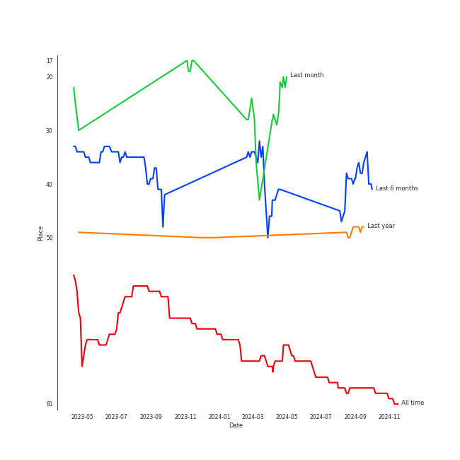
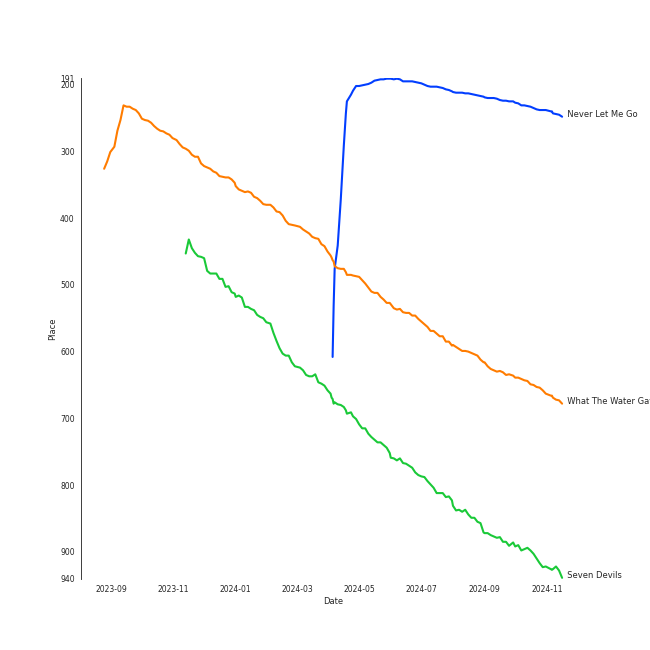

# Florence + The Machine

[See Track Features](audio_features.md)

[See Clusters](clusters/overview.md)

## Relationships

Florence + The Machine:
- has member Robert Ackroyd
- has member Rusty Bradshaw
- has member Christopher Lloyd Hayden
- has member Tom Moth
- has member Mark Saunders
- has member Isabella Summers
- has member Florence Welch

## Artist Rank
Florence + The Machine is currently:
- The #28 artist of the last month
- The #43 artist of the last 6 months

## Top Tracks

- Never Let Me Go is the #18 track of the last month

### Top tracks, aggregated

## Featured on Playlists
| Art | Tracks | Playlist |
|:---|---:|:---|
|  | 16 | [Alt-Pop](../../playlists/alt-pop/overview.md) |
|  | 3 | [A-Pop Favorites](../../playlists/a-pop_favorites/overview.md) |
|  | 2 | [Summer](../../playlists/summer/overview.md) |
|  | 2 | [Halloween](../../playlists/halloween/overview.md) |
|  | 1 | [Karaoke](../../playlists/karaoke/overview.md) |
|  | 1 | [Tarps](../../playlists/tarps/overview.md) |

## Top Albums

| Art | Tracks | 💚 | Album | Release Date | 🔗 |
|:---|---:|---:|:---|:---|:---|
|  | 6 | 6 | Lungs (Deluxe Edition) | 2009 | [🔗](https://open.spotify.com/album/2FgknX5e7fJlriQtxvpLhZ) |
|  | 6 | 6 | Ceremonials (Deluxe Edition) | 2011-01-01 | [🔗](https://open.spotify.com/album/5SxudoALxEAVh9l83kSebx) |
|  | 3 | 2 | How Big, How Blue, How Beautiful | 2015-06-01 | [🔗](https://open.spotify.com/album/2btszoya78vyT8fwelmVnz) |
|  | 1 | 0 | High As Hope | 2018-06-29 | [🔗](https://open.spotify.com/album/0pKZJj9GzcKPCS8r4IaksA) |

## Top Record Labels

| Tracks | 💚 | Label |
|---:|---:|:---|
| 15 | 14 | [Universal-Island Records Ltd.](../../labels/universal-island_records_ltd_/overview.md) |
| 1 | 0 | [EMI](../../labels/emi/overview.md) |

## Genres

- baroque pop
- [electropop](../../genres/electropop/overview.md)
- [modern rock](../../genres/modern_rock/overview.md)
- [neo mellow](../../genres/neo_mellow/overview.md)
- [uk alternative pop](../../genres/uk_alternative_pop/overview.md)

## Credits

### Member Credits

| | Christopher Lloyd Hayden | Isabella Summers | Mark Saunders | Robert Ackroyd | Rusty Bradshaw | Tom Moth | [Florence Welch](../../producers/florence_welch/overview.md) |
|:---|---:|---:|---:|---:|---:|---:|---:|
| Arranger | 0 | 0 | 0 | 0 | 0 | 1 | 1 |
| Instrument | 17 | 10 | 7 | 12 | 6 | 17 | 1 |
| Lyricist | 0 | 1 | 0 | 0 | 0 | 0 | 6 |
| Producer | 0 | 6 | 0 | 0 | 0 | 0 | 1 |
| Songwriter | 0 | 9 | 0 | 0 | 0 | 0 | 18 |
| Vocal | 5 | 0 | 5 | 0 | 0 | 0 | 20 |
### Production Credits

| Art | Track | Members | Credit Types |
|:---|:---|:---|:---|
|  | Dog Days Are Over | [Florence Welch](../../../producers/florence_welch/overview.md), Isabella Summers | Songwriter, Producer |
|  | I'm Not Calling You A Liar | [Florence Welch](../../../producers/florence_welch/overview.md), Isabella Summers | Songwriter, Producer |
|  | Between Two Lungs | [Florence Welch](../../../producers/florence_welch/overview.md), Isabella Summers | Songwriter, Producer |
|  | Lover To Lover | [Florence Welch](../../../producers/florence_welch/overview.md) | Lyricist, Songwriter |
|  | What The Water Gave Me | [Florence Welch](../../../producers/florence_welch/overview.md) | Lyricist, Songwriter |
|  | Shake It Out | [Florence Welch](../../../producers/florence_welch/overview.md) | Lyricist, Songwriter |
|  | No Light, No Light | [Florence Welch](../../../producers/florence_welch/overview.md), Isabella Summers | Lyricist, Songwriter |
|  | Seven Devils | [Florence Welch](../../../producers/florence_welch/overview.md) | Lyricist, Songwriter |
|  | Never Let Me Go | [Florence Welch](../../../producers/florence_welch/overview.md) | Lyricist, Songwriter |
|  | Delilah | [Florence Welch](../../../producers/florence_welch/overview.md), Isabella Summers | Songwriter |

View all

| Art | Track | Members | Credit Types |
|:---|:---|:---|:---|
|  | How Big, How Blue, How Beautiful | [Florence Welch](../../../producers/florence_welch/overview.md), Isabella Summers | Songwriter |
| | nan | [Florence Welch](../../../producers/florence_welch/overview.md) | Songwriter |
| | nan | [Florence Welch](../../../producers/florence_welch/overview.md) | Songwriter |
| | nan | [Florence Welch](../../../producers/florence_welch/overview.md), Tom Moth | Arranger, Producer, Songwriter |

## Top Producers

| Art | Producer | Tracks | Credit Types |
|:---|:---|---:|:---|
| | [Florence Welch](../../producers/florence_welch/overview.md) | 12 | Lyricist, Songwriter |
| | [Paul Epworth](../../producers/paul_epworth/overview.md) | 7 | Producer, Lyricist, Songwriter |
| | Isabella Summers | 6 | Songwriter, Producer, Lyricist |
| | Craig Silvey | 4 | Producer |
| | Cenzo Townshend | 4 | Producer |
| | James Ford | 3 | Producer |
| | Sally Herbert | 3 | Arranger |
| | Jimmy Robertson | 3 | Producer |
| | [Kid Harpoon](../../producers/kid_harpoon/overview.md) | 2 | Songwriter |
| | Markus Dravs | 2 | Producer |

View all

| Art | Producer | Tracks | Credit Types |
|:---|:---|---:|:---|
| | Tom Elmhirst | 2 | Producer |
| | Bullion | 2 | Producer |
| | [Mark "Spike" Stent](../../producers/mark__spike__stent/overview.md) | 2 | Producer |
| | Robin Baynton | 2 | Producer |
| | Mat Bartram | 1 | Producer |
| | Francis White | 1 | Lyricist, Songwriter |
| | Brian Degraw | 1 | Songwriter |
| | Ali Helnwein | 1 | Arranger |
| | Will Owen | 1 | Arranger |
| | Charlie Hugall | 1 | Producer |
| | Lizzi Bougatsos | 1 | Songwriter |
| | Rush | 1 | Songwriter |
| | John Bellamy | 1 | Songwriter |
| | Tim Dewit | 1 | Songwriter |
| | Mark "Top" Rankin | 1 | Producer |
| | Anthony B. Stephens | 1 | Songwriter |
| | Pete Prokopiw | 1 | Producer |
| | Arnecia Michelle Harris | 1 | Songwriter |
| | Josh Diamond | 1 | Songwriter |

## Tracks

| Art | Track | Album | Artists | Label | Rank | 💚 | 🔗 |
|:---|:---|:---|:---|:---|---:|:---|:---|
|  | What The Water Gave Me | Ceremonials (Deluxe Edition) | [Florence + The Machine](overview.md) | [Universal-Island Records Ltd.](../../labels/universal-island_records_ltd_) | 469 | 💚 | [🔗](https://open.spotify.com/track/3RiOPzAvhNKuMIdPYOrKV8) |
|  | Never Let Me Go | Ceremonials (Deluxe Edition) | [Florence + The Machine](overview.md) | [Universal-Island Records Ltd.](../../labels/universal-island_records_ltd_) | 534 | 💚 | [🔗](https://open.spotify.com/track/6cC9RY7MoUx5z3aHjDTNI6) |
|  | Seven Devils | Ceremonials (Deluxe Edition) | [Florence + The Machine](overview.md) | [Universal-Island Records Ltd.](../../labels/universal-island_records_ltd_) | 681 | 💚 | [🔗](https://open.spotify.com/track/5qaLfqAUiqvsoL0l4T05Yx) |
|  | Between Two Lungs | Lungs (Deluxe Edition) | [Florence + The Machine](overview.md) | [Universal-Island Records Ltd.](../../labels/universal-island_records_ltd_) | nan | 💚 | [🔗](https://open.spotify.com/track/5WnYyCWBbJyLChmd2sbZK9) |
|  | Dog Days Are Over | Lungs (Deluxe Edition) | [Florence + The Machine](overview.md) | [Universal-Island Records Ltd.](../../labels/universal-island_records_ltd_) | nan | 💚 | [🔗](https://open.spotify.com/track/1YLJVmuzeM2YSUkCCaTNUB) |
|  | I'm Not Calling You A Liar | Lungs (Deluxe Edition) | [Florence + The Machine](overview.md) | [Universal-Island Records Ltd.](../../labels/universal-island_records_ltd_) | nan | 💚 | [🔗](https://open.spotify.com/track/3euILOYDltKArnqpupsE1W) |
|  | Kiss With A Fist | Lungs (Deluxe Edition) | [Florence + The Machine](overview.md) | [Universal-Island Records Ltd.](../../labels/universal-island_records_ltd_) | nan | 💚 | [🔗](https://open.spotify.com/track/0jv5OcbvTUHgO8FgHhya8b) |
|  | Rabbit Heart (Raise It Up) | Lungs (Deluxe Edition) | [Florence + The Machine](overview.md) | [Universal-Island Records Ltd.](../../labels/universal-island_records_ltd_) | nan | 💚 | [🔗](https://open.spotify.com/track/5RoLLyMmaEG4WiVMlp7r59) |
|  | You've Got The Love | Lungs (Deluxe Edition) | [Florence + The Machine](overview.md) | [Universal-Island Records Ltd.](../../labels/universal-island_records_ltd_) | nan | 💚 | [🔗](https://open.spotify.com/track/6u9RqxALwkjJ1ukB1y8vuP) |
|  | Lover To Lover | Ceremonials (Deluxe Edition) | [Florence + The Machine](overview.md) | [Universal-Island Records Ltd.](../../labels/universal-island_records_ltd_) | nan | 💚 | [🔗](https://open.spotify.com/track/1LsZVVQxkbmL9izqfy1RRK) |

See all tracks

| Art | Track | Album | Artists | Label | Rank | 💚 | 🔗 |
|:---|:---|:---|:---|:---|---:|:---|:---|
|  | No Light, No Light | Ceremonials (Deluxe Edition) | [Florence + The Machine](overview.md) | [Universal-Island Records Ltd.](../../labels/universal-island_records_ltd_) | nan | 💚 | [🔗](https://open.spotify.com/track/5nkYDYUSb1bvLJ4nP8CnQ1) |
|  | Shake It Out | Ceremonials (Deluxe Edition) | [Florence + The Machine](overview.md) | [Universal-Island Records Ltd.](../../labels/universal-island_records_ltd_) | nan | 💚 | [🔗](https://open.spotify.com/track/4lY95OMGb9WxP6IYut64ir) |
|  | Delilah | How Big, How Blue, How Beautiful | [Florence + The Machine](overview.md) | [Universal-Island Records Ltd.](../../labels/universal-island_records_ltd_) | nan | 💚 | [🔗](https://open.spotify.com/track/3o9qzsqkT0mvfxcusUaXsN) |
|  | How Big, How Blue, How Beautiful | How Big, How Blue, How Beautiful | [Florence + The Machine](overview.md) | [Universal-Island Records Ltd.](../../labels/universal-island_records_ltd_) | nan | 💚 | [🔗](https://open.spotify.com/track/7GlwvJ8iAbCEfZjGq3iwmZ) |
|  | What Kind Of Man | How Big, How Blue, How Beautiful | [Florence + The Machine](overview.md) | [Universal-Island Records Ltd.](../../labels/universal-island_records_ltd_) | nan | | [🔗](https://open.spotify.com/track/2ZE1EiHnmtdiv9KAJTGeRq) |
|  | Hunger | High As Hope | [Florence + The Machine](overview.md) | [EMI](../../labels/emi) | nan | | [🔗](https://open.spotify.com/track/6Ju28M6P8Y8sLjBgWjyUUD) |

