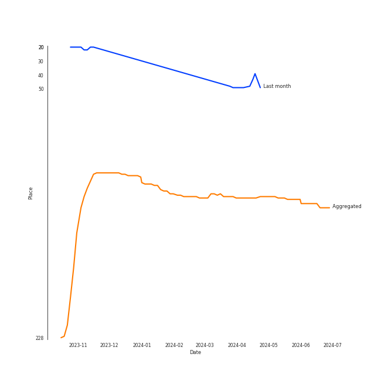
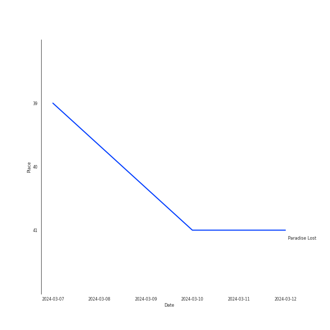

# Gain

## Artist Rank

## Top Tracks

- Paradise Lost is the #48 track of the last 6 months

### Top tracks of the last 6 months over time

## Featured on Playlists
| Art | Tracks | Playlist |
|:---|---:|:---|
|  | 6 | [K-Pop](../../playlists/k-pop/overview.md) |
|  | 1 | [Halloween](../../playlists/halloween/overview.md) |
|  | 1 | [Chill](../../playlists/chill/overview.md) |

## Top Albums

| Art | Tracks | 💚 | Album | Release Date | 🔗 |
|:---|---:|---:|:---|:---|:---|
|  | 2 | 2 | Talk about S. | 2012-10-05 | [🔗](https://open.spotify.com/album/0gVRGN17vkeY9z4mXiPr8i) |
|  | 2 | 2 | End Again | 2016-09-09 | [🔗](https://open.spotify.com/album/1Lb5NVfPBTadR5jl6Vpkdq) |
|  | 1 | 1 | Romantic Spring | 2013-04-08 | [🔗](https://open.spotify.com/album/2eMwg6w5Hq171Rfn8RakOj) |
|  | 1 | 1 | Hawwah | 2015-03-12 | [🔗](https://open.spotify.com/album/1fghVqJ812j2fqPYrSFd0Q) |

## Top Record Labels

| Tracks | 💚 | Label |
|---:|---:|:---|
| 3 | 3 | MYSTIC Entertainment |
| 3 | 3 | Kakao M Corp. |
| 3 | 3 | APOP Entertainment |

## Genres

- [k-pop](../../genres/k-pop/overview.md)

## Tracks

| Art | Track | Album | Artists | Label | Score | 💚 | 🔗 |
|:---|:---|:---|:---|:---|---:|:---|:---|
|  | Paradise Lost | Hawwah | [Gain](overview.md) | APOP Entertainment, MYSTIC Entertainment | 652 | 💚 | [🔗](https://open.spotify.com/track/1PVluFXbdOTv29475JS2Mj) |
|  | Bloom | Talk about S. | [Gain](overview.md) | Kakao M Corp. | 0 | 💚 | [🔗](https://open.spotify.com/track/3lcdPSfDGg11Qyimx2ONYH) |
|  | Tinkerbell | Talk about S. | [Gain](overview.md) | Kakao M Corp. | 0 | 💚 | [🔗](https://open.spotify.com/track/2KCMmpIOEl1Ydb3I9jIaYp) |
|  | Brunch | Romantic Spring | [Gain](overview.md), HYUNGWOO | Kakao M Corp. | 0 | 💚 | [🔗](https://open.spotify.com/track/5wiWryEZLvo30nopnOEbdJ) |
|  | Carnival (The Last Day) | End Again | [Gain](overview.md) | APOP Entertainment, MYSTIC Entertainment | 0 | 💚 | [🔗](https://open.spotify.com/track/1wFwU41aWXC5wb7ycY9q61) |
|  | Carrie (The First Day) | End Again | [Gain](overview.md) | APOP Entertainment, MYSTIC Entertainment | 0 | 💚 | [🔗](https://open.spotify.com/track/5n2Z6Z4Tw6hkbMqY4lT24u) |
