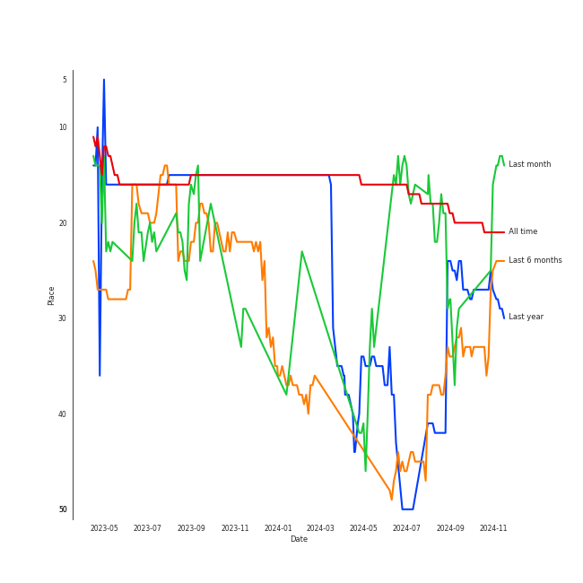
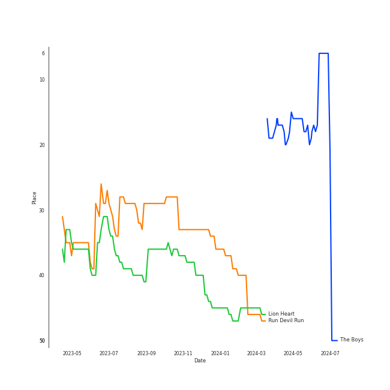
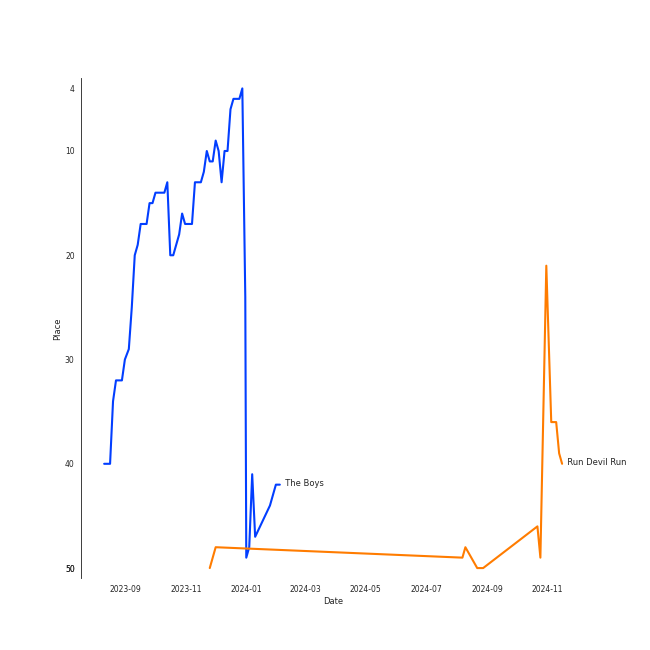

# Girls' Generation

[See Track Features](audio_features.md)

[See Clusters](clusters/overview.md)

## Relationships

Girls' Generation:
- has member HYOYEON
- has member HYO
- has member Jessica
- has member 서현 (SEOHYUN)
- has member SUNNY
- has member 수영 (Sooyoung)
- has member [TAEYEON](../taeyeon/overview.md)
- has member YURI
- has member 윤아 (YoonA)
- has member Tiffany Young
- has the subgroup Girls' Generation-TTS

## Artist Rank
Girls' Generation is currently:
- The #15 artist of all time
- The #22 artist of the last 6 months

## Top Tracks

- Run Devil Run is:
    - the #48 track of the last 6 months
    - the #33 track of all time
- Lion Heart is:
    - the #40 track of all time
- The Boys is:
    - the #9 track of the last 6 months

### Top tracks of all time over time

### Top tracks of the last 6 months over time

### Top tracks of the last month over time

## Featured on Playlists
| Art | Tracks | Playlist |
|:---|---:|:---|
|  | 16 | [K-Pop](../../playlists/k_pop/overview.md) |
|  | 7 | [Summer](../../playlists/summer/overview.md) |
|  | 4 | [K-Pop Favorites](../../playlists/k_pop_favorites/overview.md) |
|  | 3 | [Halloween](../../playlists/halloween/overview.md) |
|  | 2 | [Workout](../../playlists/workout/overview.md) |
|  | 1 | [K-Pop 101](../../playlists/k_pop_101/overview.md) |
|  | 1 | [K-Memes](../../playlists/k_memes/overview.md) |
|  | 1 | [애교！](../../playlists/___/overview.md) |

## Top Albums

| Art | Tracks | 💚 | Album | Release Date | 🔗 |
|:---|---:|---:|:---|:---|:---|
|  | 5 | 3 | FOREVER 1 - The 7th Album | 2022-08-05 | [🔗](https://open.spotify.com/album/3CcgnUkTrUaPTt4Ms1MkoP) |
|  | 2 | 1 | Oh! - The Second Album | 2010-01-28 | [🔗](https://open.spotify.com/album/4e841RxorIoZIufX8v7p7E) |
|  | 2 | 1 | I GOT A BOY - The 4th Album | 2013-01-01 | [🔗](https://open.spotify.com/album/3uhihQCm9aSvdJmDXcVrvi) |
|  | 1 | 1 | The Boys - The 3rd Album | 2011-10-19 | [🔗](https://open.spotify.com/album/4vGkZl9P0sKxupLdJE7ndS) |
|  | 1 | 1 | Run Devil Run - The 2nd Album Repackage | 2010-03-22 | [🔗](https://open.spotify.com/album/2b4JQKXl0gwf3bnAfhZwLA) |
|  | 1 | 1 | Mr. Mr. - The 4th Mini Album | 2014-02-24 | [🔗](https://open.spotify.com/album/1WyHAY8OWdfCFWTF0Ufwjj) |
|  | 1 | 1 | Lion Heart - The 5th Album | 2015-08-19 | [🔗](https://open.spotify.com/album/4eKdn0skJCidO2wqIJyCgB) |
|  | 1 | 1 | Gee - The First Mini Album | 2009-01-05 | [🔗](https://open.spotify.com/album/4YroJ4NELkaJ34JjEZ6RyJ) |
|  | 1 | 0 | Holiday Night - The 6th Album | 2017-08-04 | [🔗](https://open.spotify.com/album/5MQM8Jw1FvT21Dny8cOXjF) |
|  | 1 | 0 | Girls' Generation | 2007-11-01 | [🔗](https://open.spotify.com/album/2U1BPwhkzHt05OFugiSB3g) |

## Top Record Labels

| Tracks | 💚 | Label |
|---:|---:|:---|
| 16 | 10 | [SM Entertainment](../../labels/sm_entertainment/overview.md) |

## Genres

- [k-pop](../../genres/k_pop/overview.md)
- [k-pop girl group](../../genres/k_pop_girl_group/overview.md)

## Credits

### Credits by Type

| Credit Type | Tracks |
|:---|---:|
| Vocal | 4 |

### Member Credits

| | Jessica | SUNNY | Tiffany Young | [TAEYEON](../taeyeon/overview.md) | 서현 (SEOHYUN) |
|:---|---:|---:|---:|---:|---:|
| Lyricist | 0 | 0 | 0 | 1 | 0 |
| Vocal | 1 | 1 | 1 | 5 | 1 |
### Production Credits

| Art | Track | Members | Credit Types |
|:---|:---|:---|:---|
|  | Can't Control Myself | [TAEYEON](../taeyeon/overview.md) | Lyricist |

## Top Producers

| Art | Producer | Tracks | Credit Types |
|:---|:---|---:|:---|
| | 이수만 (Lee, Soo-Man) | 5 | Producer |
| | 이성호 (Lee, Sung-ho) | 3 | Producer |
| | 남궁진 (Nam Goong, Jin) | 3 | Producer |
| | Kenzie | 2 | Arranger, Lyricist, Songwriter, Producer |
| | 유영진 (Yoo, Young-jin) | 2 | Arranger, Lyricist, Producer, Songwriter |
| | Teddy Riley | 1 | Arranger, Producer, Songwriter |
| | Sarah Lundbäck-Bell (Lundbäck-Bell, Sarah) | 1 | Arranger, Songwriter |
| | Moonshine | 1 | Arranger |
| | E-Tribe | 1 | Arranger, Lyricist, Songwriter |
| | Anne Judith Wik | 1 | Arranger, Songwriter |

View all

| Art | Producer | Tracks | Credit Types |
|:---|:---|---:|:---|
| | busbee | 1 | Arranger, Producer |
| | Will Simms | 1 | Arranger, Producer, Songwriter |
| | Ylva Dimberg | 1 | Songwriter |
| | 김영후 (Kim, Young-hu) | 1 | Lyricist |
| | DOM | 1 | Arranger, Songwriter |
| | Avenue 52 | 1 | Arranger |
| | Joyfactory | 1 | Lyricist |
| | Claudia Brant | 1 | Songwriter |
| | 1월 8일 (1월 8일) | 1 | Lyricist |
| | 홍지유 (Hong, Ji Yu) | 1 | Lyricist |
| | 김태성 (Kim, Tae Sung) | 1 | Arranger, Songwriter |
| | 최소영 (Choi, Seo-young) | 1 | Lyricist |
| | Darren Baby-dee Smith | 1 | Arranger, Songwriter |
| | Kalle Engstrom | 1 | Arranger, Producer |
| | Richard Garcia | 1 | Arranger, Songwriter |
| | 김정배 (Kim, Jung Bae) | 1 | Lyricist |
| | Alex James | 1 | Arranger, Producer |
| | Sean Alexander | 1 | Songwriter |

## Tracks

| Art | Track | Album | Artists | Label | 💚 | 🔗 |
|:---|:---|:---|:---|:---|:---|:---|
|  | Into the New World | Girls' Generation | [Girls' Generation](overview.md) | [SM Entertainment](../../labels/sm_entertainment) | | [🔗](https://open.spotify.com/track/1RTW9UthqmZwr8Od6CH4i8) |
|  | Gee | Gee - The First Mini Album | [Girls' Generation](overview.md) | [SM Entertainment](../../labels/sm_entertainment) | 💚 | [🔗](https://open.spotify.com/track/2BQIMF7CyLe2xAKzh74A4C) |
|  | Genie | Oh! - The Second Album | [Girls' Generation](overview.md) | [SM Entertainment](../../labels/sm_entertainment) | 💚 | [🔗](https://open.spotify.com/track/6kN3vvzDiVZP2hiPA0ApMd) |
|  | Oh! | Oh! - The Second Album | [Girls' Generation](overview.md) | [SM Entertainment](../../labels/sm_entertainment) | | [🔗](https://open.spotify.com/track/6VOG2ROMCklbn6SSg9mA9H) |
|  | Run Devil Run | Run Devil Run - The 2nd Album Repackage | [Girls' Generation](overview.md) | [SM Entertainment](../../labels/sm_entertainment) | 💚 | [🔗](https://open.spotify.com/track/0U9jNoTJeTxXToakhsb7pV) |
|  | The Boys | The Boys - The 3rd Album | [Girls' Generation](overview.md) | [SM Entertainment](../../labels/sm_entertainment) | 💚 | [🔗](https://open.spotify.com/track/4sRQg2aoec0VIvQ7GZPGMy) |
|  | I GOT A BOY | I GOT A BOY - The 4th Album | [Girls' Generation](overview.md) | [SM Entertainment](../../labels/sm_entertainment) | 💚 | [🔗](https://open.spotify.com/track/2WkPfNd237yc0l5KewCDpp) |
|  | 말해봐 (Talk Talk) | I GOT A BOY - The 4th Album | [Girls' Generation](overview.md) | [SM Entertainment](../../labels/sm_entertainment) | | [🔗](https://open.spotify.com/track/4fcMeRJFjEbvWagaEJD33A) |
|  | Mr.Mr. | Mr. Mr. - The 4th Mini Album | [Girls' Generation](overview.md) | [SM Entertainment](../../labels/sm_entertainment) | 💚 | [🔗](https://open.spotify.com/track/3JaMGQXJmtbAhvgl0nBPPN) |
|  | Lion Heart | Lion Heart - The 5th Album | [Girls' Generation](overview.md) | [SM Entertainment](../../labels/sm_entertainment) | 💚 | [🔗](https://open.spotify.com/track/405SQUJdQut02dxtuQ0CZ3) |

See all tracks

| Art | Track | Album | Artists | Label | 💚 | 🔗 |
|:---|:---|:---|:---|:---|:---|:---|
|  | Holiday | Holiday Night - The 6th Album | [Girls' Generation](overview.md) | [SM Entertainment](../../labels/sm_entertainment) | | [🔗](https://open.spotify.com/track/1Bjy9ZtwMle3uhVgoBgiGN) |
|  | Closer | FOREVER 1 - The 7th Album | [Girls' Generation](overview.md) | [SM Entertainment](../../labels/sm_entertainment) | | [🔗](https://open.spotify.com/track/7JWXQE9QBQ8BAPFKAwnUWP) |
|  | FOREVER 1 | FOREVER 1 - The 7th Album | [Girls' Generation](overview.md) | [SM Entertainment](../../labels/sm_entertainment) | 💚 | [🔗](https://open.spotify.com/track/1oen3GpTcA486fTHaT7neg) |
|  | Freedom | FOREVER 1 - The 7th Album | [Girls' Generation](overview.md) | [SM Entertainment](../../labels/sm_entertainment) | | [🔗](https://open.spotify.com/track/4ncRdOnJVY9uSFC74jFJOa) |
|  | Villain | FOREVER 1 - The 7th Album | [Girls' Generation](overview.md) | [SM Entertainment](../../labels/sm_entertainment) | 💚 | [🔗](https://open.spotify.com/track/3FuL8QGYM7NWj9YWFCEc5W) |
|  | You Better Run | FOREVER 1 - The 7th Album | [Girls' Generation](overview.md) | [SM Entertainment](../../labels/sm_entertainment) | 💚 | [🔗](https://open.spotify.com/track/7AKKUOFQjjhFyjzvhtawsM) |

