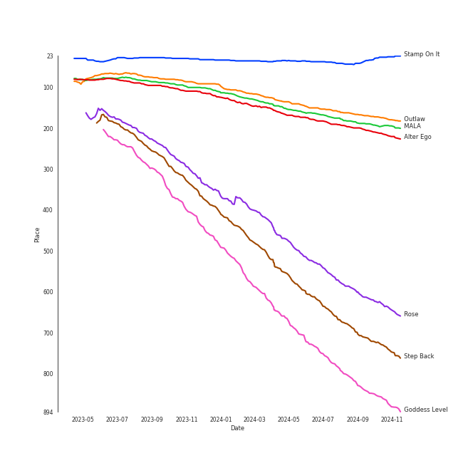
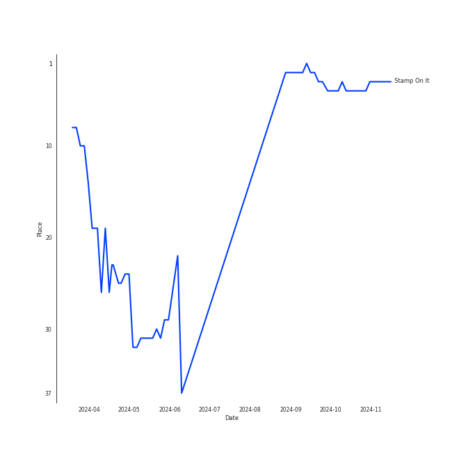
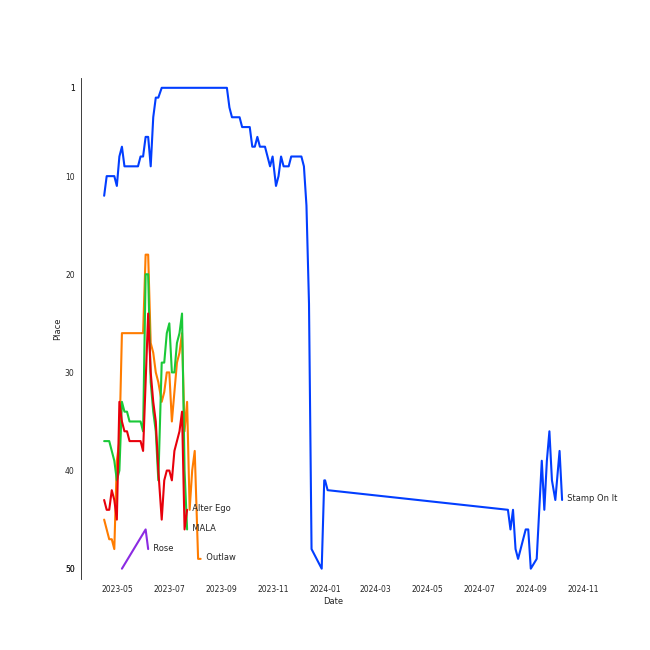
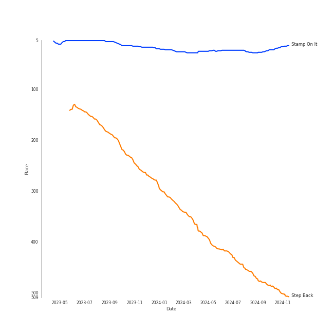
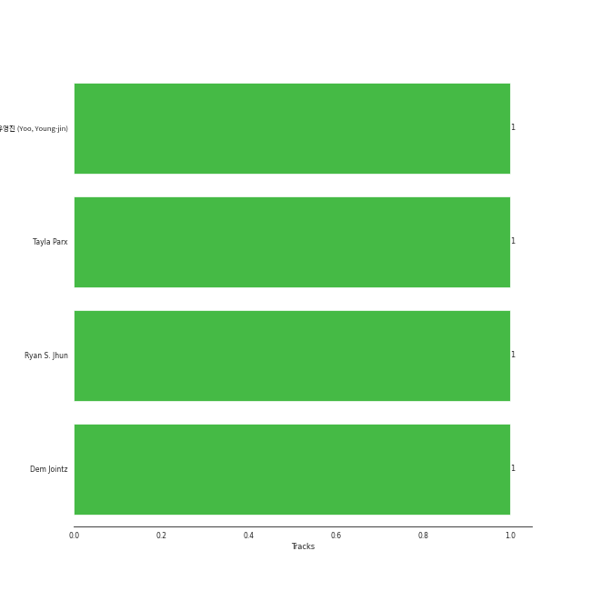

# GOT the beat

## Relationships

GOT the beat:
- has member [BoA](../boa/overview.md)
- has member HYOYEON
- has member HYO
- has member KARINA
- has member [SEULGI](../seulgi/overview.md)
- has member [TAEYEON](../taeyeon/overview.md)
- has member [WENDY](../wendy/overview.md)
- has member [WINTER](../winter/overview.md)

## Artist Rank
GOT the beat is currently:
- The #41 artist of the last 6 months
- The #37 artist of the last year
- The #31 artist of all time

## Top Tracks

### Top tracks of all time

Top tracks of the last year over time

Top tracks of the last 6 months over time

## Top Albums

| Art | Rank | Tracks | 💚 | Album | Release Date | 🔗 |
|:---|---:|---:|---:|:---|:---|:---|
|  | 27 | 6 | 6 | Stamp On It - The 1st Mini Album | 2023-01-16 | [🔗](https://open.spotify.com/album/2Gxd1fr4RFHVNx6IxGr9I7) |
|  | 480 | 1 | 1 | Step Back | 2022-01-03 | [🔗](https://open.spotify.com/album/3gwL04bGAX4Kc2D5Wd7NMk) |

## Featured on Playlists
| Art | Tracks | Playlist |
|:---|---:|:---|
|  | 7 | [K-Pop](../../playlists/k-pop/overview.md) |
|  | 5 | [Workout](../../playlists/workout/overview.md) |
|  | 3 | [K-Pop Favorites](../../playlists/k-pop_favorites/overview.md) |
|  | 2 | [Your Top Songs 2023](../../playlists/your_top_songs_2023/overview.md) |
|  | 1 | [Sharon RPD](../../playlists/sharon_rpd/overview.md) |
|  | 1 | [Your Top Songs 2022](../../playlists/your_top_songs_2022/overview.md) |
|  | 1 | [Chill](../../playlists/chill/overview.md) |

## Top Record Labels

| Tracks | 💚 | Label |
|---:|---:|:---|
| 7 | 7 | [SM Entertainment](../../labels/sm_entertainment/overview.md) |

## Genres

- [k-pop](../../genres/k-pop/overview.md)

## Credits

### Member Credits

| | KARINA | [BoA](../boa/overview.md) | [SEULGI](../seulgi/overview.md) | [TAEYEON](../taeyeon/overview.md) | [WENDY](../wendy/overview.md) | [WINTER](../winter/overview.md) |
|:---|---:|---:|---:|---:|---:|---:|
| Arranger | 0 | 2 | 0 | 0 | 0 | 0 |
| Lyricist | 0 | 5 | 0 | 1 | 0 | 0 |
| Songwriter | 0 | 3 | 0 | 0 | 0 | 0 |
| Vocal | 2 | 2 | 16 | 7 | 16 | 3 |
### Production Credits

| Art | Track | Members | Credit Types |
|:---|:---|:---|:---|
|  | Kiss My Lips | [BoA](../../boa/overview.md) | Arranger, Lyricist, Songwriter |
|  | ONE SHOT, TWO SHOT | [BoA](../../boa/overview.md) | Lyricist |
|  | Woman | [BoA](../../boa/overview.md) | Lyricist |
|  | Dreams Come True | [BoA](../../boa/overview.md) | Arranger, Lyricist, Songwriter |
|  | Can't Control Myself | [TAEYEON](../../taeyeon/overview.md) | Lyricist |
|  | Forgive Me | [BoA](../../boa/overview.md) | Lyricist, Songwriter |

## Top Producers

| Art | Producer | Tracks | Credit Types |
|:---|:---|---:|:---|
| | [Ryan S. Jhun](../../producers/ryan_s__jhun/overview.md) | 1 | Arranger, Songwriter |
| | [유영진 (Yoo, Young-jin)](../../producers/유영진_(yoo,_young-jin)/overview.md) | 1 | Arranger, Lyricist, Songwriter |
| | Dem Jointz | 1 | Arranger, Songwriter |
| | Tayla Parx | 1 | Songwriter |

## Tracks

| Art | Track | Album | Artists | Label | Rank | 💚 | 🔗 |
|:---|:---|:---|:---|:---|---:|:---|:---|
|  | Stamp On It | Stamp On It - The 1st Mini Album | [GOT the beat](overview.md) | [SM Entertainment](../../labels/sm_entertainment) | 35 | 💚 | [🔗](https://open.spotify.com/track/0mlxHb4jbPr1PUBUv0WHRS) |
|  | Outlaw | Stamp On It - The 1st Mini Album | [GOT the beat](overview.md) | [SM Entertainment](../../labels/sm_entertainment) | 168 | 💚 | [🔗](https://open.spotify.com/track/7ad8cTZkKU4ftlATRGve3M) |
|  | MALA | Stamp On It - The 1st Mini Album | [GOT the beat](overview.md) | [SM Entertainment](../../labels/sm_entertainment) | 185 | 💚 | [🔗](https://open.spotify.com/track/1YA3wSJ2kWd27sxgeEBjA9) |
|  | Alter Ego | Stamp On It - The 1st Mini Album | [GOT the beat](overview.md) | [SM Entertainment](../../labels/sm_entertainment) | 199 | 💚 | [🔗](https://open.spotify.com/track/08pPhcvPmphUEx3pEBZwGZ) |
|  | Rose | Stamp On It - The 1st Mini Album | [GOT the beat](overview.md) | [SM Entertainment](../../labels/sm_entertainment) | 592 | 💚 | [🔗](https://open.spotify.com/track/1Bu2ogfsVZauj3IOvKJSNy) |
|  | Step Back | Step Back | [GOT the beat](overview.md) | [SM Entertainment](../../labels/sm_entertainment) | 712 | 💚 | [🔗](https://open.spotify.com/track/3LCwQoTrdQgHsGJE5gGVqx) |
|  | Goddess Level | Stamp On It - The 1st Mini Album | [GOT the beat](overview.md) | [SM Entertainment](../../labels/sm_entertainment) | 804 | 💚 | [🔗](https://open.spotify.com/track/0bFZXAWYbhEpcQKNvEJ7Ut) |
