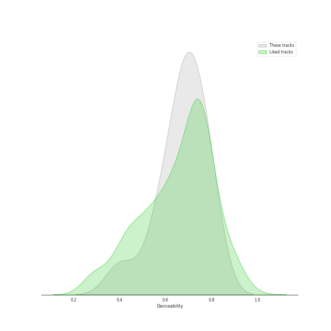
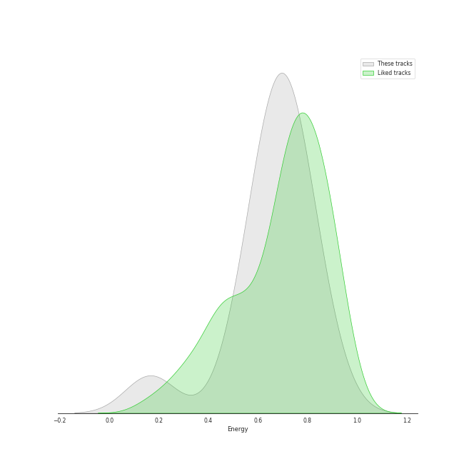
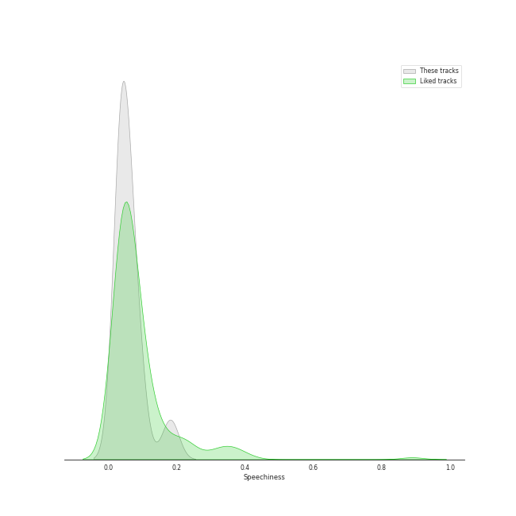
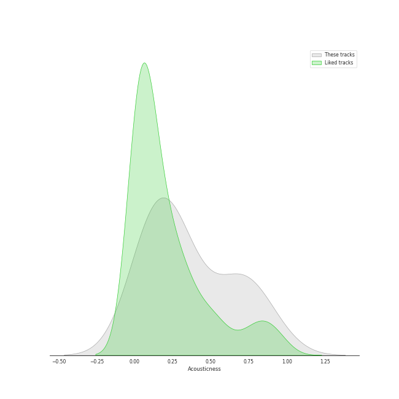
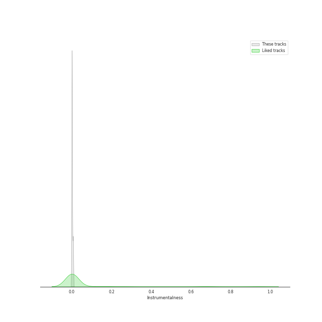
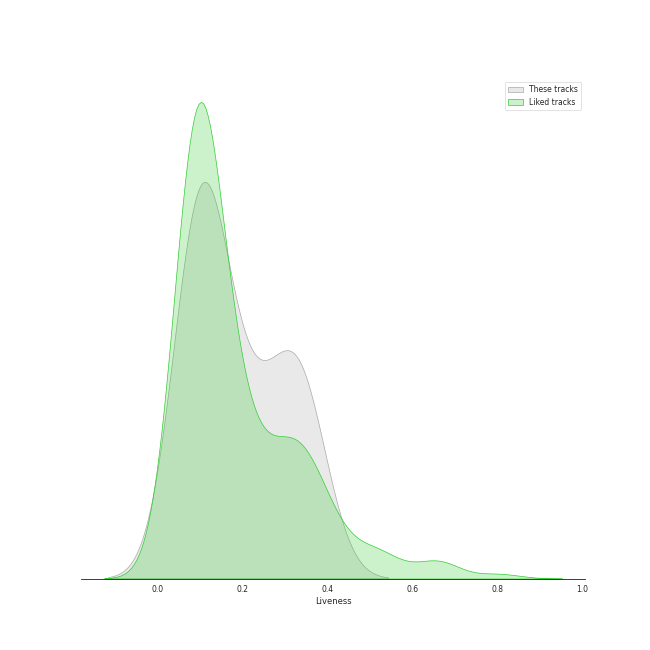
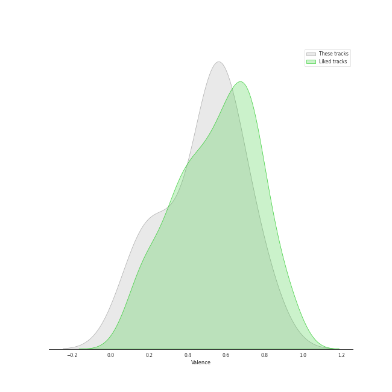
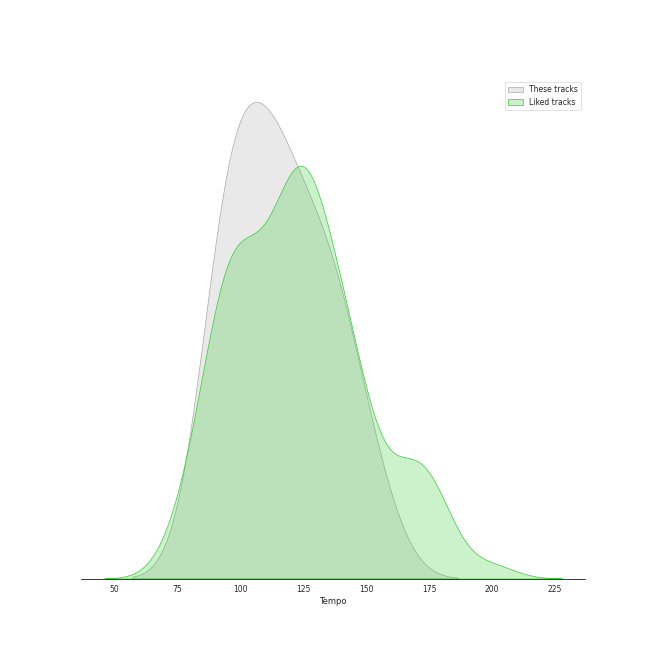

# Track Features for HEIZE

## Danceability

| ​ | 10 most Danceable tracks | ​​ | 10 least Danceable tracks |
|:---|:---|:---|:---|
|  | Perhaps, Happy Ending (0.786) |  | 내 맘을 볼 수 있나요 (0.397) |
|  | VingleVingle (Prod. R.Tee) (0.785) |  | Lyricist (0.566) |
|  | Undo (0.784) |  | When it snows(Feat.Heize) (0.574) |
|  | And July (0.734) |  | Shut Up & Groove (0.655) |
|  | Jenga (feat. Gaeko) (0.711) |  | Last Winter (0.662) |
|  | HAPPEN (0.704) |  | FM 89.1 (0.662) |
|  | First Sight (0.691) |  | First Sight (0.691) |
|  | FM 89.1 (0.662) |  | HAPPEN (0.704) |
|  | Last Winter (0.662) |  | Jenga (feat. Gaeko) (0.711) |
|  | Shut Up & Groove (0.655) |  | And July (0.734) |

## Energy

| ​ | 10 most Energetic tracks | ​​ | 10 least Energetic tracks |
|:---|:---|:---|:---|
|  | And July (0.852) |  | 내 맘을 볼 수 있나요 (0.166) |
|  | Perhaps, Happy Ending (0.828) |  | When it snows(Feat.Heize) (0.54) |
|  | FM 89.1 (0.732) |  | Last Winter (0.576) |
|  | Jenga (feat. Gaeko) (0.73) |  | Lyricist (0.628) |
|  | VingleVingle (Prod. R.Tee) (0.728) |  | Shut Up & Groove (0.665) |
|  | First Sight (0.728) |  | HAPPEN (0.674) |
|  | Undo (0.676) |  | Undo (0.676) |
|  | HAPPEN (0.674) |  | First Sight (0.728) |
|  | Shut Up & Groove (0.665) |  | VingleVingle (Prod. R.Tee) (0.728) |
|  | Lyricist (0.628) |  | Jenga (feat. Gaeko) (0.73) |

## Speechiness

| ​ | 10 most Speechy tracks | ​​ | 10 least Speechy tracks |
|:---|:---|:---|:---|
|  | FM 89.1 (0.182) |  | When it snows(Feat.Heize) (0.0316) |
|  | And July (0.0916) |  | 내 맘을 볼 수 있나요 (0.0349) |
|  | HAPPEN (0.0799) |  | Shut Up & Groove (0.036) |
|  | Last Winter (0.0705) |  | VingleVingle (Prod. R.Tee) (0.0361) |
|  | Lyricist (0.0574) |  | Perhaps, Happy Ending (0.0374) |
|  | Undo (0.0497) |  | First Sight (0.0418) |
|  | Jenga (feat. Gaeko) (0.0436) |  | Jenga (feat. Gaeko) (0.0436) |
|  | First Sight (0.0418) |  | Undo (0.0497) |
|  | Perhaps, Happy Ending (0.0374) |  | Lyricist (0.0574) |
|  | VingleVingle (Prod. R.Tee) (0.0361) |  | Last Winter (0.0705) |

## Acousticness

| ​ | 10 most Acoustic tracks | ​​ | 10 least Acoustic tracks |
|:---|:---|:---|:---|
|  | 내 맘을 볼 수 있나요 (0.884) |  | And July (0.0401) |
|  | Lyricist (0.721) |  | Shut Up & Groove (0.0859) |
|  | Last Winter (0.705) |  | Perhaps, Happy Ending (0.112) |
|  | FM 89.1 (0.645) |  | HAPPEN (0.168) |
|  | VingleVingle (Prod. R.Tee) (0.407) |  | First Sight (0.168) |
|  | When it snows(Feat.Heize) (0.31) |  | Undo (0.201) |
|  | Jenga (feat. Gaeko) (0.269) |  | Jenga (feat. Gaeko) (0.269) |
|  | Undo (0.201) |  | When it snows(Feat.Heize) (0.31) |
|  | First Sight (0.168) |  | VingleVingle (Prod. R.Tee) (0.407) |
|  | HAPPEN (0.168) |  | FM 89.1 (0.645) |

## Instrumentalness

| ​ | 10 most Instrumental tracks | ​​ | 10 least Instrumental tracks |
|:---|:---|:---|:---|
|  | VingleVingle (Prod. R.Tee) (0.00676) |  | And July (0.0) |
|  | Perhaps, Happy Ending (0.00583) |  | HAPPEN (0.0) |
|  | FM 89.1 (0.00335) |  | Shut Up & Groove (0.0) |
|  | Last Winter (0.00159) |  | 내 맘을 볼 수 있나요 (0.0) |
|  | First Sight (1.88e-05) |  | When it snows(Feat.Heize) (0.0) |
|  | Lyricist (1.14e-05) |  | Undo (1.06e-06) |
|  | Jenga (feat. Gaeko) (2.34e-06) |  | Jenga (feat. Gaeko) (2.34e-06) |
|  | Undo (1.06e-06) |  | Lyricist (1.14e-05) |
|  | When it snows(Feat.Heize) (0.0) |  | First Sight (1.88e-05) |
|  | 내 맘을 볼 수 있나요 (0.0) |  | Last Winter (0.00159) |

## Liveness

| ​ | 10 most Live tracks | ​​ | 10 least Live tracks |
|:---|:---|:---|:---|
|  | Lyricist (0.352) |  | First Sight (0.0735) |
|  | HAPPEN (0.341) |  | Undo (0.0903) |
|  | VingleVingle (Prod. R.Tee) (0.325) |  | 내 맘을 볼 수 있나요 (0.1) |
|  | When it snows(Feat.Heize) (0.289) |  | Last Winter (0.103) |
|  | FM 89.1 (0.224) |  | Jenga (feat. Gaeko) (0.109) |
|  | And July (0.196) |  | Perhaps, Happy Ending (0.109) |
|  | Shut Up & Groove (0.122) |  | Shut Up & Groove (0.122) |
|  | Perhaps, Happy Ending (0.109) |  | And July (0.196) |
|  | Jenga (feat. Gaeko) (0.109) |  | FM 89.1 (0.224) |
|  | Last Winter (0.103) |  | When it snows(Feat.Heize) (0.289) |

## Valence

| ​ | 10 most Happy tracks | ​​ | 10 least Happy tracks |
|:---|:---|:---|:---|
|  | And July (0.787) |  | 내 맘을 볼 수 있나요 (0.131) |
|  | Undo (0.734) |  | When it snows(Feat.Heize) (0.176) |
|  | Jenga (feat. Gaeko) (0.604) |  | First Sight (0.239) |
|  | FM 89.1 (0.575) |  | Last Winter (0.338) |
|  | VingleVingle (Prod. R.Tee) (0.573) |  | Lyricist (0.5) |
|  | HAPPEN (0.565) |  | Perhaps, Happy Ending (0.519) |
|  | Shut Up & Groove (0.531) |  | Shut Up & Groove (0.531) |
|  | Perhaps, Happy Ending (0.519) |  | HAPPEN (0.565) |
|  | Lyricist (0.5) |  | VingleVingle (Prod. R.Tee) (0.573) |
|  | Last Winter (0.338) |  | FM 89.1 (0.575) |

## Tempo

| ​ | 10 most Fast tracks | ​​ | 10 least Fast tracks |
|:---|:---|:---|:---|
|  | FM 89.1 (151.872) |  | Last Winter (91.735) |
|  | Lyricist (139.569) |  | Jenga (feat. Gaeko) (93.015) |
|  | Perhaps, Happy Ending (134.992) |  | When it snows(Feat.Heize) (96.005) |
|  | 내 맘을 볼 수 있나요 (134.708) |  | And July (98.504) |
|  | VingleVingle (Prod. R.Tee) (122.967) |  | First Sight (104.982) |
|  | Undo (116.103) |  | Shut Up & Groove (112.831) |
|  | HAPPEN (112.893) |  | HAPPEN (112.893) |
|  | Shut Up & Groove (112.831) |  | Undo (116.103) |
|  | First Sight (104.982) |  | VingleVingle (Prod. R.Tee) (122.967) |
|  | And July (98.504) |  | 내 맘을 볼 수 있나요 (134.708) |
