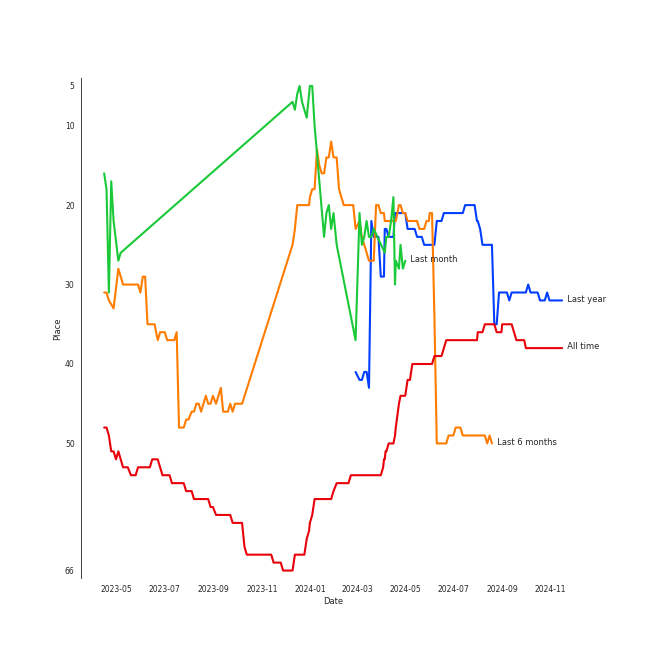
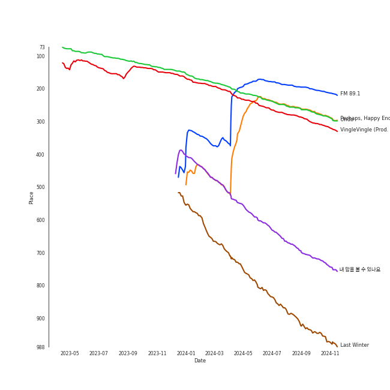
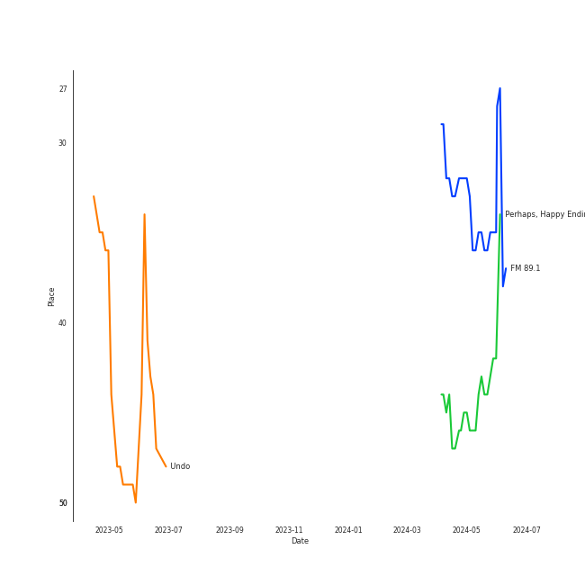

# HEIZE

[See Track Features](audio_features.md)

[See Clusters](clusters/overview.md)

## Artist Rank
HEIZE is currently:
- The #22 artist of the last month
- The #22 artist of the last 6 months
- The #24 artist of all time

## Top Tracks

- FM 89.1 is the #32 track of the last 6 months
- Perhaps, Happy Ending is the #44 track of the last 6 months

### Top tracks, aggregated

### Top tracks of the last 6 months over time

## Featured on Playlists
| Art | Tracks | Playlist |
|:---|---:|:---|
|  | 12 | [K-R&B](../../playlists/k-r_b/overview.md) |
|  | 6 | [Chill](../../playlists/chill/overview.md) |
|  | 2 | [K-Pop Favorites](../../playlists/k-pop_favorites/overview.md) |
|  | 1 | [Funk](../../playlists/funk/overview.md) |
|  | 1 | [Recommendations for Jeff](../../playlists/recommendations_for_jeff/overview.md) |
|  | 1 | [K-OST](../../playlists/k-ost/overview.md) |

## Top Albums

| Art | Tracks | 💚 | Album | Release Date | 🔗 |
|:---|---:|---:|:---|:---|:---|
|  | 3 | 2 | Last Winter | 2023-12-07 | [🔗](https://open.spotify.com/album/41vj1sO4NJFriquGszDSh5) |
|  | 2 | 1 | And July | 2016-07-18 | [🔗](https://open.spotify.com/album/3xUWeFeLn6m3NXKr0FlT3E) |
|  | 1 | 1 | Wish & Wind | 2018-03-08 | [🔗](https://open.spotify.com/album/5Fs2dlwUz1zkNcUPu6KaKF) |
|  | 1 | 1 | VingleVingle | 2023-04-05 | [🔗](https://open.spotify.com/album/10Ldh1KXu0ySjpfiX6qLXQ) |
|  | 1 | 1 | Undo | 2022-06-30 | [🔗](https://open.spotify.com/album/2xR7YEyRweqClzs50bbW3J) |
|  | 1 | 1 | HAPPEN | 2021-05-20 | [🔗](https://open.spotify.com/album/4xOOB79WcZuOoVwK06No1s) |
|  | 1 | 1 | First Sight | 2018-12-14 | [🔗](https://open.spotify.com/album/5M9f9Tze7sspUDrIAjdCgV) |
|  | 1 | 0 | When it snows(Feat.Heize) | 2021-12-03 | [🔗](https://open.spotify.com/album/1d2YKQ02RQA97EyrB55ZcK) |
|  | 1 | 0 | Lyricist | 2020-06-10 | [🔗](https://open.spotify.com/album/6igUyuDlRCyjoTtPXui6bT) |
|  | 1 | 0 | Hotel del Luna (Original Television Soundtrack) Pt.5 | 2019-07-28 | [🔗](https://open.spotify.com/album/2PdRNAz6mDmy9OR7hDCrH5) |

## Top Record Labels

| Tracks | 💚 | Label |
|---:|---:|:---|
| 10 | 7 | [Genie Music Corporation](../../labels/genie_music_corporation/overview.md) |
| 6 | 5 | [Stone Music Entertainment](../../labels/stone_music_entertainment/overview.md) |
| 1 | 1 | CJ E&M MUSIC |
| 1 | 0 | ShowPLAY ENTERTAINMENT |
| 1 | 0 | Beyond Music |

## Genres

- [k-pop](../../genres/k-pop/overview.md)
- [korean pop](../../genres/korean_pop/overview.md)
- [korean r&b](../../genres/korean_r_b/overview.md)

## Top Producers

| Art | Producer | Tracks | Credit Types |
|:---|:---|---:|:---|
| | [R.Tee](../../producers/r_tee/overview.md) | 1 | Producer |

## Tracks

| Art | Track | Album | Artists | Label | Rank | 💚 | 🔗 |
|:---|:---|:---|:---|:---|---:|:---|:---|
|  | Undo | Undo | [HEIZE](overview.md) | [Genie Music Corporation](../../labels/genie_music_corporation), [Stone Music Entertainment](../../labels/stone_music_entertainment) | 195 | 💚 | [🔗](https://open.spotify.com/track/6z1pJ3KUmQagUpMVqL62sa) |
|  | FM 89.1 | Last Winter | [HEIZE](overview.md) | [Genie Music Corporation](../../labels/genie_music_corporation), [Stone Music Entertainment](../../labels/stone_music_entertainment) | 209 | 💚 | [🔗](https://open.spotify.com/track/262jf0kGFJVl2AHsGJ6xiG) |
|  | VingleVingle (Prod. R.Tee) | VingleVingle | [HEIZE](overview.md) | [Genie Music Corporation](../../labels/genie_music_corporation), [Stone Music Entertainment](../../labels/stone_music_entertainment) | 227 | 💚 | [🔗](https://open.spotify.com/track/4mSb6RA9eJnXuMWChHLpgn) |
|  | Perhaps, Happy Ending | Last Winter | [HEIZE](overview.md) | [Genie Music Corporation](../../labels/genie_music_corporation), [Stone Music Entertainment](../../labels/stone_music_entertainment) | 314 | 💚 | [🔗](https://open.spotify.com/track/5VRjJvpk6xL9cxkkWhfWkY) |
|  | 내 맘을 볼 수 있나요 | Hotel del Luna (Original Television Soundtrack) Pt.5 | [HEIZE](overview.md) | Beyond Music | 542 | | [🔗](https://open.spotify.com/track/2oVHb8wyg6oC2iNpGBNvx1) |
|  | Last Winter | Last Winter | [HEIZE](overview.md) | [Genie Music Corporation](../../labels/genie_music_corporation), [Stone Music Entertainment](../../labels/stone_music_entertainment) | 725 | | [🔗](https://open.spotify.com/track/0neVuSeb4wkhi1tLNc0t47) |
|  | And July | And July | [HEIZE](overview.md), DEAN, dj friz | [Genie Music Corporation](../../labels/genie_music_corporation) | nan | 💚 | [🔗](https://open.spotify.com/track/0Yz3F0UGDibDe8uU69zmjn) |
|  | Shut Up & Groove | And July | [HEIZE](overview.md), DEAN | [Genie Music Corporation](../../labels/genie_music_corporation) | nan | | [🔗](https://open.spotify.com/track/1WT5I6vlWjYW2cnhR1UkVA) |
|  | Jenga (feat. Gaeko) | Wish & Wind | [HEIZE](overview.md), Gaeko | CJ E&M MUSIC | nan | 💚 | [🔗](https://open.spotify.com/track/1dA1tlzwcJ3YDYsSul1m06) |
|  | First Sight | First Sight | [HEIZE](overview.md) | [Genie Music Corporation](../../labels/genie_music_corporation) | nan | 💚 | [🔗](https://open.spotify.com/track/2g76vE59gdow7ynPQdzuaw) |

See all tracks

| Art | Track | Album | Artists | Label | Rank | 💚 | 🔗 |
|:---|:---|:---|:---|:---|---:|:---|:---|
|  | Lyricist | Lyricist | [HEIZE](overview.md) | [Genie Music Corporation](../../labels/genie_music_corporation) | nan | | [🔗](https://open.spotify.com/track/1eEHOnrNLP46aGKLb1LtMI) |
|  | HAPPEN | HAPPEN | [HEIZE](overview.md) | [Genie Music Corporation](../../labels/genie_music_corporation), [Stone Music Entertainment](../../labels/stone_music_entertainment) | nan | 💚 | [🔗](https://open.spotify.com/track/1MtCOuTy3B6fU72LQPvg16) |
|  | When it snows(Feat.Heize) | When it snows(Feat.Heize) | Lee Mujin, [HEIZE](overview.md) | ShowPLAY ENTERTAINMENT | nan | | [🔗](https://open.spotify.com/track/2vA5M8uXee4amGQajyUMFR) |

