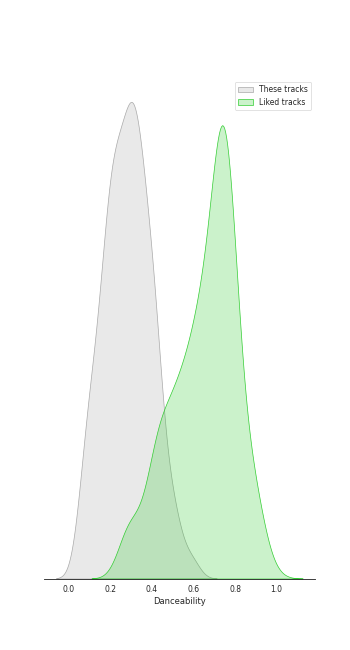
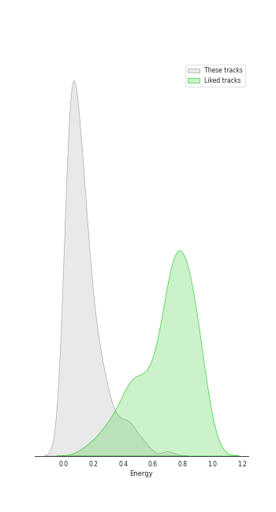
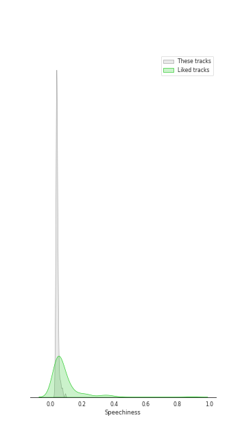
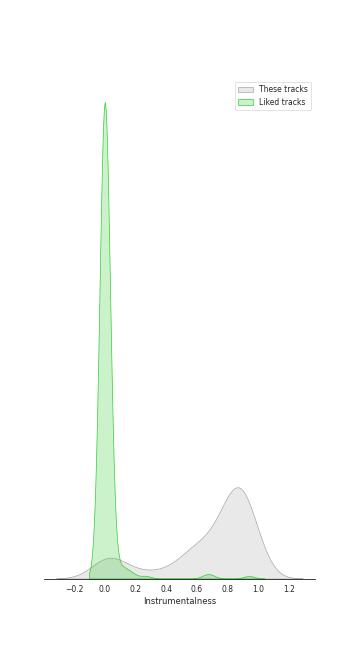
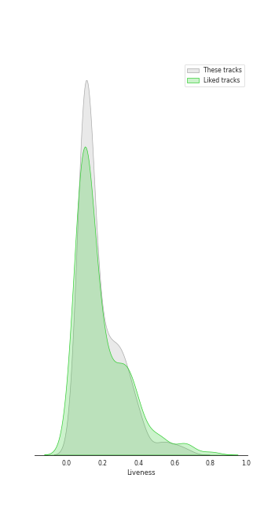
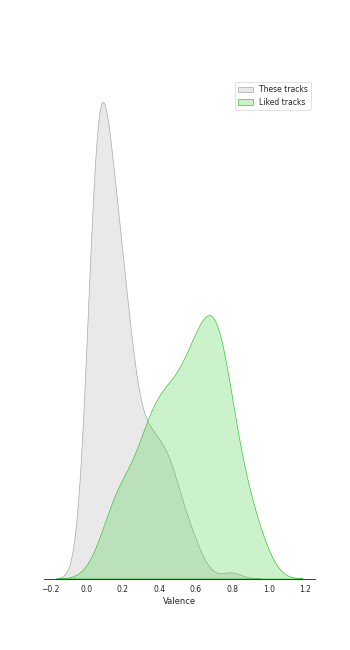
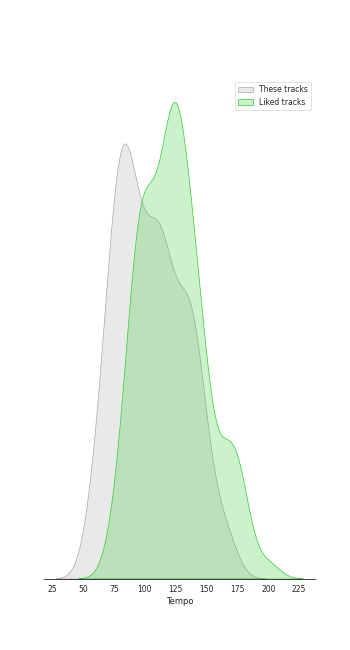

# Track Features for Herbert von Karajan

## Danceability

| ​ | 10 most Danceable tracks | ​​ | 10 least Danceable tracks |
|:---|:---|:---|:---|
|  | Divertimento in D Major, K. 251 "Nannerl-Septett" (Orch. Perf.): IV. Menuetto. Tema con variazioni (0.593) |  | The Planets, Op. 32: 7. Neptune, the Mystic (0.0601) |
|  | The Rite of Spring, K15, Pt. 2: XIV. Sacrificial Dance (0.59) |  | Symphony No. 9 In D Minor, Op. 125 - "Choral": 3. Adagio molto e cantabile (0.062) |
|  | The Rite of Spring, K15, Pt. 2: XII. Evocation of the Ancestors (0.539) |  | Die Zauberflöte, K. 620, Act II: No. 18, Chorus. O Isis und Osiris, welche Wonne (0.0663) |
|  | The Rite of Spring, K15, Pt. 1: II. The Augurs of Spring (0.508) |  | Horn Concerto No. 4 in E-Flat Major, K. 495: II. Romance. Andante cantabile (0.0683) |
|  | Violin Concerto No. 3 in G Major, K. 216: III. Rondeau. Allegro (0.507) |  | Requiem, K. 626: VII. Agnus Dei (0.0749) |
|  | The Rite of Spring, K15, Pt. 2: XI. Glorification of the Chosen One (0.507) |  | The Planets, Op. 32: 2. Venus, the Bringer of Peace (0.0864) |
|  | Die Zauberflöte, K. 620, Act II: No. 21, Finale: g. Pa-Pa-Pa-Pa-Pa-Pa-Papagena! (0.504) |  | Symphony No. 3 In E Flat, Op. 55 -"Eroica": 2. Marcia funebre (Adagio assai) (0.0871) |
|  | Die Zauberflöte, K. 620, Act II: No. 13, Alles fühlt der Liebe Freuden (0.499) |  | Divertimento in B-Flat Major, K. 287 (Orch. Perf.): IV. Adagio - Recorded 1965 (0.0898) |
|  | Eine kleine Nachtmusik, K. 525: IV. Rondo. Allegro (0.478) |  | Horn Concerto No. 2 in E-Flat Major, K. 417: II. Andante (0.099) |
|  | Divertimento in B-Flat Major, K. 287 (Orch. Perf.): VI. Andante – Allegro molto - Recorded 1987 (0.476) |  | Divertimento in D Major, K. 334 (Orch. Perf.): IV. Adagio - Recorded 1965 (0.101) |

## Energy

| ​ | 10 most Energetic tracks | ​​ | 10 least Energetic tracks |
|:---|:---|:---|:---|
|  | The Rite of Spring, K15, Pt. 1: VI. Procession of the Sage (0.7) |  | The Rite of Spring, K15, Pt. 1: VII. Adoration of the Earth (The Sage) (0.000239) |
|  | The Rite of Spring, K15, Pt. 1: III. Ritual of Abduction (0.555) |  | Die Zauberflöte, K. 620, Act II: No. 16, Seid uns zum zweiten Mal willkommen (0.00404) |
|  | Requiem, K. 626: IIIa. Dies irae (0.542) |  | The Planets, Op. 32: 7. Neptune, the Mystic (0.00757) |
|  | The Rite of Spring, K15, Pt. 1: VIII. Dance of the Earth (0.509) |  | The Planets, Op. 32: 2. Venus, the Bringer of Peace (0.00922) |
|  | The Planets, Op. 32: 1. Mars, the Bringer of War (0.478) |  | The Planets, Op. 32: 5. Saturn, the Bringer of Old Age (0.0136) |
|  | The Rite of Spring, K15, Pt. 2: XIV. Sacrificial Dance (0.46) |  | Divertimento in B-Flat Major, K. 287 (Orch. Perf.): VI. Andante – Allegro molto - Recorded 1987 (0.0183) |
|  | The Rite of Spring, K15, Pt. 2: XI. Glorification of the Chosen One (0.447) |  | Requiem, K. 626: IIIe. Confutatis (0.0185) |
|  | Symphony No. 39 in E-Flat Major, K. 543: IV. Finale. Allegro (0.441) |  | Symphony No. 2 In D, Op. 36: 2. Larghetto (0.0205) |
|  | The Rite of Spring, K15, Pt. 1: V. Games of the Rival Tribes (0.435) |  | Divertimento in B-Flat Major, K. 287 (Orch. Perf.): III. Menuetto I - Recorded 1987 (0.0207) |
|  | Mass in C Major, K. 317 "Coronation Mass": III. Credo (0.433) |  | The Rite of Spring, K15, Pt. 2: XIII. Ritual of the Ancestors (0.0216) |

## Speechiness

| ​ | 10 most Speechy tracks | ​​ | 10 least Speechy tracks |
|:---|:---|:---|:---|
|  | The Rite of Spring, K15, Pt. 2: XI. Glorification of the Chosen One (0.0935) |  | The Rite of Spring, K15, Pt. 1: VIII. Dance of the Earth (0.0292) |
|  | Symphony No. 1 In C, Op. 21: 3. Menuetto (Allegro molto e vivace) (0.0779) |  | The Rite of Spring, K15, Pt. 1: II. The Augurs of Spring (0.0293) |
|  | The Rite of Spring, K15, Pt. 2: XIV. Sacrificial Dance (0.0741) |  | Requiem, K. 626: IVa. Domine Jesu (0.0293) |
|  | Symphony No. 9 In D Minor, Op. 125 - "Choral" / 4.: "O Freunde nicht diese Töne" - (0.0736) |  | Symphony No. 39 in E-Flat Major, K. 543: III. Menuetto. Allegretto (0.0297) |
|  | Divertimento in D Major, K. 251 "Nannerl-Septett" (Orch. Perf.): IV. Menuetto. Tema con variazioni (0.068) |  | Requiem, K. 626: V. Sanctus (0.0301) |
|  | Die Zauberflöte, K. 620, Act II: No. 13, Alles fühlt der Liebe Freuden (0.0662) |  | Requiem, K. 626: II. Kyrie (0.0304) |
|  | Symphony No. 3 In E Flat, Op. 55 -"Eroica": 3. Scherzo (Allegro vivace) (0.0634) |  | Requiem, K. 626: IIIc. Rex tremendae (0.0315) |
|  | The Planets, Op. 32: 6. Uranus, the Magician (0.0633) |  | Requiem, K. 626: IVb. Hostias (0.0316) |
|  | Die Zauberflöte, K. 620, Act I: No. 7, Duet. Bei Männern, welche Liebe fühlen (0.0611) |  | Requiem, K. 626: VIII. Communio. Lux aeterna (0.0317) |
|  | Die Zauberflöte, K. 620, Act I: No. 1, Zu Hilfe! Zu Hilfe! (0.0591) |  | The Rite of Spring, K15, Pt. 2: XIII. Ritual of the Ancestors (0.0319) |

## Acousticness

| ​ | 10 most Acoustic tracks | ​​ | 10 least Acoustic tracks |
|:---|:---|:---|:---|
|  | Requiem, K. 626: IIIe. Confutatis (0.993) |  | The Rite of Spring, K15, Pt. 1: VII. Adoration of the Earth (The Sage) (0.591) |
|  | Requiem, K. 626: IVa. Domine Jesu (0.992) |  | The Rite of Spring, K15, Pt. 1: VI. Procession of the Sage (0.612) |
|  | Horn Concerto No. 4 in E-Flat Major, K. 495: III. Rondo. Allegro vivace (0.992) |  | Die Zauberflöte, K. 620, Act II: No. 20, Ein Mädchen oder Weibchen (0.623) |
|  | Horn Concerto No. 2 in E-Flat Major, K. 417: III. Rondo. Allegro (0.991) |  | The Rite of Spring, K15, Pt. 1: VIII. Dance of the Earth (0.712) |
|  | Horn Concerto No. 2 in E-Flat Major, K. 417: II. Andante (0.991) |  | Symphony No. 6 In F, Op. 68 -"Pastoral": 4. Gewitter, Sturm (Allegro) (0.792) |
|  | Requiem, K. 626: IIIb. Tuba mirum (0.99) |  | The Rite of Spring, K15, Pt. 2: XIV. Sacrificial Dance (0.802) |
|  | Requiem, K. 626: VI. Benedictus (0.99) |  | Eine kleine Nachtmusik, K. 525: III. Menuetto. Allegretto (0.828) |
|  | Horn Concerto No. 3 in E-Flat Major, K. 447: I. Allegro (Cadenza: Klier) (0.989) |  | The Planets, Op. 32: 1. Mars, the Bringer of War (0.83) |
|  | Horn Concerto No. 2 in E-Flat Major, K. 417: I. Allegro maestoso (0.989) |  | Symphony No. 7 In A, Op. 92: 4. Allegro con brio (0.847) |
|  | Requiem, K. 626: IVb. Hostias (0.989) |  | Symphony No. 41 in C Major, K. 551 "Jupiter": IV. Finale. Molto allegro (0.852) |

## Instrumentalness

| ​ | 10 most Instrumental tracks | ​​ | 10 least Instrumental tracks |
|:---|:---|:---|:---|
|  | The Rite of Spring, K15, Pt. 1: I. Introduction (0.972) |  | Die Zauberflöte, K. 620, Act II: No. 20, Ein Mädchen oder Weibchen (0.0) |
|  | Divertimento in D Major, K. 251 "Nannerl-Septett" (Orch. Perf.): IV. Menuetto. Tema con variazioni (0.958) |  | Die Zauberflöte, K. 620, Act I: No. 7, Duet. Bei Männern, welche Liebe fühlen (0.0) |
|  | Horn Concerto No. 2 in E-Flat Major, K. 417: II. Andante (0.954) |  | Die Zauberflöte, K. 620, Act I: No. 2, Der Vogelfänger bin ich ja (1.03e-05) |
|  | Horn Concerto No. 1 in D Major, K. 412/K. 514: I. Allegro, K. 412 (0.95) |  | Die Zauberflöte, K. 620, Act II: No. 16, Seid uns zum zweiten Mal willkommen (1.46e-05) |
|  | Horn Concerto No. 4 in E-Flat Major, K. 495: II. Romance. Andante cantabile (0.949) |  | Die Zauberflöte, K. 620, Act I: No. 1, Zu Hilfe! Zu Hilfe! (5.54e-05) |
|  | The Rite of Spring, K15, Pt. 1: III. Ritual of Abduction (0.945) |  | Die Zauberflöte, K. 620, Act II: No. 13, Alles fühlt der Liebe Freuden (5.9e-05) |
|  | Requiem, K. 626: IIIe. Confutatis (0.944) |  | The Rite of Spring, K15, Pt. 1: VII. Adoration of the Earth (The Sage) (0.000308) |
|  | Symphony No. 40 in G Minor, K. 550: IV. Finale. Allegro assai (0.941) |  | Requiem, K. 626: IIId. Recordare (0.000349) |
|  | Symphony No. 40 in G Minor, K. 550: III. Menuetto. Allegretto (0.939) |  | Requiem, K. 626: IIIb. Tuba mirum (0.0004) |
|  | The Rite of Spring, K15, Pt. 2: XII. Evocation of the Ancestors (0.938) |  | Requiem, K. 626: VI. Benedictus (0.000441) |

## Liveness

| ​ | 10 most Live tracks | ​​ | 10 least Live tracks |
|:---|:---|:---|:---|
|  | The Rite of Spring, K15, Pt. 1: II. The Augurs of Spring (0.669) |  | Symphony No. 1 In C, Op. 21: 3. Menuetto (Allegro molto e vivace) (0.0554) |
|  | Symphony No. 5 In C Minor, Op. 67: 3. Allegro (0.614) |  | The Planets, Op. 32: 7. Neptune, the Mystic (0.0614) |
|  | Symphony No. 36 in C Major, K. 425 "Linz": III. Menuetto (0.594) |  | Divertimento in D Major, K. 334 (Orch. Perf.): II. Theme & Variations. Andante - Recorded 1965 (0.0641) |
|  | Requiem, K. 626: IIId. Recordare (0.541) |  | Violin Concerto No. 5 in A Major, K. 219 "Turkish": III. Rondeau. Tempo di menuetto (0.0665) |
|  | Symphony No. 9 In D Minor, Op. 125 - "Choral" - Excerpt From 4th Movement: 4. Presto (0.535) |  | The Rite of Spring, K15, Pt. 1: I. Introduction (0.0674) |
|  | Die Zauberflöte, K. 620, Act II: No. 13, Alles fühlt der Liebe Freuden (0.508) |  | Violin Concerto No. 5 in A Major, K. 219 "Turkish": I. Allegro aperto (0.0674) |
|  | Requiem, K. 626: IIIa. Dies irae (0.444) |  | Requiem, K. 626: VIII. Communio. Lux aeterna (0.0716) |
|  | Die Zauberflöte, K. 620, Act I: No. 2, Der Vogelfänger bin ich ja (0.421) |  | Die Zauberflöte, K. 620, Act II: No. 14, Der Hölle Rache "Queen of the Night Aria" (0.0743) |
|  | Divertimento in F Major, K. 247 (Orch. Perf.): III. Menuetto (0.412) |  | Concerto for Orchestra, Sz. 116: 1. Introduzione (Andante non troppo - Allegro vivace (0.0751) |
|  | Symphony No. 33 in B-Flat Major, K. 319: III. Menuetto (0.409) |  | Symphony No. 39 in E-Flat Major, K. 543: II. Andante con moto (0.0759) |

## Valence

| ​ | 10 most Happy tracks | ​​ | 10 least Happy tracks |
|:---|:---|:---|:---|
|  | Die Zauberflöte, K. 620, Act II: No. 13, Alles fühlt der Liebe Freuden (0.792) |  | The Rite of Spring, K15, Pt. 1: VII. Adoration of the Earth (The Sage) (0.0) |
|  | Eine kleine Nachtmusik, K. 525: IV. Rondo. Allegro (0.64) |  | The Planets, Op. 32: 2. Venus, the Bringer of Peace (0.0301) |
|  | Requiem, K. 626: IIIa. Dies irae (0.596) |  | The Planets, Op. 32: 7. Neptune, the Mystic (0.0305) |
|  | The Rite of Spring, K15, Pt. 1: II. The Augurs of Spring (0.587) |  | Concerto for Orchestra, Sz. 116: 3. Elegia (Andante, non troppo) (0.0312) |
|  | Divertimento in D Major, K. 251 "Nannerl-Septett" (Orch. Perf.): IV. Menuetto. Tema con variazioni (0.57) |  | The Planets, Op. 32: 5. Saturn, the Bringer of Old Age (0.0316) |
|  | Divertimento in D Major, K. 251 "Nannerl-Septett" (Orch. Perf.): VI. Marcia alla francese (0.56) |  | Requiem, K. 626: VII. Agnus Dei (0.0338) |
|  | Requiem, K. 626: II. Kyrie (0.544) |  | Requiem, K. 626: IIIe. Confutatis (0.0351) |
|  | Eine kleine Nachtmusik, K. 525: I. Allegro (0.524) |  | Die Zauberflöte, K. 620, Act II: No. 10, O Isis und Osiris (0.0353) |
|  | Symphony No. 2 In D, Op. 36: 3. Scherzo (Allegro) (0.522) |  | Symphony No. 3 In E Flat, Op. 55 -"Eroica": 2. Marcia funebre (Adagio assai) (0.0366) |
|  | Die Zauberflöte, K. 620, Act I: No. 2, Der Vogelfänger bin ich ja (0.504) |  | The Rite of Spring, K15, Pt. 1: I. Introduction (0.037) |

## Tempo

| ​ | 10 most Fast tracks | ​​ | 10 least Fast tracks |
|:---|:---|:---|:---|
|  | Divertimento in D Major, K. 334 (Orch. Perf.): IV. Adagio - Recorded 1965 (168.802) |  | Divertimento in B-Flat Major, K. 287 (Orch. Perf.): IV. Adagio - Recorded 1965 (56.647) |
|  | Symphony No. 33 in B-Flat Major, K. 319: II. Andante moderato (165.957) |  | Mass in C Major, K. 317 "Coronation Mass": V. Benedictus (57.355) |
|  | Symphony No. 33 in B-Flat Major, K. 319: I. Allegro assai (165.933) |  | The Planets, Op. 32: 7. Neptune, the Mystic (57.624) |
|  | Symphony No. 8 in F Major, Op. 93: II. Allegretto scherzando (164.384) |  | Symphony No. 7 In A, Op. 92: 3. Presto - Assai meno presto (59.821) |
|  | Symphony No. 3 In E Flat, Op. 55 -"Eroica": 3. Scherzo (Allegro vivace) (163.062) |  | Music To Goethe's Tragedy "Egmont" Op. 84: Ouverture - Sostenuto, ma non troppo - Allegro (62.227) |
|  | Divertimento in B-Flat Major, K. 287 (Orch. Perf.): I. Allegro - Recorded 1965 (153.666) |  | Symphony No. 3 In E Flat, Op. 55 -"Eroica": 2. Marcia funebre (Adagio assai) (62.976) |
|  | Eine kleine Nachtmusik, K. 525: II. Romance. Andante (153.555) |  | Horn Concerto No. 4 in E-Flat Major, K. 495: III. Rondo. Allegro vivace (63.172) |
|  | Symphony No. 39 in E-Flat Major, K. 543: I. Adagio – Allegro (153.184) |  | Symphony No. 4 In B Flat, Op. 60: 2. Adagio (63.776) |
|  | Mass in C Major, K. 317 "Coronation Mass": II. Gloria (152.459) |  | The Rite of Spring, K15, Pt. 1: IV. Spring Rounds (64.022) |
|  | Symphony No. 3 In E Flat, Op. 55 -"Eroica": 1. Allegro con brio (149.615) |  | The Rite of Spring, K15, Pt. 2: IX. Introduction (64.987) |
