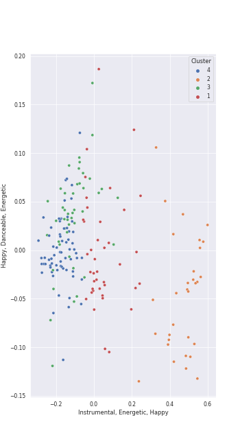

# Clusters in Herbert von Karajan

## Cluster #1

40 tracks

| Art | Track | Album | Artists | Label | Rank | 💚 | 🔗 |
|:---|:---|:---|:---|:---|---:|:---|:---|
|  | Requiem In D Minor, K.626: 4. Offertorium: Hostias | Karajan - Mozart | [Wolfgang Amadeus Mozart](../../../wolfgang_amadeus_mozart/overview.md), Wiener Singverein, Wiener Philharmoniker, [Herbert von Karajan](../../overview.md) | [UME - Global Clearing House](../../../../labels/ume_-_global_clearing_house) | 838 | | [🔗](https://open.spotify.com/track/0x7uY2kKO4RVhajULRVNFo) |
|  | Symphony No. 39 in E flat, K.543: 2. Andante con moto | Karajan - Mozart | [Wolfgang Amadeus Mozart](../../../wolfgang_amadeus_mozart/overview.md), [Berliner Philharmoniker](../../../berliner_philharmoniker/overview.md), [Herbert von Karajan](../../overview.md) | [UME - Global Clearing House](../../../../labels/ume_-_global_clearing_house) | 838 | | [🔗](https://open.spotify.com/track/1NSzl0NwDRMhIZGG03Lyq9) |
|  | Violin Concerto No. 5 in A Major, K. 219: II. Adagio | Karajan - Mozart | [Wolfgang Amadeus Mozart](../../../wolfgang_amadeus_mozart/overview.md), Joseph Joachim, Ossip Schnirlin, Anne-Sophie Mutter, [Berliner Philharmoniker](../../../berliner_philharmoniker/overview.md), [Herbert von Karajan](../../overview.md) | [UME - Global Clearing House](../../../../labels/ume_-_global_clearing_house) | 838 | | [🔗](https://open.spotify.com/track/3G4djnsfzYUYDBTvAMnT1x) |
|  | Serenade In G, K.525 "Eine kleine Nachtmusik": 2. Romance (Andante) | Karajan - Mozart | [Wolfgang Amadeus Mozart](../../../wolfgang_amadeus_mozart/overview.md), [Berliner Philharmoniker](../../../berliner_philharmoniker/overview.md), [Herbert von Karajan](../../overview.md) | [UME - Global Clearing House](../../../../labels/ume_-_global_clearing_house) | 838 | | [🔗](https://open.spotify.com/track/3NB3I7BknhsluKpKuy5bxx) |
|  | The Rite of Spring, K15, Pt. 2: XIII. Ritual of the Ancestors | Stravinsky: The Rite of Spring / Bartók: Concerto for Orchestra | Igor Stravinsky, [Berliner Philharmoniker](../../../berliner_philharmoniker/overview.md), [Herbert von Karajan](../../overview.md) | [Deutsche Grammophon (DG)](../../../../labels/deutsche_grammophon_(dg)) | 838 | | [🔗](https://open.spotify.com/track/41g1p1wDLuNnZNDLa13QIR) |
|  | Symphony No. 6 In F, Op. 68 -"Pastoral": 1. Erwachen heiterer Empfindungen bei der Ankunft auf dem Lande: Allegro ma non troppo | Beethoven: 9 Symphonies; Overtures | [Ludwig van Beethoven](../../../ludwig_van_beethoven/overview.md), [Berliner Philharmoniker](../../../berliner_philharmoniker/overview.md), [Herbert von Karajan](../../overview.md) | [Deutsche Grammophon (DG)](../../../../labels/deutsche_grammophon_(dg)) | 838 | | [🔗](https://open.spotify.com/track/11YigXaFNjzST4L0HAaFv3) |
|  | Overture "Leonore No. 3", Op. 72b | Beethoven: 9 Symphonies; Overtures | [Ludwig van Beethoven](../../../ludwig_van_beethoven/overview.md), [Berliner Philharmoniker](../../../berliner_philharmoniker/overview.md), [Herbert von Karajan](../../overview.md) | [Deutsche Grammophon (DG)](../../../../labels/deutsche_grammophon_(dg)) | 838 | | [🔗](https://open.spotify.com/track/1qP4L90ZORZad6pqdLMyci) |
|  | Overture "Coriolan", Op. 62 | Beethoven: 9 Symphonies; Overtures | [Ludwig van Beethoven](../../../ludwig_van_beethoven/overview.md), [Berliner Philharmoniker](../../../berliner_philharmoniker/overview.md), [Herbert von Karajan](../../overview.md) | [Deutsche Grammophon (DG)](../../../../labels/deutsche_grammophon_(dg)) | 838 | | [🔗](https://open.spotify.com/track/3JMmtvBklNEhWY9TfhKTw9) |
|  | Symphony No. 7 In A, Op. 92: 1. Poco sostenuto - Vivace | Beethoven: 9 Symphonies; Overtures | [Ludwig van Beethoven](../../../ludwig_van_beethoven/overview.md), [Berliner Philharmoniker](../../../berliner_philharmoniker/overview.md), [Herbert von Karajan](../../overview.md) | [Deutsche Grammophon (DG)](../../../../labels/deutsche_grammophon_(dg)) | 838 | | [🔗](https://open.spotify.com/track/5qPk5Rcw6iA9DQCtCkhhz7) |
|  | Symphony No. 4 In B Flat, Op. 60: 3. Allegro vivace | Beethoven: 9 Symphonies; Overtures | [Ludwig van Beethoven](../../../ludwig_van_beethoven/overview.md), [Berliner Philharmoniker](../../../berliner_philharmoniker/overview.md), [Herbert von Karajan](../../overview.md) | [Deutsche Grammophon (DG)](../../../../labels/deutsche_grammophon_(dg)) | 838 | | [🔗](https://open.spotify.com/track/7a7kRoZbf61WJgqA2CMCfP) |
## Cluster #2

31 tracks

| Art | Track | Album | Artists | Label | Rank | 💚 | 🔗 |
|:---|:---|:---|:---|:---|---:|:---|:---|
|  | Requiem In D Minor, K.626: 6. Benedictus | Karajan - Mozart | [Wolfgang Amadeus Mozart](../../../wolfgang_amadeus_mozart/overview.md), Anna Tomowa-Sintow, Helga Muller-Molinari, Vinson Cole, Paata Burchuladze, Wiener Singverein, Wiener Philharmoniker, [Herbert von Karajan](../../overview.md) | [UME - Global Clearing House](../../../../labels/ume_-_global_clearing_house) | 838 | | [🔗](https://open.spotify.com/track/0HFIawlgXNMh01tMP3rur4) |
|  | Mass In C, K.317 "Coronation": 2. Gloria | Karajan - Mozart | [Wolfgang Amadeus Mozart](../../../wolfgang_amadeus_mozart/overview.md), Anna Tomowa-Sintow, Agnes Baltsa, Werner Krenn, José van Dam, [Berliner Philharmoniker](../../../berliner_philharmoniker/overview.md), [Herbert von Karajan](../../overview.md), Wiener Singverein | [UME - Global Clearing House](../../../../labels/ume_-_global_clearing_house) | 838 | | [🔗](https://open.spotify.com/track/0nN6oNjnxZ9yUfNP3Vq5VY) |
|  | Die Zauberflöte, K.620 / Act 2: "Seid uns zum zweiten Mal willkommen" | Karajan - Mozart | [Wolfgang Amadeus Mozart](../../../wolfgang_amadeus_mozart/overview.md), Wolfgang Bünten, Christian Schulz, Tobias Pfulb, [Berliner Philharmoniker](../../../berliner_philharmoniker/overview.md), [Herbert von Karajan](../../overview.md) | [UME - Global Clearing House](../../../../labels/ume_-_global_clearing_house) | 838 | | [🔗](https://open.spotify.com/track/3JIno6JgE7mhYuYke4Fs6p) |
|  | Die Zauberflöte, K.620 / Act 1: Zu Hilfe! Zu Hilfe! (Tamino, Die drei Damen) | Karajan - Mozart | [Wolfgang Amadeus Mozart](../../../wolfgang_amadeus_mozart/overview.md), Francisco Araiza, Anna Tomowa-Sintow, Agnes Baltsa, Hanna Schwarz, [Berliner Philharmoniker](../../../berliner_philharmoniker/overview.md), [Herbert von Karajan](../../overview.md) | [UME - Global Clearing House](../../../../labels/ume_-_global_clearing_house) | 838 | | [🔗](https://open.spotify.com/track/3dFThyBhorrpp8sOOUIS0o) |
|  | Die Zauberflöte, K.620 / Act 2: Ein Mädchen oder Weibchen (Papageno) | Karajan - Mozart | [Wolfgang Amadeus Mozart](../../../wolfgang_amadeus_mozart/overview.md), Gottfried Hornik, [Berliner Philharmoniker](../../../berliner_philharmoniker/overview.md), [Herbert von Karajan](../../overview.md) | [UME - Global Clearing House](../../../../labels/ume_-_global_clearing_house) | 838 | | [🔗](https://open.spotify.com/track/4CiRjMy096b9LjZYRCGO9x) |
|  | Die Zauberflöte, K.620 / Act 1: "O zittre nicht, mein lieber Sohn" | Karajan - Mozart | [Wolfgang Amadeus Mozart](../../../wolfgang_amadeus_mozart/overview.md), Karin Ott, [Berliner Philharmoniker](../../../berliner_philharmoniker/overview.md), [Herbert von Karajan](../../overview.md) | [UME - Global Clearing House](../../../../labels/ume_-_global_clearing_house) | 838 | | [🔗](https://open.spotify.com/track/6DT54QnrQN2kHlWCf6KroH) |
|  | Die Zauberflöte, K.620 / Act 1: "Bei Männern, welche Liebe fühlen" | Karajan - Mozart | [Wolfgang Amadeus Mozart](../../../wolfgang_amadeus_mozart/overview.md), Edith Mathis, Gottfried Hornik, [Berliner Philharmoniker](../../../berliner_philharmoniker/overview.md), [Herbert von Karajan](../../overview.md) | [UME - Global Clearing House](../../../../labels/ume_-_global_clearing_house) | 838 | | [🔗](https://open.spotify.com/track/7earPy3QwSWpSKX2eYX9US) |
|  | Requiem In D Minor, K.626: 4. Offertorium: Domine Jesu | Karajan - Mozart | [Wolfgang Amadeus Mozart](../../../wolfgang_amadeus_mozart/overview.md), Anna Tomowa-Sintow, Helga Muller-Molinari, Vinson Cole, Paata Burchuladze, Wiener Singverein, Wiener Philharmoniker, [Herbert von Karajan](../../overview.md) | [UME - Global Clearing House](../../../../labels/ume_-_global_clearing_house) | 838 | | [🔗](https://open.spotify.com/track/7rFbjvOVAjimxhIMVVatF6) |
|  | Symphony No. 6 In F, Op. 68 -"Pastoral": 3. Lustiges Zusammensein der Landleute (Allegro) | Beethoven: 9 Symphonies; Overtures | [Ludwig van Beethoven](../../../ludwig_van_beethoven/overview.md), [Berliner Philharmoniker](../../../berliner_philharmoniker/overview.md), [Herbert von Karajan](../../overview.md) | [Deutsche Grammophon (DG)](../../../../labels/deutsche_grammophon_(dg)) | 838 | | [🔗](https://open.spotify.com/track/1rClQ3viDyCkJVC2yealEp) |
|  | Symphony No. 3 In E Flat, Op. 55 -"Eroica": 3. Scherzo (Allegro vivace) | Beethoven: 9 Symphonies; Overtures | [Ludwig van Beethoven](../../../ludwig_van_beethoven/overview.md), [Berliner Philharmoniker](../../../berliner_philharmoniker/overview.md), [Herbert von Karajan](../../overview.md) | [Deutsche Grammophon (DG)](../../../../labels/deutsche_grammophon_(dg)) | 838 | | [🔗](https://open.spotify.com/track/5b3322i4oAchfQQfcwZcxV) |
## Cluster #3

45 tracks

| Art | Track | Album | Artists | Label | Rank | 💚 | 🔗 |
|:---|:---|:---|:---|:---|---:|:---|:---|
|  | Horn Concerto No. 3 in E-Flat Major, K. 447: III. Allegro | Karajan - Mozart | [Wolfgang Amadeus Mozart](../../../wolfgang_amadeus_mozart/overview.md), Manfred Klier, Gerd Seifert, [Berliner Philharmoniker](../../../berliner_philharmoniker/overview.md), [Herbert von Karajan](../../overview.md) | [UME - Global Clearing House](../../../../labels/ume_-_global_clearing_house) | 838 | | [🔗](https://open.spotify.com/track/1UPNWzHNtv70waHBGDTQxq) |
|  | Divertimento In F, K.247: Andante - Allegro assai | Karajan - Mozart | [Wolfgang Amadeus Mozart](../../../wolfgang_amadeus_mozart/overview.md), [Berliner Philharmoniker](../../../berliner_philharmoniker/overview.md), [Herbert von Karajan](../../overview.md) | [UME - Global Clearing House](../../../../labels/ume_-_global_clearing_house) | 838 | | [🔗](https://open.spotify.com/track/2nzdItFNINgLqxAc1tQJZw) |
|  | Horn Concerto No. 1 in D Major, K. 386b (K. 412 & 514): II. Rondò. Allegro K. 514 | Karajan - Mozart | [Wolfgang Amadeus Mozart](../../../wolfgang_amadeus_mozart/overview.md), Gerd Seifert, [Berliner Philharmoniker](../../../berliner_philharmoniker/overview.md), [Herbert von Karajan](../../overview.md) | [UME - Global Clearing House](../../../../labels/ume_-_global_clearing_house) | 838 | | [🔗](https://open.spotify.com/track/4sHYPGjXXhFpJB1DMVc14A) |
|  | Symphony No. 38 In D, K.504 "Prague": 3. Finale (Presto) | Karajan - Mozart | [Wolfgang Amadeus Mozart](../../../wolfgang_amadeus_mozart/overview.md), [Berliner Philharmoniker](../../../berliner_philharmoniker/overview.md), [Herbert von Karajan](../../overview.md) | [UME - Global Clearing House](../../../../labels/ume_-_global_clearing_house) | 838 | | [🔗](https://open.spotify.com/track/5OlBFvqwbhQcoihA42rIdk) |
|  | Horn Concerto No. 2 in E-Flat Major, K. 417: III. Rondo | Karajan - Mozart | [Wolfgang Amadeus Mozart](../../../wolfgang_amadeus_mozart/overview.md), Gerd Seifert, [Berliner Philharmoniker](../../../berliner_philharmoniker/overview.md), [Herbert von Karajan](../../overview.md) | [UME - Global Clearing House](../../../../labels/ume_-_global_clearing_house) | 838 | | [🔗](https://open.spotify.com/track/5mpOrd1Lrkq1qoblksJsyM) |
|  | Horn Concerto No. 1 in D Major, K. 386b (K. 412 & 514): I. (Allegro) K. 412 | Karajan - Mozart | [Wolfgang Amadeus Mozart](../../../wolfgang_amadeus_mozart/overview.md), Gerd Seifert, [Berliner Philharmoniker](../../../berliner_philharmoniker/overview.md), [Herbert von Karajan](../../overview.md) | [UME - Global Clearing House](../../../../labels/ume_-_global_clearing_house) | 838 | | [🔗](https://open.spotify.com/track/5xZOR5ykKAvXmGT4Hp8Nl0) |
|  | Symphony No. 35 in D Major, K. 385 "Haffner": 4. Finale (Presto) | Karajan - Mozart | [Wolfgang Amadeus Mozart](../../../wolfgang_amadeus_mozart/overview.md), [Berliner Philharmoniker](../../../berliner_philharmoniker/overview.md), [Herbert von Karajan](../../overview.md) | [UME - Global Clearing House](../../../../labels/ume_-_global_clearing_house) | 838 | | [🔗](https://open.spotify.com/track/6AG3DgiQijfQStdoPQxyKO) |
|  | Symphony No. 33 in B flat, K.319: 4. Finale (Allegro assai) | Karajan - Mozart | [Wolfgang Amadeus Mozart](../../../wolfgang_amadeus_mozart/overview.md), [Berliner Philharmoniker](../../../berliner_philharmoniker/overview.md), [Herbert von Karajan](../../overview.md) | [UME - Global Clearing House](../../../../labels/ume_-_global_clearing_house) | 838 | | [🔗](https://open.spotify.com/track/6tx5pjn919UXtGD80ElBa9) |
|  | Divertimento No. 15 in B-Flat Major, K. 287: 6. Andante - Allegro molto | Karajan - Mozart | [Wolfgang Amadeus Mozart](../../../wolfgang_amadeus_mozart/overview.md), [Berliner Philharmoniker](../../../berliner_philharmoniker/overview.md), [Herbert von Karajan](../../overview.md) | [UME - Global Clearing House](../../../../labels/ume_-_global_clearing_house) | 838 | | [🔗](https://open.spotify.com/track/7nc7BiEK1CxbWKPqZxtU4H) |
|  | The Rite of Spring, K15, Pt. 1: V. Games of the Rival Tribes | Stravinsky: The Rite of Spring / Bartók: Concerto for Orchestra | Igor Stravinsky, [Berliner Philharmoniker](../../../berliner_philharmoniker/overview.md), [Herbert von Karajan](../../overview.md) | [Deutsche Grammophon (DG)](../../../../labels/deutsche_grammophon_(dg)) | 838 | | [🔗](https://open.spotify.com/track/6DmCs7oYITGEnfX7lsOe2O) |
## Cluster #4

67 tracks

| Art | Track | Album | Artists | Label | Rank | 💚 | 🔗 |
|:---|:---|:---|:---|:---|---:|:---|:---|
|  | Symphony No. 38 In D, K.504 "Prague": 2. Andante | Karajan - Mozart | [Wolfgang Amadeus Mozart](../../../wolfgang_amadeus_mozart/overview.md), [Berliner Philharmoniker](../../../berliner_philharmoniker/overview.md), [Herbert von Karajan](../../overview.md) | [UME - Global Clearing House](../../../../labels/ume_-_global_clearing_house) | 838 | | [🔗](https://open.spotify.com/track/1nhBekRWgdBjtMPiGeKr0i) |
|  | Divertimento No. 15 in B-Flat Major, K. 287: 4. Adagio | Karajan - Mozart | [Wolfgang Amadeus Mozart](../../../wolfgang_amadeus_mozart/overview.md), [Berliner Philharmoniker](../../../berliner_philharmoniker/overview.md), [Herbert von Karajan](../../overview.md) | [UME - Global Clearing House](../../../../labels/ume_-_global_clearing_house) | 838 | | [🔗](https://open.spotify.com/track/2ACtFsRgeQGC5db37wMhEN) |
|  | Horn Concerto No. 3 in E-Flat Major, K. 447: II. Romanze. Larghetto | Karajan - Mozart | [Wolfgang Amadeus Mozart](../../../wolfgang_amadeus_mozart/overview.md), Manfred Klier, Gerd Seifert, [Berliner Philharmoniker](../../../berliner_philharmoniker/overview.md), [Herbert von Karajan](../../overview.md) | [UME - Global Clearing House](../../../../labels/ume_-_global_clearing_house) | 838 | | [🔗](https://open.spotify.com/track/2QgJYJgBuKQ67CEVhSsCZS) |
|  | Symphony No. 39 in E flat, K.543: 1. Adagio - Allegro | Karajan - Mozart | [Wolfgang Amadeus Mozart](../../../wolfgang_amadeus_mozart/overview.md), [Berliner Philharmoniker](../../../berliner_philharmoniker/overview.md), [Herbert von Karajan](../../overview.md) | [UME - Global Clearing House](../../../../labels/ume_-_global_clearing_house) | 838 | | [🔗](https://open.spotify.com/track/2rDigYsTPubJm1fhML82Pj) |
|  | Divertimento In F, K.247: Andante grazioso | Karajan - Mozart | [Wolfgang Amadeus Mozart](../../../wolfgang_amadeus_mozart/overview.md), [Berliner Philharmoniker](../../../berliner_philharmoniker/overview.md), [Herbert von Karajan](../../overview.md) | [UME - Global Clearing House](../../../../labels/ume_-_global_clearing_house) | 838 | | [🔗](https://open.spotify.com/track/3iaBg32tC3kAL7lsYkr8Ff) |
|  | Divertimento No. 15 in B Flat Major, K. 287: III. Menuetto (I) | Karajan - Mozart | [Wolfgang Amadeus Mozart](../../../wolfgang_amadeus_mozart/overview.md), [Berliner Philharmoniker](../../../berliner_philharmoniker/overview.md), [Herbert von Karajan](../../overview.md) | [UME - Global Clearing House](../../../../labels/ume_-_global_clearing_house) | 838 | | [🔗](https://open.spotify.com/track/6TQjyU0bNyhYwSBfqJUm6O) |
|  | Symphony No. 1 In C, Op. 21: 1. Adagio molto - Allegro con brio | Beethoven: 9 Symphonies; Overtures | [Ludwig van Beethoven](../../../ludwig_van_beethoven/overview.md), [Berliner Philharmoniker](../../../berliner_philharmoniker/overview.md), [Herbert von Karajan](../../overview.md) | [Deutsche Grammophon (DG)](../../../../labels/deutsche_grammophon_(dg)) | 838 | | [🔗](https://open.spotify.com/track/4LQOZVTTZ6JA46dM2RUc71) |
|  | Symphony No. 6 In F, Op. 68 -"Pastoral": 5. Hirtengesang. Frohe und dankbare Gefühle nach dem Sturm: Allegretto | Beethoven: 9 Symphonies; Overtures | [Ludwig van Beethoven](../../../ludwig_van_beethoven/overview.md), [Berliner Philharmoniker](../../../berliner_philharmoniker/overview.md), [Herbert von Karajan](../../overview.md) | [Deutsche Grammophon (DG)](../../../../labels/deutsche_grammophon_(dg)) | 838 | | [🔗](https://open.spotify.com/track/70E993QEzhQSWILEzDliaV) |
|  | Symphony No. 3 In E Flat, Op. 55 -"Eroica": 1. Allegro con brio | Beethoven: 9 Symphonies; Overtures | [Ludwig van Beethoven](../../../ludwig_van_beethoven/overview.md), [Berliner Philharmoniker](../../../berliner_philharmoniker/overview.md), [Herbert von Karajan](../../overview.md) | [Deutsche Grammophon (DG)](../../../../labels/deutsche_grammophon_(dg)) | 838 | | [🔗](https://open.spotify.com/track/71VJtbfu5Emrknn8dBVybx) |
|  | The Planets, Op. 32: 3. Mercury, the Winged Messenger | Holst: The Planets | Gustav Holst, [Berliner Philharmoniker](../../../berliner_philharmoniker/overview.md), [Herbert von Karajan](../../overview.md) | [Deutsche Grammophon (DG)](../../../../labels/deutsche_grammophon_(dg)) | 838 | | [🔗](https://open.spotify.com/track/4rehJ6QJSNLQCK3Rav7pAe) |