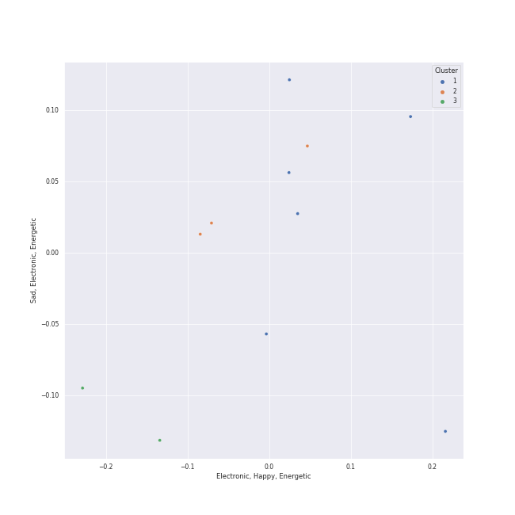

# Clusters in HWASA

## Cluster #1

6 tracks

| Art | Track | Album | Artists | Label | Rank | 💚 | 🔗 |
|:---|:---|:---|:---|:---|---:|:---|:---|
|  | Now (feat. Hwa Sa) | PSY 9th | PSY, [HWASA](../../overview.md) | P NATION | nan | | [🔗](https://open.spotify.com/track/77agEdLYGWCAhSmwtkPlCs) |
|  | Maria | María | [HWASA](../../overview.md) | [RBW, Inc](../../../../labels/rbw_inc_) | 5 | 💚 | [🔗](https://open.spotify.com/track/0ZeGfEAL5Rl4pd5LZBGuEK) |
|  | I Love My Body | I Love My Body | [HWASA](../../overview.md) | [WM Korea](../../../../labels/wm_korea) | 313 | | [🔗](https://open.spotify.com/track/0pHylQR53epYtRcVIhUSCh) |
|  | Chili | Chili | [HWASA](../../overview.md) | [Genie Music Corporation](../../../../labels/genie_music_corporation) | 510 | 💚 | [🔗](https://open.spotify.com/track/253P6uwLnelVQ6MdwXMIJk) |
|  | TWIT | TWIT | [HWASA](../../overview.md) | [RBW, Inc](../../../../labels/rbw_inc_) | nan | 💚 | [🔗](https://open.spotify.com/track/6qyz1KOlGJsKYJ4ZsRmRSD) |
|  | Physical (feat. Hwa Sa) | Physical (feat. Hwa Sa) | [Dua Lipa](../../../dua_lipa/overview.md), [HWASA](../../overview.md) | [Warner Records](../../../../labels/warner_records) | nan | 💚 | [🔗](https://open.spotify.com/track/23jEeXRyrjFbfs2Q8tBwdI) |
## Cluster #2

3 tracks

| Art | Track | Album | Artists | Label | Rank | 💚 | 🔗 |
|:---|:---|:---|:---|:---|---:|:---|:---|
|  | I`m a B | Guilty Pleasure | [HWASA](../../overview.md) | [RBW Inc.](../../../../labels/rbw_inc_) | nan | 💚 | [🔗](https://open.spotify.com/track/1AToLLvWghQgiBFef1iGuR) |
|  | Somebody! | Somebody | Loco, [HWASA](../../overview.md) | AOMG, ㈜RBW | nan | | [🔗](https://open.spotify.com/track/2FA4veLVh3jf7O8q5VhNh5) |
|  | Don’t | The Hyena on the Keyboard Pt. 4 | Loco, [HWASA](../../overview.md) | [Genie Music Corporation](../../../../labels/genie_music_corporation), [Stone Music Entertainment](../../../../labels/stone_music_entertainment) | nan | 💚 | [🔗](https://open.spotify.com/track/6KyafpXji3NKMmlmSokT9Y) |
## Cluster #3

2 tracks

| Art | Track | Album | Artists | Label | Rank | 💚 | 🔗 |
|:---|:---|:---|:---|:---|---:|:---|:---|
|  | FOMO | Guilty Pleasure | [HWASA](../../overview.md) | [RBW Inc.](../../../../labels/rbw_inc_) | nan | | [🔗](https://open.spotify.com/track/3f2I2bydLQ38Xr0jvUcNJn) |
|  | In The Fall | Hwa:telier | [HWASA](../../overview.md), WOOGIE | [RBW, Inc](../../../../labels/rbw_inc_) | 696 | 💚 | [🔗](https://open.spotify.com/track/2esmbUCwduwG8SyN4RAwmM) |