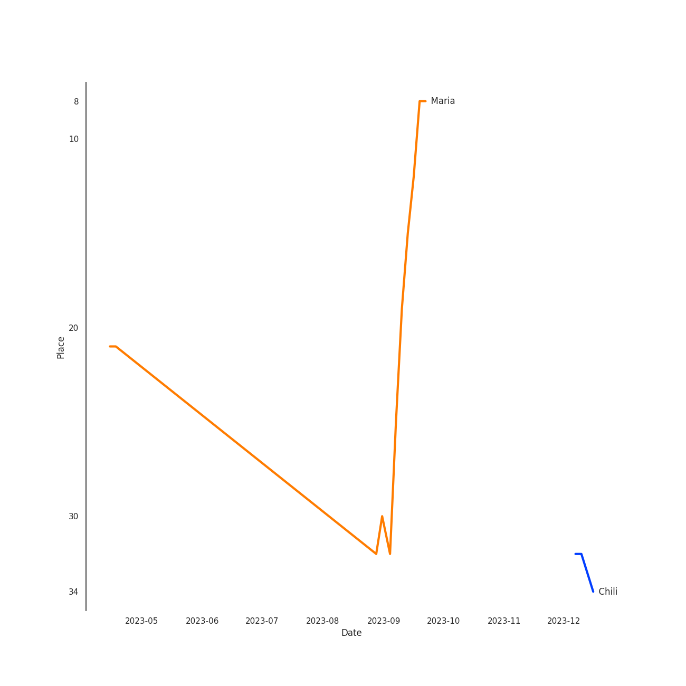

# HWASA

## Relationships

HWASA:
- is a member of [MAMAMOO](../mamamoo/overview.md)

## Artist Rank

## Top Tracks

- Maria is:
    - the #6 track of all time

### Top tracks of all time over time

### Top tracks of the last month over time

## Featured on Playlists
| Art | Tracks | Playlist |
|:---|---:|:---|
|  | 8 | [K-Pop](../../playlists/k_pop/overview.md) |
|  | 3 | [K-R&B](../../playlists/k_r_b/overview.md) |
|  | 2 | [Chill](../../playlists/chill/overview.md) |
|  | 1 | [Pop](../../playlists/pop/overview.md) |
|  | 1 | [K-Pop Favorites](../../playlists/k_pop_favorites/overview.md) |
|  | 1 | [Recent Comebacks](../../playlists/recent_comebacks/overview.md) |

## Top Albums

| Art | Tracks | 💚 | Album | Release Date | 🔗 |
|:---|---:|---:|:---|:---|:---|
|  | 2 | 1 | Guilty Pleasure | 2021-11-24 | [🔗](https://open.spotify.com/album/7jke1vYOze3jdyTiWhtFnz) |
|  | 1 | 1 | The Hyena on the Keyboard Pt. 4 | 2018-04-21 | [🔗](https://open.spotify.com/album/2fMMk4DD96UcAmSczUQ0kq) |
|  | 1 | 1 | TWIT | 2019-02-13 | [🔗](https://open.spotify.com/album/6KL4s0Y6Ijcj0QP1Nm1EVF) |
|  | 1 | 1 | Physical (feat. Hwa Sa) | 2020-01-28 | [🔗](https://open.spotify.com/album/6apIJi4hf7U6cBOFwIqq1b) |
|  | 1 | 1 | PSY 9th | 2022-04-29 | [🔗](https://open.spotify.com/album/0v4swbfO7N9WyJkUo465C4) |
|  | 1 | 1 | María | 2020-06-29 | [🔗](https://open.spotify.com/album/5YYY7QCkq3pSw4Hoc1m0D3) |
|  | 1 | 1 | I Love My Body | 2023-09-06 | [🔗](https://open.spotify.com/album/7Lbc8drIJGlYLT4hdcBvre) |
|  | 1 | 1 | Hwa:telier | 2019-10-11 | [🔗](https://open.spotify.com/album/20xEJwUlmfoSLoK5AhEucL) |
|  | 1 | 0 | Somebody | 2022-07-25 | [🔗](https://open.spotify.com/album/40XK96MKBOb5BjAU8QAIfN) |

## Top Record Labels

| Tracks | 💚 | Label |
|---:|---:|:---|
| 5 | 4 | [RBW Inc.](../../labels/rbw_inc_/overview.md) |
| 1 | 1 | [Warner Records](../../labels/warner_records/overview.md) |
| 1 | 1 | [WM Korea](../../labels/wm_korea/overview.md) |
| 1 | 1 | [Stone Music Entertainment](../../labels/stone_music_entertainment/overview.md) |
| 1 | 1 | P NATION |
| 1 | 1 | [Genie Music Corporation](../../labels/genie_music_corporation/overview.md) |
| 1 | 0 | ㈜RBW |
| 1 | 0 | AOMG |

## Genres

- [k-pop](../../genres/k_pop/overview.md)
- korean talent show

## Credits

### Credits by Type

| Credit Type | Tracks |
|:---|---:|
| Lyricist | 2 |
| Songwriter | 1 |
| Vocal | 2 |

### Production Credits

| Art | Track | Credit Types |
|:---|:---|:---|
|  | Maria | Lyricist, Songwriter |
|  | I`m a B | Lyricist |

## Top Producers

| Art | Producer | Tracks | Credit Types |
|:---|:---|---:|:---|
|  | [HWASA](overview.md) | 2 | Lyricist, Songwriter |
| | 박우상 (Park, Woo-sang) | 2 | Producer, Arranger, Lyricist |
| | Sarah Hudson | 1 | Songwriter |
| | Jason Evigan | 1 | Songwriter |
| | Gustav Landell | 1 | Arranger, Lyricist, Songwriter |
| | Steve Wittmack | 1 | Songwriter |
| | 구종필 (Koo, Jong-Pil) | 1 | Producer |
| | 유건형 (Yoo, Keon-Hyung) | 1 | Arranger |
| | Clarence Coffee Jr. | 1 | Songwriter |
|  | [Dua Lipa](../dua_lipa/overview.md) | 1 | Songwriter |

View all

| Art | Producer | Tracks | Credit Types |
|:---|:---|---:|:---|
| | Peggy March | 1 | Songwriter |
| | 해다영 (Hae, Da-young) | 1 | Lyricist |
| | 이기호 (Lee, Ki-ho) | 1 | Producer |
| | Musikality | 1 | Arranger, Lyricist, Songwriter |
| | Simon Jonasson | 1 | Arranger, Lyricist, Songwriter |
| | 오동식 (Oh Dong-sik) | 1 | Lyricist |
| | Kristin Carpenter | 1 | Arranger, Lyricist, Songwriter |
| | Michael Bradley | 1 | Songwriter |

## Tracks

| Art | Track | Album | Artists | Label | 💚 | 🔗 |
|:---|:---|:---|:---|:---|:---|:---|
|  | Physical (feat. Hwa Sa) | Physical (feat. Hwa Sa) | [Dua Lipa](../dua_lipa/overview.md), [HWASA](overview.md) | [Warner Records](../../labels/warner_records) | 💚 | [🔗](https://open.spotify.com/track/23jEeXRyrjFbfs2Q8tBwdI) |
|  | TWIT | TWIT | [HWASA](overview.md) | [RBW, Inc](../../labels/rbw_inc_) | 💚 | [🔗](https://open.spotify.com/track/6qyz1KOlGJsKYJ4ZsRmRSD) |
|  | In The Fall | Hwa:telier | [HWASA](overview.md), WOOGIE | [RBW, Inc](../../labels/rbw_inc_) | 💚 | [🔗](https://open.spotify.com/track/2esmbUCwduwG8SyN4RAwmM) |
|  | Maria | María | [HWASA](overview.md) | [RBW, Inc](../../labels/rbw_inc_) | 💚 | [🔗](https://open.spotify.com/track/0ZeGfEAL5Rl4pd5LZBGuEK) |
|  | FOMO | Guilty Pleasure | [HWASA](overview.md) | [RBW Inc.](../../labels/rbw_inc_) | | [🔗](https://open.spotify.com/track/3f2I2bydLQ38Xr0jvUcNJn) |
|  | I`m a B | Guilty Pleasure | [HWASA](overview.md) | [RBW Inc.](../../labels/rbw_inc_) | 💚 | [🔗](https://open.spotify.com/track/1AToLLvWghQgiBFef1iGuR) |
|  | I Love My Body | I Love My Body | [HWASA](overview.md) | [WM Korea](../../labels/wm_korea) | 💚 | [🔗](https://open.spotify.com/track/0pHylQR53epYtRcVIhUSCh) |
|  | Don’t | The Hyena on the Keyboard Pt. 4 | Loco, [HWASA](overview.md) | [Genie Music Corporation](../../labels/genie_music_corporation), [Stone Music Entertainment](../../labels/stone_music_entertainment) | 💚 | [🔗](https://open.spotify.com/track/6KyafpXji3NKMmlmSokT9Y) |
|  | Somebody! | Somebody | Loco, [HWASA](overview.md) | AOMG, ㈜RBW | | [🔗](https://open.spotify.com/track/2FA4veLVh3jf7O8q5VhNh5) |
|  | Now (feat. Hwa Sa) | PSY 9th | PSY, [HWASA](overview.md) | P NATION | 💚 | [🔗](https://open.spotify.com/track/3tXzsm4d0w4w1Dyx7Eo88g) |
