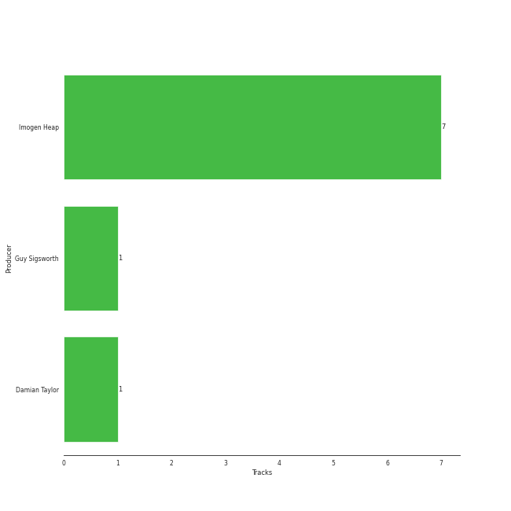

# Imogen Heap

## Relationships

Imogen Heap:
- is a member of Frou Frou

## Artist Rank
- The #409 artist of all time

## Top Albums

| Art | Rank | Tracks | 💚 | Album | Release Date | 🔗 |
|:---|---:|---:|---:|:---|:---|:---|
|  | 597 | 4 | 3 | Ellipse | 2009-08-25 | [🔗](https://open.spotify.com/album/5AYKGPzPBJNHeKehCxMaq0) |
|  | 597 | 3 | 3 | Speak for Yourself | 2005-07-18 | [🔗](https://open.spotify.com/album/0t0Cr8jA63wlm8nWj7qfvJ) |
|  | 597 | 1 | 1 | A New Kind Of Love (Demo) | 2022-04-08 | [🔗](https://open.spotify.com/album/484SKRaXGq7m9VV0rmSyeb) |
|  | 597 | 1 | 0 | Goodnight And Go | 2006-05-02 | [🔗](https://open.spotify.com/album/3JYjYjUAoBjxXr1W8eDVLV) |

## Featured on Playlists
| Art | Tracks | Playlist |
|:---|---:|:---|
|  | 9 | [Alt-Pop](../../playlists/alt-pop/overview.md) |
|  | 8 | [Singer-Songwriter](../../playlists/singer-songwriter/overview.md) |
|  | 3 | [A-Pop Favorites](../../playlists/a-pop_favorites/overview.md) |
|  | 1 | [Halloween](../../playlists/halloween/overview.md) |

## Top Record Labels

| Tracks | 💚 | Label |
|---:|---:|:---|
| 4 | 3 | [RCA Records Label](../../labels/rca_records_label/overview.md) |
| 3 | 3 | Sony BMG Music UK |
| 1 | 1 | Megaphonic |
| 1 | 0 | RCA Victor |

## Genres

- etherpop
- metropopolis

## Credits

### Credits by Type

| Credit Type | Tracks |
|:---|---:|
| Instrument | 1 |
| Lyricist | 7 |
| Producer | 7 |
| Songwriter | 9 |
| Vocal | 5 |

### Production Credits

| Art | Track | Credit Types |
|:---|:---|:---|
|  | Goodnight and Go | Lyricist, Producer, Songwriter |
|  | Closing In | Lyricist, Producer, Songwriter |
|  | Hide and Seek | Lyricist, Producer, Songwriter |
|  | Aha! | Lyricist, Producer, Songwriter |
|  | Wait It Out | Lyricist, Producer, Songwriter |
|  | Earth | Lyricist, Producer, Songwriter |
|  | Aha! | Lyricist, Songwriter |
|  | Clean | Producer, Songwriter |
|  | A New Kind Of Love - Demo | Songwriter |

## Top Producers

| Art | Producer | Tracks | Credit Types |
|:---|:---|---:|:---|
|  | [Imogen Heap](overview.md) | 7 | Songwriter, Lyricist, Producer |
| | Damian Taylor | 1 | Producer |
|  | Guy Sigsworth | 1 | Producer, Songwriter |

## Tracks

| Art | Track | Album | Artists | Label | Rank | 💚 | 🔗 |
|:---|:---|:---|:---|:---|---:|:---|:---|
|  | Closing In | Speak for Yourself | [Imogen Heap](overview.md) | Sony BMG Music UK | 888 | 💚 | [🔗](https://open.spotify.com/track/3wKRHAG6IvErggsniF1a3j) |
|  | Goodnight and Go | Speak for Yourself | [Imogen Heap](overview.md) | Sony BMG Music UK | 888 | 💚 | [🔗](https://open.spotify.com/track/0vfWzo75MKGYiQSiT5jEzt) |
|  | Hide and Seek | Speak for Yourself | [Imogen Heap](overview.md) | Sony BMG Music UK | 888 | 💚 | [🔗](https://open.spotify.com/track/7mMlbJlXXo2mRtQ4R9sIzD) |
|  | Speeding Cars | Goodnight And Go | [Imogen Heap](overview.md) | RCA Victor | 888 | | [🔗](https://open.spotify.com/track/5qeh0TEQCFdmUVnSRKG9md) |
|  | Aha! | Ellipse | [Imogen Heap](overview.md) | [RCA Records Label](../../labels/rca_records_label) | 888 | 💚 | [🔗](https://open.spotify.com/track/42itRd5WoYb42RSYOloJvD) |
|  | Earth | Ellipse | [Imogen Heap](overview.md) | [RCA Records Label](../../labels/rca_records_label) | 888 | 💚 | [🔗](https://open.spotify.com/track/4zXgNwVhtfDrPLjKs52msC) |
|  | First Train Home | Ellipse | [Imogen Heap](overview.md) | [RCA Records Label](../../labels/rca_records_label) | 888 | | [🔗](https://open.spotify.com/track/504gJcwsW5n0s3Zj5uAedr) |
|  | Wait It Out | Ellipse | [Imogen Heap](overview.md) | [RCA Records Label](../../labels/rca_records_label) | 888 | 💚 | [🔗](https://open.spotify.com/track/4xszw2YraekWIpj0SZ6Lp6) |
|  | A New Kind Of Love - Demo | A New Kind Of Love (Demo) | Frou Frou, [Imogen Heap](overview.md), Guy Sigsworth | Megaphonic | 888 | 💚 | [🔗](https://open.spotify.com/track/3fuyYaLhZ2RoP9eWpvfP1H) |
