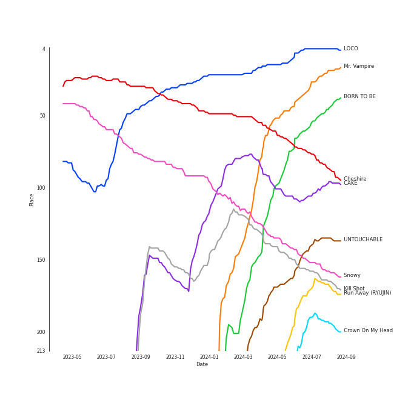
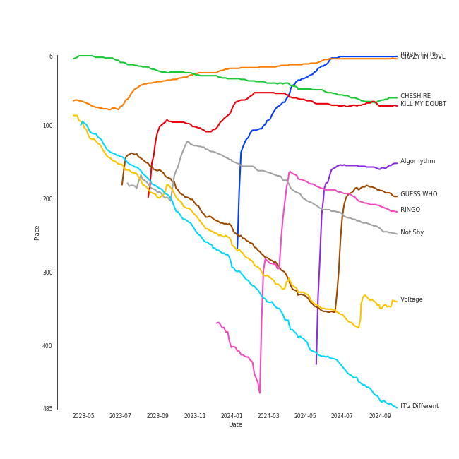
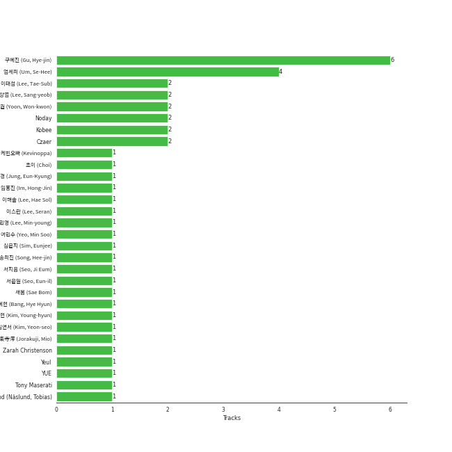

# ITZY

[See Track Features](audio_features.md)

[See Clusters](clusters/overview.md)

## Relationships

ITZY:
- has member 채령 (Chaeryeong)
- has member LIA
- has member 류진 (Ryujin)
- has member 예지 (Yeji)
- has member 유나 (Yuna)

## Artist Rank
ITZY is currently:
- The #7 artist of the last month
- The #5 artist of the last 6 months
- The #3 artist of the last year
- The #5 artist of all time

## Top Tracks

### Top tracks of all time

Top tracks of the last year over time

Top tracks of the last 6 months over time

## Top Albums

| Art | Rank | Tracks | 💚 | Album | Release Date | 🔗 |
|:---|---:|---:|---:|:---|:---|:---|
|  | 7 | 5 | 5 | BORN TO BE | 2024-01-08 | [🔗](https://open.spotify.com/album/3cm3EkNQLpKu58btSJT7fz) |
|  | 70 | 5 | 4 | KILL MY DOUBT | 2023-07-31 | [🔗](https://open.spotify.com/album/6P01cKb7sdwfnNpuMLNEik) |
|  | 185 | 5 | 3 | GUESS WHO | 2021-04-30 | [🔗](https://open.spotify.com/album/4lS8nhX8cplsYPzKjvhw6G) |
|  | 10 | 5 | 3 | CRAZY IN LOVE | 2021-09-24 | [🔗](https://open.spotify.com/album/4U7rGOkJgtxs27H9L93Xli) |
|  | 579 | 5 | 3 | CHECKMATE | 2022-07-15 | [🔗](https://open.spotify.com/album/64EGnoCD5NuC41OqQ3E7UK) |
|  | 613 | 4 | 0 | Not Shy (English Ver.) | 2021-01-22 | [🔗](https://open.spotify.com/album/0hoNwSKuuOeT9eAxopgMdm) |
|  | 68 | 3 | 2 | CHESHIRE | 2022-11-30 | [🔗](https://open.spotify.com/album/2a1ezg7hE6Dyuymv1aCnkm) |
|  | 236 | 2 | 2 | Not Shy | 2020-08-17 | [🔗](https://open.spotify.com/album/5NN55LKbjzX16a7Uf8u7Os) |
|  | 157 | 2 | 2 | Algorhythm | 2024-05-15 | [🔗](https://open.spotify.com/album/7ji7zKkvRlYOsu3ehctQRx) |
|  | 337 | 1 | 1 | Voltage | 2022-03-23 | [🔗](https://open.spotify.com/album/3MXVqfk9VG3B757nLlow0D) |

See all albums

| Art | Rank | Tracks | 💚 | Album | Release Date | 🔗 |
|:---|---:|---:|---:|:---|:---|:---|
|  | 613 | 1 | 1 | Street Dance Girls Fighter(SGF) Special | 2022-01-04 | [🔗](https://open.spotify.com/album/4azL8fNPVZ8tmKqPyK1583) |
|  | 209 | 1 | 1 | RINGO | 2023-10-18 | [🔗](https://open.spotify.com/album/1kRAzoCTDLqwU6nX2I2Nmc) |
|  | 536 | 1 | 1 | IT'z ME | 2020-03-09 | [🔗](https://open.spotify.com/album/7ynKAohxfwPUZzvU8f1p1U) |
|  | 461 | 1 | 1 | IT'z ICY | 2019-07-29 | [🔗](https://open.spotify.com/album/5Xb03XAF2LoaMqbM38H9eB) |
|  | 458 | 1 | 1 | IT'z Different | 2019-02-12 | [🔗](https://open.spotify.com/album/7Mxbav9clZ3AVDKThwwgXS) |
|  | 613 | 1 | 0 | In the morning (English Ver.) | 2021-05-14 | [🔗](https://open.spotify.com/album/1VbG3CJlf1cSVDibgiM3GM) |
|  | 613 | 1 | 0 | Break My Heart Myself (feat. YEJI & RYUJIN of ITZY) | 2022-07-29 | [🔗](https://open.spotify.com/album/6nHECY2OnWXVmd4QjGhJEm) |
|  | 613 | 1 | 0 | Blah Blah Blah | 2022-09-21 | [🔗](https://open.spotify.com/album/0KaoPehrtwhjQfae6XMd7B) |

## Featured on Playlists
| Art | Tracks | Playlist |
|:---|---:|:---|
|  | 38 | [K-Pop](../../playlists/k-pop/overview.md) |
|  | 15 | [Workout](../../playlists/workout/overview.md) |
|  | 11 | [K-Pop Favorites](../../playlists/k-pop_favorites/overview.md) |
|  | 8 | [Summer](../../playlists/summer/overview.md) |
|  | 7 | [Cursed English](../../playlists/cursed_english/overview.md) |
|  | 7 | [Your Top Songs 2023](../../playlists/your_top_songs_2023/overview.md) |
|  | 5 | [Your Top Songs 2022](../../playlists/your_top_songs_2022/overview.md) |
|  | 4 | [Repeat Rewind](../../playlists/repeat_rewind/overview.md) |
|  | 2 | [Sharon RPD](../../playlists/sharon_rpd/overview.md) |
|  | 2 | [Recent Comebacks](../../playlists/recent_comebacks/overview.md) |
|  | 2 | [K-Memes](../../playlists/k-memes/overview.md) |
|  | 1 | [On Repeat](../../playlists/on_repeat/overview.md) |
|  | 1 | [K-Pop 101](../../playlists/k-pop_101/overview.md) |
|  | 1 | [Halloween](../../playlists/halloween/overview.md) |
|  | 1 | [Classical Samples](../../playlists/classical_samples/overview.md) |
|  | 1 | [Recommendations for Chris](../../playlists/recommendations_for_chris/overview.md) |
|  | 1 | [Chill](../../playlists/chill/overview.md) |
|  | 1 | [Christmas](../../playlists/christmas/overview.md) |

## Top Record Labels

| Tracks | 💚 | Label |
|---:|---:|:---|
| 38 | 25 | [Republic Records](../../labels/republic_records/overview.md) |
| 5 | 4 | [WM Japan](../../labels/wm_japan/overview.md) |
| 1 | 1 | [Genie Music Corporation](../../labels/genie_music_corporation/overview.md) |
| 1 | 0 | [Warner Records](../../labels/warner_records/overview.md) |

## Genres

- [k-pop](../../genres/k-pop/overview.md)
- [k-pop girl group](../../genres/k-pop_girl_group/overview.md)

## Credits

### Credits by Type

| Credit Type | Tracks |
|:---|---:|
| Performer | 9 |

### Member Credits

| | LIA | 류진 (Ryujin) | 예지 (Yeji) | 유나 (Yuna) | 채령 (Chaeryeong) |
|:---|---:|---:|---:|---:|---:|
| Vocal | 6 | 9 | 9 | 9 | 9 |
## Top Producers

| Art | Producer | Tracks | Credit Types |
|:---|:---|---:|:---|
| | [구혜진 (Gu, Hye-jin)](../../producers/구혜진_(gu,_hye-jin)/overview.md) | 6 | Producer |
| | [엄세희 (Um, Se-Hee)](../../producers/엄세희_(um,_se-hee)/overview.md) | 4 | Producer |
| | Czaer | 2 | Producer, Arranger, Lyricist, Songwriter |
| | 이상엽 (Lee, Sang-yeob) | 2 | Producer |
| | Noday | 2 | Arranger, Lyricist, Songwriter |
| | 윤원권 (Yoon, Won-kwon) | 2 | Producer |
| | Kobee | 2 | Arranger, Producer, Songwriter |
| | [이태섭 (Lee, Tae-Sub)](../../producers/이태섭_(lee,_tae-sub)/overview.md) | 2 | Producer |
| | 김영현 (Kim, Young-hyun) | 1 | Producer |
| | Cameron Neilson | 1 | Songwriter |

View all

| Art | Producer | Tracks | Credit Types |
|:---|:---|---:|:---|
| | [심은지 (Sim, Eunjee)](../../producers/심은지_(sim,_eunjee)/overview.md) | 1 | Arranger, Producer, Songwriter |
| | 여민수 (Yeo, Min Soo) | 1 | Producer |
| | Gusten Dahlqvist | 1 | Arranger, Producer, Songwriter |
| | Arineh Karimi | 1 | Songwriter |
| | IRIS Yerin Lee | 1 | Lyricist, Songwriter |
| | [정은경 (Jung, Eun-Kyung)](../../producers/정은경_(jung,_eun-kyung)/overview.md) | 1 | Producer |
| | [LDN Noise](../../producers/ldn_noise/overview.md) | 1 | Arranger, Producer |
| | 방혜현 (Bang, Hye Hyun) | 1 | Lyricist |
| | Daniel Mikael Caesar | 1 | Songwriter |
| | Zarah Christenson | 1 | Songwriter |
| | 송희진 (Song, Hee-jin) | 1 | Arranger, Lyricist, Songwriter |
| | 이민영 (Lee, Min-young) | 1 | Arranger, Producer, Songwriter |
| | SELAH | 1 | Arranger |
| | Karin Wilhemina Eurenius | 1 | Arranger, Producer, Songwriter |
| | EZIT | 1 | Arranger, Songwriter |
| | 常楽寺澪 (Jorakuji, Mio) | 1 | Lyricist |
| | 서은일 (Seo, Eun-il) | 1 | Producer |
| | Cazzi Opeia | 1 | Songwriter |
| | Greg Bonnick | 1 | Songwriter |
| | Ellen Berg Tollbom | 1 | Songwriter |
| | [서지음 (Seo, Ji Eum)](../../producers/서지음_(seo,_ji_eum)/overview.md) | 1 | Lyricist |
|  | J.Y. Park | 1 | Arranger, Lyricist, Songwriter |
| | 이해솔 (Lee, Hae Sol) | 1 | Arranger, Producer |
| | [Tony Maserati](../../producers/tony_maserati/overview.md) | 1 | Producer |
| | Christoffer Semelius | 1 | Arranger, Producer, Songwriter |
| | 이스란 (Lee, Seran) | 1 | Lyricist |
| | Melange | 1 | Arranger |
| | Ludwig Lindell | 1 | Songwriter |
| | Maria Marcus | 1 | Songwriter |
| | 김연서 (Kim, Yeon-seo) | 1 | Arranger |
| | Tobias Näslund (Näslund, Tobias) | 1 | Arranger, Producer, Songwriter |
| | 초이 (Choi) | 1 | Producer |
| | [Manny Marroquin](../../producers/manny_marroquin/overview.md) | 1 | Producer |
| | 케빈오빠 (Kevinoppa) | 1 | Arranger, Lyricist, Producer, Songwriter |
| | Hayden Chapman | 1 | Songwriter |
| | Holy M | 1 | Arranger, Songwriter |
| | YUE | 1 | Producer |
| | PENOMECO | 1 | Arranger, Lyricist |
| | 임홍진 (Im, Hong-Jin) | 1 | Producer |
| | Sofia Quinn | 1 | Songwriter |
| | Chris Galland | 1 | Producer |
| | Lauren Dyson | 1 | Songwriter |
| | Ashley Alisha | 1 | Songwriter |
| | 새봄 (Sae Bom) | 1 | Lyricist |
| | Noémie Legrand (Legrand, Noémie) | 1 | Songwriter |
| | Yeul | 1 | Arranger, Producer, Songwriter |

## Tracks

| Art | Track | Album | Artists | Label | Rank | 💚 | 🔗 |
|:---|:---|:---|:---|:---|---:|:---|:---|
|  | LOCO | CRAZY IN LOVE | [ITZY](overview.md) | [Republic Records](../../labels/republic_records) | 4 | 💚 | [🔗](https://open.spotify.com/track/56Yxkm62GtEpnPyG7TvwLY) |
|  | Mr. Vampire | BORN TO BE | [ITZY](overview.md) | [Republic Records](../../labels/republic_records) | 18 | 💚 | [🔗](https://open.spotify.com/track/3uI6jqO0fFBoFryc8SJOXw) |
|  | BORN TO BE | BORN TO BE | [ITZY](overview.md) | [Republic Records](../../labels/republic_records) | 39 | 💚 | [🔗](https://open.spotify.com/track/45lXSvtDt6uKiGZIXB4LLF) |
|  | Cheshire | CHESHIRE | [ITZY](overview.md) | [Republic Records](../../labels/republic_records) | 93 | 💚 | [🔗](https://open.spotify.com/track/7ixVW7RobslvMrvlzHYLha) |
|  | CAKE | KILL MY DOUBT | [ITZY](overview.md) | [Republic Records](../../labels/republic_records) | 97 | 💚 | [🔗](https://open.spotify.com/track/3syxwxJqX5jpgjNYmvzdW6) |
|  | UNTOUCHABLE | BORN TO BE | [ITZY](overview.md) | [Republic Records](../../labels/republic_records) | 137 | 💚 | [🔗](https://open.spotify.com/track/2HQALWSN6IF4BYrSADMJ0w) |
|  | Snowy | CHESHIRE | [ITZY](overview.md) | [Republic Records](../../labels/republic_records) | 161 | 💚 | [🔗](https://open.spotify.com/track/1i0NAz5emJMbRWSkADMsL7) |
|  | Kill Shot | KILL MY DOUBT | [ITZY](overview.md) | [Republic Records](../../labels/republic_records) | 170 | 💚 | [🔗](https://open.spotify.com/track/3i7Z0CI7QIwnU4MVL0XJB9) |
|  | Run Away (RYUJIN) | BORN TO BE | [ITZY](overview.md) | [Republic Records](../../labels/republic_records) | 174 | 💚 | [🔗](https://open.spotify.com/track/4e94KIas5maH8RixY26LiN) |
|  | Crown On My Head (YEJI) | BORN TO BE | [ITZY](overview.md) | [Republic Records](../../labels/republic_records) | 199 | 💚 | [🔗](https://open.spotify.com/track/7us3VPvRjtjuMEexfyRsMC) |

See all tracks

| Art | Track | Album | Artists | Label | Rank | 💚 | 🔗 |
|:---|:---|:---|:---|:---|---:|:---|:---|
|  | BET ON ME | KILL MY DOUBT | [ITZY](overview.md) | [Republic Records](../../labels/republic_records) | 218 | 💚 | [🔗](https://open.spotify.com/track/5BCPIye83pj24VjCzQuL5F) |
|  | Algorhythm | Algorhythm | [ITZY](overview.md) | [WM Japan](../../labels/wm_japan) | 253 | 💚 | [🔗](https://open.spotify.com/track/47tYRja2sNmaF0tFFY3D2a) |
|  | In the morning | GUESS WHO | [ITZY](overview.md) | [Republic Records](../../labels/republic_records) | 255 | 💚 | [🔗](https://open.spotify.com/track/1Wcr8zrKqbUX0zwN8Dbr16) |
|  | No Biggie | Algorhythm | [ITZY](overview.md) | [WM Japan](../../labels/wm_japan) | 257 | 💚 | [🔗](https://open.spotify.com/track/6ysaQMOAn1JNU0ab9IPtyP) |
|  | RINGO | RINGO | [ITZY](overview.md) | [WM Japan](../../labels/wm_japan) | 282 | 💚 | [🔗](https://open.spotify.com/track/2zRz0XfYEtsHuVfrM8KaOP) |
|  | None of My Business | KILL MY DOUBT | [ITZY](overview.md) | [Republic Records](../../labels/republic_records) | 312 | 💚 | [🔗](https://open.spotify.com/track/6iYfUvWNdKulAgX2TOhk5u) |
|  | Be In Love | Not Shy | [ITZY](overview.md) | [Republic Records](../../labels/republic_records) | 346 | 💚 | [🔗](https://open.spotify.com/track/0FGeJSm4Iix7OdvjvENrwx) |
|  | #Twenty | CRAZY IN LOVE | [ITZY](overview.md) | [Republic Records](../../labels/republic_records) | 477 | | [🔗](https://open.spotify.com/track/0deWmYkaZHaElUm15oVXkE) |
|  | Voltage | Voltage | [ITZY](overview.md) | [WM Japan](../../labels/wm_japan) | 482 | 💚 | [🔗](https://open.spotify.com/track/7e65OAe9L0xWPSHDiahjQe) |
|  | DALLA DALLA | IT'z Different | [ITZY](overview.md) | [Republic Records](../../labels/republic_records) | 679 | 💚 | [🔗](https://open.spotify.com/track/38rUIlTX93Aoif3WcY1wv6) |
|  | ICY | IT'z ICY | [ITZY](overview.md) | [Republic Records](../../labels/republic_records) | 688 | 💚 | [🔗](https://open.spotify.com/track/2vdkN2NSQ5mxqNGg7sJUxs) |
|  | Not Shy | Not Shy | [ITZY](overview.md) | [Republic Records](../../labels/republic_records) | 704 | 💚 | [🔗](https://open.spotify.com/track/1ehags7lQMM1qX94VJkoaf) |
|  | Bratty | KILL MY DOUBT | [ITZY](overview.md) | [Republic Records](../../labels/republic_records) | 750 | | [🔗](https://open.spotify.com/track/5Z0gyPr6idyscwLribVpFH) |
|  | WANNABE | IT'z ME | [ITZY](overview.md) | [Republic Records](../../labels/republic_records) | 802 | 💚 | [🔗](https://open.spotify.com/track/4pspYVQGFHLPEFgQPD1J7e) |
|  | Free Fall | CHECKMATE | [ITZY](overview.md) | [Republic Records](../../labels/republic_records) | 877 | 💚 | [🔗](https://open.spotify.com/track/3bW8vRr2qQwtmz46OEPZKk) |
|  | WHAT I WANT | CHECKMATE | [ITZY](overview.md) | [Republic Records](../../labels/republic_records) | 916 | 💚 | [🔗](https://open.spotify.com/track/28E5sYRuv2gpZPEdNAwMkE) |
|  | DALLA DALLA - English Ver. | Not Shy (English Ver.) | [ITZY](overview.md) | [Republic Records](../../labels/republic_records) | 925 | | [🔗](https://open.spotify.com/track/1tQMEpkJ6ayK5w9mtW3Tqv) |
|  | ICY - English Ver. | Not Shy (English Ver.) | [ITZY](overview.md) | [Republic Records](../../labels/republic_records) | 925 | | [🔗](https://open.spotify.com/track/0H76idYK173LwctmFntEdz) |
|  | Not Shy - English Ver. | Not Shy (English Ver.) | [ITZY](overview.md) | [Republic Records](../../labels/republic_records) | 925 | | [🔗](https://open.spotify.com/track/2p0WmvGmzE3mKr3lc6ZB9g) |
|  | WANNABE - English Ver. | Not Shy (English Ver.) | [ITZY](overview.md) | [Republic Records](../../labels/republic_records) | 925 | | [🔗](https://open.spotify.com/track/2cnhL9Xb7jlTuUs4taxJSB) |
|  | KIDDING ME | GUESS WHO | [ITZY](overview.md) | [Republic Records](../../labels/republic_records) | 925 | 💚 | [🔗](https://open.spotify.com/track/74WtkDIkOXTtEVO4TatDMX) |
|  | SHOOT! | GUESS WHO | [ITZY](overview.md) | [Republic Records](../../labels/republic_records) | 925 | 💚 | [🔗](https://open.spotify.com/track/2xeaHUnzzT5Kc974OQt1kA) |
|  | Sorry Not Sorry | GUESS WHO | [ITZY](overview.md) | [Republic Records](../../labels/republic_records) | 925 | | [🔗](https://open.spotify.com/track/4BV9bZOeH869aewS9lwTtM) |
|  | TENNIS (0:0) | GUESS WHO | [ITZY](overview.md) | [Republic Records](../../labels/republic_records) | 925 | | [🔗](https://open.spotify.com/track/6wSBcV4mjwiVKGJzNrgwha) |
|  | In the morning - English Ver. | In the morning (English Ver.) | [ITZY](overview.md) | [Republic Records](../../labels/republic_records) | 925 | | [🔗](https://open.spotify.com/track/0rXBxNaEX9pJSV8U7xYUXr) |
|  | Gas Me Up | CRAZY IN LOVE | [ITZY](overview.md) | [Republic Records](../../labels/republic_records) | 925 | 💚 | [🔗](https://open.spotify.com/track/3RCMSJIlIZkvJP4LFGtOtu) |
|  | LOCO - English Ver. | CRAZY IN LOVE | [ITZY](overview.md) | [Republic Records](../../labels/republic_records) | 925 | | [🔗](https://open.spotify.com/track/0QPYsEvaoEJzZLSF5Cq390) |
|  | SWIPE | CRAZY IN LOVE | [ITZY](overview.md) | [Republic Records](../../labels/republic_records) | 925 | 💚 | [🔗](https://open.spotify.com/track/5o0urLKhjQLIFMoJH5SSrY) |
|  | Weapon (With Newnion, FLOOR) (Prod.Czaer) | Street Dance Girls Fighter(SGF) Special | [ITZY](overview.md) | [Genie Music Corporation](../../labels/genie_music_corporation) | 925 | 💚 | [🔗](https://open.spotify.com/track/6poVmpGU3y3jj1Z9xbbbH4) |
|  | RACER | CHECKMATE | [ITZY](overview.md) | [Republic Records](../../labels/republic_records) | 925 | 💚 | [🔗](https://open.spotify.com/track/5v15IF9D4nKZbto4US7Ar1) |
|  | SNEAKERS | CHECKMATE | [ITZY](overview.md) | [Republic Records](../../labels/republic_records) | 925 | | [🔗](https://open.spotify.com/track/2WoluqyWzsgRmFCeHeGlnm) |
|  | SNEAKERS (English Ver.) | CHECKMATE | [ITZY](overview.md) | [Republic Records](../../labels/republic_records) | 925 | | [🔗](https://open.spotify.com/track/4DM60RC0fVoHbVRtl4Fjdp) |
|  | Break My Heart Myself (feat. YEJI & RYUJIN of ITZY) | Break My Heart Myself (feat. YEJI & RYUJIN of ITZY) | Bebe Rexha, [ITZY](overview.md), YEJI & RYUJIN of ITZY | [Warner Records](../../labels/warner_records) | 925 | | [🔗](https://open.spotify.com/track/5Av4jZOAbtY8STz7KPsNDB) |
|  | Blah Blah Blah | Blah Blah Blah | [ITZY](overview.md) | [WM Japan](../../labels/wm_japan) | 925 | | [🔗](https://open.spotify.com/track/5wOWpaKW92jhcm8pBOlrdR) |
|  | Boys Like You | CHESHIRE | [ITZY](overview.md) | [Republic Records](../../labels/republic_records) | 925 | | [🔗](https://open.spotify.com/track/1V3EKDf81bitSEQTYjOJzZ) |

