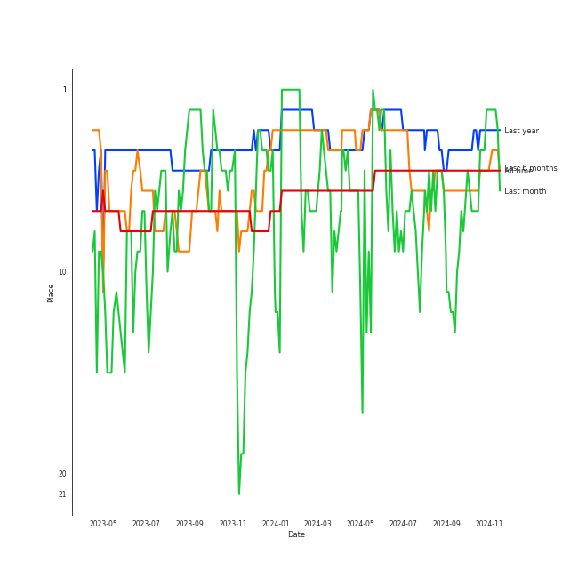

# ITZY

[See Track Features](audio_features.md)

[See Clusters](clusters/overview.md)

## Artist Rank
ITZY is currently:
- The #5 artist of all time
- The #9 artist of the last 6 months
- The #2 artist of the last month

## Top Tracks

- LOCO is:
    - the #27 track of the last 6 months
    - the #31 track of all time
- Cheshire is:
    - the #8 track of the last 6 months
- Kill Shot is:
    - the #4 track of the last month
- CAKE is:
    - the #12 track of the last month

### Top tracks of all time over time

### Top tracks of the last 6 months over time

### Top tracks of the last month over time

## Featured on Playlists
| Art | Tracks | Playlist |
|:---|---:|:---|
|  | 37 | [K-Pop](../../playlists/k_pop/overview.md) |
|  | 10 | [Workout](../../playlists/workout/overview.md) |
|  | 9 | [K-Pop Favorites](../../playlists/k_pop_favorites/overview.md) |
|  | 8 | [Summer](../../playlists/summer/overview.md) |
|  | 7 | [Cursed English](../../playlists/cursed_english/overview.md) |
|  | 6 | [K-Memes](../../playlists/k_memes/overview.md) |
|  | 5 | [Recent Comebacks](../../playlists/recent_comebacks/overview.md) |
|  | 1 | [K-Pop 101](../../playlists/k_pop_101/overview.md) |
|  | 1 | [Sharon RPD](../../playlists/sharon_rpd/overview.md) |
|  | 1 | [Chill](../../playlists/chill/overview.md) |
|  | 1 | [Christmas](../../playlists/christmas/overview.md) |
## Top Albums

| Art | Tracks | 💚 | Album | Release Date | 🔗 |
|:---|---:|---:|:---|:---|:---|
|  | 6 | 4 | CRAZY IN LOVE | 2021-09-24 | [🔗](https://open.spotify.com/album/4U7rGOkJgtxs27H9L93Xli) |
|  | 6 | 3 | CHECKMATE | 2022-07-15 | [🔗](https://open.spotify.com/album/64EGnoCD5NuC41OqQ3E7UK) |
|  | 5 | 4 | KILL MY DOUBT | 2023-07-31 | [🔗](https://open.spotify.com/album/6P01cKb7sdwfnNpuMLNEik) |
|  | 5 | 4 | GUESS WHO | 2021-04-30 | [🔗](https://open.spotify.com/album/4lS8nhX8cplsYPzKjvhw6G) |
|  | 4 | 3 | Not Shy | 2020-08-17 | [🔗](https://open.spotify.com/album/5NN55LKbjzX16a7Uf8u7Os) |
|  | 4 | 2 | CHESHIRE | 2022-11-30 | [🔗](https://open.spotify.com/album/2a1ezg7hE6Dyuymv1aCnkm) |
|  | 4 | 0 | Not Shy (English Ver.) | 2021-01-22 | [🔗](https://open.spotify.com/album/0hoNwSKuuOeT9eAxopgMdm) |
|  | 2 | 1 | IT'z ICY | 2019-07-29 | [🔗](https://open.spotify.com/album/2y2Nuvvw5xNDYOunTSsgf1) |
|  | 1 | 1 | Voltage | 2022-03-23 | [🔗](https://open.spotify.com/album/3MXVqfk9VG3B757nLlow0D) |
|  | 1 | 1 | Street Dance Girls Fighter(SGF) Special | 2022-01-04 | [🔗](https://open.spotify.com/album/4azL8fNPVZ8tmKqPyK1583) |

See all albums

| Art | Tracks | 💚 | Album | Release Date | 🔗 |
|:---|---:|---:|:---|:---|:---|
|  | 1 | 1 | IT'z ME | 2020-03-09 | [🔗](https://open.spotify.com/album/7ynKAohxfwPUZzvU8f1p1U) |
|  | 1 | 1 | IT'z Different | 2019-02-12 | [🔗](https://open.spotify.com/album/7Mxbav9clZ3AVDKThwwgXS) |
|  | 1 | 1 | Blah Blah Blah | 2022-09-21 | [🔗](https://open.spotify.com/album/0KaoPehrtwhjQfae6XMd7B) |
|  | 1 | 0 | In the morning (English Ver.) | 2021-05-14 | [🔗](https://open.spotify.com/album/1VbG3CJlf1cSVDibgiM3GM) |
|  | 1 | 0 | Break My Heart Myself (feat. YEJI & RYUJIN of ITZY) | 2022-07-29 | [🔗](https://open.spotify.com/album/6nHECY2OnWXVmd4QjGhJEm) |

## Top Record Labels

| Tracks | 💚 | Label |
|---:|---:|:---|
| 37 | 22 | [Republic Records](../../labels/republic_records/overview.md) |
| 2 | 2 | WM Japan |
| 2 | 1 | [JYP Entertainment](../../labels/jyp_entertainment/overview.md) |
| 1 | 1 | [Genie Music Corporation](../../labels/genie_music_corporation/overview.md) |
| 1 | 0 | [Warner Records](../../labels/warner_records/overview.md) |

## Genres

- [k-pop](../../genres/k_pop)
- [k-pop girl group](../../genres/k_pop_girl_group)

## Tracks

| Art | Track | Album | Artists | Label | 💚 | 🔗 |
|:---|:---|:---|:---|:---|:---|:---|
|  | Break My Heart Myself (feat. YEJI & RYUJIN of ITZY) | Break My Heart Myself (feat. YEJI & RYUJIN of ITZY) | Bebe Rexha, [ITZY](overview.md), YEJI & RYUJIN of ITZY | [Warner Records](../../labels/warner_records) | | [🔗](https://open.spotify.com/track/5Av4jZOAbtY8STz7KPsNDB) |
|  | DALLA DALLA | IT'z Different | [ITZY](overview.md) | [Republic Records](../../labels/republic_records) | 💚 | [🔗](https://open.spotify.com/track/38rUIlTX93Aoif3WcY1wv6) |
|  | CHERRY | IT'z ICY | [ITZY](overview.md) | [JYP Entertainment](../../labels/jyp_entertainment) | | [🔗](https://open.spotify.com/track/3Ef2Sr4U0oehtcozO23yUN) |
|  | ICY | IT'z ICY | [ITZY](overview.md) | [JYP Entertainment](../../labels/jyp_entertainment) | 💚 | [🔗](https://open.spotify.com/track/7zFBtYAVURF3bUVqEQ6UUu) |
|  | WANNABE | IT'z ME | [ITZY](overview.md) | [Republic Records](../../labels/republic_records) | 💚 | [🔗](https://open.spotify.com/track/4pspYVQGFHLPEFgQPD1J7e) |
|  | Be In Love | Not Shy | [ITZY](overview.md) | [Republic Records](../../labels/republic_records) | 💚 | [🔗](https://open.spotify.com/track/0FGeJSm4Iix7OdvjvENrwx) |
|  | Louder | Not Shy | [ITZY](overview.md) | [Republic Records](../../labels/republic_records) | | [🔗](https://open.spotify.com/track/39pv61XfYr9MUwsYkx30aQ) |
|  | Not Shy | Not Shy | [ITZY](overview.md) | [Republic Records](../../labels/republic_records) | 💚 | [🔗](https://open.spotify.com/track/1ehags7lQMM1qX94VJkoaf) |
|  | SURF | Not Shy | [ITZY](overview.md) | [Republic Records](../../labels/republic_records) | 💚 | [🔗](https://open.spotify.com/track/5rAjh9qDtJalKfwgxNk2vt) |
|  | DALLA DALLA - English Ver. | Not Shy (English Ver.) | [ITZY](overview.md) | [Republic Records](../../labels/republic_records) | | [🔗](https://open.spotify.com/track/1tQMEpkJ6ayK5w9mtW3Tqv) |

See all tracks

| Art | Track | Album | Artists | Label | 💚 | 🔗 |
|:---|:---|:---|:---|:---|:---|:---|
|  | ICY - English Ver. | Not Shy (English Ver.) | [ITZY](overview.md) | [Republic Records](../../labels/republic_records) | | [🔗](https://open.spotify.com/track/0H76idYK173LwctmFntEdz) |
|  | Not Shy - English Ver. | Not Shy (English Ver.) | [ITZY](overview.md) | [Republic Records](../../labels/republic_records) | | [🔗](https://open.spotify.com/track/2p0WmvGmzE3mKr3lc6ZB9g) |
|  | WANNABE - English Ver. | Not Shy (English Ver.) | [ITZY](overview.md) | [Republic Records](../../labels/republic_records) | | [🔗](https://open.spotify.com/track/2cnhL9Xb7jlTuUs4taxJSB) |
|  | In the morning | GUESS WHO | [ITZY](overview.md) | [Republic Records](../../labels/republic_records) | 💚 | [🔗](https://open.spotify.com/track/1Wcr8zrKqbUX0zwN8Dbr16) |
|  | KIDDING ME | GUESS WHO | [ITZY](overview.md) | [Republic Records](../../labels/republic_records) | 💚 | [🔗](https://open.spotify.com/track/74WtkDIkOXTtEVO4TatDMX) |
|  | SHOOT! | GUESS WHO | [ITZY](overview.md) | [Republic Records](../../labels/republic_records) | 💚 | [🔗](https://open.spotify.com/track/2xeaHUnzzT5Kc974OQt1kA) |
|  | Sorry Not Sorry | GUESS WHO | [ITZY](overview.md) | [Republic Records](../../labels/republic_records) | | [🔗](https://open.spotify.com/track/4BV9bZOeH869aewS9lwTtM) |
|  | TENNIS (0:0) | GUESS WHO | [ITZY](overview.md) | [Republic Records](../../labels/republic_records) | 💚 | [🔗](https://open.spotify.com/track/6wSBcV4mjwiVKGJzNrgwha) |
|  | In the morning - English Ver. | In the morning (English Ver.) | [ITZY](overview.md) | [Republic Records](../../labels/republic_records) | | [🔗](https://open.spotify.com/track/0rXBxNaEX9pJSV8U7xYUXr) |
|  | #Twenty | CRAZY IN LOVE | [ITZY](overview.md) | [Republic Records](../../labels/republic_records) | 💚 | [🔗](https://open.spotify.com/track/0deWmYkaZHaElUm15oVXkE) |
|  | Gas Me Up | CRAZY IN LOVE | [ITZY](overview.md) | [Republic Records](../../labels/republic_records) | 💚 | [🔗](https://open.spotify.com/track/3RCMSJIlIZkvJP4LFGtOtu) |
|  | LOCO | CRAZY IN LOVE | [ITZY](overview.md) | [Republic Records](../../labels/republic_records) | 💚 | [🔗](https://open.spotify.com/track/56Yxkm62GtEpnPyG7TvwLY) |
|  | LOCO - English Ver. | CRAZY IN LOVE | [ITZY](overview.md) | [Republic Records](../../labels/republic_records) | | [🔗](https://open.spotify.com/track/0QPYsEvaoEJzZLSF5Cq390) |
|  | SWIPE | CRAZY IN LOVE | [ITZY](overview.md) | [Republic Records](../../labels/republic_records) | 💚 | [🔗](https://open.spotify.com/track/5o0urLKhjQLIFMoJH5SSrY) |
|  | Sooo LUCKY | CRAZY IN LOVE | [ITZY](overview.md) | [Republic Records](../../labels/republic_records) | | [🔗](https://open.spotify.com/track/6zqZfHvp3f9r4AF6G7Nhgl) |
|  | Weapon (With Newnion, FLOOR) (Prod.Czaer) | Street Dance Girls Fighter(SGF) Special | [ITZY](overview.md) | [Genie Music Corporation](../../labels/genie_music_corporation) | 💚 | [🔗](https://open.spotify.com/track/6poVmpGU3y3jj1Z9xbbbH4) |
|  | Voltage | Voltage | [ITZY](overview.md) | WM Japan | 💚 | [🔗](https://open.spotify.com/track/7e65OAe9L0xWPSHDiahjQe) |
|  | DOMINO | CHECKMATE | [ITZY](overview.md) | [Republic Records](../../labels/republic_records) | | [🔗](https://open.spotify.com/track/2Yi1F6c06h8HY5ZIvNRogo) |
|  | Free Fall | CHECKMATE | [ITZY](overview.md) | [Republic Records](../../labels/republic_records) | 💚 | [🔗](https://open.spotify.com/track/3bW8vRr2qQwtmz46OEPZKk) |
|  | RACER | CHECKMATE | [ITZY](overview.md) | [Republic Records](../../labels/republic_records) | 💚 | [🔗](https://open.spotify.com/track/5v15IF9D4nKZbto4US7Ar1) |
|  | SNEAKERS | CHECKMATE | [ITZY](overview.md) | [Republic Records](../../labels/republic_records) | | [🔗](https://open.spotify.com/track/2WoluqyWzsgRmFCeHeGlnm) |
|  | SNEAKERS (English Ver.) | CHECKMATE | [ITZY](overview.md) | [Republic Records](../../labels/republic_records) | | [🔗](https://open.spotify.com/track/4DM60RC0fVoHbVRtl4Fjdp) |
|  | WHAT I WANT | CHECKMATE | [ITZY](overview.md) | [Republic Records](../../labels/republic_records) | 💚 | [🔗](https://open.spotify.com/track/28E5sYRuv2gpZPEdNAwMkE) |
|  | Blah Blah Blah | Blah Blah Blah | [ITZY](overview.md) | WM Japan | 💚 | [🔗](https://open.spotify.com/track/5wOWpaKW92jhcm8pBOlrdR) |
|  | Boys Like You | CHESHIRE | [ITZY](overview.md) | [Republic Records](../../labels/republic_records) | | [🔗](https://open.spotify.com/track/1V3EKDf81bitSEQTYjOJzZ) |
|  | Cheshire | CHESHIRE | [ITZY](overview.md) | [Republic Records](../../labels/republic_records) | 💚 | [🔗](https://open.spotify.com/track/7ixVW7RobslvMrvlzHYLha) |
|  | Freaky | CHESHIRE | [ITZY](overview.md) | [Republic Records](../../labels/republic_records) | | [🔗](https://open.spotify.com/track/6VgVT2ZxtssMdzrbfW1R0d) |
|  | Snowy | CHESHIRE | [ITZY](overview.md) | [Republic Records](../../labels/republic_records) | 💚 | [🔗](https://open.spotify.com/track/1i0NAz5emJMbRWSkADMsL7) |
|  | BET ON ME | KILL MY DOUBT | [ITZY](overview.md) | [Republic Records](../../labels/republic_records) | 💚 | [🔗](https://open.spotify.com/track/5BCPIye83pj24VjCzQuL5F) |
|  | Bratty | KILL MY DOUBT | [ITZY](overview.md) | [Republic Records](../../labels/republic_records) | | [🔗](https://open.spotify.com/track/5Z0gyPr6idyscwLribVpFH) |
|  | CAKE | KILL MY DOUBT | [ITZY](overview.md) | [Republic Records](../../labels/republic_records) | 💚 | [🔗](https://open.spotify.com/track/3syxwxJqX5jpgjNYmvzdW6) |
|  | Kill Shot | KILL MY DOUBT | [ITZY](overview.md) | [Republic Records](../../labels/republic_records) | 💚 | [🔗](https://open.spotify.com/track/3i7Z0CI7QIwnU4MVL0XJB9) |
|  | None of My Business | KILL MY DOUBT | [ITZY](overview.md) | [Republic Records](../../labels/republic_records) | 💚 | [🔗](https://open.spotify.com/track/6iYfUvWNdKulAgX2TOhk5u) |

