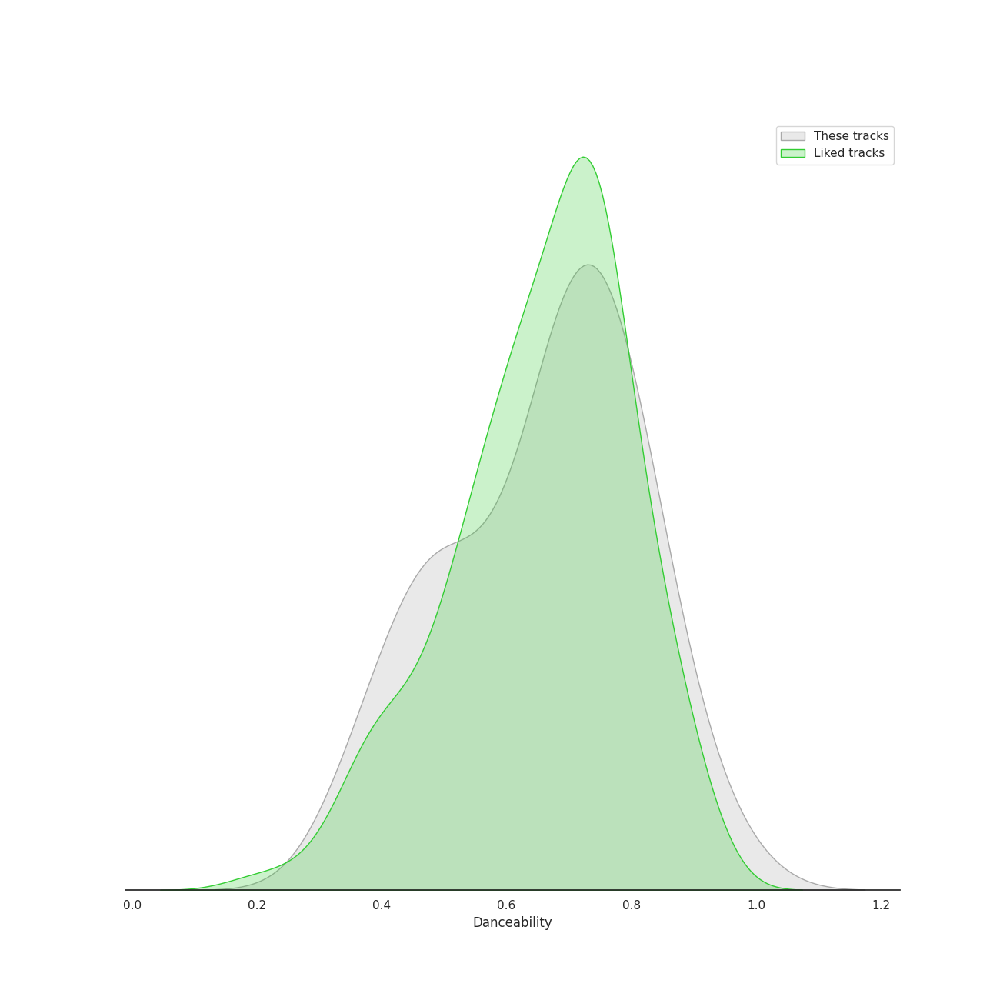
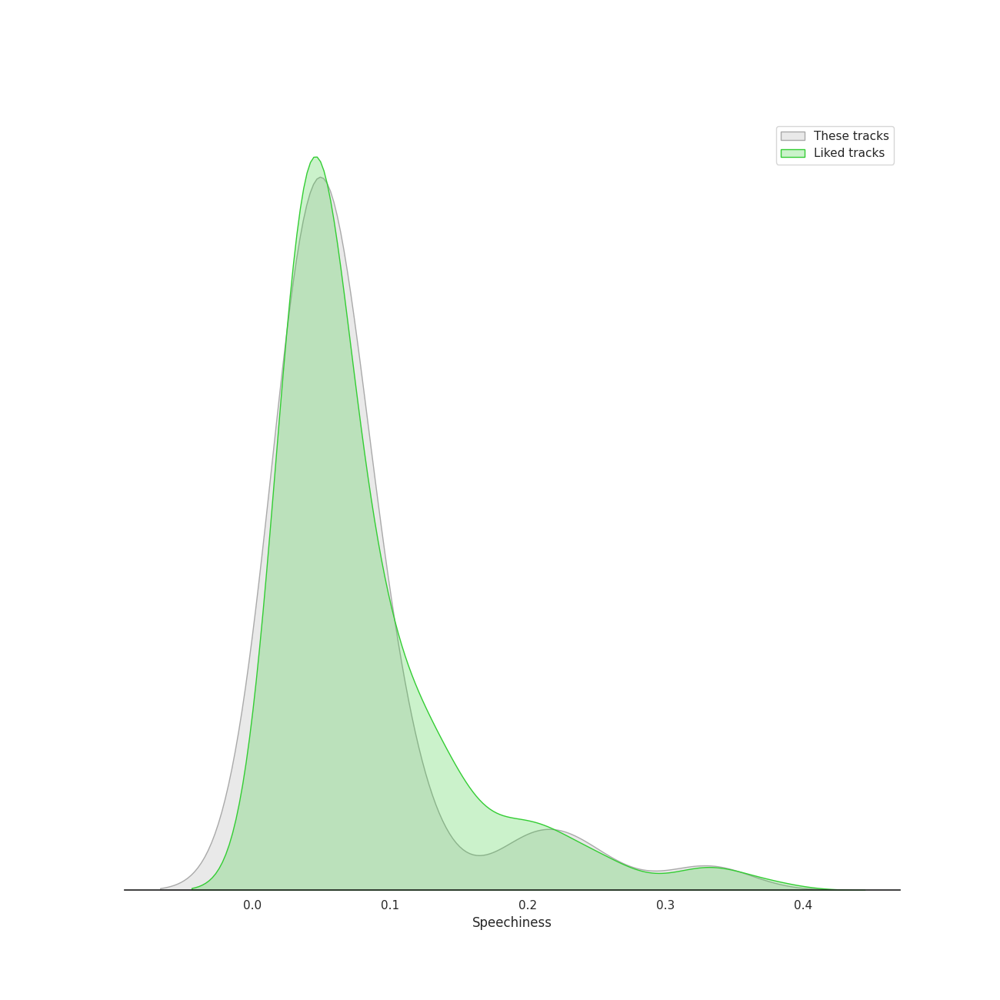
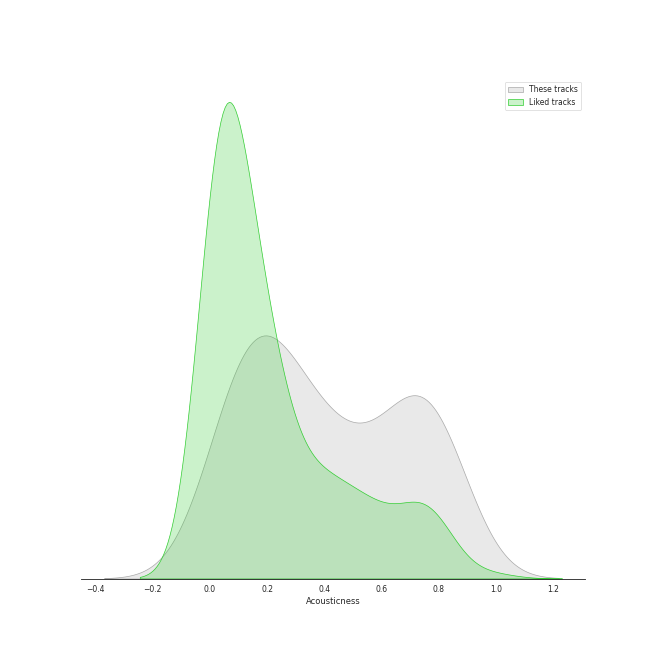
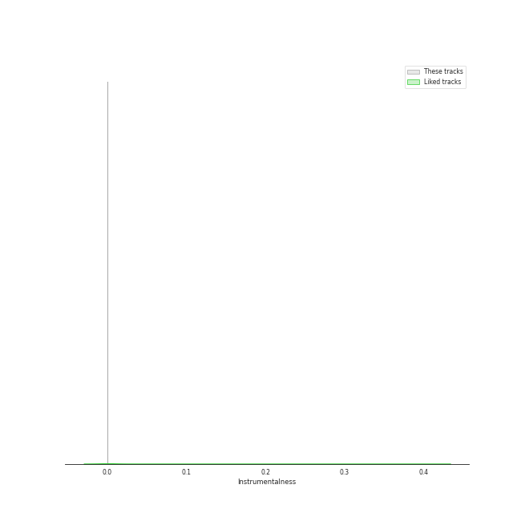
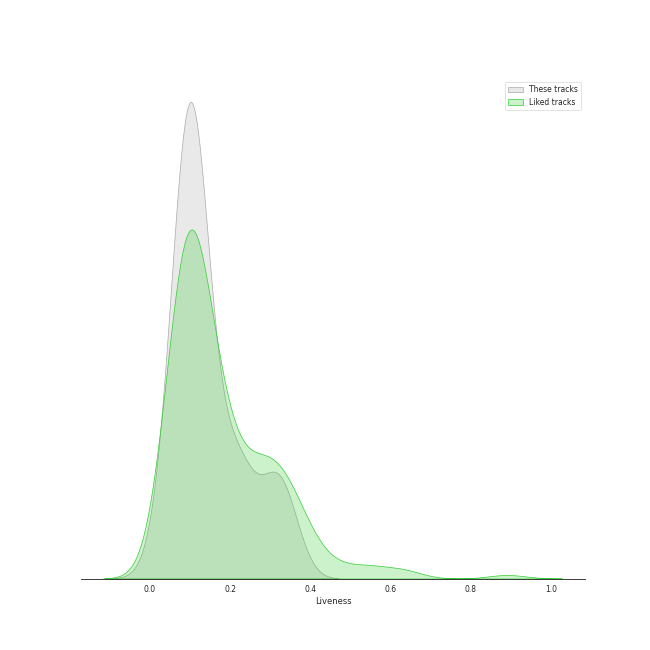
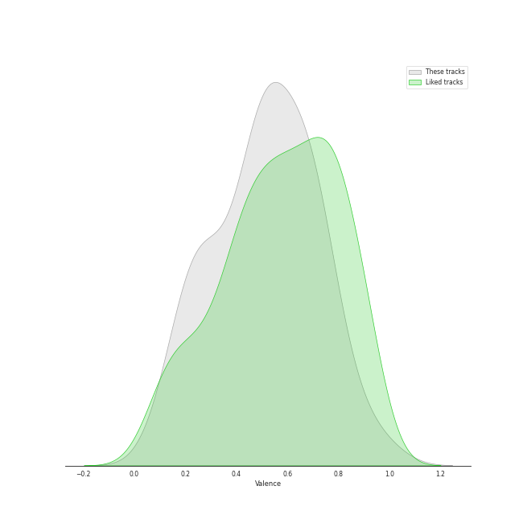

# Track Features for IU

## Danceability

| ​ | 10 most Danceable tracks | ​​ | 10 least Danceable tracks |
|:---|:---|:---|:---|
|  | Ah puh (0.954) |  | My sea (0.353) |
|  | Cat (Feat. IU) (0.882) |  | Love poem (0.404) |
|  | Love of B (0.855) |  | Through the Night (0.428) |
|  | SoulMate (feat. IU) (0.855) |  | Scary Fairy Tale (0.465) |
|  | BBIBBI (0.839) |  | above the time (0.471) |
|  | Pierrot laughs at us (0.824) |  | Secret Garden (0.482) |
|  | Blueming (0.819) |  | Obliviate (0.486) |
|  | NAKKA (with IU) (0.816) |  | Modern Times (0.489) |
|  | Palette (feat. G-DRAGON) (0.804) |  | GANADARA (Feat. IU) (0.492) |
|  | Zezé (0.771) |  | Love wins all (0.509) |

## Energy

| ​ | 10 most Energetic tracks | ​​ | 10 least Energetic tracks |
|:---|:---|:---|:---|
|  | Twenty-three (0.955) |  | Winter Sleep (0.237) |
|  | The Red Shoes (0.922) |  | Through the Night (0.313) |
|  | YOU&I (0.9) |  | heart (0.318) |
|  | LILAC (0.89) |  | Secret Garden (0.387) |
|  | Good day (0.882) |  | Cat (Feat. IU) (0.392) |
|  | Coin (0.879) |  | Between the lips (50cm) (0.399) |
|  | eight(Prod.&Feat. SUGA of BTS) (0.869) |  | My sea (0.419) |
|  | Zezé (0.848) |  | 4AM (0.421) |
|  | lost child (0.832) |  | Love wins all (0.447) |
|  | Modern Times (0.805) |  | Sleepless rainy night (0.456) |

## Speechiness

| ​ | 10 most Speechy tracks | ​​ | 10 least Speechy tracks |
|:---|:---|:---|:---|
|  | BBIBBI (0.331) |  | Scary Fairy Tale (0.0263) |
|  | GANADARA (Feat. IU) (0.244) |  | Winter Sleep (0.0273) |
|  | The Red Shoes (0.211) |  | heart (0.0277) |
|  | Palette (feat. G-DRAGON) (0.2) |  | Between the lips (50cm) (0.0307) |
|  | Shh.. (Feat. HYEIN, WONSUN JOE & Special Narr. Patti Kim) (0.18) |  | Love wins all (0.0311) |
|  | SoulMate (feat. IU) (0.141) |  | Obliviate (0.0322) |
|  | Zezé (0.108) |  | My sea (0.0341) |
|  | Holssi (0.108) |  | Havana (0.0353) |
|  | Coin (0.101) |  | lost child (0.0365) |
|  | NAKKA (with IU) (0.101) |  | above the time (0.0369) |

## Acousticness

| ​ | 10 most Acoustic tracks | ​​ | 10 least Acoustic tracks |
|:---|:---|:---|:---|
|  | heart (0.842) |  | Coin (0.00849) |
|  | unlucky (0.836) |  | Twenty-three (0.0168) |
|  | Secret Garden (0.825) |  | NAKKA (with IU) (0.0732) |
|  | Love wins all (0.821) |  | Blueming (0.0849) |
|  | Winter Sleep (0.82) |  | Ah puh (0.0861) |
|  | Through the Night (0.757) |  | LILAC (0.0895) |
|  | Pierrot laughs at us (0.752) |  | eight(Prod.&Feat. SUGA of BTS) (0.115) |
|  | above the time (0.742) |  | Shopper (0.115) |
|  | Love poem (0.74) |  | Jam Jam (0.121) |
|  | Sleepless rainy night (0.727) |  | Holssi (0.136) |

## Instrumentalness

| ​ | 10 most Instrumental tracks | ​​ | 10 least Instrumental tracks |
|:---|:---|:---|:---|
|  | Sleepless rainy night (0.000103) |  | Friday (feat.Jang Yi-jeong) (0.0) |
|  | NAKKA (with IU) (2.81e-05) |  | eight(Prod.&Feat. SUGA of BTS) (0.0) |
|  | Holssi (8.54e-06) |  | lost child (0.0) |
|  | Love of B (5.05e-06) |  | Good day (0.0) |
|  | 4AM (4.63e-06) |  | Shopper (0.0) |
|  | Ah puh (4.05e-06) |  | Zezé (0.0) |
|  | Jam Jam (3.72e-06) |  | unlucky (0.0) |
|  | Black Out (2.37e-06) |  | SoulMate (feat. IU) (0.0) |
|  | LILAC (1.89e-06) |  | Shh.. (Feat. HYEIN, WONSUN JOE & Special Narr. Patti Kim) (0.0) |
|  | YOU&I (1.47e-06) |  | Obliviate (0.0) |

## Liveness

| ​ | 10 most Live tracks | ​​ | 10 least Live tracks |
|:---|:---|:---|:---|
|  | My sea (0.35) |  | Black Out (0.0243) |
|  | Winter Sleep (0.345) |  | Holssi (0.0483) |
|  | People Pt.2 (feat. IU) (0.319) |  | Pierrot laughs at us (0.0577) |
|  | Coin (0.316) |  | Shopper (0.0643) |
|  | Through the Night (0.309) |  | Blueming (0.0667) |
|  | BBIBBI (0.3) |  | Ah puh (0.0724) |
|  | Merry Christmas ahead (feat.Chundung) (0.26) |  | GANADARA (Feat. IU) (0.0772) |
|  | Glasses (0.233) |  | Twenty-three (0.0817) |
|  | Between the lips (50cm) (0.226) |  | Zezé (0.0873) |
|  | Jam Jam (0.218) |  | above the time (0.0896) |

## Valence

| ​ | 10 most Happy tracks | ​​ | 10 least Happy tracks |
|:---|:---|:---|:---|
|  | Twenty-three (0.968) |  | My sea (0.122) |
|  | Ah puh (0.842) |  | lost child (0.174) |
|  | BBIBBI (0.821) |  | above the time (0.177) |
|  | Black Out (0.778) |  | Shh.. (Feat. HYEIN, WONSUN JOE & Special Narr. Patti Kim) (0.241) |
|  | LILAC (0.75) |  | Secret Garden (0.258) |
|  | Coin (0.71) |  | Winter Sleep (0.259) |
|  | Zezé (0.708) |  | heart (0.267) |
|  | Cat (Feat. IU) (0.702) |  | Love poem (0.273) |
|  | Love of B (0.701) |  | Through the Night (0.284) |
|  | Modern Times (0.696) |  | Love wins all (0.288) |

## Tempo

| ​ | 10 most Fast tracks | ​​ | 10 least Fast tracks |
|:---|:---|:---|:---|
|  | Modern Times (199.923) |  | Winter Sleep (68.045) |
|  | Obliviate (173.738) |  | Shh.. (Feat. HYEIN, WONSUN JOE & Special Narr. Patti Kim) (76.25) |
|  | unlucky (169.907) |  | Through the Night (78.723) |
|  | Scary Fairy Tale (155.749) |  | Friday (feat.Jang Yi-jeong) (80.052) |
|  | above the time (147.961) |  | 4AM (84.976) |
|  | BBIBBI (143.894) |  | Holssi (86.949) |
|  | My sea (134.334) |  | People Pt.2 (feat. IU) (88.94) |
|  | YOU&I (134.004) |  | GANADARA (Feat. IU) (90.081) |
|  | Good day (128.027) |  | Sleepless rainy night (91.028) |
|  | Merry Christmas ahead (feat.Chundung) (127.998) |  | Zezé (93.024) |
