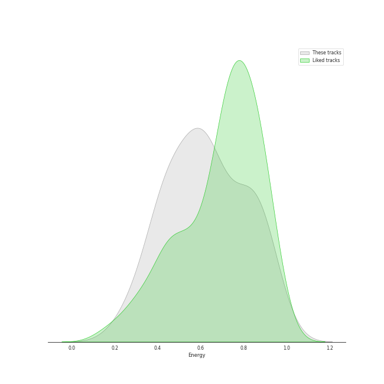
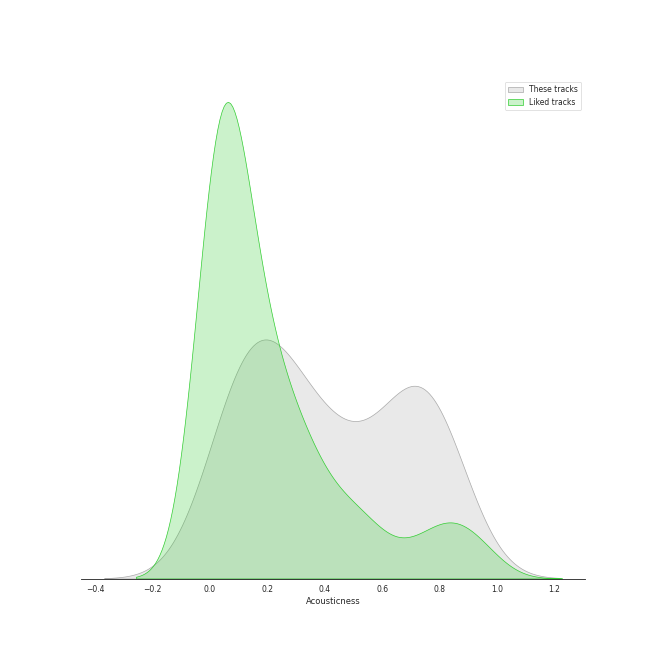
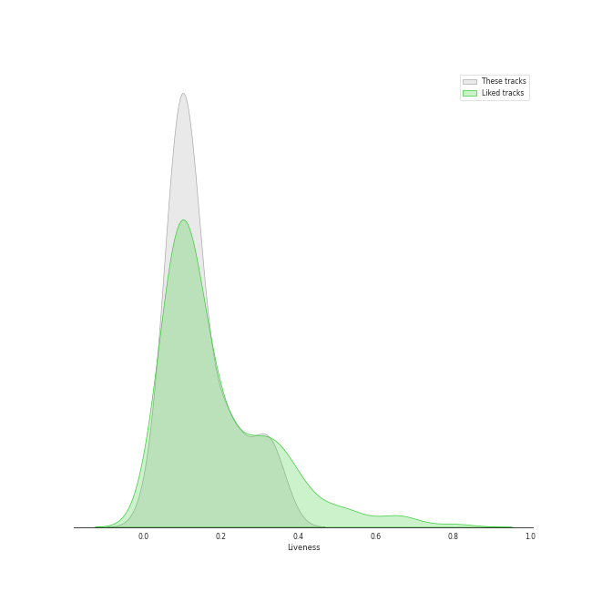
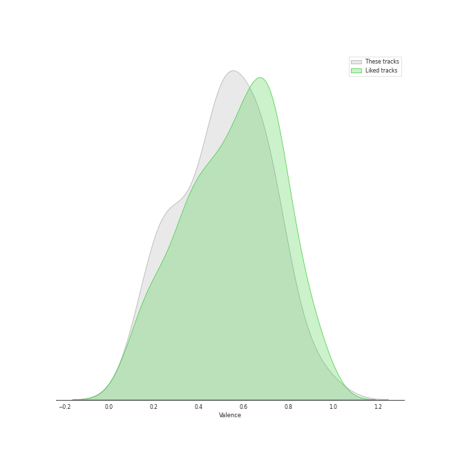
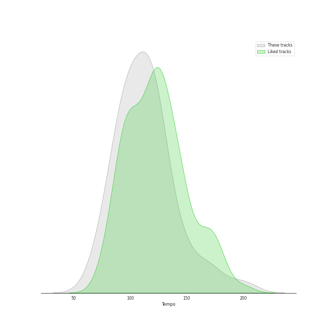

# Audio Features for IU

## Danceability

| 10 most Danceable tracks | 10 least Danceable tracks |
|:---|:---|
| Cat (Feat. IU) (0.882) | My sea (0.353) |
| BBIBBI (0.839) | Epilogue (0.366) |
| Pierrot laughs at us (0.824) | Love poem (0.404) |
| Blueming (0.819) | Through the Night (0.428) |
| NAKKA (with IU) (0.816) | above the time (0.471) |
| Palette (feat. G-DRAGON) (0.804) | GANADARA (Feat. IU) (0.492) |
| Sleepless rainy night (0.761) | Winter Sleep (0.539) |
| Twenty-three (0.757) | Glasses (0.578) |
| 4AM (0.755) | lost child (0.59) |
| LILAC (0.738) | YOU&I (0.636) |

## Energy

| 10 most Energetic tracks | 10 least Energetic tracks |
|:---|:---|
| Twenty-three (0.955) | Winter Sleep (0.237) |
| The Red Shoes (0.922) | Through the Night (0.313) |
| YOU&I (0.9) | Cat (Feat. IU) (0.392) |
| LILAC (0.89) | My sea (0.419) |
| Good day (0.882) | 4AM (0.421) |
| Coin (0.879) | Sleepless rainy night (0.456) |
| eight(Prod.&Feat. SUGA of BTS) (0.869) | Glasses (0.462) |
| lost child (0.832) | Love poem (0.467) |
| Merry Christmas ahead (feat.Chundung) (0.803) | Epilogue (0.47) |
| Celebrity (0.784) | Friday (feat.Jang Yi-jeong) (0.525) |

## Speechiness

| 10 most Speechy tracks | 10 least Speechy tracks |
|:---|:---|
| BBIBBI (0.331) | Winter Sleep (0.0273) |
| GANADARA (Feat. IU) (0.244) | Epilogue (0.0322) |
| The Red Shoes (0.211) | My sea (0.0341) |
| Palette (feat. G-DRAGON) (0.2) | lost child (0.0365) |
| Coin (0.101) | above the time (0.0369) |
| NAKKA (with IU) (0.101) | Pierrot laughs at us (0.0371) |
| Cat (Feat. IU) (0.0751) | Through the Night (0.0391) |
| LILAC (0.0748) | 4AM (0.0405) |
| Celebrity (0.0691) | Twenty-three (0.0412) |
| Good day (0.0654) | Love poem (0.0413) |

## Acousticness

| 10 most Acoustic tracks | 10 least Acoustic tracks |
|:---|:---|
| Winter Sleep (0.82) | Coin (0.00849) |
| Through the Night (0.757) | Twenty-three (0.0168) |
| Pierrot laughs at us (0.752) | NAKKA (with IU) (0.0732) |
| above the time (0.742) | Blueming (0.0849) |
| Love poem (0.74) | LILAC (0.0895) |
| Epilogue (0.74) | eight(Prod.&Feat. SUGA of BTS) (0.115) |
| Sleepless rainy night (0.727) | Jam Jam (0.121) |
| Friday (feat.Jang Yi-jeong) (0.619) | Good day (0.165) |
| lost child (0.56) | Glasses (0.185) |
| Cat (Feat. IU) (0.555) | Celebrity (0.191) |

## Instrumentalness

| 10 most Instrumental tracks | 10 least Instrumental tracks |
|:---|:---|
| Sleepless rainy night (0.000103) | Friday (feat.Jang Yi-jeong) (0.0) |
| NAKKA (with IU) (2.81e-05) | eight(Prod.&Feat. SUGA of BTS) (0.0) |
| 4AM (4.63e-06) | lost child (0.0) |
| Jam Jam (3.72e-06) | Good day (0.0) |
| LILAC (1.89e-06) | above the time (0.0) |
| YOU&I (1.47e-06) | Winter Sleep (0.0) |
| Coin (1.25e-06) | Cat (Feat. IU) (0.0) |
| Pierrot laughs at us (0.0) | Through the Night (0.0) |
| Love poem (0.0) | Twenty-three (0.0) |
| Epilogue (0.0) | The Red Shoes (0.0) |

## Liveness

| 10 most Live tracks | 10 least Live tracks |
|:---|:---|
| My sea (0.35) | Pierrot laughs at us (0.0577) |
| Winter Sleep (0.345) | Blueming (0.0667) |
| People Pt.2 (feat. IU) (0.319) | GANADARA (Feat. IU) (0.0772) |
| Coin (0.316) | Twenty-three (0.0817) |
| Through the Night (0.309) | above the time (0.0896) |
| BBIBBI (0.3) | Epilogue (0.0896) |
| Merry Christmas ahead (feat.Chundung) (0.26) | The Red Shoes (0.0898) |
| Glasses (0.233) | Celebrity (0.0956) |
| Jam Jam (0.218) | Good day (0.0981) |
| LILAC (0.213) | YOU&I (0.0982) |

## Valence

| 10 most Happy tracks | 10 least Happy tracks |
|:---|:---|
| Twenty-three (0.968) | My sea (0.122) |
| BBIBBI (0.821) | lost child (0.174) |
| LILAC (0.75) | above the time (0.177) |
| Coin (0.71) | Winter Sleep (0.259) |
| Cat (Feat. IU) (0.702) | Love poem (0.273) |
| YOU&I (0.686) | Through the Night (0.284) |
| Blueming (0.682) | Epilogue (0.368) |
| Celebrity (0.673) | The Red Shoes (0.371) |
| Pierrot laughs at us (0.659) | Jam Jam (0.388) |
| dlwlrma (0.631) | 4AM (0.417) |

## Tempo

| 10 most Fast tracks | 10 least Fast tracks |
|:---|:---|
| Epilogue (179.609) | Winter Sleep (68.045) |
| above the time (147.961) | Through the Night (78.723) |
| BBIBBI (143.894) | Friday (feat.Jang Yi-jeong) (80.052) |
| My sea (134.334) | 4AM (84.976) |
| YOU&I (134.004) | People Pt.2 (feat. IU) (88.94) |
| Good day (128.027) | GANADARA (Feat. IU) (90.081) |
| Merry Christmas ahead (feat.Chundung) (127.998) | Sleepless rainy night (91.028) |
| lost child (123.937) | Celebrity (99.995) |
| Twenty-three (122.952) | NAKKA (with IU) (100.923) |
| eight(Prod.&Feat. SUGA of BTS) (120.029) | Palette (feat. G-DRAGON) (102.013) |
