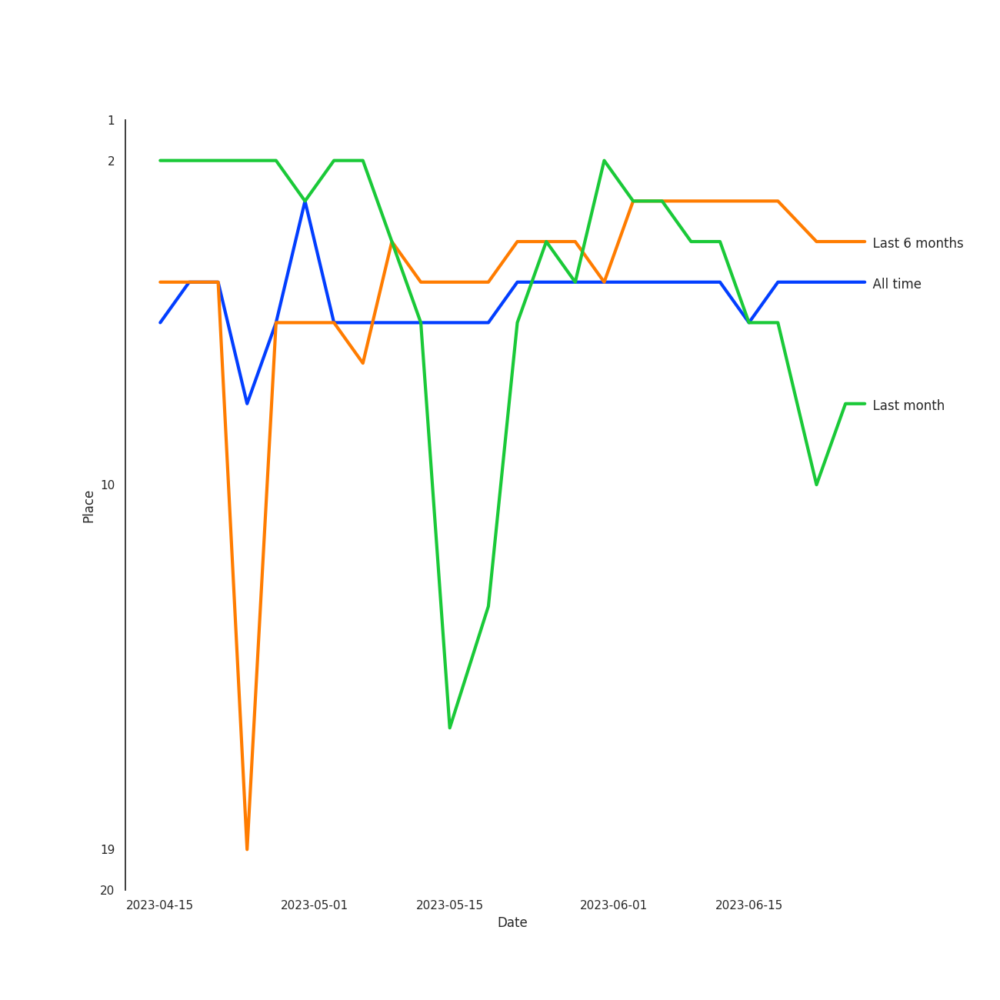
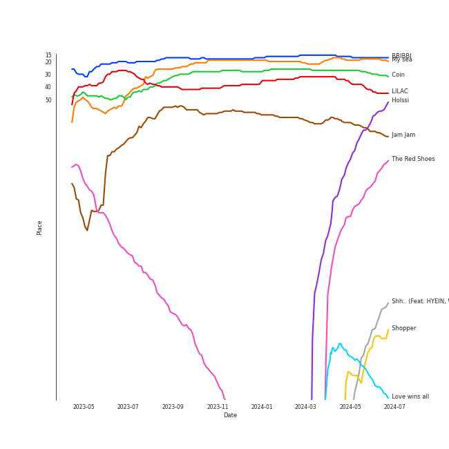
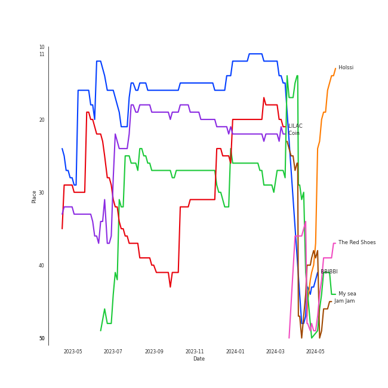
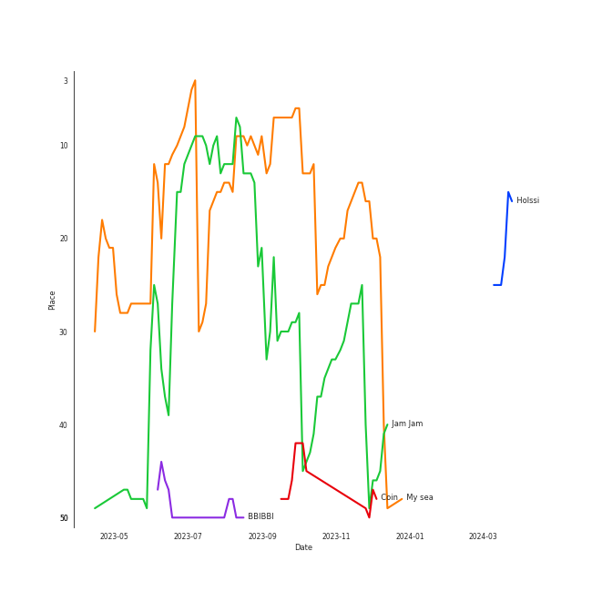
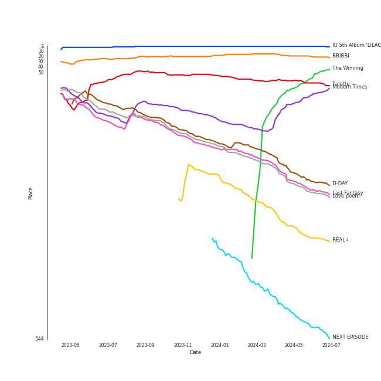
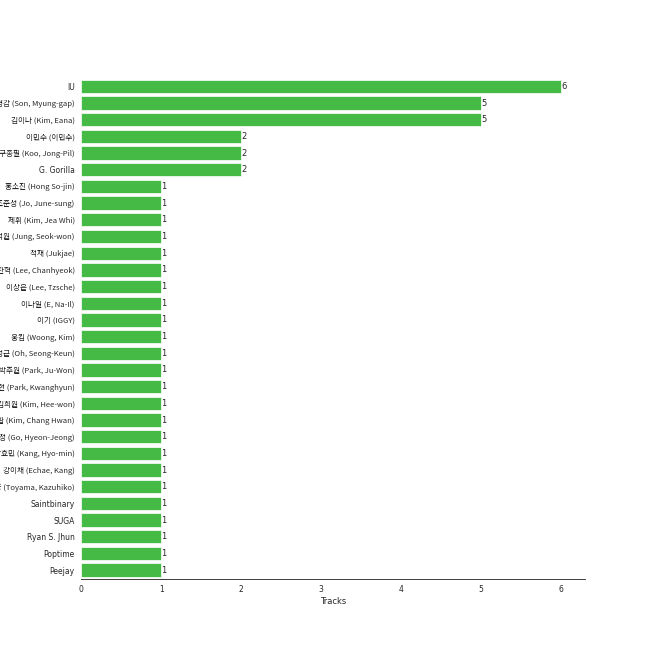

# IU

[See Track Features](audio_features.md)

[See Clusters](clusters/overview.md)

## Artist Rank
IU is currently:
- The #5 artist of the last month
- The #4 artist of the last 6 months
- The #4 artist of the last year
- The #3 artist of all time

## Top Tracks

### Top tracks of all time

Top tracks of the last year over time

Top tracks of the last 6 months over time

## Top Albums

| Art | Rank | Tracks | 💚 | Album | Release Date | 🔗 |
|:---|---:|---:|---:|:---|:---|:---|
|  | 49 | 6 | 5 | Modern Times | 2013-10-08 | [🔗](https://open.spotify.com/album/2QcuXvQBWv1ZKyQtEhLbFe) |
|  | 6 | 5 | 5 | IU 5th Album 'LILAC' | 2021-03-25 | [🔗](https://open.spotify.com/album/01dPJcwyht77brL4JQiR8R) |
|  | 53 | 5 | 4 | Palette | 2017-04-21 | [🔗](https://open.spotify.com/album/5V8n6fqyAPxvFTibPhQVcp) |
|  | 229 | 4 | 4 | Love poem | 2019-11-18 | [🔗](https://open.spotify.com/album/2xEH7SRzJq7LgA0fCtTlxH) |
|  | 18 | 4 | 3 | The Winning | 2024-02-20 | [🔗](https://open.spotify.com/album/08CvAj58nVMpq1Nw7T6maj) |
|  | 639 | 3 | 3 | CHAT-SHIRE | 2015-10-23 | [🔗](https://open.spotify.com/album/3rMvAe0zU0pJRnRa7Rfc1U) |
|  | 656 | 2 | 2 | A flower bookmark | 2017-09-22 | [🔗](https://open.spotify.com/album/4B3UIkrohpUIxyVCCgLrEI) |
|  | 656 | 2 | 1 | REAL | 2010-12-09 | [🔗](https://open.spotify.com/album/4WY1pPvmP9sBlVICuPxBQh) |
|  | 318 | 2 | 1 | Last Fantasy | 2011-11-29 | [🔗](https://open.spotify.com/album/149BHv6qAyMgJ483vPi77C) |
|  | 654 | 1 | 1 | eight | 2020-05-06 | [🔗](https://open.spotify.com/album/5vJNAlQeTf9lsulO1YlmSt) |

See all albums

| Art | Rank | Tracks | 💚 | Album | Release Date | 🔗 |
|:---|---:|---:|---:|:---|:---|:---|
|  | 424 | 1 | 1 | REAL+ | 2011-02-17 | [🔗](https://open.spotify.com/album/79725WrSou2C9RrEUxClUf) |
|  | 634 | 1 | 1 | Pieces | 2021-12-29 | [🔗](https://open.spotify.com/album/3ivhPVStd9RrtczBFwjkMQ) |
|  | 400 | 1 | 1 | NEXT EPISODE | 2021-07-26 | [🔗](https://open.spotify.com/album/0Pt0eGpyNO5dDN8PORypSy) |
|  | 656 | 1 | 1 | Modern Times – Epilogue | 2013-12-20 | [🔗](https://open.spotify.com/album/56MqewtCUq5bplrqEYTVL0) |
|  | 656 | 1 | 1 | GANADARA | 2022-03-11 | [🔗](https://open.spotify.com/album/4cwyl5ynvYVojZRbZ3dSFH) |
|  | 293 | 1 | 1 | D-DAY | 2023-04-21 | [🔗](https://open.spotify.com/album/446ROKmKfpEwkbi2SjELVX) |
|  | 656 | 1 | 1 | Cat | 2017-12-28 | [🔗](https://open.spotify.com/album/3b8iQhtbLD0Vn4EqQzMC3N) |
|  | 31 | 1 | 1 | BBIBBI | 2018-10-10 | [🔗](https://open.spotify.com/album/4ghBzVOTFoeKPPmyNKjVtI) |
|  | 656 | 1 | 1 | A flower bookmark | 2014-05-16 | [🔗](https://open.spotify.com/album/460uGpon2JwPfRgDohV2bP) |
|  | 656 | 1 | 0 | heart | 2015-05-18 | [🔗](https://open.spotify.com/album/3NYm5NdVNZsXNfn0ZVezWb) |
|  | 656 | 1 | 0 | SoulMate (feat. IU) | 2018-07-30 | [🔗](https://open.spotify.com/album/0aDnkPxX660ezxCWBcqzVo) |
|  | 656 | 1 | 0 | Lost and Found | 2008-09-23 | [🔗](https://open.spotify.com/album/5CqhdN6fFBPN5JcNiU1uyF) |
|  | 656 | 1 | 0 | First Winter | 2019-12-09 | [🔗](https://open.spotify.com/album/7Kudn82wLhfFfxLVhi9VhA) |

## Featured on Playlists
| Art | Tracks | Playlist |
|:---|---:|:---|
|  | 43 | [K-Pop](../../playlists/k-pop/overview.md) |
|  | 14 | [Retro Kpop](../../playlists/retro_kpop/overview.md) |
|  | 12 | [K-Pop Favorites](../../playlists/k-pop_favorites/overview.md) |
|  | 7 | [Chill](../../playlists/chill/overview.md) |
|  | 6 | [Relax](../../playlists/relax/overview.md) |
|  | 6 | [Recommendations for Jeff](../../playlists/recommendations_for_jeff/overview.md) |
|  | 5 | [Recommendations for Chris](../../playlists/recommendations_for_chris/overview.md) |
|  | 4 | [Your Top Songs 2022](../../playlists/your_top_songs_2022/overview.md) |
|  | 3 | [Summer](../../playlists/summer/overview.md) |
|  | 3 | [Your Top Songs 2023](../../playlists/your_top_songs_2023/overview.md) |
|  | 3 | [K-Pop-Adjacent](../../playlists/k-pop-adjacent/overview.md) |
|  | 3 | [Christmas](../../playlists/christmas/overview.md) |
|  | 1 | [Funk](../../playlists/funk/overview.md) |
|  | 1 | [K-Pop 101](../../playlists/k-pop_101/overview.md) |
|  | 1 | [Repeat Rewind](../../playlists/repeat_rewind/overview.md) |
|  | 1 | [Halloween](../../playlists/halloween/overview.md) |

## Top Record Labels

| Tracks | 💚 | Label |
|---:|---:|:---|
| 23 | 18 | [Kakao Entertainment](../../labels/kakao_entertainment/overview.md) |
| 11 | 10 | [EDAM Entertainment](../../labels/edam_entertainment/overview.md) |
| 7 | 6 | Fave Entertainment |
| 1 | 1 | [YG Entertainment](../../labels/yg_entertainment/overview.md) |
| 1 | 1 | MORE VISION |
| 1 | 1 | MAGIC STRAWBERRY SOUND |
| 1 | 1 | [BIGHIT MUSIC](../../labels/bighit_music/overview.md) |
| 1 | 0 | SK Jaewon Co. |
| 1 | 0 | SEVEN SEASONS |

## Genres

- [k-pop](../../genres/k-pop/overview.md)
- [pop](../../genres/pop/overview.md)

## Credits

### Credits by Type

| Credit Type | Tracks |
|:---|---:|
| Lyricist | 6 |
| Performer | 1 |
| Songwriter | 2 |
| Vocal | 5 |

### Production Credits

| Art | Track | Credit Types |
|:---|:---|:---|
|  | Love of B | Lyricist |
|  | Ah puh | Lyricist |
|  | My sea | Lyricist |
|  | Celebrity | Lyricist, Songwriter |
|  | LILAC | Lyricist |
|  | Coin | Lyricist, Songwriter |

## Top Producers

| Art | Producer | Tracks | Credit Types |
|:---|:---|---:|:---|
|  | [IU](overview.md) | 6 | Lyricist, Songwriter |
| | [김이나 (Kim, Eana)](../../producers/김이나_(kim,_eana)/overview.md) | 5 | Lyricist |
| | 손명갑 (Son, Myung-gap) | 5 | Producer |
| | [이민수 (이민수)](../../producers/이민수_(이민수)/overview.md) | 2 | Arranger, Songwriter |
| | [구종필 (Koo, Jong-Pil)](../../producers/구종필_(koo,_jong-pil)/overview.md) | 2 | Producer |
| | G. Gorilla | 2 | Arranger, Lyricist, Songwriter |
| | 김희원 (Kim, Hee-won) | 1 | Songwriter |
|  | SUGA | 1 | Producer |
| | 박광현 (Park, Kwanghyun) | 1 | Lyricist, Songwriter |
| | 제휘 (Kim, Jea Whi) | 1 | Arranger, Songwriter |

View all

| Art | Producer | Tracks | Credit Types |
|:---|:---|---:|:---|
| | 강효민 (Kang, Hyo-min) | 1 | Producer |
| | Celine Svanbäck (Svanbäck, Celine) | 1 | Songwriter |
| | Kako | 1 | Songwriter |
| | 고현정 (Go, Hyeon-Jeong) | 1 | Producer |
| | 강이채 (Echae, Kang) | 1 | Arranger |
| | N!ko | 1 | Arranger, Songwriter |
| | 오성근 (Oh, Seong-Keun) | 1 | Producer |
| | Poptime | 1 | Arranger, Songwriter |
| | 이기 (IGGY) | 1 | Arranger, Songwriter |
| | Jeppe London Bilsby | 1 | Arranger, Songwriter |
| | 적재 (Jukjae) | 1 | Arranger |
| | 조준성 (Jo, June-sung) | 1 | Producer |
| | Chloe Latimer | 1 | Songwriter |
| | 박주원 (Park, Ju-Won) | 1 | Arranger, Songwriter |
| | 김창환 (Kim, Chang Hwan) | 1 | Lyricist, Songwriter |
| | Dr.JO | 1 | Songwriter |
| | Saintbinary | 1 | Songwriter |
| | 이상은 (Lee, Tzsche) | 1 | Lyricist, Songwriter |
| | Lauritz Emil Christiansen | 1 | Arranger, Songwriter |
| | 이나일 (E, Na-Il) | 1 | Arranger |
| | 웅킴 (Woong, Kim) | 1 | Arranger, Songwriter |
| | [Ryan S. Jhun](../../producers/ryan_s__jhun/overview.md) | 1 | Arranger, Songwriter |
| | Peejay | 1 | Arranger, Songwriter |
| | 이찬혁 (Lee, Chanhyeok) | 1 | Lyricist, Songwriter |
| | 정석원 (Jung, Seok-won) | 1 | Arranger, Songwriter |
| | 外山和彦 (Toyama, Kazuhiko) | 1 | Arranger |
| | 홍소진 (Hong So-jin) | 1 | Arranger |

## Tracks

| Art | Track | Album | Artists | Label | Rank | 💚 | 🔗 |
|:---|:---|:---|:---|:---|---:|:---|:---|
|  | My sea | IU 5th Album 'LILAC' | [IU](overview.md) | [EDAM Entertainment](../../labels/edam_entertainment) | 21 | 💚 | [🔗](https://open.spotify.com/track/46wDG6evLn2iPoQ0F8CUWk) |
|  | Holssi | The Winning | [IU](overview.md) | [EDAM Entertainment](../../labels/edam_entertainment) | 22 | 💚 | [🔗](https://open.spotify.com/track/0UTtK6hregIBOsefavRI26) |
|  | BBIBBI | BBIBBI | [IU](overview.md) | [Kakao Entertainment](../../labels/kakao_entertainment) | 23 | 💚 | [🔗](https://open.spotify.com/track/4as4XEOR03oGm1STUKl6pa) |
|  | Coin | IU 5th Album 'LILAC' | [IU](overview.md) | [EDAM Entertainment](../../labels/edam_entertainment) | 39 | 💚 | [🔗](https://open.spotify.com/track/7CZRguMolNqIobnXxpV735) |
|  | The Red Shoes | Modern Times | [IU](overview.md) | [Kakao Entertainment](../../labels/kakao_entertainment) | 52 | 💚 | [🔗](https://open.spotify.com/track/3atsk5EWI5fNxLMIJnfYfJ) |
|  | Jam Jam | Palette | [IU](overview.md) | Fave Entertainment | 59 | 💚 | [🔗](https://open.spotify.com/track/3h7WIL3B6nP3171zl6HWj8) |
|  | LILAC | IU 5th Album 'LILAC' | [IU](overview.md) | [EDAM Entertainment](../../labels/edam_entertainment) | 60 | 💚 | [🔗](https://open.spotify.com/track/5xrtzzzikpG3BLbo4q1Yul) |
|  | Shh.. (Feat. HYEIN, WONSUN JOE & Special Narr. Patti Kim) | The Winning | [IU](overview.md), HYEIN, Joe Won Sun, Patti Kim | [EDAM Entertainment](../../labels/edam_entertainment) | 174 | | [🔗](https://open.spotify.com/track/20uUaRkfRJZG15mXfn7LaU) |
|  | Shopper | The Winning | [IU](overview.md) | [EDAM Entertainment](../../labels/edam_entertainment) | 234 | 💚 | [🔗](https://open.spotify.com/track/1c6kkrWnpy68eYDfBdxNtF) |
|  | Black Out | Palette | [IU](overview.md) | Fave Entertainment | 260 | 💚 | [🔗](https://open.spotify.com/track/1sUOFqmIU38dQCA13aVKBL) |

See all tracks

| Art | Track | Album | Artists | Label | Rank | 💚 | 🔗 |
|:---|:---|:---|:---|:---|---:|:---|:---|
|  | dlwlrma | Palette | [IU](overview.md) | Fave Entertainment | 290 | 💚 | [🔗](https://open.spotify.com/track/4NPARrLIbtMl29ZJv8ESr2) |
|  | Love wins all | The Winning | [IU](overview.md) | [EDAM Entertainment](../../labels/edam_entertainment) | 338 | 💚 | [🔗](https://open.spotify.com/track/53g7ZIvZE47H9pwXPFYMCH) |
|  | Modern Times | Modern Times | [IU](overview.md) | [Kakao Entertainment](../../labels/kakao_entertainment) | 391 | 💚 | [🔗](https://open.spotify.com/track/38Dwg8OrUClCZl2wzUKrmi) |
|  | Love poem | Love poem | [IU](overview.md) | [Kakao Entertainment](../../labels/kakao_entertainment) | 469 | 💚 | [🔗](https://open.spotify.com/track/7HrE6HtYNBbGqp5GmHbFV0) |
|  | YOU&I | Last Fantasy | [IU](overview.md) | [Kakao Entertainment](../../labels/kakao_entertainment) | 513 | 💚 | [🔗](https://open.spotify.com/track/37S86pw74OH8j96ZmMnrpR) |
|  | NAKKA (with IU) | NEXT EPISODE | [AKMU](../akmu/overview.md), [IU](overview.md) | [YG Entertainment](../../labels/yg_entertainment) | 593 | 💚 | [🔗](https://open.spotify.com/track/4t2FIqZJORKZGSKg30SShr) |
|  | above the time | Love poem | [IU](overview.md) | [Kakao Entertainment](../../labels/kakao_entertainment) | 595 | 💚 | [🔗](https://open.spotify.com/track/2qKZnheMe0HhqYC1XJcdaA) |
|  | unlucky | Love poem | [IU](overview.md) | [Kakao Entertainment](../../labels/kakao_entertainment) | 629 | 💚 | [🔗](https://open.spotify.com/track/1jsY6pQeNaEConZWGau1L4) |
|  | Scary Fairy Tale | REAL+ | [IU](overview.md) | [Kakao Entertainment](../../labels/kakao_entertainment) | 637 | 💚 | [🔗](https://open.spotify.com/track/4I7QHqHq3luA1ygpWZqqBV) |
|  | People Pt.2 (feat. IU) | D-DAY | [Agust D](../agust_d/overview.md), [IU](overview.md) | [BIGHIT MUSIC](../../labels/bighit_music) | 778 | 💚 | [🔗](https://open.spotify.com/track/41JPN7pZMTp1sumBOHOzHd) |
|  | 4AM | Last Fantasy | [IU](overview.md) | [Kakao Entertainment](../../labels/kakao_entertainment) | 804 | | [🔗](https://open.spotify.com/track/3K2qsjNSynFOx2XHTHGXT2) |
|  | Obliviate | Modern Times | [IU](overview.md) | [Kakao Entertainment](../../labels/kakao_entertainment) | 865 | 💚 | [🔗](https://open.spotify.com/track/2RENeWPEosqVewFaHSNnjT) |
|  | Winter Sleep | Pieces | [IU](overview.md) | [EDAM Entertainment](../../labels/edam_entertainment) | 968 | 💚 | [🔗](https://open.spotify.com/track/2y4hHM6c48Qzk0bqh33XfB) |
|  | Zezé | CHAT-SHIRE | [IU](overview.md) | [Kakao Entertainment](../../labels/kakao_entertainment) | 975 | 💚 | [🔗](https://open.spotify.com/track/1dwOTQnBuN8LeVX4jNwJXS) |
|  | eight(Prod.&Feat. SUGA of BTS) | eight | [IU](overview.md), SUGA | [EDAM Entertainment](../../labels/edam_entertainment) | 996 | 💚 | [🔗](https://open.spotify.com/track/0pYacDCZuRhcrwGUA5nTBe) |
|  | lost child | Lost and Found | [IU](overview.md) | [Kakao Entertainment](../../labels/kakao_entertainment) | 1000 | | [🔗](https://open.spotify.com/track/1EzYoGGkr0azLsiq8svGSl) |
|  | Good day | REAL | [IU](overview.md) | [Kakao Entertainment](../../labels/kakao_entertainment) | 1000 | 💚 | [🔗](https://open.spotify.com/track/1SwZVVH9BnXtLRLi2cbFhw) |
|  | Merry Christmas ahead (feat.Chundung) | REAL | [IU](overview.md), Chundung | [Kakao Entertainment](../../labels/kakao_entertainment) | 1000 | | [🔗](https://open.spotify.com/track/6I9Y6PHTWv72fgQV3tIHt0) |
|  | Between the lips (50cm) | Modern Times | [IU](overview.md) | [Kakao Entertainment](../../labels/kakao_entertainment) | 1000 | 💚 | [🔗](https://open.spotify.com/track/5K8D8VKWxLlS9irhfGlIEi) |
|  | Havana | Modern Times | [IU](overview.md) | [Kakao Entertainment](../../labels/kakao_entertainment) | 1000 | | [🔗](https://open.spotify.com/track/5tW1WVLeSj61qexZmyb1il) |
|  | Love of B | Modern Times | [IU](overview.md) | [Kakao Entertainment](../../labels/kakao_entertainment) | 1000 | 💚 | [🔗](https://open.spotify.com/track/7b3p9nGAWa2fByucNemToA) |
|  | Friday (feat.Jang Yi-jeong) | Modern Times – Epilogue | [IU](overview.md), Jang Yi-jeong | [Kakao Entertainment](../../labels/kakao_entertainment) | 1000 | 💚 | [🔗](https://open.spotify.com/track/0GsRx0gPft6RmijIwMsKmG) |
|  | Pierrot laughs at us | A flower bookmark | [IU](overview.md) | [Kakao Entertainment](../../labels/kakao_entertainment) | 1000 | 💚 | [🔗](https://open.spotify.com/track/7rx1DA57CL4nGS3AnFGjgJ) |
|  | heart | heart | [IU](overview.md) | [Kakao Entertainment](../../labels/kakao_entertainment) | 1000 | | [🔗](https://open.spotify.com/track/5ktwBE88NKZSfmk6Lw2KhS) |
|  | Glasses | CHAT-SHIRE | [IU](overview.md) | [Kakao Entertainment](../../labels/kakao_entertainment) | 1000 | 💚 | [🔗](https://open.spotify.com/track/4ogMtogPGtC1VwKRNiHymx) |
|  | Twenty-three | CHAT-SHIRE | [IU](overview.md) | [Kakao Entertainment](../../labels/kakao_entertainment) | 1000 | 💚 | [🔗](https://open.spotify.com/track/3YkDslZvvMixTwgDId0aYB) |
|  | Palette (feat. G-DRAGON) | Palette | [IU](overview.md), G-DRAGON | Fave Entertainment | 1000 | | [🔗](https://open.spotify.com/track/3y7ByLZ05tluscOTRgEJ9Y) |
|  | Through the Night | Palette | [IU](overview.md) | Fave Entertainment | 1000 | 💚 | [🔗](https://open.spotify.com/track/3P3UA61WRQqwCXaoFOTENd) |
|  | Secret Garden | A flower bookmark | [IU](overview.md) | Fave Entertainment | 1000 | 💚 | [🔗](https://open.spotify.com/track/5F6nAnNIsRk9QbPOx9t11B) |
|  | Sleepless rainy night | A flower bookmark | [IU](overview.md) | Fave Entertainment | 1000 | 💚 | [🔗](https://open.spotify.com/track/546tamGotuR5Mhbe35ONAv) |
|  | Cat (Feat. IU) | Cat | Sunwoojunga, [IU](overview.md) | Magic Strawberry Sound | 1000 | 💚 | [🔗](https://open.spotify.com/track/3LAnd3nxfVjYsNG14xuM7x) |
|  | SoulMate (feat. IU) | SoulMate (feat. IU) | ZICO, [IU](overview.md) | SEVEN SEASONS | 1000 | | [🔗](https://open.spotify.com/track/1pz24zu5H9A0S1a2NKT4F0) |
|  | Blueming | Love poem | [IU](overview.md) | [Kakao Entertainment](../../labels/kakao_entertainment) | 1000 | 💚 | [🔗](https://open.spotify.com/track/4Dr2hJ3EnVh2Aaot6fRwDO) |
|  | First Winter | First Winter | Sung Si Kyung, [IU](overview.md) | SK Jaewon Co.,Ltd. | 1000 | | [🔗](https://open.spotify.com/track/5eWw4OyW26hL51XFSTkTPg) |
|  | Ah puh | IU 5th Album 'LILAC' | [IU](overview.md) | [EDAM Entertainment](../../labels/edam_entertainment) | 1000 | 💚 | [🔗](https://open.spotify.com/track/1IJxbEXfgiKuRx6oXMX87e) |
|  | Celebrity | IU 5th Album 'LILAC' | [IU](overview.md) | [EDAM Entertainment](../../labels/edam_entertainment) | 1000 | 💚 | [🔗](https://open.spotify.com/track/5nCwjUUsmBuNZKn9Xu10Os) |
|  | GANADARA (Feat. IU) | GANADARA | Jay Park, [IU](overview.md) | MORE VISION | 1000 | 💚 | [🔗](https://open.spotify.com/track/5quFr5s5PXYfUX5jV2EBZ1) |

