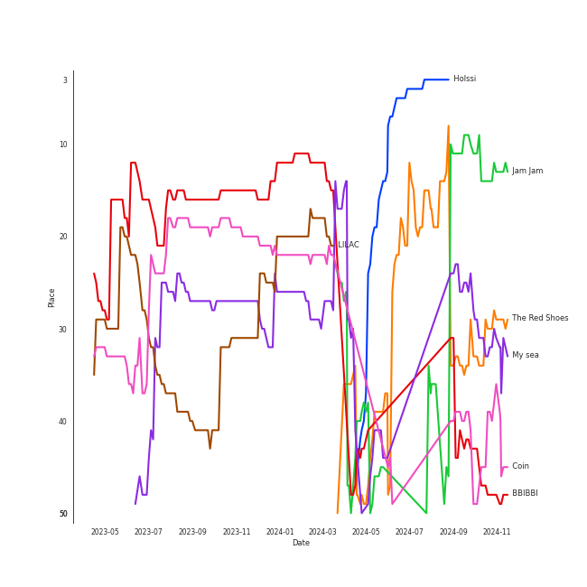

# IU

[See Track Features](audio_features.md)

[See Clusters](clusters/overview.md)

## Artist Rank
IU is currently:
- The #4 artist of all time
- The #2 artist of the last 6 months
- The #2 artist of the last month

## Top Tracks

- BBIBBI is:
    - the #50 track of the last 6 months
    - the #15 track of all time
- Coin is:
    - the #18 track of all time
- My sea is:
    - the #9 track of the last 6 months
    - the #24 track of all time
- LILAC is:
    - the #39 track of all time
- Jam Jam is:
    - the #8 track of the last 6 months
- Modern Times is:
    - the #11 track of the last month
- unlucky is:
    - the #34 track of the last month
- YOU&I is:
    - the #40 track of the last month
- People Pt.2 (feat. IU) is:
    - the #46 track of the last month

### Top tracks of all time over time

### Top tracks of the last 6 months over time

### Top tracks of the last month over time

## Featured on Playlists
| Art | Tracks | Playlist |
|:---|---:|:---|
|  | 36 | [K-Pop](../../playlists/k_pop/overview.md) |
|  | 9 | [K-Pop Favorites](../../playlists/k_pop_favorites/overview.md) |
|  | 7 | [Chill](../../playlists/chill/overview.md) |
|  | 3 | [Summer](../../playlists/summer/overview.md) |
|  | 3 | [K-R&B](../../playlists/k_r_b/overview.md) |
|  | 2 | [Christmas](../../playlists/christmas/overview.md) |
|  | 1 | [K-Pop 101](../../playlists/k_pop_101/overview.md) |
|  | 1 | [Recent Comebacks](../../playlists/recent_comebacks/overview.md) |
|  | 1 | [Halloween](../../playlists/halloween/overview.md) |
## Top Albums

| Art | Tracks | 💚 | Album | Release Date | 🔗 |
|:---|---:|---:|:---|:---|:---|
|  | 6 | 5 | IU 5th Album 'LILAC' | 2021-03-25 | [🔗](https://open.spotify.com/album/01dPJcwyht77brL4JQiR8R) |
|  | 5 | 3 | Palette | 2017-04-21 | [🔗](https://open.spotify.com/album/5V8n6fqyAPxvFTibPhQVcp) |
|  | 4 | 4 | Modern Times | 2013-10-08 | [🔗](https://open.spotify.com/album/2QcuXvQBWv1ZKyQtEhLbFe) |
|  | 4 | 4 | Love poem | 2019-11-18 | [🔗](https://open.spotify.com/album/2xEH7SRzJq7LgA0fCtTlxH) |
|  | 3 | 2 | CHAT-SHIRE | 2015-10-23 | [🔗](https://open.spotify.com/album/3rMvAe0zU0pJRnRa7Rfc1U) |
|  | 2 | 2 | A flower bookmark | 2017-09-22 | [🔗](https://open.spotify.com/album/4B3UIkrohpUIxyVCCgLrEI) |
|  | 2 | 1 | REAL | 2010-12-09 | [🔗](https://open.spotify.com/album/4WY1pPvmP9sBlVICuPxBQh) |
|  | 2 | 1 | Last Fantasy | 2011-11-29 | [🔗](https://open.spotify.com/album/149BHv6qAyMgJ483vPi77C) |
|  | 1 | 1 | eight | 2020-05-06 | [🔗](https://open.spotify.com/album/5vJNAlQeTf9lsulO1YlmSt) |
|  | 1 | 1 | Pieces | 2021-12-29 | [🔗](https://open.spotify.com/album/3ivhPVStd9RrtczBFwjkMQ) |

See all albums

| Art | Tracks | 💚 | Album | Release Date | 🔗 |
|:---|---:|---:|:---|:---|:---|
|  | 1 | 1 | NEXT EPISODE | 2021-07-26 | [🔗](https://open.spotify.com/album/0Pt0eGpyNO5dDN8PORypSy) |
|  | 1 | 1 | Modern Times – Epilogue | 2013-12-20 | [🔗](https://open.spotify.com/album/56MqewtCUq5bplrqEYTVL0) |
|  | 1 | 1 | GANADARA | 2022-03-11 | [🔗](https://open.spotify.com/album/4cwyl5ynvYVojZRbZ3dSFH) |
|  | 1 | 1 | D-DAY | 2023-04-21 | [🔗](https://open.spotify.com/album/446ROKmKfpEwkbi2SjELVX) |
|  | 1 | 1 | Cat | 2017-12-28 | [🔗](https://open.spotify.com/album/3b8iQhtbLD0Vn4EqQzMC3N) |
|  | 1 | 1 | BBIBBI | 2018-10-10 | [🔗](https://open.spotify.com/album/4ghBzVOTFoeKPPmyNKjVtI) |
|  | 1 | 1 | A flower bookmark | 2014-05-16 | [🔗](https://open.spotify.com/album/460uGpon2JwPfRgDohV2bP) |
|  | 1 | 0 | REAL+ | 2011-02-17 | [🔗](https://open.spotify.com/album/79725WrSou2C9RrEUxClUf) |
|  | 1 | 0 | Lost and Found | 2008-09-23 | [🔗](https://open.spotify.com/album/5CqhdN6fFBPN5JcNiU1uyF) |

## Top Record Labels

| Tracks | 💚 | Label |
|---:|---:|:---|
| 20 | 15 | [Kakao Entertainment](../../labels/kakao_entertainment/overview.md) |
| 8 | 7 | EDAM Entertainment |
| 7 | 5 | Fave Entertainment |
| 1 | 1 | [YG Entertainment](../../labels/yg_entertainment/overview.md) |
| 1 | 1 | MORE VISION |
| 1 | 1 | MAGIC STRAWBERRY SOUND |
| 1 | 1 | [BIGHIT MUSIC](../../labels/bighit_music/overview.md) |

## Genres

- [k-pop](../../genres/k_pop)
- [pop](../../genres/pop)

## Tracks

| Art | Track | Album | Artists | Label | 💚 | 🔗 |
|:---|:---|:---|:---|:---|:---|:---|
|  | NAKKA (with IU) | NEXT EPISODE | [AKMU](../akmu/overview.md), [IU](overview.md) | [YG Entertainment](../../labels/yg_entertainment) | 💚 | [🔗](https://open.spotify.com/track/4t2FIqZJORKZGSKg30SShr) |
|  | People Pt.2 (feat. IU) | D-DAY | Agust D, [IU](overview.md) | [BIGHIT MUSIC](../../labels/bighit_music) | 💚 | [🔗](https://open.spotify.com/track/41JPN7pZMTp1sumBOHOzHd) |
|  | lost child | Lost and Found | [IU](overview.md) | [Kakao Entertainment](../../labels/kakao_entertainment) | | [🔗](https://open.spotify.com/track/1EzYoGGkr0azLsiq8svGSl) |
|  | Good day | REAL | [IU](overview.md) | [Kakao Entertainment](../../labels/kakao_entertainment) | 💚 | [🔗](https://open.spotify.com/track/1SwZVVH9BnXtLRLi2cbFhw) |
|  | Merry Christmas ahead (feat.Chundung) | REAL | [IU](overview.md), Chundung | [Kakao Entertainment](../../labels/kakao_entertainment) | | [🔗](https://open.spotify.com/track/6I9Y6PHTWv72fgQV3tIHt0) |
|  | Scary Fairy Tale | REAL+ | [IU](overview.md) | [Kakao Entertainment](../../labels/kakao_entertainment) | | [🔗](https://open.spotify.com/track/4I7QHqHq3luA1ygpWZqqBV) |
|  | 4AM | Last Fantasy | [IU](overview.md) | [Kakao Entertainment](../../labels/kakao_entertainment) | | [🔗](https://open.spotify.com/track/3K2qsjNSynFOx2XHTHGXT2) |
|  | YOU&I | Last Fantasy | [IU](overview.md) | [Kakao Entertainment](../../labels/kakao_entertainment) | 💚 | [🔗](https://open.spotify.com/track/37S86pw74OH8j96ZmMnrpR) |
|  | Between the lips (50cm) | Modern Times | [IU](overview.md) | [Kakao Entertainment](../../labels/kakao_entertainment) | 💚 | [🔗](https://open.spotify.com/track/5K8D8VKWxLlS9irhfGlIEi) |
|  | Love of B | Modern Times | [IU](overview.md) | [Kakao Entertainment](../../labels/kakao_entertainment) | 💚 | [🔗](https://open.spotify.com/track/7b3p9nGAWa2fByucNemToA) |

See all tracks

| Art | Track | Album | Artists | Label | 💚 | 🔗 |
|:---|:---|:---|:---|:---|:---|:---|
|  | Modern Times | Modern Times | [IU](overview.md) | [Kakao Entertainment](../../labels/kakao_entertainment) | 💚 | [🔗](https://open.spotify.com/track/38Dwg8OrUClCZl2wzUKrmi) |
|  | The Red Shoes | Modern Times | [IU](overview.md) | [Kakao Entertainment](../../labels/kakao_entertainment) | 💚 | [🔗](https://open.spotify.com/track/3atsk5EWI5fNxLMIJnfYfJ) |
|  | Friday (feat.Jang Yi-jeong) | Modern Times – Epilogue | [IU](overview.md), Jang Yi-jeong | [Kakao Entertainment](../../labels/kakao_entertainment) | 💚 | [🔗](https://open.spotify.com/track/0GsRx0gPft6RmijIwMsKmG) |
|  | Pierrot laughs at us | A flower bookmark | [IU](overview.md) | [Kakao Entertainment](../../labels/kakao_entertainment) | 💚 | [🔗](https://open.spotify.com/track/7rx1DA57CL4nGS3AnFGjgJ) |
|  | Glasses | CHAT-SHIRE | [IU](overview.md) | [Kakao Entertainment](../../labels/kakao_entertainment) | 💚 | [🔗](https://open.spotify.com/track/4ogMtogPGtC1VwKRNiHymx) |
|  | Twenty-three | CHAT-SHIRE | [IU](overview.md) | [Kakao Entertainment](../../labels/kakao_entertainment) | 💚 | [🔗](https://open.spotify.com/track/3YkDslZvvMixTwgDId0aYB) |
|  | Zezé | CHAT-SHIRE | [IU](overview.md) | [Kakao Entertainment](../../labels/kakao_entertainment) | | [🔗](https://open.spotify.com/track/1dwOTQnBuN8LeVX4jNwJXS) |
|  | Black Out | Palette | [IU](overview.md) | Fave Entertainment | | [🔗](https://open.spotify.com/track/1sUOFqmIU38dQCA13aVKBL) |
|  | Jam Jam | Palette | [IU](overview.md) | Fave Entertainment | 💚 | [🔗](https://open.spotify.com/track/3h7WIL3B6nP3171zl6HWj8) |
|  | Palette (feat. G-DRAGON) | Palette | [IU](overview.md), G-DRAGON | Fave Entertainment | | [🔗](https://open.spotify.com/track/3y7ByLZ05tluscOTRgEJ9Y) |
|  | Through the Night | Palette | [IU](overview.md) | Fave Entertainment | 💚 | [🔗](https://open.spotify.com/track/3P3UA61WRQqwCXaoFOTENd) |
|  | dlwlrma | Palette | [IU](overview.md) | Fave Entertainment | 💚 | [🔗](https://open.spotify.com/track/4NPARrLIbtMl29ZJv8ESr2) |
|  | Secret Garden | A flower bookmark | [IU](overview.md) | Fave Entertainment | 💚 | [🔗](https://open.spotify.com/track/5F6nAnNIsRk9QbPOx9t11B) |
|  | Sleepless rainy night | A flower bookmark | [IU](overview.md) | Fave Entertainment | 💚 | [🔗](https://open.spotify.com/track/546tamGotuR5Mhbe35ONAv) |
|  | BBIBBI | BBIBBI | [IU](overview.md) | [Kakao Entertainment](../../labels/kakao_entertainment) | 💚 | [🔗](https://open.spotify.com/track/4as4XEOR03oGm1STUKl6pa) |
|  | Blueming | Love poem | [IU](overview.md) | [Kakao Entertainment](../../labels/kakao_entertainment) | 💚 | [🔗](https://open.spotify.com/track/4Dr2hJ3EnVh2Aaot6fRwDO) |
|  | Love poem | Love poem | [IU](overview.md) | [Kakao Entertainment](../../labels/kakao_entertainment) | 💚 | [🔗](https://open.spotify.com/track/7HrE6HtYNBbGqp5GmHbFV0) |
|  | above the time | Love poem | [IU](overview.md) | [Kakao Entertainment](../../labels/kakao_entertainment) | 💚 | [🔗](https://open.spotify.com/track/2qKZnheMe0HhqYC1XJcdaA) |
|  | unlucky | Love poem | [IU](overview.md) | [Kakao Entertainment](../../labels/kakao_entertainment) | 💚 | [🔗](https://open.spotify.com/track/1jsY6pQeNaEConZWGau1L4) |
|  | eight(Prod.&Feat. SUGA of BTS) | eight | [IU](overview.md), SUGA | EDAM Entertainment | 💚 | [🔗](https://open.spotify.com/track/0pYacDCZuRhcrwGUA5nTBe) |
|  | Ah puh | IU 5th Album 'LILAC' | [IU](overview.md) | EDAM Entertainment | 💚 | [🔗](https://open.spotify.com/track/1IJxbEXfgiKuRx6oXMX87e) |
|  | Celebrity | IU 5th Album 'LILAC' | [IU](overview.md) | EDAM Entertainment | 💚 | [🔗](https://open.spotify.com/track/5nCwjUUsmBuNZKn9Xu10Os) |
|  | Coin | IU 5th Album 'LILAC' | [IU](overview.md) | EDAM Entertainment | 💚 | [🔗](https://open.spotify.com/track/7CZRguMolNqIobnXxpV735) |
|  | Epilogue | IU 5th Album 'LILAC' | [IU](overview.md) | EDAM Entertainment | | [🔗](https://open.spotify.com/track/6rcwrRWKyjaFyUL8b8GlIJ) |
|  | LILAC | IU 5th Album 'LILAC' | [IU](overview.md) | EDAM Entertainment | 💚 | [🔗](https://open.spotify.com/track/5xrtzzzikpG3BLbo4q1Yul) |
|  | My sea | IU 5th Album 'LILAC' | [IU](overview.md) | EDAM Entertainment | 💚 | [🔗](https://open.spotify.com/track/46wDG6evLn2iPoQ0F8CUWk) |
|  | Winter Sleep | Pieces | [IU](overview.md) | EDAM Entertainment | 💚 | [🔗](https://open.spotify.com/track/2y4hHM6c48Qzk0bqh33XfB) |
|  | GANADARA (Feat. IU) | GANADARA | Jay Park, [IU](overview.md) | MORE VISION | 💚 | [🔗](https://open.spotify.com/track/5quFr5s5PXYfUX5jV2EBZ1) |
|  | Cat (Feat. IU) | Cat | Sunwoojunga, [IU](overview.md) | Magic Strawberry Sound | 💚 | [🔗](https://open.spotify.com/track/3LAnd3nxfVjYsNG14xuM7x) |

