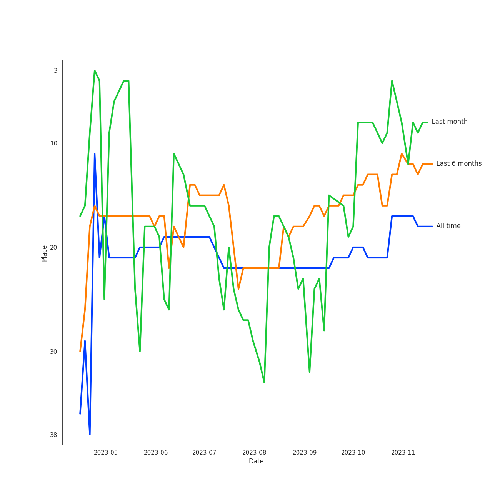
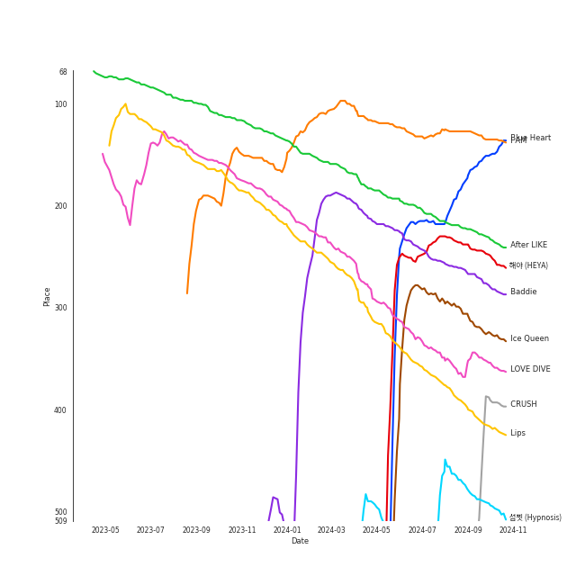
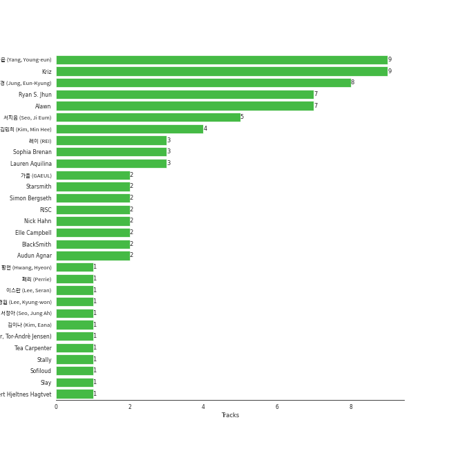

# IVE

[See Track Features](audio_features.md)

[See Clusters](clusters/overview.md)

## Relationships

IVE:
- has member 안유진 (An, Yu-jin)
- has member 가을 (GAEUL)
- has member 장원영 (Jang, Won-young)
- has member 이서 (LEESEO)
- has member LIZ (IVE)
- has member 레이 (REI)

## Artist Rank
IVE is currently:
- The #7 artist of the last month
- The #19 artist of the last 6 months
- The #17 artist of all time
- The #20 artist overall

## Top Tracks

### Top tracks, aggregated

Top tracks of the last 6 months over time

## Featured on Playlists
| Art | Tracks | Playlist |
|:---|---:|:---|
|  | 15 | [K-Pop](../../playlists/k-pop/overview.md) |
|  | 6 | [K-Pop Favorites](../../playlists/k-pop_favorites/overview.md) |
|  | 4 | [Recent Comebacks](../../playlists/recent_comebacks/overview.md) |
|  | 2 | [Sharon RPD](../../playlists/sharon_rpd/overview.md) |
|  | 2 | [On Repeat](../../playlists/on_repeat/overview.md) |
|  | 2 | [Recommendations for Jeff](../../playlists/recommendations_for_jeff/overview.md) |
|  | 1 | [Summer](../../playlists/summer/overview.md) |
|  | 1 | [K-Pop 101](../../playlists/k-pop_101/overview.md) |
|  | 1 | [Your Top Songs 2022](../../playlists/your_top_songs_2022/overview.md) |
|  | 1 | [Your Top Songs 2023](../../playlists/your_top_songs_2023/overview.md) |
|  | 1 | [Christmas](../../playlists/christmas/overview.md) |

## Top Albums

| Art | Tracks | 💚 | Album | Release Date | 🔗 |
|:---|---:|---:|:---|:---|:---|
|  | 5 | 5 | I've IVE | 2023-04-10 | [🔗](https://open.spotify.com/album/38VzP4yWfHdHafITKKRHEB) |
|  | 4 | 4 | IVE SWITCH | 2024-04-29 | [🔗](https://open.spotify.com/album/7z61DsZtWO2S4nC5xd0b9p) |
|  | 2 | 2 | I'VE MINE | 2023-10-13 | [🔗](https://open.spotify.com/album/5J7VAdKdGZGme6wymgopbp) |
|  | 2 | 1 | LOVE DIVE | 2022-04-05 | [🔗](https://open.spotify.com/album/1AFVTHHm7kKoQ6Rgb25x3p) |
|  | 1 | 1 | ELEVEN | 2021-12-01 | [🔗](https://open.spotify.com/album/1XMYvsHRt52sMi6wittWqI) |
|  | 1 | 1 | After LIKE | 2022-08-22 | [🔗](https://open.spotify.com/album/0nzRF7khA2UDSZa9T0B6Da) |
|  | 1 | 0 | Spotify Singles - Holiday | 2022-11-16 | [🔗](https://open.spotify.com/album/6LNdcxlSXwXv2UFKQ3pvMk) |

## Top Record Labels

| Tracks | 💚 | Label |
|---:|---:|:---|
| 16 | 14 | [Starship Entertainment](../../labels/starship_entertainment/overview.md) |

## Genres

- [k-pop girl group](../../genres/k-pop_girl_group/overview.md)

## Credits

### Credits by Type

| Credit Type | Tracks |
|:---|---:|
| Performer | 10 |

### Member Credits

| | LIZ (IVE) | 가을 (GAEUL) | 레이 (REI) | 안유진 (An, Yu-jin) | 이서 (LEESEO) | 장원영 (Jang, Won-young) |
|:---|---:|---:|---:|---:|---:|---:|
| Lyricist | 0 | 2 | 3 | 0 | 0 | 0 |
| Vocal | 11 | 10 | 10 | 10 | 10 | 10 |
### Production Credits

| Art | Track | Members | Credit Types |
|:---|:---|:---|:---|
|  | After LIKE | 레이 (REI) | Lyricist |
|  | 섬찟 (Hypnosis) | 레이 (REI), 가을 (GAEUL) | Lyricist |
|  | Kitsch | 레이 (REI), 가을 (GAEUL) | Lyricist |

## Top Producers

| Art | Producer | Tracks | Credit Types |
|:---|:---|---:|:---|
| | [Kriz](../../producers/kriz/overview.md) | 9 | Arranger |
| | [양영은 (Yang, Young-eun)](../../producers/양영은_(yang,_young-eun)/overview.md) | 9 | Producer |
| | [정은경 (Jung, Eun-Kyung)](../../producers/정은경_(jung,_eun-kyung)/overview.md) | 8 | Producer |
| | [Ryan S. Jhun](../../producers/ryan_s__jhun/overview.md) | 7 | Arranger, Songwriter, Lyricist, Producer |
| | Alawn | 7 | Producer, Arranger |
| | [서지음 (Seo, Ji Eum)](../../producers/서지음_(seo,_ji_eum)/overview.md) | 5 | Lyricist |
| | 김민희 (Kim, Min Hee) | 4 | Producer |
| | Sophia Brenan | 3 | Songwriter |
| | 레이 (REI) | 3 | Lyricist |
| | Lauren Aquilina | 3 | Songwriter |

View all

| Art | Producer | Tracks | Credit Types |
|:---|:---|---:|:---|
| | 가을 (GAEUL) | 2 | Lyricist |
| | Starsmith | 2 | Arranger, Songwriter |
| | RISC | 2 | Arranger |
| | Audun Agnar | 2 | Arranger, Songwriter |
| | BlackSmith | 2 | Songwriter |
| | Simon Bergseth | 2 | Producer |
| | Nick Hahn | 2 | Arranger, Songwriter |
| | Elle Campbell | 2 | Songwriter |
| | SOHLHEE | 1 | Lyricist |
| | Stally | 1 | Arranger, Songwriter |
| | Kyle Joseph Faulkner | 1 | Songwriter |
| | BIG Naughty | 1 | Lyricist |
| | Eline Noelia | 1 | Songwriter |
| | Hilda Stenmalm | 1 | Songwriter |
| | Exy | 1 | Lyricist |
| | Iselin Solheim | 1 | Songwriter |
| | Benjamin Pinkus | 1 | Arranger, Songwriter |
| | Markus Gustafson | 1 | Producer |
| | Emily Harbakk | 1 | Songwriter |
| | Elof Loelv | 1 | Arranger, Songwriter |
| | 이경원 (Lee, Kyung-won) | 1 | Producer |
| | 페리 (Perrie) | 1 | Lyricist |
| | Lars Kristian Rosness | 1 | Arranger, Songwriter |
| | Alexander Pavelich | 1 | Songwriter |
| | Corey Sanders | 1 | Songwriter |
| | 서정아 (Seo, Jung Ah) | 1 | Lyricist |
| | Anders Nilsen | 1 | Arranger, Songwriter |
| | Adriana Caldas de Barros | 1 | Songwriter |
| | [김이나 (Kim, Eana)](../../producers/김이나_(kim,_eana)/overview.md) | 1 | Lyricist |
| | LOSTBOY | 1 | Arranger, Songwriter |
| | 이스란 (Lee, Seran) | 1 | Lyricist |
| | Avin | 1 | Arranger |
| | Tea Carpenter | 1 | Songwriter |
| | Andre Davidson | 1 | Songwriter |
| | 황현 (Hwang, Hyeon) | 1 | Lyricist |
| | Sean Davidson | 1 | Songwriter |
| | Bård Bonsaksen (Bonsaken, Bård) | 1 | Songwriter |
| | Sivert Hjeltnes Hagtvet | 1 | Arranger, Songwriter |
| | Kristin Marie | 1 | Arranger, Songwriter |
| | Mommy Son | 1 | Lyricist |
| | Sofiloud | 1 | Songwriter |
| | Lauren Keen | 1 | Songwriter |
| | Tor-Andrè Jensen Skaar (Skaar, Tor-Andrè Jensen) | 1 | Songwriter |
| | PATEKO | 1 | Arranger, Songwriter |
| | Slay | 1 | Arranger |

## Tracks

| Art | Track | Album | Artists | Label | Rank | 💚 | 🔗 |
|:---|:---|:---|:---|:---|---:|:---|:---|
|  | I AM | I've IVE | [IVE](overview.md) | [Starship Entertainment](../../labels/starship_entertainment) | 126 | 💚 | [🔗](https://open.spotify.com/track/70t7Q6AYG6ZgTYmJWcnkUM) |
|  | After LIKE | After LIKE | [IVE](overview.md) | [Starship Entertainment](../../labels/starship_entertainment) | 189 | 💚 | [🔗](https://open.spotify.com/track/2gYj9lubBorOPIVWsTXugG) |
|  | Baddie | I'VE MINE | [IVE](overview.md) | [Starship Entertainment](../../labels/starship_entertainment) | 224 | 💚 | [🔗](https://open.spotify.com/track/7uyeEbG6hyApgXuEypGcsZ) |
|  | Blue Heart | IVE SWITCH | [IVE](overview.md) | [Starship Entertainment](../../labels/starship_entertainment) | 235 | 💚 | [🔗](https://open.spotify.com/track/00wTgWOnpWPlTvFsAkZBme) |
|  | 해야 (HEYA) | IVE SWITCH | [IVE](overview.md) | [Starship Entertainment](../../labels/starship_entertainment) | 255 | 💚 | [🔗](https://open.spotify.com/track/4gOwpU4kMZZNDWkoHYUj1Z) |
|  | LOVE DIVE | LOVE DIVE | [IVE](overview.md) | [STARSHIP Entertainment](../../labels/starship_entertainment) | 291 | 💚 | [🔗](https://open.spotify.com/track/0Q5VnK2DYzRyfqQRJuUtvi) |
|  | Ice Queen | IVE SWITCH | [IVE](overview.md) | [Starship Entertainment](../../labels/starship_entertainment) | 314 | 💚 | [🔗](https://open.spotify.com/track/5h0QtLzRxaGI9ujUMugAhr) |
|  | Lips | I've IVE | [IVE](overview.md) | [Starship Entertainment](../../labels/starship_entertainment) | 347 | 💚 | [🔗](https://open.spotify.com/track/0dRSOmb7pqkkmjXCu5BYbe) |
|  | Accendio | IVE SWITCH | [IVE](overview.md) | [Starship Entertainment](../../labels/starship_entertainment) | 441 | 💚 | [🔗](https://open.spotify.com/track/1BAtAtx0VgWgAMROWK9WYf) |
|  | 섬찟 (Hypnosis) | I've IVE | [IVE](overview.md) | [Starship Entertainment](../../labels/starship_entertainment) | 544 | 💚 | [🔗](https://open.spotify.com/track/1tzeAVyGwvoHcVzDit0UeT) |

See all tracks

| Art | Track | Album | Artists | Label | Rank | 💚 | 🔗 |
|:---|:---|:---|:---|:---|---:|:---|:---|
|  | Blue Blood | I've IVE | [IVE](overview.md) | [Starship Entertainment](../../labels/starship_entertainment) | 715 | 💚 | [🔗](https://open.spotify.com/track/2avdbiswb0d5AFmyyz68xP) |
|  | ELEVEN | ELEVEN | [IVE](overview.md) | [STARSHIP Entertainment](../../labels/starship_entertainment) | 840 | 💚 | [🔗](https://open.spotify.com/track/7n2FZQsaLb7ZRfRPfEeIvr) |
|  | ROYAL | LOVE DIVE | [IVE](overview.md) | [STARSHIP Entertainment](../../labels/starship_entertainment) | 840 | | [🔗](https://open.spotify.com/track/0LMdtBOxbVgrYoA4n0Vwvv) |
|  | After LIKE - Holiday Remix | Spotify Singles - Holiday | [IVE](overview.md) | [Starship Entertainment](../../labels/starship_entertainment) | 840 | | [🔗](https://open.spotify.com/track/7DMsSbvw9BOp4BpxraTtNX) |
|  | Kitsch | I've IVE | [IVE](overview.md) | [Starship Entertainment](../../labels/starship_entertainment) | 840 | 💚 | [🔗](https://open.spotify.com/track/7foeH2Emgq8A3LWk3q6dat) |
|  | Off The Record | I'VE MINE | [IVE](overview.md) | [Starship Entertainment](../../labels/starship_entertainment) | 840 | 💚 | [🔗](https://open.spotify.com/track/6TNx6kHZeVDByUNMVxkAfa) |

