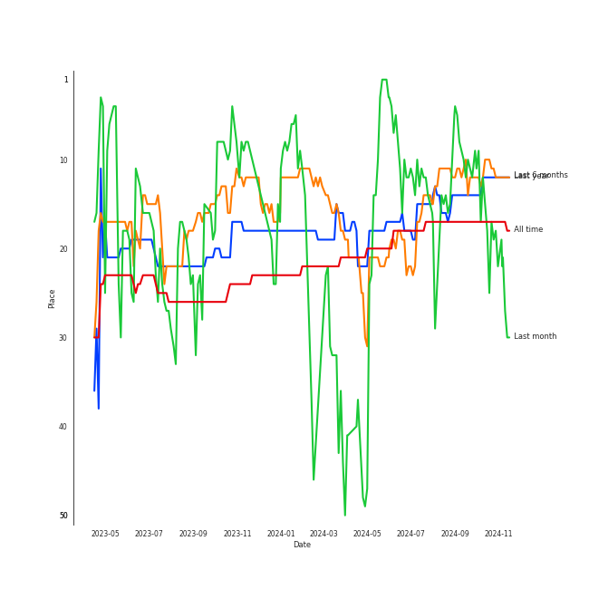
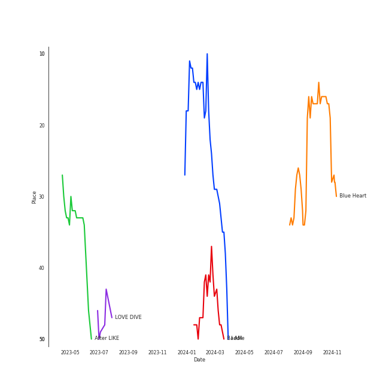

# IVE

[See Track Features](audio_features.md)

[See Clusters](clusters/overview.md)

## Relationships

IVE:
- has member 안유진 (An, Yu-jin)
- has member 가을 (GAEUL)
- has member 장원영 (Jang, Won-young)
- has member 이서 (LEESEO)
- has member 리즈 (LIZ)
- has member 레이 (REI)

## Artist Rank
IVE is currently:
- The #21 artist of all time
- The #16 artist of the last 6 months
- The #9 artist of the last month

## Top Tracks

- I AM is:
    - the #11 track of the last month

### Top tracks of the last 6 months over time

### Top tracks of the last month over time

## Featured on Playlists
| Art | Tracks | Playlist |
|:---|---:|:---|
|  | 10 | [K-Pop](../../playlists/k_pop/overview.md) |
|  | 4 | [K-Pop Favorites](../../playlists/k_pop_favorites/overview.md) |
|  | 2 | [Recent Comebacks](../../playlists/recent_comebacks/overview.md) |
|  | 2 | [Sharon RPD](../../playlists/sharon_rpd/overview.md) |
|  | 1 | [Summer](../../playlists/summer/overview.md) |
|  | 1 | [K-Pop 101](../../playlists/k_pop_101/overview.md) |
|  | 1 | [Christmas](../../playlists/christmas/overview.md) |

## Top Albums

| Art | Tracks | 💚 | Album | Release Date | 🔗 |
|:---|---:|---:|:---|:---|:---|
|  | 5 | 5 | I've IVE | 2023-04-10 | [🔗](https://open.spotify.com/album/38VzP4yWfHdHafITKKRHEB) |
|  | 2 | 1 | LOVE DIVE | 2022-04-05 | [🔗](https://open.spotify.com/album/1AFVTHHm7kKoQ6Rgb25x3p) |
|  | 2 | 1 | I'VE MINE | 2023-10-13 | [🔗](https://open.spotify.com/album/5J7VAdKdGZGme6wymgopbp) |
|  | 1 | 1 | ELEVEN | 2021-12-01 | [🔗](https://open.spotify.com/album/1XMYvsHRt52sMi6wittWqI) |
|  | 1 | 1 | After LIKE | 2022-08-22 | [🔗](https://open.spotify.com/album/0nzRF7khA2UDSZa9T0B6Da) |
|  | 1 | 0 | Spotify Singles - Holiday | 2022-11-16 | [🔗](https://open.spotify.com/album/6LNdcxlSXwXv2UFKQ3pvMk) |

## Top Record Labels

| Tracks | 💚 | Label |
|---:|---:|:---|
| 12 | 9 | [Starship Entertainment](../../labels/starship_entertainment/overview.md) |

## Genres

- [k-pop girl group](../../genres/k_pop_girl_group/overview.md)

## Credits

### Credits by Type

| Credit Type | Tracks |
|:---|---:|
| Performer | 9 |

### Member Credits

| | 가을 (GAEUL) | 레이 (REI) | 리즈 (LIZ) | 안유진 (An, Yu-jin) | 이서 (LEESEO) | 장원영 (Jang, Won-young) |
|:---|---:|---:|---:|---:|---:|---:|
| Lyricist | 2 | 3 | 0 | 0 | 0 | 0 |
| Vocal | 9 | 9 | 9 | 9 | 9 | 9 |
### Production Credits

| Art | Track | Members | Credit Types |
|:---|:---|:---|:---|
|  | After LIKE | 레이 (REI) | Lyricist |
|  | 섬찟 (Hypnosis) | 레이 (REI), 가을 (GAEUL) | Lyricist |
|  | Kitsch | 레이 (REI), 가을 (GAEUL) | Lyricist |

## Top Producers

| Art | Producer | Tracks | Credit Types |
|:---|:---|---:|:---|
| | 양영은 (Yang, Young-eun) | 8 | Producer |
| | Kriz | 8 | Arranger |
| | 정은경 (Jung, Eun-Kyung) | 7 | Producer |
| | Alawn | 6 | Producer, Arranger |
| | Ryan S. Jhun | 6 | Arranger, Songwriter, Lyricist |
| | 서지음 (Seo, Ji Eum) | 4 | Lyricist |
| | Sophia Brenan | 3 | Songwriter |
| | 레이 (REI) | 3 | Lyricist |
| | 김민희 (Kim, Min Hee) | 3 | Producer |
| | Lauren Aquilina | 3 | Songwriter |

View all

| Art | Producer | Tracks | Credit Types |
|:---|:---|---:|:---|
| | RISC | 2 | Arranger |
| | 가을 (GAEUL) | 2 | Lyricist |
| | Audun Agnar | 2 | Arranger, Songwriter |
| | Starsmith | 2 | Arranger, Songwriter |
| | Nick Hahn | 2 | Arranger, Songwriter |
| | Simon Bergseth | 2 | Producer |
| | BlackSmith | 2 | Songwriter |
| | Elle Campbell | 2 | Songwriter |
| | Iselin Solheim | 1 | Songwriter |
| | Eline Noelia | 1 | Songwriter |
| | Lars Kristian Rosness | 1 | Arranger, Songwriter |
| | Kyle Joseph Faulkner | 1 | Songwriter |
| | Emily Harbakk | 1 | Songwriter |
| | SOHLHEE | 1 | Lyricist |
| | Exy | 1 | Lyricist |
| | Markus Gustafson | 1 | Producer |
| | Elof Loelv | 1 | Arranger, Songwriter |
| | BIG Naughty | 1 | Lyricist |
| | 페리 (Perrie) | 1 | Lyricist |
| | Benjamin Pinkus | 1 | Arranger, Songwriter |
| | 이경원 (Lee, Kyung-won) | 1 | Producer |
| | Stally | 1 | Arranger, Songwriter |
| | Corey Sanders | 1 | Songwriter |
| | Alexander Pavelich | 1 | Songwriter |
| | Tea Carpenter | 1 | Songwriter |
| | 서정아 (Seo, Jung Ah) | 1 | Lyricist |
| | Anders Nilsen | 1 | Arranger, Songwriter |
| | Adriana Caldas de Barros | 1 | Songwriter |
| | 김이나 (Kim, Eana) | 1 | Lyricist |
| | LOSTBOY | 1 | Arranger, Songwriter |
| | 이스란 (Lee, Seran) | 1 | Lyricist |
| | Avin | 1 | Arranger |
| | Andre Davidson | 1 | Songwriter |
| | PATEKO | 1 | Arranger, Songwriter |
| | 황현 (Hwang, Hyeon) | 1 | Lyricist |
| | Sean Davidson | 1 | Songwriter |
| | Kristin Marie | 1 | Arranger, Songwriter |
| | Mommy Son | 1 | Lyricist |
| | Sofiloud | 1 | Songwriter |
| | Lauren Keen | 1 | Songwriter |
| | Tor-Andrè Jensen Skaar (Skaar, Tor-Andrè Jensen) | 1 | Songwriter |
| | Slay | 1 | Arranger |

## Tracks

| Art | Track | Album | Artists | Label | 💚 | 🔗 |
|:---|:---|:---|:---|:---|:---|:---|
|  | ELEVEN | ELEVEN | [IVE](overview.md) | [STARSHIP Entertainment](../../labels/starship_entertainment) | 💚 | [🔗](https://open.spotify.com/track/7n2FZQsaLb7ZRfRPfEeIvr) |
|  | LOVE DIVE | LOVE DIVE | [IVE](overview.md) | [STARSHIP Entertainment](../../labels/starship_entertainment) | 💚 | [🔗](https://open.spotify.com/track/0Q5VnK2DYzRyfqQRJuUtvi) |
|  | ROYAL | LOVE DIVE | [IVE](overview.md) | [STARSHIP Entertainment](../../labels/starship_entertainment) | | [🔗](https://open.spotify.com/track/0LMdtBOxbVgrYoA4n0Vwvv) |
|  | After LIKE | After LIKE | [IVE](overview.md) | [Starship Entertainment](../../labels/starship_entertainment) | 💚 | [🔗](https://open.spotify.com/track/2gYj9lubBorOPIVWsTXugG) |
|  | After LIKE - Holiday Remix | Spotify Singles - Holiday | [IVE](overview.md) | [Starship Entertainment](../../labels/starship_entertainment) | | [🔗](https://open.spotify.com/track/7DMsSbvw9BOp4BpxraTtNX) |
|  | Blue Blood | I've IVE | [IVE](overview.md) | [Starship Entertainment](../../labels/starship_entertainment) | 💚 | [🔗](https://open.spotify.com/track/2avdbiswb0d5AFmyyz68xP) |
|  | I AM | I've IVE | [IVE](overview.md) | [Starship Entertainment](../../labels/starship_entertainment) | 💚 | [🔗](https://open.spotify.com/track/70t7Q6AYG6ZgTYmJWcnkUM) |
|  | Kitsch | I've IVE | [IVE](overview.md) | [Starship Entertainment](../../labels/starship_entertainment) | 💚 | [🔗](https://open.spotify.com/track/7foeH2Emgq8A3LWk3q6dat) |
|  | Lips | I've IVE | [IVE](overview.md) | [Starship Entertainment](../../labels/starship_entertainment) | 💚 | [🔗](https://open.spotify.com/track/0dRSOmb7pqkkmjXCu5BYbe) |
|  | 섬찟 (Hypnosis) | I've IVE | [IVE](overview.md) | [Starship Entertainment](../../labels/starship_entertainment) | 💚 | [🔗](https://open.spotify.com/track/1tzeAVyGwvoHcVzDit0UeT) |

See all tracks

| Art | Track | Album | Artists | Label | 💚 | 🔗 |
|:---|:---|:---|:---|:---|:---|:---|
|  | Baddie | I'VE MINE | [IVE](overview.md) | [Starship Entertainment](../../labels/starship_entertainment) | 💚 | [🔗](https://open.spotify.com/track/7uyeEbG6hyApgXuEypGcsZ) |
|  | Either Way | I'VE MINE | [IVE](overview.md) | [Starship Entertainment](../../labels/starship_entertainment) | | [🔗](https://open.spotify.com/track/5c1EubDxHdulbausF5CpX5) |

