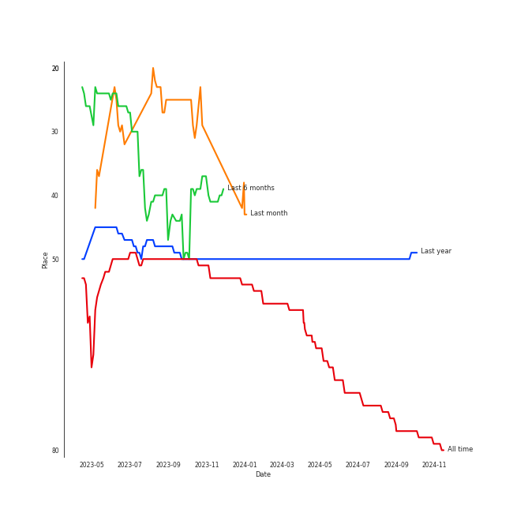
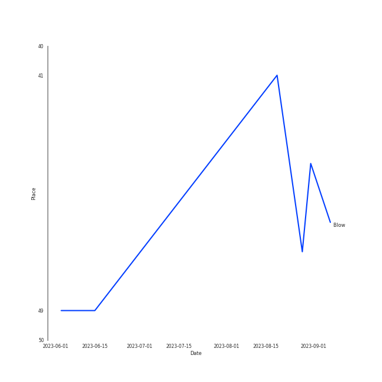
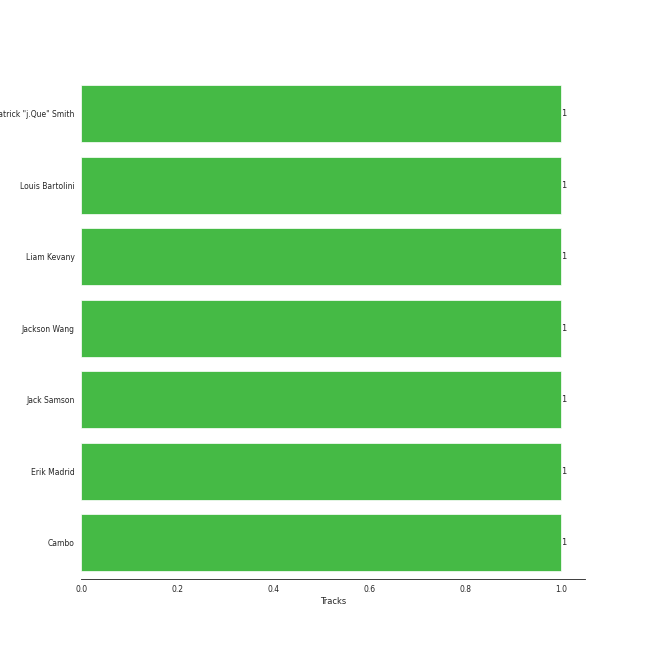

# Jackson Wang

## Relationships

Jackson Wang:
- is a member of GOT7

## Artist Rank
Jackson Wang is currently:
- The #50 artist of all time
- The #49 artist of the last 6 months

## Top Tracks

### Top tracks of the last 6 months over time

### Top tracks of the last month over time

## Featured on Playlists
| Art | Tracks | Playlist |
|:---|---:|:---|
|  | 6 | [K-Pop](../../playlists/k_pop/overview.md) |
|  | 2 | [K-Pop Favorites](../../playlists/k_pop_favorites/overview.md) |
|  | 2 | [Recent Comebacks](../../playlists/recent_comebacks/overview.md) |
|  | 1 | [Pop](../../playlists/pop/overview.md) |
|  | 1 | [Sharon RPD](../../playlists/sharon_rpd/overview.md) |
|  | 1 | [K-Pop-Adjacent](../../playlists/k_pop_adjacent/overview.md) |
|  | 1 | [Chill](../../playlists/chill/overview.md) |

## Top Albums

| Art | Tracks | 💚 | Album | Release Date | 🔗 |
|:---|---:|---:|:---|:---|:---|
|  | 3 | 3 | MAGIC MAN | 2022-09-09 | [🔗](https://open.spotify.com/album/2VZ4og2ZbwyTQ3X1rbgCe1) |
|  | 2 | 1 | Cheetah | 2023-04-24 | [🔗](https://open.spotify.com/album/4nK0XlFVAQNesqpijBX1Ri) |
|  | 1 | 1 | Head In The Clouds II | 2019-10-11 | [🔗](https://open.spotify.com/album/7bOpX6Ilc9UCFmH9uGyUDy) |
|  | 1 | 0 | LMLY | 2021-03-26 | [🔗](https://open.spotify.com/album/09UJf8ZqCuv5NHRZIqTZgh) |

## Top Record Labels

| Tracks | 💚 | Label |
|---:|---:|:---|
| 7 | 5 | [Warner Records](../../labels/warner_records/overview.md) |
| 7 | 5 | [88rising Music](../../labels/88rising_music/overview.md) |
| 5 | 4 | TEAM WANG records |

## Genres

- [k-pop](../../genres/k_pop/overview.md)

## Credits

### Credits by Type

| Credit Type | Tracks |
|:---|---:|
| Songwriter | 1 |
| Vocal | 2 |

### Production Credits

| Art | Track | Credit Types |
|:---|:---|:---|
|  | Blow | Songwriter |

## Top Producers

| Art | Producer | Tracks | Credit Types |
|:---|:---|---:|:---|
| | Erik Madrid | 1 | Producer |
| | Patrick "j.Que" Smith | 1 | Songwriter |
| | Cambo | 1 | Producer, Songwriter |
| | Louis Bartolini | 1 | Producer, Songwriter |
| | Liam Kevany | 1 | Producer, Songwriter |
|  | [Jackson Wang](overview.md) | 1 | Songwriter |
| | Jack Samson | 1 | Songwriter |

## Tracks

| Art | Track | Album | Artists | Label | 💚 | 🔗 |
|:---|:---|:---|:---|:---|:---|:---|
|  | I Love You 3000 II | Head In The Clouds II | 88rising, Stephanie Poetri, [Jackson Wang](overview.md) | [88rising Music](../../labels/88rising_music), [Warner Records](../../labels/warner_records) | 💚 | [🔗](https://open.spotify.com/track/3witRpHWHqArlnt6GTlH2Y) |
|  | LMLY | LMLY | [Jackson Wang](overview.md) | [88rising Music](../../labels/88rising_music), [Warner Records](../../labels/warner_records) | | [🔗](https://open.spotify.com/track/3Jbpo2slhW2bbVneiJnC9G) |
|  | Blow | MAGIC MAN | [Jackson Wang](overview.md) | TEAM WANG records, [88rising Music](../../labels/88rising_music), [Warner Records](../../labels/warner_records) | 💚 | [🔗](https://open.spotify.com/track/53WD6QvMGh7wXQVP0U8Rnr) |
|  | Come Alive | MAGIC MAN | [Jackson Wang](overview.md) | TEAM WANG records, [88rising Music](../../labels/88rising_music), [Warner Records](../../labels/warner_records) | 💚 | [🔗](https://open.spotify.com/track/2mrG7QoaHDD1kYhr5jeK9q) |
|  | Cruel | MAGIC MAN | [Jackson Wang](overview.md) | TEAM WANG records, [88rising Music](../../labels/88rising_music), [Warner Records](../../labels/warner_records) | 💚 | [🔗](https://open.spotify.com/track/32nxxRcrH6gqlVG2RYYMEN) |
|  | Cheetah | Cheetah | [Jackson Wang](overview.md) | TEAM WANG records, [88rising Music](../../labels/88rising_music), [Warner Records](../../labels/warner_records) | 💚 | [🔗](https://open.spotify.com/track/76WMXf8zWfpNLgOZbU2ej8) |
|  | Slow (with Ciara) | Cheetah | [Jackson Wang](overview.md), Ciara | TEAM WANG records, [88rising Music](../../labels/88rising_music), [Warner Records](../../labels/warner_records) | | [🔗](https://open.spotify.com/track/4GJanLClwCh0D0EROpsHyd) |
