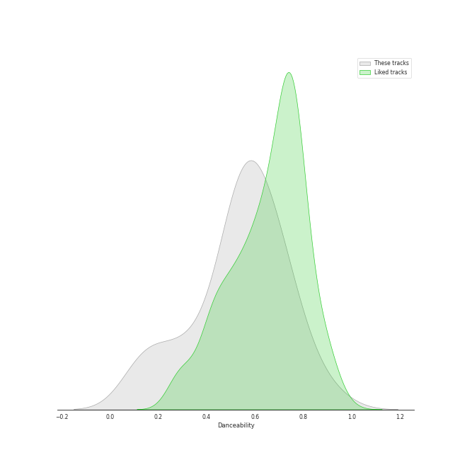
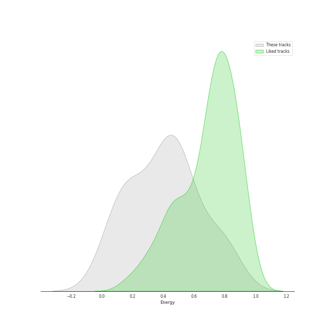
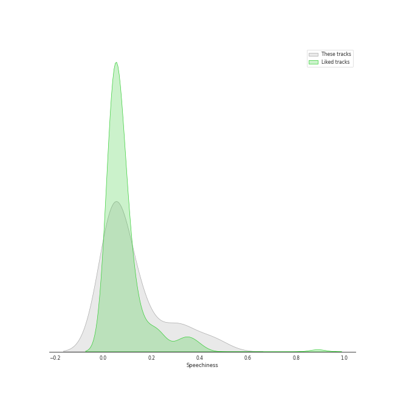
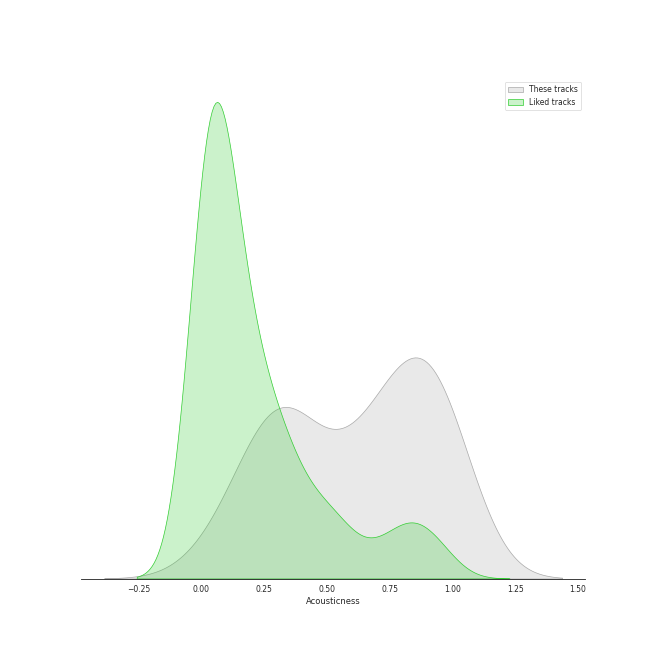
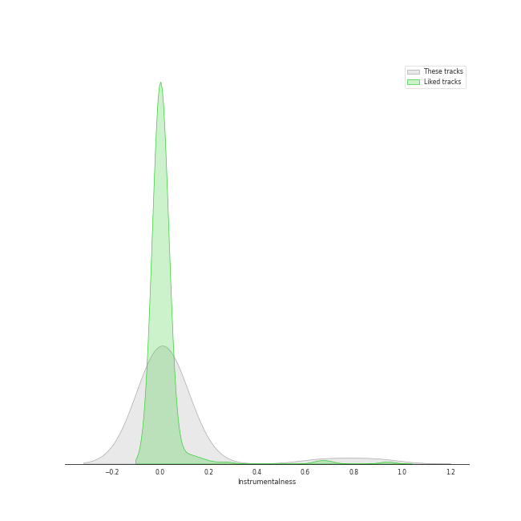
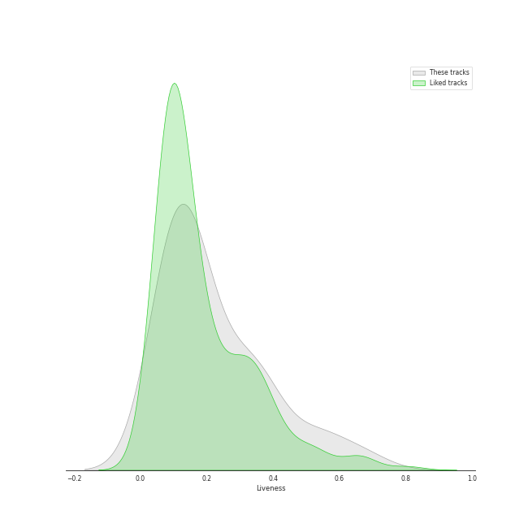
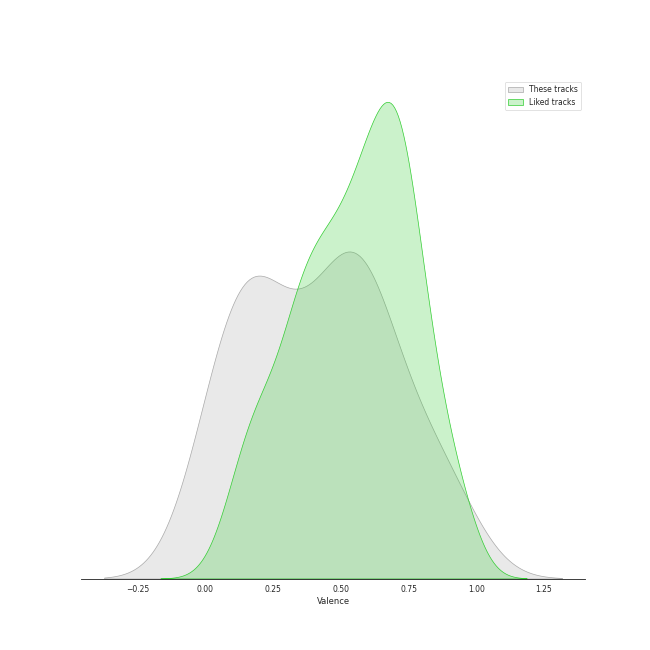
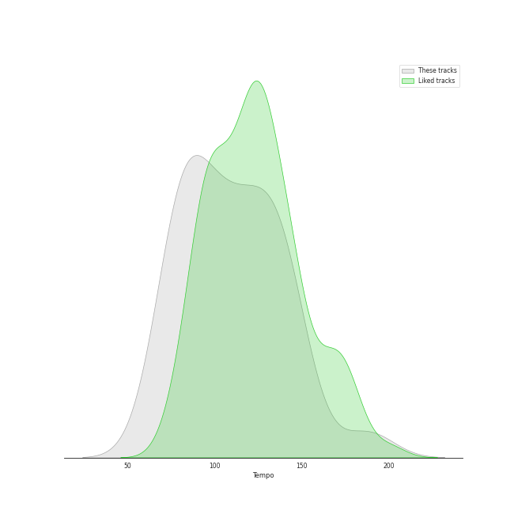

# Track Features for Jacob Collier

## Danceability

| ​ | 10 most Danceable tracks | ​​ | 10 least Danceable tracks |
|:---|:---|:---|:---|
|  | In My Bones (feat. Kimbra & Tank and The Bangas) (0.897) |  | Bridge Over Troubled Water (feat. John Legend & Tori Kelly) (0.129) |
|  | Woke Up Today (0.765) |  | Moon River (0.144) |
|  | She Put Sunshine (0.726) |  | Home Is (0.148) |
|  | Mi Corazón (feat. Camilo) (0.716) |  | You And I (0.29) |
|  | Running Outta Love (feat. Tori Kelly) (0.704) |  | In The Wee Small Hours of the Morning (0.326) |
|  | All Night Long (feat. Take 6) (0.698) |  | ❤️ (0.348) |
|  | In My Room (0.676) |  | He Won't Hold You (feat. Rapsody) (0.404) |
|  | Hajanga (0.654) |  | Cinnamon Crush (feat. Lindsey Lomis) (0.454) |
|  | Here Comes The Sun (feat. dodie) (0.641) |  | All I Need (with Mahalia & Ty Dolla $ign) (0.494) |
|  | Feel (feat. Lianne La Havas) (0.611) |  | With The Love In My Heart (0.51) |

## Energy

| ​ | 10 most Energetic tracks | ​​ | 10 least Energetic tracks |
|:---|:---|:---|:---|
|  | In My Bones (feat. Kimbra & Tank and The Bangas) (0.823) |  | In The Wee Small Hours of the Morning (0.029) |
|  | Over You (feat. aespa & Chris Martin) (0.798) |  | ❤️ (0.0491) |
|  | Woke Up Today (0.763) |  | Feel (feat. Lianne La Havas) (0.134) |
|  | She Put Sunshine (0.718) |  | Home Is (0.147) |
|  | WELLLL (0.626) |  | Make Me Cry (0.152) |
|  | With The Love In My Heart (0.551) |  | You And I (0.153) |
|  | Hajanga (0.538) |  | Moon River (0.154) |
|  | All Night Long (feat. Take 6) (0.536) |  | In My Room (0.21) |
|  | Every Little Thing She Does Is Magic (0.514) |  | Flintstones (0.274) |
|  | All I Need (with Mahalia & Ty Dolla $ign) (0.492) |  | Bridge Over Troubled Water (feat. John Legend & Tori Kelly) (0.307) |

## Speechiness

| ​ | 10 most Speechy tracks | ​​ | 10 least Speechy tracks |
|:---|:---|:---|:---|
|  | Time Alone With You (feat. Daniel Caesar) (0.462) |  | Never Gonna Be Alone (feat. Lizzy McAlpine & John Mayer) (0.0265) |
|  | Running Outta Love (feat. Tori Kelly) (0.405) |  | You And I (0.0288) |
|  | Flintstones (0.314) |  | Moon River (0.0302) |
|  | All I Need (with Mahalia & Ty Dolla $ign) (0.311) |  | Bridge Over Troubled Water (feat. John Legend & Tori Kelly) (0.032) |
|  | With The Love In My Heart (0.29) |  | A Rock Somewhere (feat. Anoushka Shankar & Varijashree Venugopal) (0.0331) |
|  | In My Bones (feat. Kimbra & Tank and The Bangas) (0.189) |  | Home Is (0.0355) |
|  | Cinnamon Crush (feat. Lindsey Lomis) (0.164) |  | In The Wee Small Hours of the Morning (0.0365) |
|  | In My Room (0.158) |  | WELLLL (0.0368) |
|  | He Won't Hold You (feat. Rapsody) (0.134) |  | Hajanga (0.037) |
|  | Woke Up Today (0.118) |  | She Put Sunshine (0.0402) |

## Acousticness

| ​ | 10 most Acoustic tracks | ​​ | 10 least Acoustic tracks |
|:---|:---|:---|:---|
|  | In The Wee Small Hours of the Morning (0.985) |  | WELLLL (0.0746) |
|  | Home Is (0.976) |  | In My Bones (feat. Kimbra & Tank and The Bangas) (0.173) |
|  | ❤️ (0.97) |  | Woke Up Today (0.242) |
|  | Moon River (0.97) |  | She Put Sunshine (0.274) |
|  | You And I (0.943) |  | Over You (feat. aespa & Chris Martin) (0.306) |
|  | Make Me Cry (0.917) |  | With The Love In My Heart (0.31) |
|  | A Rock Somewhere (feat. Anoushka Shankar & Varijashree Venugopal) (0.905) |  | All Night Long (feat. Take 6) (0.327) |
|  | Bridge Over Troubled Water (feat. John Legend & Tori Kelly) (0.877) |  | Time Alone With You (feat. Daniel Caesar) (0.368) |
|  | Here Comes The Sun (feat. dodie) (0.838) |  | Mi Corazón (feat. Camilo) (0.374) |
|  | Feel (feat. Lianne La Havas) (0.836) |  | All I Need (with Mahalia & Ty Dolla $ign) (0.407) |

## Instrumentalness

| ​ | 10 most Instrumental tracks | ​​ | 10 least Instrumental tracks |
|:---|:---|:---|:---|
|  | Home Is (0.884) |  | All I Need (with Mahalia & Ty Dolla $ign) (0.0) |
|  | Never Gonna Be Alone (feat. Lizzy McAlpine & John Mayer) (0.682) |  | Running Outta Love (feat. Tori Kelly) (0.0) |
|  | A Rock Somewhere (feat. Anoushka Shankar & Varijashree Venugopal) (0.13) |  | Time Alone With You (feat. Daniel Caesar) (0.0) |
|  | Hajanga (0.0763) |  | WELLLL (0.0) |
|  | With The Love In My Heart (0.045) |  | Over You (feat. aespa & Chris Martin) (0.0) |
|  | Moon River (0.0284) |  | In My Bones (feat. Kimbra & Tank and The Bangas) (7.47e-06) |
|  | Feel (feat. Lianne La Havas) (0.0184) |  | You And I (8.99e-06) |
|  | In My Room (0.00459) |  | She Put Sunshine (2.65e-05) |
|  | He Won't Hold You (feat. Rapsody) (0.00138) |  | Mi Corazón (feat. Camilo) (4.8e-05) |
|  | All Night Long (feat. Take 6) (0.00084) |  | Bridge Over Troubled Water (feat. John Legend & Tori Kelly) (6.35e-05) |

## Liveness

| ​ | 10 most Live tracks | ​​ | 10 least Live tracks |
|:---|:---|:---|:---|
|  | WELLLL (0.652) |  | A Rock Somewhere (feat. Anoushka Shankar & Varijashree Venugopal) (0.0758) |
|  | Here Comes The Sun (feat. dodie) (0.539) |  | Feel (feat. Lianne La Havas) (0.081) |
|  | Time Alone With You (feat. Daniel Caesar) (0.522) |  | All Night Long (feat. Take 6) (0.0875) |
|  | He Won't Hold You (feat. Rapsody) (0.373) |  | ❤️ (0.0918) |
|  | With The Love In My Heart (0.371) |  | In My Room (0.0926) |
|  | Mi Corazón (feat. Camilo) (0.351) |  | Cinnamon Crush (feat. Lindsey Lomis) (0.0963) |
|  | Over You (feat. aespa & Chris Martin) (0.333) |  | Home Is (0.0987) |
|  | In My Bones (feat. Kimbra & Tank and The Bangas) (0.331) |  | Hajanga (0.102) |
|  | Never Gonna Be Alone (feat. Lizzy McAlpine & John Mayer) (0.322) |  | Moon River (0.103) |
|  | Bridge Over Troubled Water (feat. John Legend & Tori Kelly) (0.217) |  | You And I (0.105) |

## Valence

| ​ | 10 most Happy tracks | ​​ | 10 least Happy tracks |
|:---|:---|:---|:---|
|  | Woke Up Today (0.91) |  | Home Is (0.0335) |
|  | All I Need (with Mahalia & Ty Dolla $ign) (0.887) |  | Moon River (0.04) |
|  | Over You (feat. aespa & Chris Martin) (0.806) |  | In The Wee Small Hours of the Morning (0.0422) |
|  | In My Bones (feat. Kimbra & Tank and The Bangas) (0.767) |  | Bridge Over Troubled Water (feat. John Legend & Tori Kelly) (0.114) |
|  | Flintstones (0.644) |  | With The Love In My Heart (0.126) |
|  | She Put Sunshine (0.625) |  | Feel (feat. Lianne La Havas) (0.136) |
|  | All Night Long (feat. Take 6) (0.615) |  | You And I (0.163) |
|  | Running Outta Love (feat. Tori Kelly) (0.606) |  | He Won't Hold You (feat. Rapsody) (0.198) |
|  | WELLLL (0.602) |  | Make Me Cry (0.223) |
|  | Hajanga (0.587) |  | ❤️ (0.232) |

## Tempo

| ​ | 10 most Fast tracks | ​​ | 10 least Fast tracks |
|:---|:---|:---|:---|
|  | In My Room (188.05) |  | Bridge Over Troubled Water (feat. John Legend & Tori Kelly) (65.873) |
|  | A Rock Somewhere (feat. Anoushka Shankar & Varijashree Venugopal) (147.988) |  | Running Outta Love (feat. Tori Kelly) (68.076) |
|  | Here Comes The Sun (feat. dodie) (145.043) |  | Cinnamon Crush (feat. Lindsey Lomis) (75.908) |
|  | Flintstones (141.386) |  | Time Alone With You (feat. Daniel Caesar) (79.153) |
|  | ❤️ (136.68) |  | Over You (feat. aespa & Chris Martin) (80.044) |
|  | Hajanga (134.067) |  | All I Need (with Mahalia & Ty Dolla $ign) (82.991) |
|  | She Put Sunshine (134.014) |  | Moon River (85.391) |
|  | You And I (133.909) |  | WELLLL (86.025) |
|  | In My Bones (feat. Kimbra & Tank and The Bangas) (129.056) |  | Never Gonna Be Alone (feat. Lizzy McAlpine & John Mayer) (90.552) |
|  | With The Love In My Heart (122.981) |  | Every Little Thing She Does Is Magic (91.967) |
