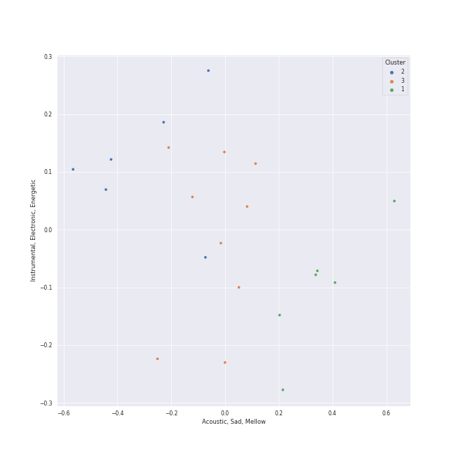

# Clusters in Jacob Collier

## Cluster #1

11 tracks

| Art | Track | Album | Artists | Label | Score | 💚 | 🔗 |
|:---|:---|:---|:---|:---|---:|:---|:---|
|  | Running Outta Love (feat. Tori Kelly) | Djesse Vol. 3 | [Jacob Collier](../../overview.md), Tori Kelly | [Decca (UMO)](../../../../labels/decca_(umo)) | 80 | 💚 | [🔗](https://open.spotify.com/track/18kV8FzhGXE6XndMdiv4Ox) |
|  | He Won't Hold You (feat. Rapsody) | Djesse Vol. 3 | [Jacob Collier](../../overview.md), Rapsody | [Decca (UMO)](../../../../labels/decca_(umo)) | 196 | 💚 | [🔗](https://open.spotify.com/track/3mSoxi4aC7oiTGJjsLLkaM) |
|  | A Rock Somewhere (feat. Anoushka Shankar & Varijashree Venugopal) | Djesse Vol. 4 | [Jacob Collier](../../overview.md), Anoushka Shankar, Varijashree Venugopal | [Decca (UMO)](../../../../labels/decca_(umo)) | 0 | 💚 | [🔗](https://open.spotify.com/track/0PZU2E5P51ZJOQDW1k5U8F) |
|  | Cinnamon Crush (feat. Lindsey Lomis) | Djesse Vol. 4 | [Jacob Collier](../../overview.md), Lindsey Lomis | [Decca (UMO)](../../../../labels/decca_(umo)) | 0 | 💚 | [🔗](https://open.spotify.com/track/6XJvYWE3tx9tRVavh6GysW) |
|  | With The Love In My Heart | Djesse Vol. 1 | [Jacob Collier](../../overview.md), Metropole Orkest, Jules Buckley | [Decca (UMO)](../../../../labels/decca_(umo)) | 0 | 💚 | [🔗](https://open.spotify.com/track/0ZVPABdzJEa0nG85uAlBjB) |
|  | Every Little Thing She Does Is Magic | Djesse Vol. 1 | [Jacob Collier](../../overview.md), Metropole Orkest, Jules Buckley | [Decca (UMO)](../../../../labels/decca_(umo)) | 89 | 💚 | [🔗](https://open.spotify.com/track/0xuz9pSNwyWljXUgEGEhjp) |
|  | Here Comes The Sun (feat. dodie) | Djesse Vol. 2 | [Jacob Collier](../../overview.md), dodie | [Decca (UMO)](../../../../labels/decca_(umo)) | 0 | | [🔗](https://open.spotify.com/track/0fu5r69xQg8OQCGsK2S5Il) |
|  | In My Room | In My Room | [Jacob Collier](../../overview.md) | Hajanga Records | 0 | 💚 | [🔗](https://open.spotify.com/track/1yGl3V3BiRSaVnuFC93CYd) |
|  | Hajanga | In My Room | [Jacob Collier](../../overview.md) | Hajanga Records | 0 | 💚 | [🔗](https://open.spotify.com/track/3VW8i6i8zT9YbIiZXmZFoQ) |
|  | Flintstones | In My Room | [Jacob Collier](../../overview.md) | Hajanga Records | 0 | | [🔗](https://open.spotify.com/track/731rnSkAluFeKZaGTHig7W) |
## Cluster #2

9 tracks

| Art | Track | Album | Artists | Label | Score | 💚 | 🔗 |
|:---|:---|:---|:---|:---|---:|:---|:---|
|  | In My Bones (feat. Kimbra & Tank and The Bangas) | Djesse Vol. 3 | [Jacob Collier](../../overview.md), [Kimbra](../../../kimbra/overview.md), Tank and The Bangas | [Decca (UMO)](../../../../labels/decca_(umo)) | 58 | 💚 | [🔗](https://open.spotify.com/track/06PNiDGtPIMOq9VU2ftVCk) |
|  | All I Need (with Mahalia & Ty Dolla $ign) | Djesse Vol. 3 | [Jacob Collier](../../overview.md), Mahalia, Ty Dolla $ign | [Decca (UMO)](../../../../labels/decca_(umo)) | 0 | 💚 | [🔗](https://open.spotify.com/track/164VgxTozx99XCinCB9ITR) |
|  | Time Alone With You (feat. Daniel Caesar) | Djesse Vol. 3 | [Jacob Collier](../../overview.md), Daniel Caesar | [Decca (UMO)](../../../../labels/decca_(umo)) | 0 | 💚 | [🔗](https://open.spotify.com/track/1iTiSQWPJNqthOMG8HG6gI) |
|  | Mi Corazón (feat. Camilo) | Djesse Vol. 4 | [Jacob Collier](../../overview.md), Camilo | [Decca (UMO)](../../../../labels/decca_(umo)) | 0 | 💚 | [🔗](https://open.spotify.com/track/5Rg0oIXL40HY5CsUWD3IAJ) |
|  | She Put Sunshine | Djesse Vol. 4 | [Jacob Collier](../../overview.md) | [Decca (UMO)](../../../../labels/decca_(umo)) | 0 | 💚 | [🔗](https://open.spotify.com/track/60ZCmLIYDUHmQ98Ydo1cR8) |
|  | Over You (feat. aespa & Chris Martin) | Djesse Vol. 4 | [Jacob Collier](../../overview.md), [aespa](../../../aespa/overview.md), Chris Martin | [Decca (UMO)](../../../../labels/decca_(umo)) | 0 | 💚 | [🔗](https://open.spotify.com/track/7MSZg4Km8CM7NRXTeJoANZ) |
|  | All Night Long (feat. Take 6) | Djesse Vol. 1 | [Jacob Collier](../../overview.md), Metropole Orkest, Jules Buckley, Take 6 | [Decca (UMO)](../../../../labels/decca_(umo)) | 0 | 💚 | [🔗](https://open.spotify.com/track/6TN4FrJvMdYrLDF2Lz7ArI) |
|  | Woke Up Today | In My Room | [Jacob Collier](../../overview.md) | Hajanga Records | 0 | 💚 | [🔗](https://open.spotify.com/track/5wSBAOJizZFq1lhgppsDNj) |
|  | WELLLL | WELLLL | [Jacob Collier](../../overview.md) | [Decca (UMO)](../../../../labels/decca_(umo)) | 0 | 💚 | [🔗](https://open.spotify.com/track/4rPv8eZH6ABfkrtxxHHtV4) |
## Cluster #3

7 tracks

| Art | Track | Album | Artists | Label | Score | 💚 | 🔗 |
|:---|:---|:---|:---|:---|---:|:---|:---|
|  | Bridge Over Troubled Water (feat. John Legend & Tori Kelly) | Djesse Vol. 4 | [Jacob Collier](../../overview.md), John Legend, Tori Kelly | [Decca (UMO)](../../../../labels/decca_(umo)) | 0 | | [🔗](https://open.spotify.com/track/4asa5agcZmibrmpTmb1q6m) |
|  | Home Is | Djesse Vol. 1 | [Jacob Collier](../../overview.md), VOCES8 | [Decca (UMO)](../../../../labels/decca_(umo)) | 0 | | [🔗](https://open.spotify.com/track/3nur4bNfmRCoLFxk9ubHHK) |
|  | Moon River | Djesse Vol. 2 | [Jacob Collier](../../overview.md) | [Decca (UMO)](../../../../labels/decca_(umo)) | 46 | 💚 | [🔗](https://open.spotify.com/track/1IRRqn75jaZHp7zMT1NGbZ) |
|  | Make Me Cry | Djesse Vol. 2 | [Jacob Collier](../../overview.md) | [Decca (UMO)](../../../../labels/decca_(umo)) | 0 | 💚 | [🔗](https://open.spotify.com/track/4Y6VEDkRSpbn8Wt8x18RHh) |
|  | Feel (feat. Lianne La Havas) | Djesse Vol. 2 | [Jacob Collier](../../overview.md), Lianne La Havas | [Decca (UMO)](../../../../labels/decca_(umo)) | 0 | | [🔗](https://open.spotify.com/track/7MGNHuYwmm9UjQgdVciO1v) |
|  | You And I | In My Room | [Jacob Collier](../../overview.md) | Hajanga Records | 0 | 💚 | [🔗](https://open.spotify.com/track/0yZ1VBdUdX2dEBXv4LXzn8) |
|  | ❤️ | Music Of The Spheres | [Coldplay](../../../coldplay/overview.md), We Are KING, [Jacob Collier](../../overview.md) | [Parlophone UK](../../../../labels/parlophone_uk) | 0 | | [🔗](https://open.spotify.com/track/3oTYv0yShT4sjuPncoUXfK) |