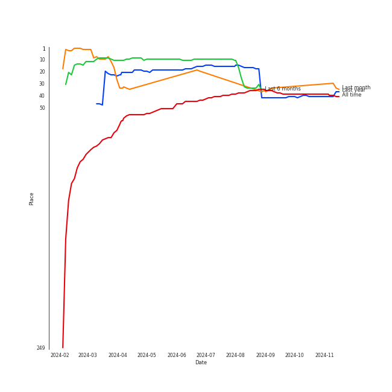
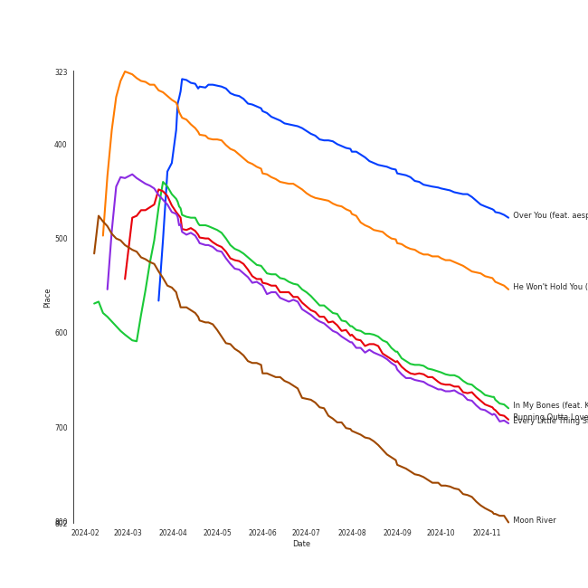
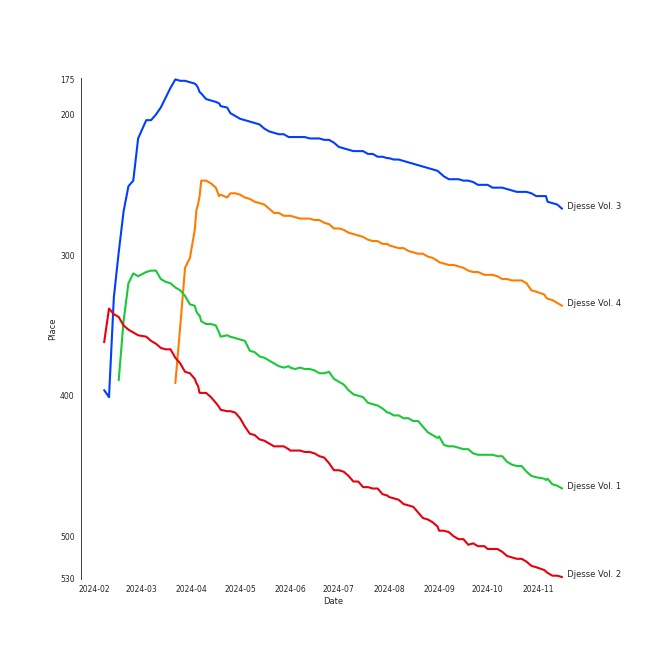

# Jacob Collier

[See Track Features](audio_features.md)

[See Clusters](clusters/overview.md)

## Artist Rank
Jacob Collier is currently:
- The #41 artist of the last year
- The #38 artist of all time

## Top Tracks

### Top tracks of all time

## Top Albums

| Art | Rank | Tracks | 💚 | Album | Release Date | 🔗 |
|:---|---:|---:|---:|:---|:---|:---|
|  | 315 | 6 | 5 | Djesse Vol. 4 | 2024-03-01 | [🔗](https://open.spotify.com/album/13r6eqjYlKELFQlNvVCBz1) |
|  | 643 | 5 | 4 | In My Room | 2016-07-01 | [🔗](https://open.spotify.com/album/70N5l7CBZmAMCh1WfnM6in) |
|  | 252 | 5 | 4 | Djesse Vol. 3 | 2020-08-14 | [🔗](https://open.spotify.com/album/33cj3kzLqVOg9zvy69Wrc8) |
|  | 445 | 4 | 3 | Djesse Vol. 1 | 2018-12-07 | [🔗](https://open.spotify.com/album/47bMDS4CMLbqcIVjEMWUjK) |
|  | 508 | 4 | 1 | Djesse Vol. 2 | 2019-07-19 | [🔗](https://open.spotify.com/album/3zNi5dCpkbm4zv7h1vGOMy) |
|  | 643 | 1 | 1 | säje | 2023-08-25 | [🔗](https://open.spotify.com/album/6L4rGy7MjjQFUhbeSFlcBr) |
|  | 643 | 1 | 1 | WELLLL | 2023-07-14 | [🔗](https://open.spotify.com/album/6RFuKQSGuvj6f0l9A7wnbm) |
|  | 643 | 1 | 0 | Never Gonna Be Alone (feat. Lizzy McAlpine & John Mayer) | 2022-06-10 | [🔗](https://open.spotify.com/album/0rFjAGsF5UhG8hPeirWaHV) |
|  | 643 | 1 | 0 | Music Of The Spheres | 2021-10-15 | [🔗](https://open.spotify.com/album/06mXfvDsRZNfnsGZvX2zpb) |

## Featured on Playlists
| Art | Tracks | Playlist |
|:---|---:|:---|
|  | 21 | [Alt-Pop](../../playlists/alt-pop/overview.md) |
|  | 11 | [Jazz](../../playlists/jazz/overview.md) |
|  | 2 | [International Pop](../../playlists/international_pop/overview.md) |
|  | 2 | [Chill](../../playlists/chill/overview.md) |
|  | 2 | [A Cappella](../../playlists/a_cappella/overview.md) |
|  | 1 | [Funk](../../playlists/funk/overview.md) |
|  | 1 | [K-Pop](../../playlists/k-pop/overview.md) |
|  | 1 | [Choral](../../playlists/choral/overview.md) |

## Top Record Labels

| Tracks | 💚 | Label |
|---:|---:|:---|
| 21 | 14 | [Decca (UMO)](../../labels/decca_(umo)/overview.md) |
| 5 | 4 | Hajanga Records |
| 1 | 1 | sajevoices |
| 1 | 0 | [Parlophone UK](../../labels/parlophone_uk/overview.md) |

## Genres

- [uk alternative pop](../../genres/uk_alternative_pop/overview.md)

## Credits

### Credits by Type

| Credit Type | Tracks |
|:---|---:|
| Arranger | 5 |
| Producer | 5 |
| Songwriter | 6 |
| Vocal | 1 |

### Production Credits

| Art | Track | Credit Types |
|:---|:---|:---|
|  | Make Me Cry | Songwriter |
|  | In My Bones (feat. Kimbra & Tank and The Bangas) | Arranger, Producer, Songwriter |
|  | All I Need (with Mahalia & Ty Dolla $ign) | Arranger, Producer, Songwriter |
|  | Running Outta Love (feat. Tori Kelly) | Arranger, Producer, Songwriter |
|  | Time Alone With You (feat. Daniel Caesar) | Arranger, Producer, Songwriter |
|  | He Won't Hold You (feat. Rapsody) | Arranger, Producer, Songwriter |

## Top Producers

| Art | Producer | Tracks | Credit Types |
|:---|:---|---:|:---|
|  | [Jacob Collier](overview.md) | 6 | Arranger, Producer, Songwriter |
| | Ben Bloomberg | 5 | Producer |
| | DJ Fai | 1 | Producer |
| | Wissam Ghorayeb | 1 | Producer |
|  | Ty Dolla $ign | 1 | Songwriter |
| | Henry Mancini | 1 | Songwriter |
| | Tarriona 'Tank' Ball | 1 | Songwriter |
| | Johnny Mercer | 1 | Lyricist |
|  | Daniel Caesar | 1 | Songwriter |
|  | Rapsody | 1 | Producer, Songwriter |

View all

| Art | Producer | Tracks | Credit Types |
|:---|:---|---:|:---|
|  | Tori Kelly | 1 | Songwriter |
|  | [Kimbra](../kimbra/overview.md) | 1 | Songwriter |

## Tracks

| Art | Track | Album | Artists | Label | Rank | 💚 | 🔗 |
|:---|:---|:---|:---|:---|---:|:---|:---|
|  | Over You (feat. aespa & Chris Martin) | Djesse Vol. 4 | [Jacob Collier](overview.md), [aespa](../aespa/overview.md), Chris Martin | [Decca (UMO)](../../labels/decca_(umo)) | 448 | 💚 | [🔗](https://open.spotify.com/track/7MSZg4Km8CM7NRXTeJoANZ) |
|  | He Won't Hold You (feat. Rapsody) | Djesse Vol. 3 | [Jacob Collier](overview.md), Rapsody | [Decca (UMO)](../../labels/decca_(umo)) | 521 | | [🔗](https://open.spotify.com/track/3mSoxi4aC7oiTGJjsLLkaM) |
|  | In My Bones (feat. Kimbra & Tank and The Bangas) | Djesse Vol. 3 | [Jacob Collier](overview.md), [Kimbra](../kimbra/overview.md), Tank and The Bangas | [Decca (UMO)](../../labels/decca_(umo)) | 642 | 💚 | [🔗](https://open.spotify.com/track/06PNiDGtPIMOq9VU2ftVCk) |
|  | Running Outta Love (feat. Tori Kelly) | Djesse Vol. 3 | [Jacob Collier](overview.md), Tori Kelly | [Decca (UMO)](../../labels/decca_(umo)) | 653 | 💚 | [🔗](https://open.spotify.com/track/18kV8FzhGXE6XndMdiv4Ox) |
|  | Every Little Thing She Does Is Magic | Djesse Vol. 1 | [Jacob Collier](overview.md), Metropole Orkest, Jules Buckley | [Decca (UMO)](../../labels/decca_(umo)) | 659 | 💚 | [🔗](https://open.spotify.com/track/0xuz9pSNwyWljXUgEGEhjp) |
|  | Moon River | Djesse Vol. 2 | [Jacob Collier](overview.md) | [Decca (UMO)](../../labels/decca_(umo)) | 759 | | [🔗](https://open.spotify.com/track/1IRRqn75jaZHp7zMT1NGbZ) |
|  | Flintstones | In My Room | [Jacob Collier](overview.md) | Hajanga Records | 974 | | [🔗](https://open.spotify.com/track/731rnSkAluFeKZaGTHig7W) |
|  | Hajanga | In My Room | [Jacob Collier](overview.md) | Hajanga Records | 974 | 💚 | [🔗](https://open.spotify.com/track/3VW8i6i8zT9YbIiZXmZFoQ) |
|  | In My Room | In My Room | [Jacob Collier](overview.md) | Hajanga Records | 974 | 💚 | [🔗](https://open.spotify.com/track/1yGl3V3BiRSaVnuFC93CYd) |
|  | Woke Up Today | In My Room | [Jacob Collier](overview.md) | Hajanga Records | 974 | 💚 | [🔗](https://open.spotify.com/track/5wSBAOJizZFq1lhgppsDNj) |

See all tracks

| Art | Track | Album | Artists | Label | Rank | 💚 | 🔗 |
|:---|:---|:---|:---|:---|---:|:---|:---|
|  | You And I | In My Room | [Jacob Collier](overview.md) | Hajanga Records | 974 | 💚 | [🔗](https://open.spotify.com/track/0yZ1VBdUdX2dEBXv4LXzn8) |
|  | All Night Long (feat. Take 6) | Djesse Vol. 1 | [Jacob Collier](overview.md), Metropole Orkest, Jules Buckley, Take 6 | [Decca (UMO)](../../labels/decca_(umo)) | 974 | 💚 | [🔗](https://open.spotify.com/track/6TN4FrJvMdYrLDF2Lz7ArI) |
|  | Home Is | Djesse Vol. 1 | [Jacob Collier](overview.md), VOCES8 | [Decca (UMO)](../../labels/decca_(umo)) | 974 | | [🔗](https://open.spotify.com/track/3nur4bNfmRCoLFxk9ubHHK) |
|  | With The Love In My Heart | Djesse Vol. 1 | [Jacob Collier](overview.md), Metropole Orkest, Jules Buckley | [Decca (UMO)](../../labels/decca_(umo)) | 974 | 💚 | [🔗](https://open.spotify.com/track/0ZVPABdzJEa0nG85uAlBjB) |
|  | Feel (feat. Lianne La Havas) | Djesse Vol. 2 | [Jacob Collier](overview.md), Lianne La Havas | [Decca (UMO)](../../labels/decca_(umo)) | 974 | | [🔗](https://open.spotify.com/track/7MGNHuYwmm9UjQgdVciO1v) |
|  | Here Comes The Sun (feat. dodie) | Djesse Vol. 2 | [Jacob Collier](overview.md), dodie | [Decca (UMO)](../../labels/decca_(umo)) | 974 | | [🔗](https://open.spotify.com/track/0fu5r69xQg8OQCGsK2S5Il) |
|  | Make Me Cry | Djesse Vol. 2 | [Jacob Collier](overview.md) | [Decca (UMO)](../../labels/decca_(umo)) | 974 | 💚 | [🔗](https://open.spotify.com/track/4Y6VEDkRSpbn8Wt8x18RHh) |
|  | All I Need (with Mahalia & Ty Dolla $ign) | Djesse Vol. 3 | [Jacob Collier](overview.md), Mahalia, Ty Dolla $ign | [Decca (UMO)](../../labels/decca_(umo)) | 974 | 💚 | [🔗](https://open.spotify.com/track/164VgxTozx99XCinCB9ITR) |
|  | Time Alone With You (feat. Daniel Caesar) | Djesse Vol. 3 | [Jacob Collier](overview.md), Daniel Caesar | [Decca (UMO)](../../labels/decca_(umo)) | 974 | 💚 | [🔗](https://open.spotify.com/track/1iTiSQWPJNqthOMG8HG6gI) |
|  | ❤️ | Music Of The Spheres | [Coldplay](../coldplay/overview.md), We Are KING, [Jacob Collier](overview.md) | [Parlophone UK](../../labels/parlophone_uk) | 974 | | [🔗](https://open.spotify.com/track/3oTYv0yShT4sjuPncoUXfK) |
|  | Never Gonna Be Alone (feat. Lizzy McAlpine & John Mayer) | Never Gonna Be Alone (feat. Lizzy McAlpine & John Mayer) | [Jacob Collier](overview.md), Lizzy McAlpine, John Mayer | [Decca (UMO)](../../labels/decca_(umo)) | 974 | | [🔗](https://open.spotify.com/track/5m9OR6G4lNt9Da6dy1xpHx) |
|  | WELLLL | WELLLL | [Jacob Collier](overview.md) | [Decca (UMO)](../../labels/decca_(umo)) | 974 | 💚 | [🔗](https://open.spotify.com/track/4rPv8eZH6ABfkrtxxHHtV4) |
|  | In The Wee Small Hours of the Morning | säje | säje, [Jacob Collier](overview.md) | sajevoices | 974 | 💚 | [🔗](https://open.spotify.com/track/3QOcWLI80NAHbD0cge9pkU) |
|  | A Rock Somewhere (feat. Anoushka Shankar & Varijashree Venugopal) | Djesse Vol. 4 | [Jacob Collier](overview.md), Anoushka Shankar, Varijashree Venugopal | [Decca (UMO)](../../labels/decca_(umo)) | 974 | 💚 | [🔗](https://open.spotify.com/track/0PZU2E5P51ZJOQDW1k5U8F) |
|  | Bridge Over Troubled Water (feat. John Legend & Tori Kelly) | Djesse Vol. 4 | [Jacob Collier](overview.md), John Legend, Tori Kelly | [Decca (UMO)](../../labels/decca_(umo)) | 974 | | [🔗](https://open.spotify.com/track/4asa5agcZmibrmpTmb1q6m) |
|  | Cinnamon Crush (feat. Lindsey Lomis) | Djesse Vol. 4 | [Jacob Collier](overview.md), Lindsey Lomis | [Decca (UMO)](../../labels/decca_(umo)) | 974 | 💚 | [🔗](https://open.spotify.com/track/6XJvYWE3tx9tRVavh6GysW) |
|  | Mi Corazón (feat. Camilo) | Djesse Vol. 4 | [Jacob Collier](overview.md), Camilo | [Decca (UMO)](../../labels/decca_(umo)) | 974 | 💚 | [🔗](https://open.spotify.com/track/5Rg0oIXL40HY5CsUWD3IAJ) |
|  | She Put Sunshine | Djesse Vol. 4 | [Jacob Collier](overview.md) | [Decca (UMO)](../../labels/decca_(umo)) | 974 | 💚 | [🔗](https://open.spotify.com/track/60ZCmLIYDUHmQ98Ydo1cR8) |

