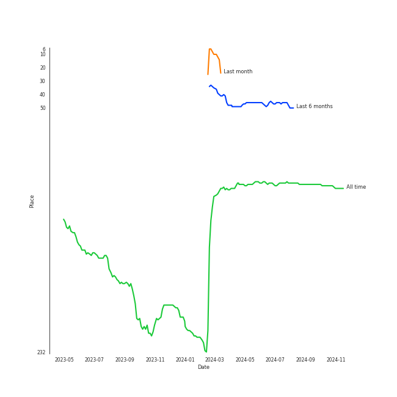
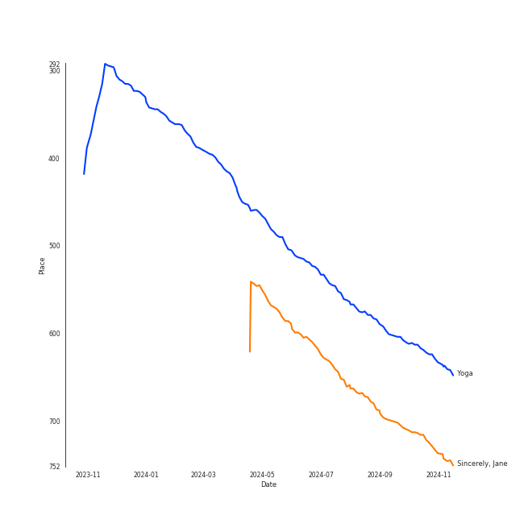
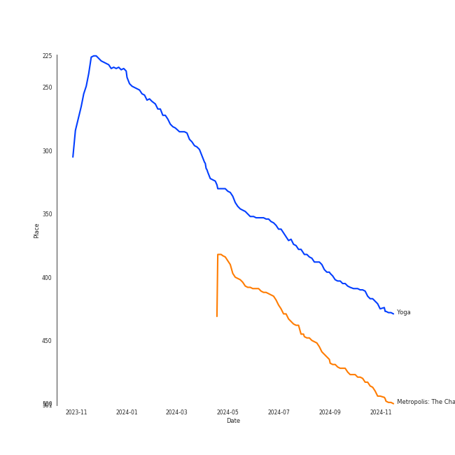

# Janelle Monáe

## Artist Rank
- The #108 artist of all time

## Top Tracks

### Top tracks of all time

## Top Albums

| Art | Rank | Tracks | 💚 | Album | Release Date | 🔗 |
|:---|---:|---:|---:|:---|:---|:---|
|  | 646 | 3 | 2 | The Electric Lady | 2013-09-06 | [🔗](https://open.spotify.com/album/3bnHtSmmsgJiG82hGCmsq9) |
|  | 646 | 3 | 2 | Dirty Computer | 2018-04-27 | [🔗](https://open.spotify.com/album/2PjlaxlMunGOUvcRzlTbtE) |
|  | 646 | 2 | 2 | The ArchAndroid | 2010-05-17 | [🔗](https://open.spotify.com/album/7MvSB0JTdtl1pSwZcgvYQX) |
|  | 412 | 1 | 1 | Yoga | 2015-03-31 | [🔗](https://open.spotify.com/album/5rzxGeVyCV74SvV5hjLRAU) |
|  | 479 | 1 | 1 | Metropolis: The Chase Suite (Special Edition) | 2008-08-12 | [🔗](https://open.spotify.com/album/3T3bJi3cvwR5U7ihwgEwF1) |

## Featured on Playlists
| Art | Tracks | Playlist |
|:---|---:|:---|
|  | 9 | [R&B](../../playlists/r_b/overview.md) |
|  | 5 | [Pop](../../playlists/pop/overview.md) |
|  | 5 | [Alt-Pop](../../playlists/alt-pop/overview.md) |
|  | 4 | [A-Pop Favorites](../../playlists/a-pop_favorites/overview.md) |
|  | 1 | [Classical Samples](../../playlists/classical_samples/overview.md) |
|  | 1 | [Karaoke](../../playlists/karaoke/overview.md) |
|  | 1 | [Chill](../../playlists/chill/overview.md) |

## Top Record Labels

| Tracks | 💚 | Label |
|---:|---:|:---|
| 9 | 7 | [Bad Boy](../../labels/bad_boy/overview.md) |
| 6 | 5 | Wondaland |
| 1 | 1 | [Epic](../../labels/epic/overview.md) |

## Genres

- afrofuturism
- alternative r&b
- atl hip hop
- [neo soul](../../genres/neo_soul/overview.md)
- [r&b](../../genres/r_b/overview.md)

## Credits

### Credits by Type

| Credit Type | Tracks |
|:---|---:|
| Producer | 1 |
| Songwriter | 2 |

### Production Credits

| Art | Track | Credit Types |
|:---|:---|:---|
|  | Sincerely, Jane | Producer |
|  | I Like That | Songwriter |
|  | Make Me Feel | Songwriter |

## Top Producers

| Art | Producer | Tracks | Credit Types |
|:---|:---|---:|:---|
|  | [Janelle Monáe](overview.md) | 3 | Songwriter, Producer |
| | Rico Wade | 1 | Songwriter |
| | Chuck Lightning | 1 | Producer |
| | Taylor Parks | 1 | Songwriter |
| | Nate "Rocket" Wonder | 1 | Producer |
| | Robin Fredriksson | 1 | Songwriter |
| | Justin Tranter | 1 | Songwriter |
| | Julia Michaels | 1 | Songwriter |
| | Nathaniel Irvin, III | 1 | Songwriter |
| | Ray Murray | 1 | Songwriter |

View all

| Art | Producer | Tracks | Credit Types |
|:---|:---|---:|:---|
| | Matt Friedman | 1 | Songwriter |
| | Patrick L. Brown | 1 | Songwriter |

## Tracks

| Art | Track | Album | Artists | Label | Rank | 💚 | 🔗 |
|:---|:---|:---|:---|:---|---:|:---|:---|
|  | Yoga | Yoga | [Janelle Monáe](overview.md), Jidenna | [Wondaland Records/Epic](../../labels/epic) | 615 | 💚 | [🔗](https://open.spotify.com/track/3IJCSQoLF4YzPAKaxq2JLb) |
|  | Sincerely, Jane | Metropolis: The Chase Suite (Special Edition) | [Janelle Monáe](overview.md) | [Bad Boy Records](../../labels/bad_boy) | 712 | 💚 | [🔗](https://open.spotify.com/track/06I6iDFVtZDGcRu9BgHraA) |
|  | Say You'll Go | The ArchAndroid | [Janelle Monáe](overview.md) | [Bad Boy/Wondaland](../../labels/bad_boy) | 978 | 💚 | [🔗](https://open.spotify.com/track/6wbEygoouLHwgy4J6uQIb1) |
|  | Tightrope (feat. Big Boi) - Big Boi Vocal Edit | The ArchAndroid | [Janelle Monáe](overview.md), Big Boi | [Bad Boy/Wondaland](../../labels/bad_boy) | 978 | 💚 | [🔗](https://open.spotify.com/track/1ljzHUgt2SU2ADkhfa9eBC) |
|  | Dance Apocalyptic | The Electric Lady | [Janelle Monáe](overview.md) | [Bad Boy/Wondaland](../../labels/bad_boy) | 978 | 💚 | [🔗](https://open.spotify.com/track/3dUMuxNadGxCE3qXuhCwqa) |
|  | Electric Lady (feat. Solange) | The Electric Lady | [Janelle Monáe](overview.md), Roman GianArthur, Solange | [Bad Boy/Wondaland](../../labels/bad_boy) | 978 | 💚 | [🔗](https://open.spotify.com/track/69vzkewKl2LPquyEiqD8BB) |
|  | Q.U.E.E.N. (feat. Erykah Badu) | The Electric Lady | [Janelle Monáe](overview.md), Erykah Badu | [Bad Boy/Wondaland](../../labels/bad_boy) | 978 | | [🔗](https://open.spotify.com/track/3HW030T8eqPs8wpsgZqCGM) |
|  | I Like That | Dirty Computer | [Janelle Monáe](overview.md) | [Bad Boy Records](../../labels/bad_boy) | 978 | 💚 | [🔗](https://open.spotify.com/track/2EznBGrlmx9wBeYgyDojsA) |
|  | Make Me Feel | Dirty Computer | [Janelle Monáe](overview.md) | [Bad Boy Records](../../labels/bad_boy) | 978 | 💚 | [🔗](https://open.spotify.com/track/5gW5dSy3vXJxgzma4rQuzH) |
|  | Pynk (feat. Grimes) | Dirty Computer | [Janelle Monáe](overview.md), Grimes | [Bad Boy Records](../../labels/bad_boy) | 978 | | [🔗](https://open.spotify.com/track/5OpiyfqaQLdtwHd3SfembH) |
