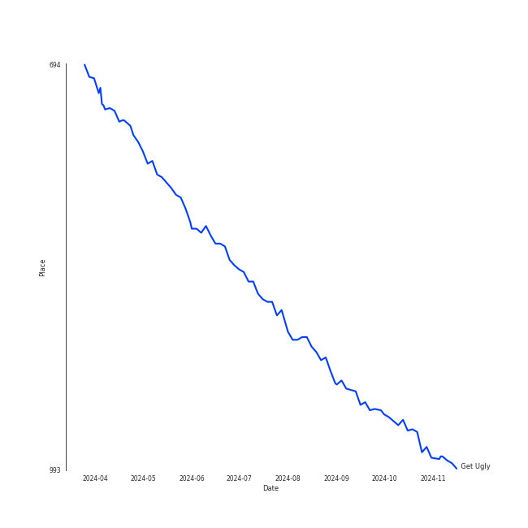
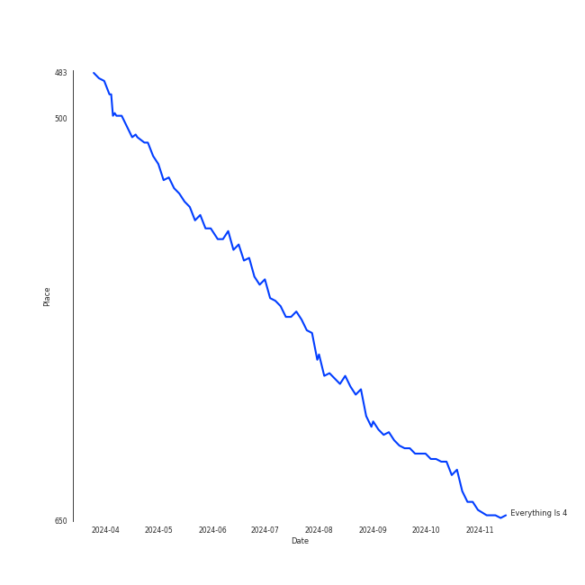

# Jason Derulo

## Artist Rank
- The #281 artist of all time

## Top Tracks

### Top tracks of all time

## Top Albums

| Art | Rank | Tracks | 💚 | Album | Release Date | 🔗 |
|:---|---:|---:|---:|:---|:---|:---|
|  | 631 | 2 | 2 | Talk Dirty | 2013-09-10 | [🔗](https://open.spotify.com/album/4PeZu0It7qVrTG40t3HM9A) |
|  | 631 | 1 | 1 | Tattoos (Deluxe Edition) | 2013-09-10 | [🔗](https://open.spotify.com/album/3wDeTllVvayYsWTHsFNWZQ) |
|  | 631 | 1 | 1 | Pentatonix (Deluxe Version) | 2015-10-16 | [🔗](https://open.spotify.com/album/6qf9tE8pNRW0kX1Cucrixr) |
|  | 613 | 1 | 1 | Everything Is 4 | 2015-05-29 | [🔗](https://open.spotify.com/album/59eUYETmE1zi31ESb3SUkI) |
|  | 631 | 1 | 1 | Coño | 2020-07-03 | [🔗](https://open.spotify.com/album/1h3x5tLWXhf438Y5AK60Ml) |
|  | 631 | 1 | 0 | Swalla (feat. Nicki Minaj & Ty Dolla $ign) | 2017-02-23 | [🔗](https://open.spotify.com/album/2e5CxfyEwBW115beiwh7Mc) |

## Featured on Playlists
| Art | Tracks | Playlist |
|:---|---:|:---|
|  | 6 | [R&B](../../playlists/r_b/overview.md) |
|  | 6 | [Pop](../../playlists/pop/overview.md) |
|  | 3 | [Workout](../../playlists/workout/overview.md) |
|  | 2 | [Summer](../../playlists/summer/overview.md) |
|  | 1 | [A Cappella](../../playlists/a_cappella/overview.md) |
|  | 1 | [A-Pop Favorites](../../playlists/a-pop_favorites/overview.md) |

## Top Record Labels

| Tracks | 💚 | Label |
|---:|---:|:---|
| 5 | 4 | [Warner Records](../../labels/warner_records/overview.md) |
| 5 | 4 | Beluga Heights |
| 1 | 1 | Spinnin' Records |
| 1 | 1 | [RCA Records Label](../../labels/rca_records_label/overview.md) |

## Genres

- [dance pop](../../genres/dance_pop/overview.md)
- [pop](../../genres/pop/overview.md)

## Credits

### Credits by Type

| Credit Type | Tracks |
|:---|---:|
| Publishing | 2 |
| Songwriter | 3 |

### Production Credits

| Art | Track | Credit Types |
|:---|:---|:---|
|  | Trumpets | Songwriter |
|  | Talk Dirty (feat. 2 Chainz) | Songwriter |
|  | Get Ugly | Songwriter |

## Top Producers

| Art | Producer | Tracks | Credit Types |
|:---|:---|---:|:---|
|  | [Jason Derulo](overview.md) | 3 | Songwriter |
| | Sean Douglas | 2 | Songwriter |
| | Jason Evigan | 2 | Songwriter |
| | [Ricky Reed](../../producers/ricky_reed/overview.md) | 2 | Producer, Songwriter |
| | Ori Kaplan | 1 | Songwriter |
| | Vince Watson | 1 | Producer |
|  | 2 Chainz | 1 | Songwriter |
|  | Timbaland | 1 | Producer |
| | Josh Collins | 1 | Producer |
| | Juan Pablo Negrete Ortiz | 1 | Producer |

View all

| Art | Producer | Tracks | Credit Types |
|:---|:---|---:|:---|
|  | [Pentatonix](../pentatonix/overview.md) | 1 | Arranger |
| | Tamir Muskat | 1 | Songwriter |
| | Jon Bellion | 1 | Producer, Songwriter |
| | Carl Martin | 1 | Songwriter |
| | תומר יוסף (Yosef, Tomer) | 1 | Songwriter |
| | Roberto "Tito" Vasquez | 1 | Producer |
| | Ben Bram | 1 | Arranger |

## Tracks

| Art | Track | Album | Artists | Label | Rank | 💚 | 🔗 |
|:---|:---|:---|:---|:---|---:|:---|:---|
|  | Get Ugly | Everything Is 4 | [Jason Derulo](overview.md) | [Beluga Heights/Warner Records](../../labels/warner_records) | 930 | 💚 | [🔗](https://open.spotify.com/track/1dl3vuXJS9anUXE7XnNP75) |
|  | Talk Dirty (feat. 2 Chainz) | Talk Dirty | [Jason Derulo](overview.md), 2 Chainz | [Beluga Heights/Warner Records](../../labels/warner_records) | 954 | 💚 | [🔗](https://open.spotify.com/track/6g6A7qNhTfUgOSH7ROOxTD) |
|  | Trumpets | Talk Dirty | [Jason Derulo](overview.md) | [Beluga Heights/Warner Records](../../labels/warner_records) | 954 | 💚 | [🔗](https://open.spotify.com/track/5KONnBIQ9LqCxyeSPin26k) |
|  | Bubblegum (feat. Tyga) | Tattoos (Deluxe Edition) | [Jason Derulo](overview.md), Tyga | [Beluga Heights/Warner Records](../../labels/warner_records) | 954 | 💚 | [🔗](https://open.spotify.com/track/1EujTZPE2yBYbbwu2vWXvr) |
|  | If I Ever Fall In Love (feat. Jason Derulo) | Pentatonix (Deluxe Version) | [Pentatonix](../pentatonix/overview.md), [Jason Derulo](overview.md) | [RCA Records Label](../../labels/rca_records_label) | 954 | 💚 | [🔗](https://open.spotify.com/track/3vaWsG3oKZt0bSra2p5c5R) |
|  | Swalla (feat. Nicki Minaj & Ty Dolla $ign) | Swalla (feat. Nicki Minaj & Ty Dolla $ign) | [Jason Derulo](overview.md), Nicki Minaj, Ty Dolla $ign | [Beluga Heights/Warner Records](../../labels/warner_records) | 954 | | [🔗](https://open.spotify.com/track/6kex4EBAj0WHXDKZMEJaaF) |
|  | Coño | Coño | [Jason Derulo](overview.md), Puri, Jhorrmountain | Spinnin' Records | 954 | 💚 | [🔗](https://open.spotify.com/track/5DV4ZSCqbFv74ui3ZhimXo) |
