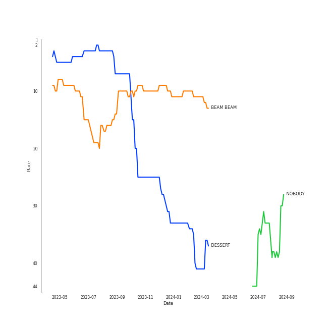

# JEON SOYEON

## Relationships

JEON SOYEON:
- is a member of [(G)I-DLE](../(g)i-dle/overview.md)

## Artist Rank
JEON SOYEON is currently:
- The #23 artist of the last month
- The #48 artist of the last 6 months
- The #31 artist of all time

## Top Tracks

- BEAM BEAM is:
    - the #12 track of all time
- DESSERT is:
    - the #41 track of all time
- NOBODY is:
    - the #14 track of the last 6 months

### Top tracks of all time over time

### Top tracks of the last 6 months over time

## Featured on Playlists
| Art | Tracks | Playlist |
|:---|---:|:---|
|  | 10 | [K-Pop](../../playlists/k-pop/overview.md) |
|  | 3 | [K-Pop Favorites](../../playlists/k-pop_favorites/overview.md) |
|  | 2 | [Summer](../../playlists/summer/overview.md) |
|  | 2 | [Workout](../../playlists/workout/overview.md) |
|  | 1 | [Recent Comebacks](../../playlists/recent_comebacks/overview.md) |
|  | 1 | [K-Memes](../../playlists/k-memes/overview.md) |
|  | 1 | [Halloween](../../playlists/halloween/overview.md) |

## Top Albums

| Art | Tracks | 💚 | Album | Release Date | 🔗 |
|:---|---:|---:|:---|:---|:---|
|  | 5 | 5 | Windy | 2021-07-05 | [🔗](https://open.spotify.com/album/1lv92CIVZbB2BsHmIx7qJf) |
|  | 1 | 1 | Wow Thing | 2018-09-28 | [🔗](https://open.spotify.com/album/3xEPyp7h78uULpDPuKvokH) |
|  | 1 | 1 | NOBODY | 2023-11-16 | [🔗](https://open.spotify.com/album/1Y48ZHmfvedT16bNakv13v) |
|  | 1 | 1 | Jelly | 2017-11-05 | [🔗](https://open.spotify.com/album/7iTA4T8A4tDU77Dt6y3f9m) |
|  | 1 | 1 | DESSERT | 2020-07-22 | [🔗](https://open.spotify.com/album/5brSFD1knAOSM7j6083naD) |
|  | 1 | 0 | Idle song | 2018-02-28 | [🔗](https://open.spotify.com/album/6RasD9dt49odO6D3VkhD1z) |

## Top Record Labels

| Tracks | 💚 | Label |
|---:|---:|:---|
| 5 | 5 | [Universal Music LLC](../../labels/universal_music_llc/overview.md) |
| 2 | 2 | [SM Entertainment](../../labels/sm_entertainment/overview.md) |
| 2 | 1 | [CUBE ENTERTAINMENT](../../labels/cube_entertainment/overview.md) |
| 1 | 1 | Studio Beyond |

## Genres

- [k-pop](../../genres/k-pop/overview.md)

## Credits

### Credits by Type

| Credit Type | Tracks |
|:---|---:|
| Arranger | 10 |
| Lyricist | 15 |
| Songwriter | 12 |
| Vocal | 15 |

### Production Credits

| Art | Track | Credit Types |
|:---|:---|:---|
|  | LATATA | Arranger, Lyricist, Songwriter |
|  | HANN (Alone) | Lyricist, Songwriter |
|  | Senorita | Arranger, Lyricist, Songwriter |
|  | Put It Straight | Arranger, Lyricist, Songwriter |
|  | Uh-Oh | Lyricist, Songwriter |
|  | HANN (Alone in winter) | Arranger, Lyricist, Songwriter |
|  | HWAA | Arranger, Lyricist, Songwriter |
|  | TOMBOY | Arranger, Lyricist, Songwriter |
|  | DARK (X-file) | Lyricist |
|  | Nxde | Arranger, Lyricist, Songwriter |

View all

| Art | Track | Credit Types |
|:---|:---|:---|
|  | Change | Lyricist |
|  | Sculpture | Lyricist |
|  | Wife | Arranger, Lyricist, Songwriter |
|  | Revenge | Arranger, Lyricist, Songwriter |
|  | Super Lady | Arranger, Lyricist, Songwriter |

## Top Producers

| Art | Producer | Tracks | Credit Types |
|:---|:---|---:|:---|
| | Maria Marcus | 1 | Songwriter |
| | 최우석 (Choi, Wooseok) | 1 | Producer |
| | 권유진 (Kwon, Eu-gene) | 1 | Producer |
| | 박근태 (Park, Keun-Tae) | 1 | Songwriter |
| | VENDORS | 1 | Arranger, Songwriter |
| | 서지음 (Seo, Ji Eum) | 1 | Lyricist |
| | Jang Yi-jeong | 1 | Arranger, Songwriter |
| | 정의석 (Jung, Euisuk) | 1 | Producer |
| | 신재빈 (Shin, Jae Bin) | 1 | Producer |
| | 우민정 (Umin, Je-ong) | 1 | Producer |

## Tracks

| Art | Track | Album | Artists | Label | Score | 💚 | 🔗 |
|:---|:---|:---|:---|:---|---:|:---|:---|
|  | BEAM BEAM | Windy | [JEON SOYEON](overview.md) | [Universal Music LLC](../../labels/universal_music_llc) | 51688 | 💚 | [🔗](https://open.spotify.com/track/1VjIS4qoyD6JS2rNZQgE00) |
|  | DESSERT | DESSERT | HYO, Loopy, [JEON SOYEON](overview.md) | [SM Entertainment](../../labels/sm_entertainment) | 44496 | 💚 | [🔗](https://open.spotify.com/track/6u0pZe0Uv7GBR0iKptfWRf) |
|  | NOBODY | NOBODY | [JEON SOYEON](overview.md), WINTER, LIZ (IVE) | Studio Beyond | 3374 | 💚 | [🔗](https://open.spotify.com/track/4loUHO28CuvSbEiZXId1BD) |
|  | Psycho | Windy | [JEON SOYEON](overview.md) | [Universal Music LLC](../../labels/universal_music_llc) | 111 | 💚 | [🔗](https://open.spotify.com/track/57LioO1gSll1wvPDAjiET3) |
|  | Weather | Windy | [JEON SOYEON](overview.md) | [Universal Music LLC](../../labels/universal_music_llc) | 58 | 💚 | [🔗](https://open.spotify.com/track/15ngHJXClzsYatjQxFVNUO) |
|  | Wow Thing | Wow Thing | [SEULGI](../seulgi/overview.md), [CHUNG HA](../chung_ha/overview.md), SinB, [JEON SOYEON](overview.md) | [SM Entertainment](../../labels/sm_entertainment) | 1 | 💚 | [🔗](https://open.spotify.com/track/5MwfxCtqMFGYp9Nc1BkTrS) |
|  | Jelly | Jelly | [JEON SOYEON](overview.md) | [CUBE ENTERTAINMENT](../../labels/cube_entertainment) | 0 | 💚 | [🔗](https://open.spotify.com/track/0MsE73sXgfqOpgzCATa0Wt) |
|  | Idle song | Idle song | [JEON SOYEON](overview.md) | [CUBE ENTERTAINMENT](../../labels/cube_entertainment) | 0 | | [🔗](https://open.spotify.com/track/1P7zwuGNeGWehpKVavukRe) |
|  | Is this bad b****** number? | Windy | [JEON SOYEON](overview.md), [BIBI](../bibi/overview.md), Lee Young Ji | [Universal Music LLC](../../labels/universal_music_llc) | 0 | 💚 | [🔗](https://open.spotify.com/track/5xTy9p0IXI8lRaU6iLGikC) |
|  | Quit | Windy | [JEON SOYEON](overview.md) | [Universal Music LLC](../../labels/universal_music_llc) | 0 | 💚 | [🔗](https://open.spotify.com/track/54y2W3EYYsSnyqL1rinbJb) |
