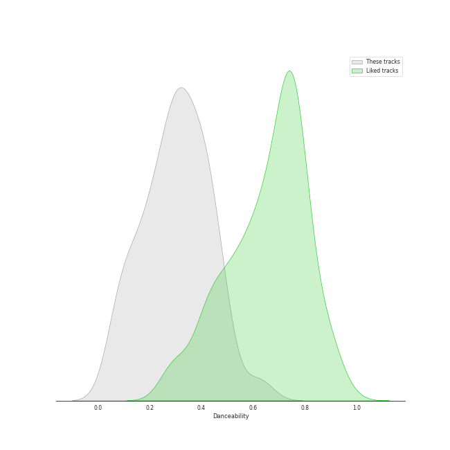
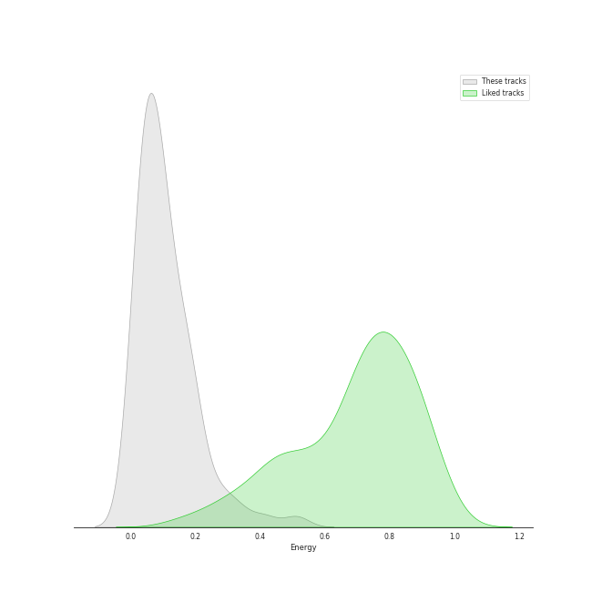
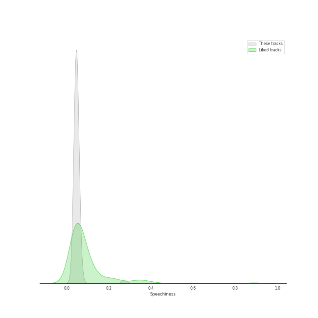
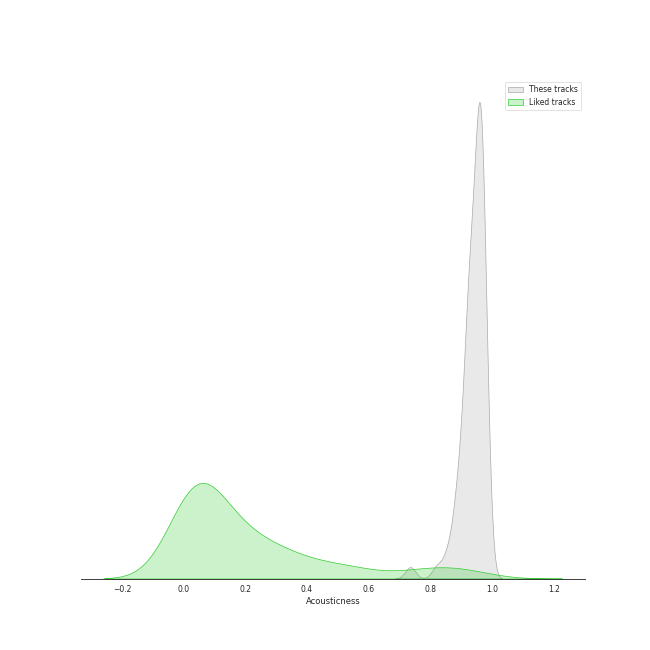
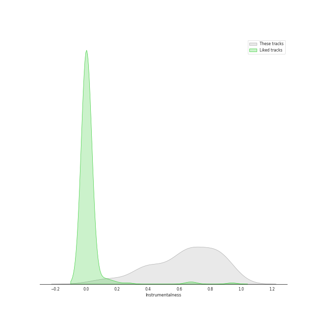
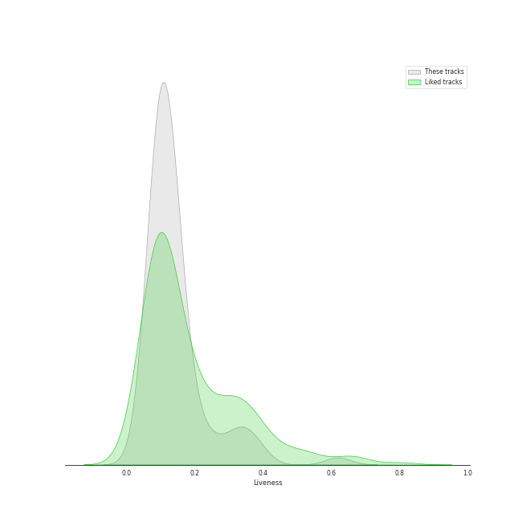
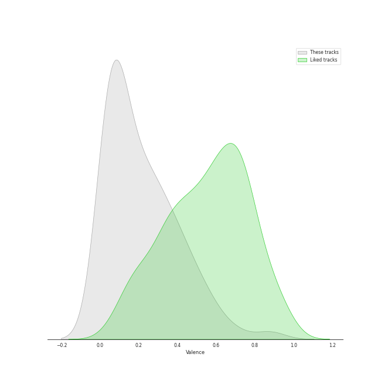
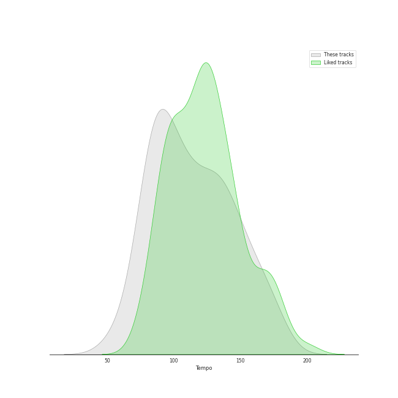

# Track Features for Jerusalem Quartet

## Danceability

| ​ | 10 most Danceable tracks | ​​ | 10 least Danceable tracks |
|:---|:---|:---|:---|
|  | String Quartet No.11 in F Minor, Op. 122: V. Humoresque (Allegro) (0.63) |  | String Quartet No. 8 in C Minor, Op. 110: V. Largo (0.0592) |
|  | String Quartet No. 4 in C Major, K. 157: III. Presto (0.614) |  | String Quartet in G Minor, Op. 10: III. Andantino, doucement expressif (0.0623) |
|  | String Quartet No. 2 in G Major, Op. 18, No. 2: III. Scherzo (Allegro) - Trio (0.493) |  | String Quartet No. 8 in C Minor, Op. 110: I. Largo (0.0744) |
|  | String Quartet No. 8 in C Minor, Op. 110: III. Allegretto (0.489) |  | String Quartet No.11 in F Minor, Op. 122: I. Introduction (Andantino) (0.0833) |
|  | String Quartet No.11 in F Minor, Op. 122: II. Scherzo (Allegretto) (0.482) |  | String Quartet No. 4 in D Major, Op. 83: II. Andantino (0.089) |
|  | String Quartet No. 4 in C Minor, Op. 18 No. 4: II. Andante scherzoso quasi allegretto (0.48) |  | String Quartet No.11 in F Minor, Op. 122: VI. Elégie (Adagio) (0.0891) |
|  | String Quartet No. 6 in B-Flat Major, Op. 18 No. 6: I. Allegro con brio (0.477) |  | String Quartet No. 8 in C Minor, Op. 110: IV. Largo (0.109) |
|  | String Quartet No. 1 in C Major, Op. 49: IV. Allegro (0.46) |  | Quatuor en Fa Majeur, M. 35: III. Très lent (0.112) |
|  | String Quartet No. 6 in B-Flat Major, Op. 18 No. 6: III. Scherzo (Allegro) - Trio (0.454) |  | String Quartet No. 9 in E-Flat Major, Op. 117: II. Adagio (0.115) |
|  | String Quartet No. 22 in B-Flat Major, K. 589, "Prussian": III. Menuetto - Moderato (0.441) |  | String Quintet No. 3, Op. 97: III. Larghetto (0.122) |

## Energy

| ​ | 10 most Energetic tracks | ​​ | 10 least Energetic tracks |
|:---|:---|:---|:---|
|  | String Quartet No. 8 in C Minor, Op. 110: II. Allegro molto (0.511) |  | String Quartet No. 9 in E-Flat Major, Op. 117: IV. Adagio (0.00449) |
|  | String Quartet No.11 in F Minor, Op. 122: V. Humoresque (Allegro) (0.413) |  | String Quartet No. 8 in C Minor, Op. 110: I. Largo (0.0053) |
|  | String Quartet No. 9 in E-Flat Major, Op. 117: V. Allegro (0.34) |  | String Quartet No.11 in F Minor, Op. 122: VII. Finale (Moderato) (0.00842) |
|  | String Quartet No. 1 in C Major, Op. 49: IV. Allegro (0.309) |  | String Quartet No. 8 in C Minor, Op. 110: IV. Largo (0.0103) |
|  | String Quartet No. 4 in C Major, K. 157: III. Presto (0.273) |  | String Quartet No. 6 in G Major, Op. 101: III. Lento (0.0113) |
|  | String Quartet No. 9 in E-Flat Major, Op. 117: III. Allegretto (0.265) |  | String Quartet No. 8 in C Minor, Op. 110: V. Largo (0.013) |
|  | String Quartet in G Minor, Op. 10: IV. Très modéré (0.224) |  | String Quartet No.11 in F Minor, Op. 122: I. Introduction (Andantino) (0.0182) |
|  | String Quartet No.11 in F Minor, Op. 122: IV. Etude (Allegro) (0.219) |  | String Quartet No.11 in F Minor, Op. 122: III. Récitatif (Adagio) (0.0206) |
|  | String Sextet, Op. 48: III. Furiant. Presto - Trio (0.204) |  | String Quartet in G Minor, Op. 10: III. Andantino, doucement expressif (0.0237) |
|  | String Quartet No. 2 in G Major, Op. 18, No. 2: IV. Allegro molto, quasi presto (0.194) |  | String Quartet No. 6 in B-Flat Major, Op. 18 No. 6: II. Adagio ma non troppo (0.024) |

## Speechiness

| ​ | 10 most Speechy tracks | ​​ | 10 least Speechy tracks |
|:---|:---|:---|:---|
|  | String Quartet No.11 in F Minor, Op. 122: V. Humoresque (Allegro) (0.274) |  | String Quartet No. 8 in C Minor, Op. 110: II. Allegro molto (0.035) |
|  | String Quartet No. 6 in B-Flat Major, Op. 18 No. 6: III. Scherzo (Allegro) - Trio (0.0689) |  | String Quartet No. 9 in E-Flat Major, Op. 117: I. Moderato Con Moto (0.0354) |
|  | String Quartet No.11 in F Minor, Op. 122: II. Scherzo (Allegretto) (0.0639) |  | String Quartet No. 4 in C Major, K. 157: I. Allegro (0.037) |
|  | String Quartet No. 8 in C Minor, Op. 110: V. Largo (0.0615) |  | String Quartet No. 1 in C Major, Op. 49: IV. Allegro (0.0378) |
|  | Quatuor en Fa Majeur, M. 35: I. Allegro moderato (0.0584) |  | String Sextet, Op. 48: III. Furiant. Presto - Trio (0.0381) |
|  | String Quartet No. 2 in G Major, Op. 18, No. 2: IV. Allegro molto, quasi presto (0.0555) |  | String Quartet No.11 in F Minor, Op. 122: VII. Finale (Moderato) (0.0381) |
|  | String Quartet No. 5 in A Major, Op. 18 No. 5: II. Menuetto - Trio (0.0549) |  | String Quartet No. 4 in C Minor, Op. 18 No. 4: IV. Allegretto – Prestissimo (0.0384) |
|  | String Quartet in G Minor, Op. 10: III. Andantino, doucement expressif (0.0534) |  | String Quartet No. 17 in B-Flat Major, K. 458 "The Hunt": I. Allegro vivace assai (0.0386) |
|  | String Quartet No. 6 in B-Flat Major, Op. 18 No. 6: IV. Adagio "La Malinconia" - Allegretto quasi allegro (0.0534) |  | String Quartet No. 4 in D Major, Op. 83: III. Allegretto (0.0389) |
|  | String Quartet No. 1 in C Major, Op. 49: II. Moderato (0.0534) |  | String Quartet No. 1 in C Major, Op. 49: I. Moderato (0.0389) |

## Acousticness

| ​ | 10 most Acoustic tracks | ​​ | 10 least Acoustic tracks |
|:---|:---|:---|:---|
|  | String Quartet No.11 in F Minor, Op. 122: III. Récitatif (Adagio) (0.983) |  | String Sextet, Op. 48: II. Dumka (Elegie). Poco allegretto (0.735) |
|  | String Quartet No.11 in F Minor, Op. 122: VI. Elégie (Adagio) (0.982) |  | String Sextet, Op. 48: IV. Finale. Tema con variazioni - Allegretto grazioso, quasi andantino (0.821) |
|  | String Quartet No. 22 in B-Flat Major, K. 589, "Prussian": I. Allegro (0.977) |  | String Sextet, Op. 48: III. Furiant. Presto - Trio (0.852) |
|  | String Quartet No. 22 in B-Flat Major, K. 589, "Prussian": III. Menuetto - Moderato (0.977) |  | String Quartet No.11 in F Minor, Op. 122: V. Humoresque (Allegro) (0.861) |
|  | String Quartet No. 22 in B-Flat Major, K. 589, "Prussian": II. Larghetto (0.976) |  | String Quartet No. 2 in G Major, Op. 18, No. 2: IV. Allegro molto, quasi presto (0.879) |
|  | String Quartet No. 6 in G Major, Op. 101: I. Allegretto (0.976) |  | String Quartet No. 1 in F Major, Op. 18 No. 1: IV. Allegro (0.887) |
|  | String Quartet No.11 in F Minor, Op. 122: II. Scherzo (Allegretto) (0.974) |  | String Quartet No. 3 in D Major, Op. 18: III. Allegro (0.888) |
|  | String Quartet No. 8 in C Minor, Op. 110: I. Largo (0.974) |  | String Quartet No. 3 in D Major, Op. 18: I. Allegro (0.888) |
|  | String Quartet in G Minor, Op. 10: I. Animé et très décidé (0.973) |  | String Quartet No. 4 in C Minor, Op. 18 No. 4: IV. Allegretto – Prestissimo (0.89) |
|  | String Quartet No. 9 in E-Flat Major, Op. 117: I. Moderato Con Moto (0.972) |  | String Sextet, Op. 48: I. Allegro moderato (0.894) |

## Instrumentalness

| ​ | 10 most Instrumental tracks | ​​ | 10 least Instrumental tracks |
|:---|:---|:---|:---|
|  | String Quartet No.11 in F Minor, Op. 122: III. Récitatif (Adagio) (0.953) |  | String Quartet No.11 in F Minor, Op. 122: VII. Finale (Moderato) (0.0443) |
|  | String Quartet No. 8 in C Minor, Op. 110: II. Allegro molto (0.936) |  | String Quartet No.11 in F Minor, Op. 122: I. Introduction (Andantino) (0.104) |
|  | String Quartet in G Minor, Op. 10: I. Animé et très décidé (0.932) |  | String Quartet No. 6 in B-Flat Major, Op. 18 No. 6: II. Adagio ma non troppo (0.147) |
|  | String Sextet, Op. 48: II. Dumka (Elegie). Poco allegretto (0.924) |  | String Quartet No. 1 in C Major, Op. 49: III. Allegro molto (0.181) |
|  | String Quartet No. 9 in E-Flat Major, Op. 117: I. Moderato Con Moto (0.897) |  | String Quartet No. 4 in C Minor, Op. 18 No. 4: II. Andante scherzoso quasi allegretto (0.184) |
|  | String Quartet in G Minor, Op. 10: II. Assez vif et bien rythmé (0.893) |  | Quatuor en Fa Majeur, M. 35: II. Assez vif, très rythmé (0.326) |
|  | String Quartet No.11 in F Minor, Op. 122: V. Humoresque (Allegro) (0.875) |  | String Quartet No. 5 in A Major, Op. 18 No. 5: III. Andante cantabile (0.329) |
|  | String Quartet No. 4 in D Major, Op. 83: I. Allegretto (0.873) |  | String Quartet No. 9 in E-Flat Major, Op. 117: IV. Adagio (0.357) |
|  | String Quintet No. 3, Op. 97: IV. Finale. Allegro giusto (0.868) |  | String Quartet No. 6 in G Major, Op. 101: I. Allegretto (0.364) |
|  | String Quintet No. 3, Op. 97: I. Allegro non tanto (0.867) |  | String Quartet No. 4 in C Minor, Op. 18 No. 4: IV. Allegretto – Prestissimo (0.368) |

## Liveness

| ​ | 10 most Live tracks | ​​ | 10 least Live tracks |
|:---|:---|:---|:---|
|  | String Quartet No. 2 in G Major, Op. 18, No. 2: III. Scherzo (Allegro) - Trio (0.62) |  | String Quartet No. 3 in D Major, Op. 18: I. Allegro (0.045) |
|  | String Quartet No. 3 in D Major, Op. 18: III. Allegro (0.386) |  | String Quartet No. 8 in C Minor, Op. 110: III. Allegretto (0.0651) |
|  | String Quartet No.11 in F Minor, Op. 122: IV. Etude (Allegro) (0.379) |  | String Quartet No. 17 in B-Flat Major, K. 458 "The Hunt": I. Allegro vivace assai (0.0676) |
|  | String Quartet No. 17 in B-Flat Major, K. 458 "The Hunt": II. Menuetto (Moderato) (0.352) |  | String Quartet No. 9 in E-Flat Major, Op. 117: II. Adagio (0.0703) |
|  | String Quartet No. 1 in F Major, Op. 18 No. 1: IV. Allegro (0.329) |  | String Quartet No. 2 in G Major, Op. 18, No. 2: IV. Allegro molto, quasi presto (0.0724) |
|  | String Quartet No. 5 in A Major, Op. 18 No. 5: IV. Allegro (0.328) |  | String Quartet No. 4 in C Minor, Op. 18 No. 4: I. Allegro ma non tanto (0.075) |
|  | String Sextet, Op. 48: III. Furiant. Presto - Trio (0.327) |  | String Quartet No. 6 in B-Flat Major, Op. 18 No. 6: IV. Adagio "La Malinconia" - Allegretto quasi allegro (0.0775) |
|  | String Quartet No. 9 in E-Flat Major, Op. 117: V. Allegro (0.283) |  | String Quartet No. 1 in C Major, Op. 49: II. Moderato (0.079) |
|  | String Quartet No. 3 in D Major, Op. 18: IV. Presto (0.259) |  | String Quintet No. 3, Op. 97: IV. Finale. Allegro giusto (0.0821) |
|  | String Quartet No. 4 in D Major, Op. 83: I. Allegretto (0.238) |  | String Quartet No. 1 in C Major, Op. 49: I. Moderato (0.0829) |

## Valence

| ​ | 10 most Happy tracks | ​​ | 10 least Happy tracks |
|:---|:---|:---|:---|
|  | String Quartet No. 4 in C Major, K. 157: III. Presto (0.878) |  | String Quartet No. 9 in E-Flat Major, Op. 117: II. Adagio (0.0251) |
|  | String Quartet No. 6 in B-Flat Major, Op. 18 No. 6: III. Scherzo (Allegro) - Trio (0.694) |  | String Quartet No.11 in F Minor, Op. 122: VI. Elégie (Adagio) (0.0307) |
|  | String Quartet No. 8 in C Minor, Op. 110: II. Allegro molto (0.599) |  | String Quartet in G Minor, Op. 10: III. Andantino, doucement expressif (0.0317) |
|  | String Quartet No. 4 in C Major, K. 157: I. Allegro (0.567) |  | String Quartet No. 4 in D Major, Op. 83: II. Andantino (0.0317) |
|  | String Quartet No. 2 in G Major, Op. 18, No. 2: III. Scherzo (Allegro) - Trio (0.558) |  | String Quartet No. 8 in C Minor, Op. 110: I. Largo (0.0342) |
|  | String Quartet No. 17 in B-Flat Major, K. 458 "The Hunt": IV. Allegro assai (0.515) |  | String Quartet No. 8 in C Minor, Op. 110: V. Largo (0.0343) |
|  | String Sextet, Op. 48: III. Furiant. Presto - Trio (0.502) |  | String Quartet No. 6 in G Major, Op. 101: III. Lento (0.0346) |
|  | String Quartet No. 4 in C Minor, Op. 18 No. 4: IV. Allegretto – Prestissimo (0.467) |  | String Quartet No. 8 in C Minor, Op. 110: IV. Largo (0.0346) |
|  | String Quartet No. 9 in E-Flat Major, Op. 117: III. Allegretto (0.461) |  | Quatuor en Fa Majeur, M. 35: III. Très lent (0.0349) |
|  | String Quartet No. 22 in B-Flat Major, K. 589, "Prussian": IV. Allegro assai (0.457) |  | String Quartet No. 9 in E-Flat Major, Op. 117: IV. Adagio (0.0366) |

## Tempo

| ​ | 10 most Fast tracks | ​​ | 10 least Fast tracks |
|:---|:---|:---|:---|
|  | String Quartet No. 6 in G Major, Op. 101: II. Moderato con moto (177.309) |  | String Quartet in G Minor, Op. 10: III. Andantino, doucement expressif (54.651) |
|  | String Quintet No. 3, Op. 97: IV. Finale. Allegro giusto (173.181) |  | String Quartet No. 8 in C Minor, Op. 110: V. Largo (61.517) |
|  | String Quartet No.11 in F Minor, Op. 122: I. Introduction (Andantino) (172.699) |  | String Quartet No. 1 in C Major, Op. 49: III. Allegro molto (69.005) |
|  | String Quartet No. 6 in B-Flat Major, Op. 18 No. 6: III. Scherzo (Allegro) - Trio (172.548) |  | String Sextet, Op. 48: I. Allegro moderato (75.345) |
|  | String Quartet No. 2 in G Major, Op. 18, No. 2: IV. Allegro molto, quasi presto (167.97) |  | String Quartet No. 3 in D Major, Op. 18: IV. Presto (77.377) |
|  | String Quartet No.11 in F Minor, Op. 122: IV. Etude (Allegro) (161.74) |  | String Quintet No. 3, Op. 97: III. Larghetto (78.164) |
|  | String Quartet No. 4 in D Major, Op. 83: III. Allegretto (158.184) |  | Quatuor en Fa Majeur, M. 35: II. Assez vif, très rythmé (80.036) |
|  | String Quartet No. 9 in E-Flat Major, Op. 117: III. Allegretto (156.457) |  | String Quartet No. 8 in C Minor, Op. 110: I. Largo (80.166) |
|  | String Quartet No. 22 in B-Flat Major, K. 589, "Prussian": IV. Allegro assai (156.406) |  | String Quartet No. 1 in F Major, Op. 18 No. 1: III. Scherzo (Allegro molto) - Trio (80.592) |
|  | String Quartet No.11 in F Minor, Op. 122: II. Scherzo (Allegretto) (154.568) |  | String Sextet, Op. 48: IV. Finale. Tema con variazioni - Allegretto grazioso, quasi andantino (80.972) |
