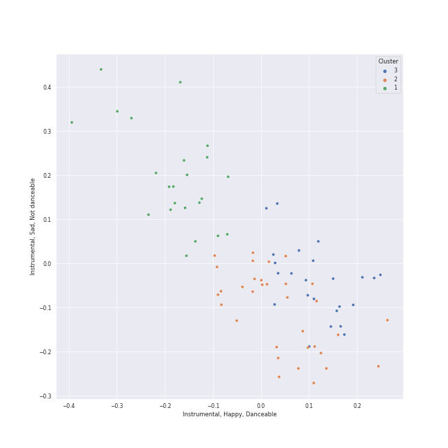

# Clusters in Jerusalem Quartet

## Cluster #1

23 tracks

| Art | Track | Album | Artists | Label | Rank | 💚 | 🔗 |
|:---|:---|:---|:---|:---|---:|:---|:---|
|  | String Quartet No. 6 in G Major, Op. 101: I. Allegretto | Shostakovich: String Quartets Nos. 1, 4, 6, 8, 9 & 11 | Dmitri Shostakovich, [Jerusalem Quartet](../../overview.md) | [harmonia mundi](../../../../labels/harmonia_mundi) | 966 | | [🔗](https://open.spotify.com/track/0k7Zd9zAYnBPuNJPck4UOc) |
|  | String Quartet No. 9 in E-Flat Major, Op. 117: IV. Adagio | Shostakovich: String Quartets Nos. 1, 4, 6, 8, 9 & 11 | Dmitri Shostakovich, [Jerusalem Quartet](../../overview.md) | [harmonia mundi](../../../../labels/harmonia_mundi) | 966 | | [🔗](https://open.spotify.com/track/0vpGcgNCl9p9UQdtCOajUG) |
|  | String Quartet No. 6 in G Major, Op. 101: II. Moderato con moto | Shostakovich: String Quartets Nos. 1, 4, 6, 8, 9 & 11 | Dmitri Shostakovich, [Jerusalem Quartet](../../overview.md) | [harmonia mundi](../../../../labels/harmonia_mundi) | 966 | | [🔗](https://open.spotify.com/track/5BqEbEtqCpIrKRJh5c3Z3u) |
|  | String Quartet No. 1 in C Major, Op. 49: III. Allegro molto | Shostakovich: String Quartets Nos. 1, 4, 6, 8, 9 & 11 | Dmitri Shostakovich, [Jerusalem Quartet](../../overview.md) | [harmonia mundi](../../../../labels/harmonia_mundi) | 966 | | [🔗](https://open.spotify.com/track/5O8Iz6Mlz4oS0DP6YYyBQC) |
|  | String Quartet No. 1 in C Major, Op. 49: I. Moderato | Shostakovich: String Quartets Nos. 1, 4, 6, 8, 9 & 11 | Dmitri Shostakovich, [Jerusalem Quartet](../../overview.md) | [harmonia mundi](../../../../labels/harmonia_mundi) | 966 | | [🔗](https://open.spotify.com/track/5VQz0yG8Lzvjj4RCbDLMrJ) |
|  | String Quartet No. 5 in A Major, Op. 18 No. 5: II. Menuetto - Trio | Beethoven: String Quartets, Op. 18 | [Ludwig van Beethoven](../../../ludwig_van_beethoven/overview.md), [Jerusalem Quartet](../../overview.md) | [harmonia mundi](../../../../labels/harmonia_mundi) | 966 | | [🔗](https://open.spotify.com/track/0AtBrNtW0crqbSyUtwNykS) |
|  | String Quartet No. 5 in A Major, Op. 18 No. 5: III. Andante cantabile | Beethoven: String Quartets, Op. 18 | [Ludwig van Beethoven](../../../ludwig_van_beethoven/overview.md), [Jerusalem Quartet](../../overview.md) | [harmonia mundi](../../../../labels/harmonia_mundi) | 966 | | [🔗](https://open.spotify.com/track/2jYxlMeQolbjDhOBY4QgYR) |
|  | String Quartet No. 1 in F Major, Op. 18 No. 1: II. Adagio affettuoso ed appassionato | Beethoven: String Quartets, Op. 18 | [Ludwig van Beethoven](../../../ludwig_van_beethoven/overview.md), [Jerusalem Quartet](../../overview.md) | [harmonia mundi](../../../../labels/harmonia_mundi) | 966 | | [🔗](https://open.spotify.com/track/74Din3wPGdlksjg6kz68Mw) |
|  | String Quartet No. 2 in G Major, Op. 18, No. 2: II. Adagio cantabile - Allegro | Beethoven: String Quartets, Op. 18 | [Ludwig van Beethoven](../../../ludwig_van_beethoven/overview.md), [Jerusalem Quartet](../../overview.md) | [harmonia mundi](../../../../labels/harmonia_mundi) | 966 | | [🔗](https://open.spotify.com/track/7v0g3biHWMpypyv0hfxroQ) |
|  | Quatuor en Fa Majeur, M. 35: II. Assez vif, très rythmé | Debussy & Ravel: String Quartets | Maurice Ravel, [Jerusalem Quartet](../../overview.md) | [harmonia mundi](../../../../labels/harmonia_mundi) | 966 | | [🔗](https://open.spotify.com/track/766aJRX19tPpWsqp4n59xJ) |
## Cluster #2

33 tracks

| Art | Track | Album | Artists | Label | Rank | 💚 | 🔗 |
|:---|:---|:---|:---|:---|---:|:---|:---|
|  | String Quartet No. 4 in C Major, K. 157: II. Andante | Mozart: String Quartets Nos. 4, 17 & 22 | [Wolfgang Amadeus Mozart](../../../wolfgang_amadeus_mozart/overview.md), [Jerusalem Quartet](../../overview.md) | [harmonia mundi](../../../../labels/harmonia_mundi) | 966 | | [🔗](https://open.spotify.com/track/4V6p7SY0ALq9I5iuOgkVNK) |
|  | String Quartet No. 17 in B-Flat Major, K. 458 "The Hunt": III. Adagio | Mozart: String Quartets Nos. 4, 17 & 22 | [Wolfgang Amadeus Mozart](../../../wolfgang_amadeus_mozart/overview.md), [Jerusalem Quartet](../../overview.md) | [harmonia mundi](../../../../labels/harmonia_mundi) | 966 | | [🔗](https://open.spotify.com/track/74TmNT7ctAj6O6wpDTkb6O) |
|  | String Quartet No. 22 in B-Flat Major, K. 589, "Prussian": II. Larghetto | Mozart: String Quartets Nos. 4, 17 & 22 | [Wolfgang Amadeus Mozart](../../../wolfgang_amadeus_mozart/overview.md), [Jerusalem Quartet](../../overview.md) | [harmonia mundi](../../../../labels/harmonia_mundi) | 966 | | [🔗](https://open.spotify.com/track/7eaYdLRx1XuHhTpKMYaBU9) |
|  | String Quartet No. 6 in G Major, Op. 101: IV. Finale (Lento) - Allegretto | Shostakovich: String Quartets Nos. 1, 4, 6, 8, 9 & 11 | Dmitri Shostakovich, [Jerusalem Quartet](../../overview.md) | [harmonia mundi](../../../../labels/harmonia_mundi) | 966 | | [🔗](https://open.spotify.com/track/3EcruCCCtRp7fi5K2YfAA5) |
|  | String Quartet No. 3 in D Major, Op. 18: II. Andante con moto | Beethoven: String Quartets, Op. 18 | [Ludwig van Beethoven](../../../ludwig_van_beethoven/overview.md), [Jerusalem Quartet](../../overview.md) | [harmonia mundi](../../../../labels/harmonia_mundi) | 966 | | [🔗](https://open.spotify.com/track/0o3Mcv1JOPsrnc3wBROq2S) |
|  | String Quartet No. 6 in B-Flat Major, Op. 18 No. 6: IV. Adagio "La Malinconia" - Allegretto quasi allegro | Beethoven: String Quartets, Op. 18 | [Ludwig van Beethoven](../../../ludwig_van_beethoven/overview.md), [Jerusalem Quartet](../../overview.md) | [harmonia mundi](../../../../labels/harmonia_mundi) | 966 | | [🔗](https://open.spotify.com/track/307vQS6VavTKNbzYSnYTt9) |
|  | String Sextet, Op. 48: IV. Finale. Tema con variazioni - Allegretto grazioso, quasi andantino | Dvorak: String Quintet, Op. 97 & String Sextet, Op. 48 | Antonín Dvořák, [Jerusalem Quartet](../../overview.md), Veronika Hagen | [harmonia mundi](../../../../labels/harmonia_mundi) | 966 | | [🔗](https://open.spotify.com/track/1BwgToZUccesFsTGQ8mBdS) |
|  | String Quintet No. 3, Op. 97: III. Larghetto | Dvorak: String Quintet, Op. 97 & String Sextet, Op. 48 | Antonín Dvořák, [Jerusalem Quartet](../../overview.md), Veronika Hagen | [harmonia mundi](../../../../labels/harmonia_mundi) | 966 | | [🔗](https://open.spotify.com/track/4ZdgET0UACAG4mHLd8lZYu) |
|  | String Sextet, Op. 48: I. Allegro moderato | Dvorak: String Quintet, Op. 97 & String Sextet, Op. 48 | Antonín Dvořák, [Jerusalem Quartet](../../overview.md), Veronika Hagen, Gary Hoffman | [harmonia mundi](../../../../labels/harmonia_mundi) | 966 | | [🔗](https://open.spotify.com/track/5Bn7rXQJDCOkR50kqlkkfv) |
|  | Quatuor en Fa Majeur, M. 35: IV. Vif et agité | Debussy & Ravel: String Quartets | Maurice Ravel, [Jerusalem Quartet](../../overview.md) | [harmonia mundi](../../../../labels/harmonia_mundi) | 966 | | [🔗](https://open.spotify.com/track/3A49NlRC42aszkRusgYDfq) |
## Cluster #3

24 tracks

| Art | Track | Album | Artists | Label | Rank | 💚 | 🔗 |
|:---|:---|:---|:---|:---|---:|:---|:---|
|  | String Quartet No. 22 in B-Flat Major, K. 589, "Prussian": III. Menuetto - Moderato | Mozart: String Quartets Nos. 4, 17 & 22 | [Wolfgang Amadeus Mozart](../../../wolfgang_amadeus_mozart/overview.md), [Jerusalem Quartet](../../overview.md) | [harmonia mundi](../../../../labels/harmonia_mundi) | 966 | | [🔗](https://open.spotify.com/track/1LAbFa0OPRS6IuapkOySby) |
|  | String Quartet No. 17 in B-Flat Major, K. 458 "The Hunt": IV. Allegro assai | Mozart: String Quartets Nos. 4, 17 & 22 | [Wolfgang Amadeus Mozart](../../../wolfgang_amadeus_mozart/overview.md), [Jerusalem Quartet](../../overview.md) | [harmonia mundi](../../../../labels/harmonia_mundi) | 966 | | [🔗](https://open.spotify.com/track/6AgF5rgvW3hRwe6A8KCcwl) |
|  | String Quartet No. 22 in B-Flat Major, K. 589, "Prussian": IV. Allegro assai | Mozart: String Quartets Nos. 4, 17 & 22 | [Wolfgang Amadeus Mozart](../../../wolfgang_amadeus_mozart/overview.md), [Jerusalem Quartet](../../overview.md) | [harmonia mundi](../../../../labels/harmonia_mundi) | 966 | | [🔗](https://open.spotify.com/track/6Y8SmRRP56DkQoDt8op0xN) |
|  | String Quartet No. 9 in E-Flat Major, Op. 117: III. Allegretto | Shostakovich: String Quartets Nos. 1, 4, 6, 8, 9 & 11 | Dmitri Shostakovich, [Jerusalem Quartet](../../overview.md) | [harmonia mundi](../../../../labels/harmonia_mundi) | 550 | | [🔗](https://open.spotify.com/track/57vPVZyYD3Cfxlpmqqdgl5) |
|  | String Quartet No.11 in F Minor, Op. 122: II. Scherzo (Allegretto) | Shostakovich: String Quartets Nos. 1, 4, 6, 8, 9 & 11 | Dmitri Shostakovich, [Jerusalem Quartet](../../overview.md) | [harmonia mundi](../../../../labels/harmonia_mundi) | 966 | | [🔗](https://open.spotify.com/track/5axBmM6eFCRlBCXlBIZGJM) |
|  | String Quartet No. 1 in F Major, Op. 18 No. 1: III. Scherzo (Allegro molto) - Trio | Beethoven: String Quartets, Op. 18 | [Ludwig van Beethoven](../../../ludwig_van_beethoven/overview.md), [Jerusalem Quartet](../../overview.md) | [harmonia mundi](../../../../labels/harmonia_mundi) | 966 | | [🔗](https://open.spotify.com/track/62gkGN2sOcxtVmoDGCeajT) |
|  | String Quartet No. 3 in D Major, Op. 18: IV. Presto | Beethoven: String Quartets, Op. 18 | [Ludwig van Beethoven](../../../ludwig_van_beethoven/overview.md), [Jerusalem Quartet](../../overview.md) | [harmonia mundi](../../../../labels/harmonia_mundi) | 966 | | [🔗](https://open.spotify.com/track/6c3exNicyaeLcebTT2VaMQ) |
|  | String Quartet No. 6 in B-Flat Major, Op. 18 No. 6: I. Allegro con brio | Beethoven: String Quartets, Op. 18 | [Ludwig van Beethoven](../../../ludwig_van_beethoven/overview.md), [Jerusalem Quartet](../../overview.md) | [harmonia mundi](../../../../labels/harmonia_mundi) | 966 | | [🔗](https://open.spotify.com/track/7FZJQ7bjH1grTUYdfxfD73) |
|  | String Quartet No. 4 in C Minor, Op. 18 No. 4: I. Allegro ma non tanto | Beethoven: String Quartets, Op. 18 | [Ludwig van Beethoven](../../../ludwig_van_beethoven/overview.md), [Jerusalem Quartet](../../overview.md) | [harmonia mundi](../../../../labels/harmonia_mundi) | 966 | | [🔗](https://open.spotify.com/track/7yoDNO5NZYx8VwDWkYDLBr) |
|  | String Sextet, Op. 48: III. Furiant. Presto - Trio | Dvorak: String Quintet, Op. 97 & String Sextet, Op. 48 | Antonín Dvořák, [Jerusalem Quartet](../../overview.md), Veronika Hagen, Gary Hoffman | [harmonia mundi](../../../../labels/harmonia_mundi) | 966 | | [🔗](https://open.spotify.com/track/0b7X9ecotXBp5yYALXdDua) |