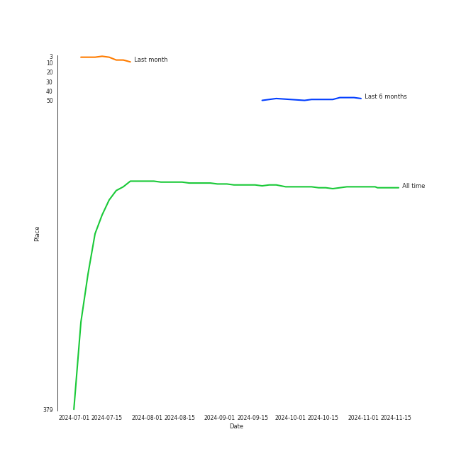

# Jerusalem Quartet

[See Track Features](audio_features.md)

[See Clusters](clusters/overview.md)

## Artist Rank
- The #143 artist of all time

## Top Tracks

### Top tracks of all time

## Top Albums

| Art | Rank | Tracks | 💚 | Album | Release Date | 🔗 |
|:---|---:|---:|---:|:---|:---|:---|
|  | 399 | 29 | 0 | Shostakovich: String Quartets Nos. 1, 4, 6, 8, 9 & 11 | 2005 | [🔗](https://open.spotify.com/album/4V2YVRjysd08RF0GLRDDK7) |
|  | 392 | 24 | 0 | Beethoven: String Quartets, Op. 18 | 2015-08-31 | [🔗](https://open.spotify.com/album/37iUq5Dekt8uP5itTiVs2Q) |
|  | 667 | 11 | 0 | Mozart: String Quartets Nos. 4, 17 & 22 | 2011-02-22 | [🔗](https://open.spotify.com/album/1PxALR0DTaTJPL6ByBK266) |
|  | 667 | 8 | 0 | Dvorak: String Quintet, Op. 97 & String Sextet, Op. 48 | 2018-01-19 | [🔗](https://open.spotify.com/album/02nUFvsdTaekp2QQalnE3N) |
|  | 667 | 8 | 0 | Debussy & Ravel: String Quartets | 2018-05-25 | [🔗](https://open.spotify.com/album/77Eg2dHidrefgsS3GZ88nK) |

## Featured on Playlists
| Art | Tracks | Playlist |
|:---|---:|:---|
|  | 80 | [String Quartets](../../playlists/string_quartets/overview.md) |

## Top Record Labels

| Tracks | 💚 | Label |
|---:|---:|:---|
| 80 | 0 | [harmonia mundi](../../labels/harmonia_mundi/overview.md) |

## Genres

- string quartet

## Tracks

| Art | Track | Album | Artists | Label | Rank | 💚 | 🔗 |
|:---|:---|:---|:---|:---|---:|:---|:---|
|  | String Quartet No. 3 in D Major, Op. 18: I. Allegro | Beethoven: String Quartets, Op. 18 | [Ludwig van Beethoven](../ludwig_van_beethoven/overview.md), [Jerusalem Quartet](overview.md) | [harmonia mundi](../../labels/harmonia_mundi) | 574 | | [🔗](https://open.spotify.com/track/4ZTY5VL2UbVghLuVkhAQdc) |
|  | String Quartet No. 9 in E-Flat Major, Op. 117: III. Allegretto | Shostakovich: String Quartets Nos. 1, 4, 6, 8, 9 & 11 | Dmitri Shostakovich, [Jerusalem Quartet](overview.md) | [harmonia mundi](../../labels/harmonia_mundi) | 589 | | [🔗](https://open.spotify.com/track/57vPVZyYD3Cfxlpmqqdgl5) |
|  | String Quartet No. 1 in C Major, Op. 49: I. Moderato | Shostakovich: String Quartets Nos. 1, 4, 6, 8, 9 & 11 | Dmitri Shostakovich, [Jerusalem Quartet](overview.md) | [harmonia mundi](../../labels/harmonia_mundi) | 1018 | | [🔗](https://open.spotify.com/track/5VQz0yG8Lzvjj4RCbDLMrJ) |
|  | String Quartet No. 1 in C Major, Op. 49: II. Moderato | Shostakovich: String Quartets Nos. 1, 4, 6, 8, 9 & 11 | Dmitri Shostakovich, [Jerusalem Quartet](overview.md) | [harmonia mundi](../../labels/harmonia_mundi) | 1018 | | [🔗](https://open.spotify.com/track/0A5oxICmtISYvCLCKY5BZs) |
|  | String Quartet No. 1 in C Major, Op. 49: III. Allegro molto | Shostakovich: String Quartets Nos. 1, 4, 6, 8, 9 & 11 | Dmitri Shostakovich, [Jerusalem Quartet](overview.md) | [harmonia mundi](../../labels/harmonia_mundi) | 1018 | | [🔗](https://open.spotify.com/track/5O8Iz6Mlz4oS0DP6YYyBQC) |
|  | String Quartet No. 1 in C Major, Op. 49: IV. Allegro | Shostakovich: String Quartets Nos. 1, 4, 6, 8, 9 & 11 | Dmitri Shostakovich, [Jerusalem Quartet](overview.md) | [harmonia mundi](../../labels/harmonia_mundi) | 1018 | | [🔗](https://open.spotify.com/track/0nxe3lOpIX0rt3E9vcrRn5) |
|  | String Quartet No. 4 in D Major, Op. 83: I. Allegretto | Shostakovich: String Quartets Nos. 1, 4, 6, 8, 9 & 11 | Dmitri Shostakovich, [Jerusalem Quartet](overview.md) | [harmonia mundi](../../labels/harmonia_mundi) | 1018 | | [🔗](https://open.spotify.com/track/2ESTZJCtAtRNts4sKVVTsl) |
|  | String Quartet No. 4 in D Major, Op. 83: II. Andantino | Shostakovich: String Quartets Nos. 1, 4, 6, 8, 9 & 11 | Dmitri Shostakovich, [Jerusalem Quartet](overview.md) | [harmonia mundi](../../labels/harmonia_mundi) | 1018 | | [🔗](https://open.spotify.com/track/4Ky633fVEZUBTOcjKbY7yc) |
|  | String Quartet No. 4 in D Major, Op. 83: III. Allegretto | Shostakovich: String Quartets Nos. 1, 4, 6, 8, 9 & 11 | Dmitri Shostakovich, [Jerusalem Quartet](overview.md) | [harmonia mundi](../../labels/harmonia_mundi) | 1018 | | [🔗](https://open.spotify.com/track/2cDsjReMRP1B3dLSH8uBRx) |
|  | String Quartet No. 4 in D Major, Op. 83: IV. Allegretto | Shostakovich: String Quartets Nos. 1, 4, 6, 8, 9 & 11 | Dmitri Shostakovich, [Jerusalem Quartet](overview.md) | [harmonia mundi](../../labels/harmonia_mundi) | 1018 | | [🔗](https://open.spotify.com/track/4qM31gOqZIt7skvz2kgaOC) |

See all tracks

| Art | Track | Album | Artists | Label | Rank | 💚 | 🔗 |
|:---|:---|:---|:---|:---|---:|:---|:---|
|  | String Quartet No. 6 in G Major, Op. 101: I. Allegretto | Shostakovich: String Quartets Nos. 1, 4, 6, 8, 9 & 11 | Dmitri Shostakovich, [Jerusalem Quartet](overview.md) | [harmonia mundi](../../labels/harmonia_mundi) | 1018 | | [🔗](https://open.spotify.com/track/0k7Zd9zAYnBPuNJPck4UOc) |
|  | String Quartet No. 6 in G Major, Op. 101: II. Moderato con moto | Shostakovich: String Quartets Nos. 1, 4, 6, 8, 9 & 11 | Dmitri Shostakovich, [Jerusalem Quartet](overview.md) | [harmonia mundi](../../labels/harmonia_mundi) | 1018 | | [🔗](https://open.spotify.com/track/5BqEbEtqCpIrKRJh5c3Z3u) |
|  | String Quartet No. 6 in G Major, Op. 101: III. Lento | Shostakovich: String Quartets Nos. 1, 4, 6, 8, 9 & 11 | Dmitri Shostakovich, [Jerusalem Quartet](overview.md) | [harmonia mundi](../../labels/harmonia_mundi) | 1018 | | [🔗](https://open.spotify.com/track/01toQ1HaV4k4aUqWqNsdJe) |
|  | String Quartet No. 6 in G Major, Op. 101: IV. Finale (Lento) - Allegretto | Shostakovich: String Quartets Nos. 1, 4, 6, 8, 9 & 11 | Dmitri Shostakovich, [Jerusalem Quartet](overview.md) | [harmonia mundi](../../labels/harmonia_mundi) | 1018 | | [🔗](https://open.spotify.com/track/3EcruCCCtRp7fi5K2YfAA5) |
|  | String Quartet No. 8 in C Minor, Op. 110: I. Largo | Shostakovich: String Quartets Nos. 1, 4, 6, 8, 9 & 11 | Dmitri Shostakovich, [Jerusalem Quartet](overview.md) | [harmonia mundi](../../labels/harmonia_mundi) | 1018 | | [🔗](https://open.spotify.com/track/2wtSkXod5g0Ms9h9Amd9FD) |
|  | String Quartet No. 8 in C Minor, Op. 110: II. Allegro molto | Shostakovich: String Quartets Nos. 1, 4, 6, 8, 9 & 11 | Dmitri Shostakovich, [Jerusalem Quartet](overview.md) | [harmonia mundi](../../labels/harmonia_mundi) | 1018 | | [🔗](https://open.spotify.com/track/5EXeMOFxbHkj2lgACzXpzr) |
|  | String Quartet No. 8 in C Minor, Op. 110: III. Allegretto | Shostakovich: String Quartets Nos. 1, 4, 6, 8, 9 & 11 | Dmitri Shostakovich, [Jerusalem Quartet](overview.md) | [harmonia mundi](../../labels/harmonia_mundi) | 1018 | | [🔗](https://open.spotify.com/track/1uQEWRgoZxzAn7OScQl9nV) |
|  | String Quartet No. 8 in C Minor, Op. 110: IV. Largo | Shostakovich: String Quartets Nos. 1, 4, 6, 8, 9 & 11 | Dmitri Shostakovich, [Jerusalem Quartet](overview.md) | [harmonia mundi](../../labels/harmonia_mundi) | 1018 | | [🔗](https://open.spotify.com/track/0axYJ2DSUKXkL67CnUDN3t) |
|  | String Quartet No. 8 in C Minor, Op. 110: V. Largo | Shostakovich: String Quartets Nos. 1, 4, 6, 8, 9 & 11 | Dmitri Shostakovich, [Jerusalem Quartet](overview.md) | [harmonia mundi](../../labels/harmonia_mundi) | 1018 | | [🔗](https://open.spotify.com/track/7I1ePDRDp8RvVv9lPU5wHi) |
|  | String Quartet No. 9 in E-Flat Major, Op. 117: I. Moderato Con Moto | Shostakovich: String Quartets Nos. 1, 4, 6, 8, 9 & 11 | Dmitri Shostakovich, [Jerusalem Quartet](overview.md) | [harmonia mundi](../../labels/harmonia_mundi) | 1018 | | [🔗](https://open.spotify.com/track/7c1PZ3jfMdI65Oqn1uI74j) |
|  | String Quartet No. 9 in E-Flat Major, Op. 117: II. Adagio | Shostakovich: String Quartets Nos. 1, 4, 6, 8, 9 & 11 | Dmitri Shostakovich, [Jerusalem Quartet](overview.md) | [harmonia mundi](../../labels/harmonia_mundi) | 1018 | | [🔗](https://open.spotify.com/track/4u51lPm5GBz9CmJxODuV60) |
|  | String Quartet No. 9 in E-Flat Major, Op. 117: IV. Adagio | Shostakovich: String Quartets Nos. 1, 4, 6, 8, 9 & 11 | Dmitri Shostakovich, [Jerusalem Quartet](overview.md) | [harmonia mundi](../../labels/harmonia_mundi) | 1018 | | [🔗](https://open.spotify.com/track/0vpGcgNCl9p9UQdtCOajUG) |
|  | String Quartet No. 9 in E-Flat Major, Op. 117: V. Allegro | Shostakovich: String Quartets Nos. 1, 4, 6, 8, 9 & 11 | Dmitri Shostakovich, [Jerusalem Quartet](overview.md) | [harmonia mundi](../../labels/harmonia_mundi) | 1018 | | [🔗](https://open.spotify.com/track/6XOKaXhXamHmqSa38Uwf4A) |
|  | String Quartet No.11 in F Minor, Op. 122: I. Introduction (Andantino) | Shostakovich: String Quartets Nos. 1, 4, 6, 8, 9 & 11 | Dmitri Shostakovich, [Jerusalem Quartet](overview.md) | [harmonia mundi](../../labels/harmonia_mundi) | 1018 | | [🔗](https://open.spotify.com/track/4tcinhmPDuyaskdPrqjWB9) |
|  | String Quartet No.11 in F Minor, Op. 122: II. Scherzo (Allegretto) | Shostakovich: String Quartets Nos. 1, 4, 6, 8, 9 & 11 | Dmitri Shostakovich, [Jerusalem Quartet](overview.md) | [harmonia mundi](../../labels/harmonia_mundi) | 1018 | | [🔗](https://open.spotify.com/track/5axBmM6eFCRlBCXlBIZGJM) |
|  | String Quartet No.11 in F Minor, Op. 122: III. Récitatif (Adagio) | Shostakovich: String Quartets Nos. 1, 4, 6, 8, 9 & 11 | Dmitri Shostakovich, [Jerusalem Quartet](overview.md) | [harmonia mundi](../../labels/harmonia_mundi) | 1018 | | [🔗](https://open.spotify.com/track/02ys9P2W1zcsnWAw9LbaRD) |
|  | String Quartet No.11 in F Minor, Op. 122: IV. Etude (Allegro) | Shostakovich: String Quartets Nos. 1, 4, 6, 8, 9 & 11 | Dmitri Shostakovich, [Jerusalem Quartet](overview.md) | [harmonia mundi](../../labels/harmonia_mundi) | 1018 | | [🔗](https://open.spotify.com/track/1jXkZMpNRhBlzleAvtfTop) |
|  | String Quartet No.11 in F Minor, Op. 122: V. Humoresque (Allegro) | Shostakovich: String Quartets Nos. 1, 4, 6, 8, 9 & 11 | Dmitri Shostakovich, [Jerusalem Quartet](overview.md) | [harmonia mundi](../../labels/harmonia_mundi) | 1018 | | [🔗](https://open.spotify.com/track/4ikkJi208jmFPkdZGsSe71) |
|  | String Quartet No.11 in F Minor, Op. 122: VI. Elégie (Adagio) | Shostakovich: String Quartets Nos. 1, 4, 6, 8, 9 & 11 | Dmitri Shostakovich, [Jerusalem Quartet](overview.md) | [harmonia mundi](../../labels/harmonia_mundi) | 1018 | | [🔗](https://open.spotify.com/track/4oCDQYx2mAoP7cXyGEoVDe) |
|  | String Quartet No.11 in F Minor, Op. 122: VII. Finale (Moderato) | Shostakovich: String Quartets Nos. 1, 4, 6, 8, 9 & 11 | Dmitri Shostakovich, [Jerusalem Quartet](overview.md) | [harmonia mundi](../../labels/harmonia_mundi) | 1018 | | [🔗](https://open.spotify.com/track/76ZylpA4UyhA3gQn0INmqF) |
|  | String Quartet No. 17 in B-Flat Major, K. 458 "The Hunt": I. Allegro vivace assai | Mozart: String Quartets Nos. 4, 17 & 22 | [Wolfgang Amadeus Mozart](../wolfgang_amadeus_mozart/overview.md), [Jerusalem Quartet](overview.md) | [harmonia mundi](../../labels/harmonia_mundi) | 1018 | | [🔗](https://open.spotify.com/track/11azjFN3PsLfWtclIaGTPz) |
|  | String Quartet No. 17 in B-Flat Major, K. 458 "The Hunt": II. Menuetto (Moderato) | Mozart: String Quartets Nos. 4, 17 & 22 | [Wolfgang Amadeus Mozart](../wolfgang_amadeus_mozart/overview.md), [Jerusalem Quartet](overview.md) | [harmonia mundi](../../labels/harmonia_mundi) | 1018 | | [🔗](https://open.spotify.com/track/25p4xpZb7TOwGzcjX9OBbc) |
|  | String Quartet No. 17 in B-Flat Major, K. 458 "The Hunt": III. Adagio | Mozart: String Quartets Nos. 4, 17 & 22 | [Wolfgang Amadeus Mozart](../wolfgang_amadeus_mozart/overview.md), [Jerusalem Quartet](overview.md) | [harmonia mundi](../../labels/harmonia_mundi) | 1018 | | [🔗](https://open.spotify.com/track/74TmNT7ctAj6O6wpDTkb6O) |
|  | String Quartet No. 17 in B-Flat Major, K. 458 "The Hunt": IV. Allegro assai | Mozart: String Quartets Nos. 4, 17 & 22 | [Wolfgang Amadeus Mozart](../wolfgang_amadeus_mozart/overview.md), [Jerusalem Quartet](overview.md) | [harmonia mundi](../../labels/harmonia_mundi) | 1018 | | [🔗](https://open.spotify.com/track/6AgF5rgvW3hRwe6A8KCcwl) |
|  | String Quartet No. 22 in B-Flat Major, K. 589, "Prussian": I. Allegro | Mozart: String Quartets Nos. 4, 17 & 22 | [Wolfgang Amadeus Mozart](../wolfgang_amadeus_mozart/overview.md), [Jerusalem Quartet](overview.md) | [harmonia mundi](../../labels/harmonia_mundi) | 1018 | | [🔗](https://open.spotify.com/track/6gN3OwvTCPD9k8tqMxUEJd) |
|  | String Quartet No. 22 in B-Flat Major, K. 589, "Prussian": II. Larghetto | Mozart: String Quartets Nos. 4, 17 & 22 | [Wolfgang Amadeus Mozart](../wolfgang_amadeus_mozart/overview.md), [Jerusalem Quartet](overview.md) | [harmonia mundi](../../labels/harmonia_mundi) | 1018 | | [🔗](https://open.spotify.com/track/7eaYdLRx1XuHhTpKMYaBU9) |
|  | String Quartet No. 22 in B-Flat Major, K. 589, "Prussian": III. Menuetto - Moderato | Mozart: String Quartets Nos. 4, 17 & 22 | [Wolfgang Amadeus Mozart](../wolfgang_amadeus_mozart/overview.md), [Jerusalem Quartet](overview.md) | [harmonia mundi](../../labels/harmonia_mundi) | 1018 | | [🔗](https://open.spotify.com/track/1LAbFa0OPRS6IuapkOySby) |
|  | String Quartet No. 22 in B-Flat Major, K. 589, "Prussian": IV. Allegro assai | Mozart: String Quartets Nos. 4, 17 & 22 | [Wolfgang Amadeus Mozart](../wolfgang_amadeus_mozart/overview.md), [Jerusalem Quartet](overview.md) | [harmonia mundi](../../labels/harmonia_mundi) | 1018 | | [🔗](https://open.spotify.com/track/6Y8SmRRP56DkQoDt8op0xN) |
|  | String Quartet No. 4 in C Major, K. 157: I. Allegro | Mozart: String Quartets Nos. 4, 17 & 22 | [Wolfgang Amadeus Mozart](../wolfgang_amadeus_mozart/overview.md), [Jerusalem Quartet](overview.md) | [harmonia mundi](../../labels/harmonia_mundi) | 1018 | | [🔗](https://open.spotify.com/track/1Yo7X5HowJgPOnisWCexqI) |
|  | String Quartet No. 4 in C Major, K. 157: II. Andante | Mozart: String Quartets Nos. 4, 17 & 22 | [Wolfgang Amadeus Mozart](../wolfgang_amadeus_mozart/overview.md), [Jerusalem Quartet](overview.md) | [harmonia mundi](../../labels/harmonia_mundi) | 1018 | | [🔗](https://open.spotify.com/track/4V6p7SY0ALq9I5iuOgkVNK) |
|  | String Quartet No. 4 in C Major, K. 157: III. Presto | Mozart: String Quartets Nos. 4, 17 & 22 | [Wolfgang Amadeus Mozart](../wolfgang_amadeus_mozart/overview.md), [Jerusalem Quartet](overview.md) | [harmonia mundi](../../labels/harmonia_mundi) | 1018 | | [🔗](https://open.spotify.com/track/6wZJSUp9ucaVj1C7gQW1Rd) |
|  | String Quartet No. 1 in F Major, Op. 18 No. 1: I. Allegro con brio | Beethoven: String Quartets, Op. 18 | [Ludwig van Beethoven](../ludwig_van_beethoven/overview.md), [Jerusalem Quartet](overview.md) | [harmonia mundi](../../labels/harmonia_mundi) | 1018 | | [🔗](https://open.spotify.com/track/0bLf8GdqFZ3rK8GwWhcjH8) |
|  | String Quartet No. 1 in F Major, Op. 18 No. 1: II. Adagio affettuoso ed appassionato | Beethoven: String Quartets, Op. 18 | [Ludwig van Beethoven](../ludwig_van_beethoven/overview.md), [Jerusalem Quartet](overview.md) | [harmonia mundi](../../labels/harmonia_mundi) | 1018 | | [🔗](https://open.spotify.com/track/74Din3wPGdlksjg6kz68Mw) |
|  | String Quartet No. 1 in F Major, Op. 18 No. 1: III. Scherzo (Allegro molto) - Trio | Beethoven: String Quartets, Op. 18 | [Ludwig van Beethoven](../ludwig_van_beethoven/overview.md), [Jerusalem Quartet](overview.md) | [harmonia mundi](../../labels/harmonia_mundi) | 1018 | | [🔗](https://open.spotify.com/track/62gkGN2sOcxtVmoDGCeajT) |
|  | String Quartet No. 1 in F Major, Op. 18 No. 1: IV. Allegro | Beethoven: String Quartets, Op. 18 | [Ludwig van Beethoven](../ludwig_van_beethoven/overview.md), [Jerusalem Quartet](overview.md) | [harmonia mundi](../../labels/harmonia_mundi) | 1018 | | [🔗](https://open.spotify.com/track/37ygTHqOZWYgHuBSEZ8M3V) |
|  | String Quartet No. 2 in G Major, Op. 18, No. 2: I. Allegro | Beethoven: String Quartets, Op. 18 | [Ludwig van Beethoven](../ludwig_van_beethoven/overview.md), [Jerusalem Quartet](overview.md) | [harmonia mundi](../../labels/harmonia_mundi) | 1018 | | [🔗](https://open.spotify.com/track/558uK4J0UIghC9WVf1lAuk) |
|  | String Quartet No. 2 in G Major, Op. 18, No. 2: II. Adagio cantabile - Allegro | Beethoven: String Quartets, Op. 18 | [Ludwig van Beethoven](../ludwig_van_beethoven/overview.md), [Jerusalem Quartet](overview.md) | [harmonia mundi](../../labels/harmonia_mundi) | 1018 | | [🔗](https://open.spotify.com/track/7v0g3biHWMpypyv0hfxroQ) |
|  | String Quartet No. 2 in G Major, Op. 18, No. 2: III. Scherzo (Allegro) - Trio | Beethoven: String Quartets, Op. 18 | [Ludwig van Beethoven](../ludwig_van_beethoven/overview.md), [Jerusalem Quartet](overview.md) | [harmonia mundi](../../labels/harmonia_mundi) | 1018 | | [🔗](https://open.spotify.com/track/5NFYYgZwkSOTpOZNeqiinF) |
|  | String Quartet No. 2 in G Major, Op. 18, No. 2: IV. Allegro molto, quasi presto | Beethoven: String Quartets, Op. 18 | [Ludwig van Beethoven](../ludwig_van_beethoven/overview.md), [Jerusalem Quartet](overview.md) | [harmonia mundi](../../labels/harmonia_mundi) | 1018 | | [🔗](https://open.spotify.com/track/2MLKpaXZA1ATmFer81pJ43) |
|  | String Quartet No. 3 in D Major, Op. 18: II. Andante con moto | Beethoven: String Quartets, Op. 18 | [Ludwig van Beethoven](../ludwig_van_beethoven/overview.md), [Jerusalem Quartet](overview.md) | [harmonia mundi](../../labels/harmonia_mundi) | 1018 | | [🔗](https://open.spotify.com/track/0o3Mcv1JOPsrnc3wBROq2S) |
|  | String Quartet No. 3 in D Major, Op. 18: III. Allegro | Beethoven: String Quartets, Op. 18 | [Ludwig van Beethoven](../ludwig_van_beethoven/overview.md), [Jerusalem Quartet](overview.md) | [harmonia mundi](../../labels/harmonia_mundi) | 1018 | | [🔗](https://open.spotify.com/track/3YHXYUEz37g5r42bPc73bB) |
|  | String Quartet No. 3 in D Major, Op. 18: IV. Presto | Beethoven: String Quartets, Op. 18 | [Ludwig van Beethoven](../ludwig_van_beethoven/overview.md), [Jerusalem Quartet](overview.md) | [harmonia mundi](../../labels/harmonia_mundi) | 1018 | | [🔗](https://open.spotify.com/track/6c3exNicyaeLcebTT2VaMQ) |
|  | String Quartet No. 4 in C Minor, Op. 18 No. 4: I. Allegro ma non tanto | Beethoven: String Quartets, Op. 18 | [Ludwig van Beethoven](../ludwig_van_beethoven/overview.md), [Jerusalem Quartet](overview.md) | [harmonia mundi](../../labels/harmonia_mundi) | 1018 | | [🔗](https://open.spotify.com/track/7yoDNO5NZYx8VwDWkYDLBr) |
|  | String Quartet No. 4 in C Minor, Op. 18 No. 4: II. Andante scherzoso quasi allegretto | Beethoven: String Quartets, Op. 18 | [Ludwig van Beethoven](../ludwig_van_beethoven/overview.md), [Jerusalem Quartet](overview.md) | [harmonia mundi](../../labels/harmonia_mundi) | 1018 | | [🔗](https://open.spotify.com/track/3utDQmK6hHWqyHGQUJ1mHN) |
|  | String Quartet No. 4 in C Minor, Op. 18 No. 4: III. Menuetto (Allegro) - Trio | Beethoven: String Quartets, Op. 18 | [Ludwig van Beethoven](../ludwig_van_beethoven/overview.md), [Jerusalem Quartet](overview.md) | [harmonia mundi](../../labels/harmonia_mundi) | 1018 | | [🔗](https://open.spotify.com/track/2dQGXr6v2FXXPeBvqrTZW2) |
|  | String Quartet No. 4 in C Minor, Op. 18 No. 4: IV. Allegretto – Prestissimo | Beethoven: String Quartets, Op. 18 | [Ludwig van Beethoven](../ludwig_van_beethoven/overview.md), [Jerusalem Quartet](overview.md) | [harmonia mundi](../../labels/harmonia_mundi) | 1018 | | [🔗](https://open.spotify.com/track/1MvCCoEM4ml6b1F2T8UKey) |
|  | String Quartet No. 5 in A Major, Op. 18 No. 5: I. Allegro | Beethoven: String Quartets, Op. 18 | [Ludwig van Beethoven](../ludwig_van_beethoven/overview.md), [Jerusalem Quartet](overview.md) | [harmonia mundi](../../labels/harmonia_mundi) | 1018 | | [🔗](https://open.spotify.com/track/26rU4aScCfqkgrtNmAAUMW) |
|  | String Quartet No. 5 in A Major, Op. 18 No. 5: II. Menuetto - Trio | Beethoven: String Quartets, Op. 18 | [Ludwig van Beethoven](../ludwig_van_beethoven/overview.md), [Jerusalem Quartet](overview.md) | [harmonia mundi](../../labels/harmonia_mundi) | 1018 | | [🔗](https://open.spotify.com/track/0AtBrNtW0crqbSyUtwNykS) |
|  | String Quartet No. 5 in A Major, Op. 18 No. 5: III. Andante cantabile | Beethoven: String Quartets, Op. 18 | [Ludwig van Beethoven](../ludwig_van_beethoven/overview.md), [Jerusalem Quartet](overview.md) | [harmonia mundi](../../labels/harmonia_mundi) | 1018 | | [🔗](https://open.spotify.com/track/2jYxlMeQolbjDhOBY4QgYR) |
|  | String Quartet No. 5 in A Major, Op. 18 No. 5: IV. Allegro | Beethoven: String Quartets, Op. 18 | [Ludwig van Beethoven](../ludwig_van_beethoven/overview.md), [Jerusalem Quartet](overview.md) | [harmonia mundi](../../labels/harmonia_mundi) | 1018 | | [🔗](https://open.spotify.com/track/5AByXPX7vW0d89Du16H7U6) |
|  | String Quartet No. 6 in B-Flat Major, Op. 18 No. 6: I. Allegro con brio | Beethoven: String Quartets, Op. 18 | [Ludwig van Beethoven](../ludwig_van_beethoven/overview.md), [Jerusalem Quartet](overview.md) | [harmonia mundi](../../labels/harmonia_mundi) | 1018 | | [🔗](https://open.spotify.com/track/7FZJQ7bjH1grTUYdfxfD73) |
|  | String Quartet No. 6 in B-Flat Major, Op. 18 No. 6: II. Adagio ma non troppo | Beethoven: String Quartets, Op. 18 | [Ludwig van Beethoven](../ludwig_van_beethoven/overview.md), [Jerusalem Quartet](overview.md) | [harmonia mundi](../../labels/harmonia_mundi) | 1018 | | [🔗](https://open.spotify.com/track/5haDu6D9Afpa5GIt5wVWMb) |
|  | String Quartet No. 6 in B-Flat Major, Op. 18 No. 6: III. Scherzo (Allegro) - Trio | Beethoven: String Quartets, Op. 18 | [Ludwig van Beethoven](../ludwig_van_beethoven/overview.md), [Jerusalem Quartet](overview.md) | [harmonia mundi](../../labels/harmonia_mundi) | 1018 | | [🔗](https://open.spotify.com/track/39AM3Owd4WbyUoTxiGNSyi) |
|  | String Quartet No. 6 in B-Flat Major, Op. 18 No. 6: IV. Adagio "La Malinconia" - Allegretto quasi allegro | Beethoven: String Quartets, Op. 18 | [Ludwig van Beethoven](../ludwig_van_beethoven/overview.md), [Jerusalem Quartet](overview.md) | [harmonia mundi](../../labels/harmonia_mundi) | 1018 | | [🔗](https://open.spotify.com/track/307vQS6VavTKNbzYSnYTt9) |
|  | String Quintet No. 3, Op. 97: I. Allegro non tanto | Dvorak: String Quintet, Op. 97 & String Sextet, Op. 48 | Antonín Dvořák, [Jerusalem Quartet](overview.md), Veronika Hagen | [harmonia mundi](../../labels/harmonia_mundi) | 1018 | | [🔗](https://open.spotify.com/track/3SwpQeSrLjp6mgUee0HYwG) |
|  | String Quintet No. 3, Op. 97: II. Allegro vivo - Minore. Un poco meno mosso | Dvorak: String Quintet, Op. 97 & String Sextet, Op. 48 | Antonín Dvořák, [Jerusalem Quartet](overview.md), Veronika Hagen | [harmonia mundi](../../labels/harmonia_mundi) | 1018 | | [🔗](https://open.spotify.com/track/23gYTbrPlIyLSIxac0PfrM) |
|  | String Quintet No. 3, Op. 97: III. Larghetto | Dvorak: String Quintet, Op. 97 & String Sextet, Op. 48 | Antonín Dvořák, [Jerusalem Quartet](overview.md), Veronika Hagen | [harmonia mundi](../../labels/harmonia_mundi) | 1018 | | [🔗](https://open.spotify.com/track/4ZdgET0UACAG4mHLd8lZYu) |
|  | String Quintet No. 3, Op. 97: IV. Finale. Allegro giusto | Dvorak: String Quintet, Op. 97 & String Sextet, Op. 48 | Antonín Dvořák, [Jerusalem Quartet](overview.md), Veronika Hagen | [harmonia mundi](../../labels/harmonia_mundi) | 1018 | | [🔗](https://open.spotify.com/track/6K2rgT3cbyNwMW1V5Hc60i) |
|  | String Sextet, Op. 48: I. Allegro moderato | Dvorak: String Quintet, Op. 97 & String Sextet, Op. 48 | Antonín Dvořák, [Jerusalem Quartet](overview.md), Veronika Hagen, Gary Hoffman | [harmonia mundi](../../labels/harmonia_mundi) | 1018 | | [🔗](https://open.spotify.com/track/5Bn7rXQJDCOkR50kqlkkfv) |
|  | String Sextet, Op. 48: II. Dumka (Elegie). Poco allegretto | Dvorak: String Quintet, Op. 97 & String Sextet, Op. 48 | Antonín Dvořák, [Jerusalem Quartet](overview.md), Veronika Hagen, Gary Hoffman | [harmonia mundi](../../labels/harmonia_mundi) | 1018 | | [🔗](https://open.spotify.com/track/2ioJboDNAzvnntmzl0YYnC) |
|  | String Sextet, Op. 48: III. Furiant. Presto - Trio | Dvorak: String Quintet, Op. 97 & String Sextet, Op. 48 | Antonín Dvořák, [Jerusalem Quartet](overview.md), Veronika Hagen, Gary Hoffman | [harmonia mundi](../../labels/harmonia_mundi) | 1018 | | [🔗](https://open.spotify.com/track/0b7X9ecotXBp5yYALXdDua) |
|  | String Sextet, Op. 48: IV. Finale. Tema con variazioni - Allegretto grazioso, quasi andantino | Dvorak: String Quintet, Op. 97 & String Sextet, Op. 48 | Antonín Dvořák, [Jerusalem Quartet](overview.md), Veronika Hagen | [harmonia mundi](../../labels/harmonia_mundi) | 1018 | | [🔗](https://open.spotify.com/track/1BwgToZUccesFsTGQ8mBdS) |
|  | Quatuor en Fa Majeur, M. 35: I. Allegro moderato | Debussy & Ravel: String Quartets | Maurice Ravel, [Jerusalem Quartet](overview.md) | [harmonia mundi](../../labels/harmonia_mundi) | 1018 | | [🔗](https://open.spotify.com/track/3TCA7n5D7MRG0v4H6BSyjW) |
|  | Quatuor en Fa Majeur, M. 35: II. Assez vif, très rythmé | Debussy & Ravel: String Quartets | Maurice Ravel, [Jerusalem Quartet](overview.md) | [harmonia mundi](../../labels/harmonia_mundi) | 1018 | | [🔗](https://open.spotify.com/track/766aJRX19tPpWsqp4n59xJ) |
|  | Quatuor en Fa Majeur, M. 35: III. Très lent | Debussy & Ravel: String Quartets | Maurice Ravel, [Jerusalem Quartet](overview.md) | [harmonia mundi](../../labels/harmonia_mundi) | 1018 | | [🔗](https://open.spotify.com/track/5Pa15bTxEBbugS06yIwnAt) |
|  | Quatuor en Fa Majeur, M. 35: IV. Vif et agité | Debussy & Ravel: String Quartets | Maurice Ravel, [Jerusalem Quartet](overview.md) | [harmonia mundi](../../labels/harmonia_mundi) | 1018 | | [🔗](https://open.spotify.com/track/3A49NlRC42aszkRusgYDfq) |
|  | String Quartet in G Minor, Op. 10: I. Animé et très décidé | Debussy & Ravel: String Quartets | Claude Debussy, [Jerusalem Quartet](overview.md) | [harmonia mundi](../../labels/harmonia_mundi) | 1018 | | [🔗](https://open.spotify.com/track/6VRCCEvDGOsiOe6M6qDsBq) |
|  | String Quartet in G Minor, Op. 10: II. Assez vif et bien rythmé | Debussy & Ravel: String Quartets | Claude Debussy, [Jerusalem Quartet](overview.md) | [harmonia mundi](../../labels/harmonia_mundi) | 1018 | | [🔗](https://open.spotify.com/track/4Az9YkyhksfJpgt00w01dl) |
|  | String Quartet in G Minor, Op. 10: III. Andantino, doucement expressif | Debussy & Ravel: String Quartets | Claude Debussy, [Jerusalem Quartet](overview.md) | [harmonia mundi](../../labels/harmonia_mundi) | 1018 | | [🔗](https://open.spotify.com/track/3ARP0EeVUiwPBc8OLhBCMg) |
|  | String Quartet in G Minor, Op. 10: IV. Très modéré | Debussy & Ravel: String Quartets | Claude Debussy, [Jerusalem Quartet](overview.md) | [harmonia mundi](../../labels/harmonia_mundi) | 1018 | | [🔗](https://open.spotify.com/track/4RQxDeNkibXjHkIkBXify8) |

