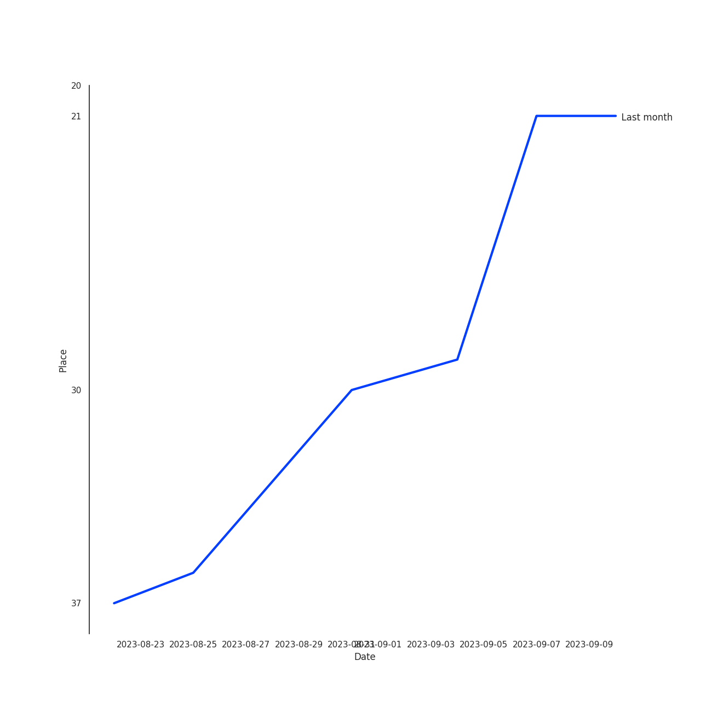
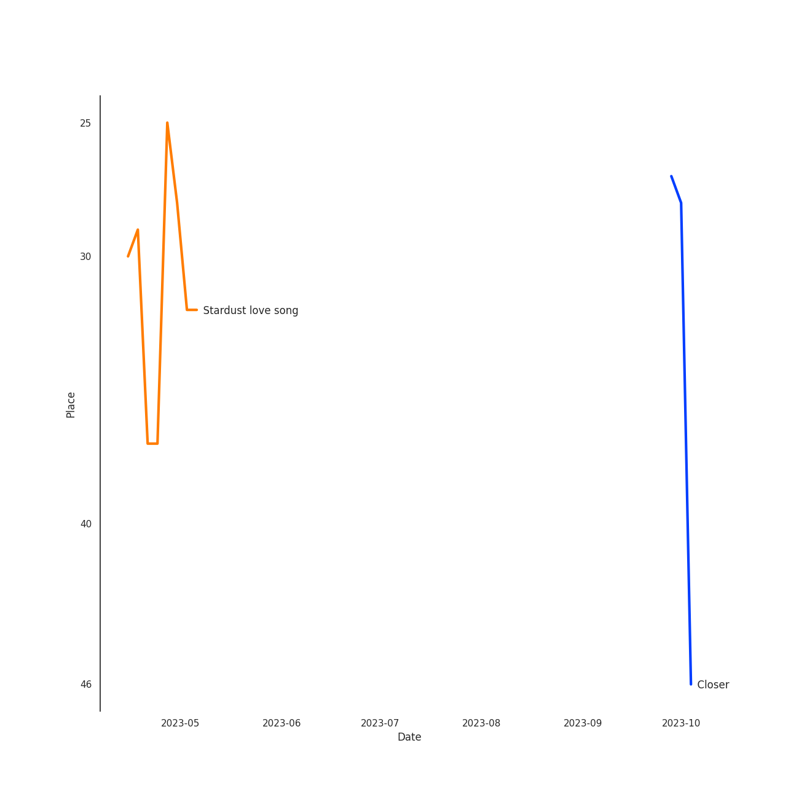

# JIHYO

## Artist Rank

## Top Tracks

### Top tracks of the last month over time

## Featured on Playlists
| Art | Tracks | Playlist |
|:---|---:|:---|
|  | 5 | [Recent Comebacks](../../playlists/recent_comebacks/overview.md) |
|  | 4 | [K-Pop](../../playlists/k_pop/overview.md) |
|  | 1 | [K-Pop Favorites](../../playlists/k_pop_favorites/overview.md) |
|  | 1 | [K-OST](../../playlists/k_ost/overview.md) |
|  | 1 | [Chill](../../playlists/chill/overview.md) |
## Top Albums

| Art | Tracks | 💚 | Album | Release Date | 🔗 |
|:---|---:|---:|:---|:---|:---|
|  | 5 | 4 | ZONE | 2023-08-18 | [🔗](https://open.spotify.com/album/1GIkapvyAw5lwdNw66hI44) |
|  | 1 | 1 | Twenty-Five Twenty-One OST | 2022-04-03 | [🔗](https://open.spotify.com/album/77NPr874WU941XZhjO43dR) |

## Top Record Labels

| Tracks | 💚 | Label |
|---:|---:|:---|
| 5 | 4 | Republic Records – JIHYO (TWICE) |
| 1 | 1 | Studio MaumC |
| 1 | 1 | Hwa&Dam pictures |

## Tracks

| Art | Track | Album | Artists | Label | 💚 | 🔗 |
|:---|:---|:---|:---|:---|:---|:---|
|  | Stardust love song | Twenty-Five Twenty-One OST | [JIHYO](overview.md) | Studio MaumC, Hwa&Dam pictures | 💚 | [🔗](https://open.spotify.com/track/473Ow8LT8YYeadY3RqrPNn) |
|  | Closer | ZONE | [JIHYO](overview.md) | Republic Records – JIHYO (TWICE) | 💚 | [🔗](https://open.spotify.com/track/0aUNIY0nITYfGH1ooJBRvR) |
|  | Killin’ Me Good | ZONE | [JIHYO](overview.md) | Republic Records – JIHYO (TWICE) | 💚 | [🔗](https://open.spotify.com/track/4Cyf87ul1le0xTWRFBoYd7) |
|  | Nightmare | ZONE | [JIHYO](overview.md) | Republic Records – JIHYO (TWICE) | 💚 | [🔗](https://open.spotify.com/track/0g6LJdn1CGodzl5zDB2IHi) |
|  | Room | ZONE | [JIHYO](overview.md) | Republic Records – JIHYO (TWICE) | | [🔗](https://open.spotify.com/track/0qcMgoijmPzjpdqin1VQlc) |
|  | Talkin’ About It (Feat. 24kGoldn) | ZONE | [JIHYO](overview.md), 24kGoldn | Republic Records – JIHYO (TWICE) | 💚 | [🔗](https://open.spotify.com/track/28mFFxAwJ9cx9j7z9yu64R) |