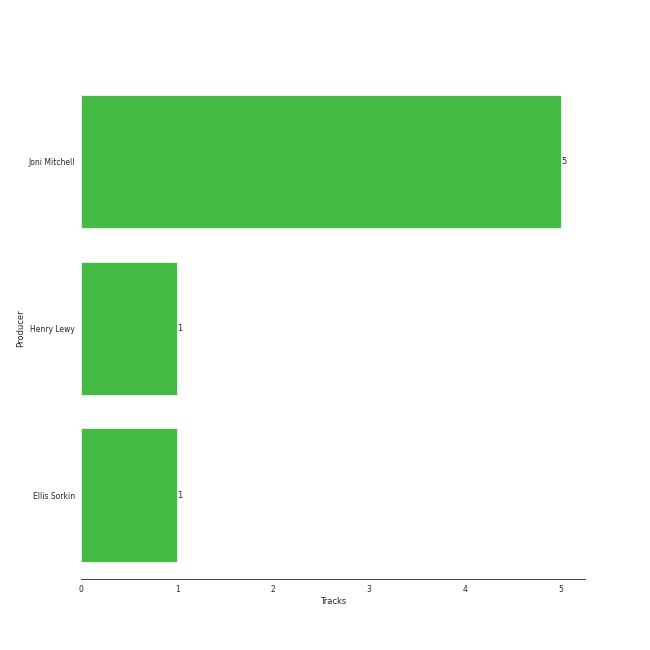

# Joni Mitchell

## Artist Rank

## Top Tracks

- The Dawntreader is the #44 track of the last month
## Featured on Playlists
| Art | Tracks | Playlist |
|:---|---:|:---|
|  | 8 | [Singer-Songwriter](../../playlists/singer-songwriter/overview.md) |

## Top Albums

| Art | Tracks | 💚 | Album | Release Date | 🔗 |
|:---|---:|---:|:---|:---|:---|
|  | 3 | 2 | Blue | 1971-06-22 | [🔗](https://open.spotify.com/album/1vz94WpXDVYIEGja8cjFNa) |
|  | 3 | 1 | Song to a Seagull | 1968-03-01 | [🔗](https://open.spotify.com/album/6rg3WTvmv68Vd6tgR0yS0E) |
|  | 1 | 1 | Ladies of the Canyon | 1970-03-01 | [🔗](https://open.spotify.com/album/7JOdtLDLyXJIppDRB7kxr9) |
|  | 1 | 1 | Court and Spark | 1974-01-17 | [🔗](https://open.spotify.com/album/2akjxkzFolkeV72Yyv5KrM) |

## Top Record Labels

| Tracks | 💚 | Label |
|---:|---:|:---|
| 8 | 5 | [Rhino](../../labels/rhino/overview.md) |

## Genres

- canadian singer-songwriter
- [folk](../../genres/folk/overview.md)
- folk rock
- [singer-songwriter](../../genres/singer-songwriter/overview.md)

## Credits

### Credits by Type

| Credit Type | Tracks |
|:---|---:|
| Instrument | 3 |
| Lyricist | 5 |
| Producer | 1 |
| Publishing | 1 |
| Songwriter | 5 |
| Vocal | 4 |

### Production Credits

| Art | Track | Credit Types |
|:---|:---|:---|
|  | The Dawntreader | Lyricist, Songwriter |
|  | I Had a King | Lyricist, Songwriter |
|  | Big Yellow Taxi | Lyricist, Songwriter |
|  | Carey | Lyricist, Songwriter |
|  | Free Man in Paris | Lyricist, Producer, Songwriter |

## Top Producers

| Art | Producer | Tracks | Credit Types |
|:---|:---|---:|:---|
|  | [Joni Mitchell](overview.md) | 5 | Lyricist, Songwriter, Producer |
| | Ellis Sorkin | 1 | Producer |
| | Henry Lewy | 1 | Producer |

## Tracks

| Art | Track | Album | Artists | Label | Rank | 💚 | 🔗 |
|:---|:---|:---|:---|:---|---:|:---|:---|
|  | The Dawntreader | Song to a Seagull | [Joni Mitchell](overview.md) | [Rhino](../../labels/rhino) | 723 | | [🔗](https://open.spotify.com/track/0KE9YElZqPumrpm9ovtXlN) |
|  | I Had a King | Song to a Seagull | [Joni Mitchell](overview.md) | [Rhino](../../labels/rhino) | nan | 💚 | [🔗](https://open.spotify.com/track/6rj2z2taVIxPRnzx5LJkGm) |
|  | The Pirate of Penance | Song to a Seagull | [Joni Mitchell](overview.md) | [Rhino](../../labels/rhino) | nan | | [🔗](https://open.spotify.com/track/53QbBfo0PTUKfOBM0YoPU7) |
|  | Big Yellow Taxi | Ladies of the Canyon | [Joni Mitchell](overview.md) | [Rhino](../../labels/rhino) | nan | 💚 | [🔗](https://open.spotify.com/track/6UkMcAA19lTdjs22jtB7o2) |
|  | A Case of You | Blue | [Joni Mitchell](overview.md) | [Rhino](../../labels/rhino) | nan | 💚 | [🔗](https://open.spotify.com/track/7shVwhUdVbHpykOfbzvDc1) |
|  | Blue | Blue | [Joni Mitchell](overview.md) | [Rhino](../../labels/rhino) | nan | | [🔗](https://open.spotify.com/track/1yWIsH3TC51gmzvQxZNCQC) |
|  | Carey | Blue | [Joni Mitchell](overview.md) | [Rhino](../../labels/rhino) | nan | 💚 | [🔗](https://open.spotify.com/track/11dUk8E2z8Oj1JURwl7GJd) |
|  | Free Man in Paris | Court and Spark | [Joni Mitchell](overview.md) | [Rhino](../../labels/rhino) | nan | 💚 | [🔗](https://open.spotify.com/track/2by5mqpQ1ZP2G5FOIccMnu) |
