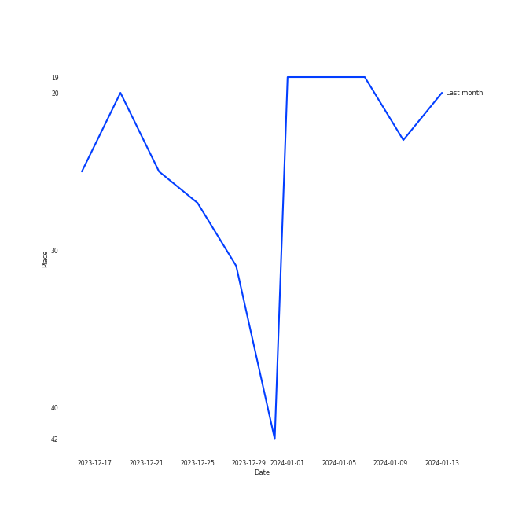
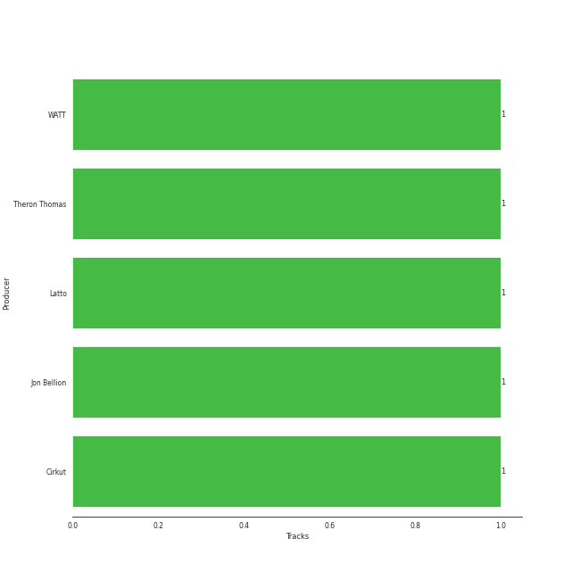

# Jung Kook

## Relationships

Jung Kook:
- is a member of [BTS](../bts/overview.md)

## Artist Rank
Jung Kook is currently:
- The #16 artist of the last month
- The #50 artist of the last 6 months

## Top Tracks

- Standing Next to You is:
    - the #32 track of the last month
## Featured on Playlists
| Art | Tracks | Playlist |
|:---|---:|:---|
|  | 5 | [K-Pop](../../playlists/k-pop/overview.md) |
|  | 4 | [Recent Comebacks](../../playlists/recent_comebacks/overview.md) |

## Top Albums

| Art | Tracks | 💚 | Album | Release Date | 🔗 |
|:---|---:|---:|:---|:---|:---|
|  | 4 | 4 | GOLDEN | 2023-11-03 | [🔗](https://open.spotify.com/album/5pSk3c3wVwnb2arb6ohCPU) |
|  | 1 | 1 | Still With You | 2020-06-05 | [🔗](https://open.spotify.com/album/0i3baFZqWSrjjgTWrhKunB) |

## Top Record Labels

| Tracks | 💚 | Label |
|---:|---:|:---|
| 5 | 5 | [BIGHIT MUSIC](../../labels/bighit_music/overview.md) |

## Genres

- [k-pop](../../genres/k-pop/overview.md)

## Credits

### Credits by Type

| Credit Type | Tracks |
|:---|---:|
| Vocal | 6 |

## Top Producers

| Art | Producer | Tracks | Credit Types |
|:---|:---|---:|:---|
| | Cirkut | 1 | Lyricist, Producer, Songwriter |
| | Jon Bellion | 1 | Lyricist, Songwriter |
|  | Latto | 1 | Lyricist, Songwriter |
| | Theron Thomas | 1 | Lyricist, Songwriter |
| | WATT | 1 | Lyricist, Producer, Songwriter |

## Tracks

| Art | Track | Album | Artists | Label | 💚 | 🔗 |
|:---|:---|:---|:---|:---|:---|:---|
|  | Still With You | Still With You | [Jung Kook](overview.md) | [BIGHIT MUSIC](../../labels/bighit_music) | 💚 | [🔗](https://open.spotify.com/track/0eFMbKCRw8KByXyWBw8WO7) |
|  | 3D (feat. Jack Harlow) | GOLDEN | [Jung Kook](overview.md), Jack Harlow | [BIGHIT MUSIC](../../labels/bighit_music) | 💚 | [🔗](https://open.spotify.com/track/6xGr4tVzpTX99p9Cf0hRRL) |
|  | Seven (feat. Latto) (Explicit Ver.) | GOLDEN | [Jung Kook](overview.md), Latto | [BIGHIT MUSIC](../../labels/bighit_music) | 💚 | [🔗](https://open.spotify.com/track/2HRgqmZQC0MC7GeNuDIXHN) |
|  | Standing Next to You | GOLDEN | [Jung Kook](overview.md) | [BIGHIT MUSIC](../../labels/bighit_music) | 💚 | [🔗](https://open.spotify.com/track/2KslE17cAJNHTsI2MI0jb2) |
|  | Yes or No | GOLDEN | [Jung Kook](overview.md) | [BIGHIT MUSIC](../../labels/bighit_music) | 💚 | [🔗](https://open.spotify.com/track/2gkVEnpahpE3bQuvGuCpAV) |
