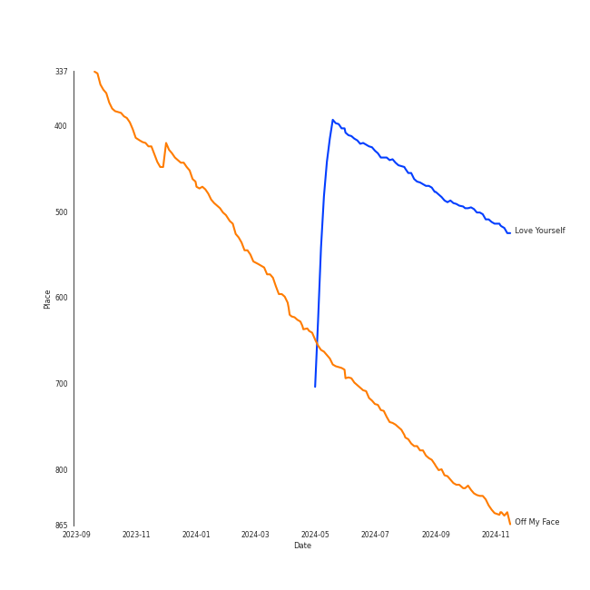
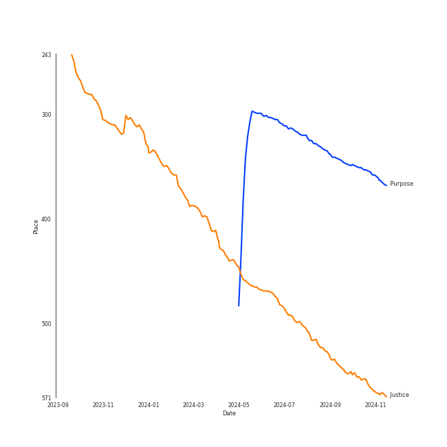
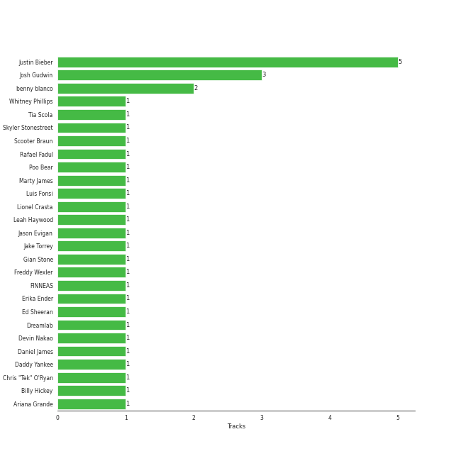

# Justin Bieber

## Artist Rank
- The #194 artist of all time

## Top Tracks

### Top tracks of all time

## Top Albums

| Art | Rank | Tracks | 💚 | Album | Release Date | 🔗 |
|:---|---:|---:|---:|:---|:---|:---|
|  | 333 | 2 | 1 | Purpose (Deluxe) | 2015-11-13 | [🔗](https://open.spotify.com/album/6Fr2rQkZ383FcMqFyT7yPr) |
|  | 619 | 2 | 0 | Under The Mistletoe (Deluxe Edition) | 2011-01-01 | [🔗](https://open.spotify.com/album/63MKT9hwmiMFFdFp5SdB1p) |
|  | 619 | 1 | 1 | Stuck with U | 2020-05-08 | [🔗](https://open.spotify.com/album/5mUdh6YWnUvf0MfklEk1oi) |
|  | 619 | 1 | 1 | Lonely (with benny blanco) | 2020-10-16 | [🔗](https://open.spotify.com/album/3P5WIUJO0Ots1lQx09TOxk) |
|  | 525 | 1 | 1 | Justice | 2021-03-19 | [🔗](https://open.spotify.com/album/5dGWwsZ9iB2Xc3UKR0gif2) |
|  | 619 | 1 | 1 | Despacito Feat. Justin Bieber (Remix) | 2017-04-17 | [🔗](https://open.spotify.com/album/3Gq2Dme9nesdgoqNNlcN8O) |
|  | 619 | 1 | 0 | Monster | 2020-11-20 | [🔗](https://open.spotify.com/album/3yVVL2EYLp8g7gT08VvYKy) |

## Featured on Playlists
| Art | Tracks | Playlist |
|:---|---:|:---|
|  | 6 | [Pop](../../playlists/pop/overview.md) |
|  | 2 | [Not K-Pop](../../playlists/not_k-pop/overview.md) |
|  | 2 | [Christmas](../../playlists/christmas/overview.md) |
|  | 1 | [Sharon RPD](../../playlists/sharon_rpd/overview.md) |
|  | 1 | [Karaoke](../../playlists/karaoke/overview.md) |
|  | 1 | [Chill](../../playlists/chill/overview.md) |
|  | 1 | [A-Pop Favorites](../../playlists/a-pop_favorites/overview.md) |

## Top Record Labels

| Tracks | 💚 | Label |
|---:|---:|:---|
| 5 | 2 | RBMG |
| 5 | 2 | Def Jam |
| 1 | 1 | UMLE |
| 1 | 1 | [Republic Records](../../labels/republic_records/overview.md) |
| 1 | 1 | [Interscope Records](../../labels/interscope_records/overview.md) |
| 1 | 1 | Friends Keep Secrets |
| 1 | 1 | [Def Jam Recordings](../../labels/def_jam_recordings/overview.md) |
| 1 | 1 | Ariana Grande & Justin Bieber "Stuck With U"- Charity |
| 1 | 0 | Shawn Mendes LP4-5 PS |
| 1 | 0 | [Island Records](../../labels/island_records/overview.md) |

## Genres

- [canadian pop](../../genres/canadian_pop/overview.md)
- [pop](../../genres/pop/overview.md)

## Credits

### Credits by Type

| Credit Type | Tracks |
|:---|---:|
| Songwriter | 5 |
| Vocal | 2 |

### Production Credits

| Art | Track | Credit Types |
|:---|:---|:---|
|  | Love Yourself | Songwriter |
|  | Despacito - Remix | Songwriter |
|  | Stuck with U (with Justin Bieber) | Songwriter |
|  | Lonely (with benny blanco) | Songwriter |
|  | Off My Face | Songwriter |

## Top Producers

| Art | Producer | Tracks | Credit Types |
|:---|:---|---:|:---|
|  | [Justin Bieber](overview.md) | 5 | Songwriter |
| | [Josh Gudwin](../../producers/josh_gudwin/overview.md) | 3 | Producer |
|  | benny blanco | 2 | Producer, Songwriter |
| | Freddy Wexler | 1 | Producer, Songwriter |
| | Daniel James | 1 | Producer, Songwriter |
|  | [Ariana Grande](../ariana_grande/overview.md) | 1 | Producer, Songwriter |
| | Devin Nakao | 1 | Producer |
| | Tia Scola | 1 | Songwriter |
|  | Luis Fonsi | 1 | Songwriter |
| | Ed Sheeran | 1 | Songwriter |

View all

| Art | Producer | Tracks | Credit Types |
|:---|:---|---:|:---|
| | Erika Ender | 1 | Songwriter |
| | Lionel Crasta | 1 | Producer |
| | Poo Bear | 1 | Songwriter |
| | Rafael Fadul | 1 | Producer |
| | Jason Evigan | 1 | Producer |
| | [FINNEAS](../../producers/finneas/overview.md) | 1 | Producer, Songwriter |
| | Billy Hickey | 1 | Producer |
| | Dreamlab | 1 | Producer |
| | Chris "Tek" O'Ryan | 1 | Producer |
| | Marty James | 1 | Songwriter |
| | Jake Torrey | 1 | Producer, Songwriter |
| | Leah Haywood | 1 | Songwriter |
| | Whitney Phillips | 1 | Songwriter |
| | Skyler Stonestreet | 1 | Songwriter |
| | Scooter Braun | 1 | Songwriter |
|  | Daddy Yankee | 1 | Songwriter |
| | Gian Stone | 1 | Producer, Songwriter |

## Tracks

| Art | Track | Album | Artists | Label | Rank | 💚 | 🔗 |
|:---|:---|:---|:---|:---|---:|:---|:---|
|  | Love Yourself | Purpose (Deluxe) | [Justin Bieber](overview.md) | RBMG/Def Jam | 470 | 💚 | [🔗](https://open.spotify.com/track/50kpGaPAhYJ3sGmk6vplg0) |
|  | Off My Face | Justice | [Justin Bieber](overview.md) | RBMG/Def Jam | 787 | 💚 | [🔗](https://open.spotify.com/track/3T03rPwlL8NVk1yIaxeD8U) |
|  | All I Want For Christmas Is You (SuperFestive!) Duet with Mariah Carey | Under The Mistletoe (Deluxe Edition) | [Justin Bieber](overview.md), Mariah Carey | RBMG/Def Jam | 934 | | [🔗](https://open.spotify.com/track/1IUtgwxLYzDVd41EgbKUjX) |
|  | Mistletoe | Under The Mistletoe (Deluxe Edition) | [Justin Bieber](overview.md) | RBMG/Def Jam | 934 | | [🔗](https://open.spotify.com/track/7xapw9Oy21WpfEcib2ErSA) |
|  | I'll Show You | Purpose (Deluxe) | [Justin Bieber](overview.md) | RBMG/Def Jam | 934 | | [🔗](https://open.spotify.com/track/0SNIAtRCPVVLoGEPcuHSIc) |
|  | Despacito - Remix | Despacito Feat. Justin Bieber (Remix) | Luis Fonsi, Daddy Yankee, [Justin Bieber](overview.md) | [Republic/UMLE](../../labels/republic_records) | 934 | 💚 | [🔗](https://open.spotify.com/track/6rPO02ozF3bM7NnOV4h6s2) |
|  | Stuck with U (with Justin Bieber) | Stuck with U | [Ariana Grande](../ariana_grande/overview.md), [Justin Bieber](overview.md) | Ariana Grande & Justin Bieber "Stuck With U"- Charity | 934 | 💚 | [🔗](https://open.spotify.com/track/4HBZA5flZLE435QTztThqH) |
|  | Lonely (with benny blanco) | Lonely (with benny blanco) | [Justin Bieber](overview.md), benny blanco | Friends Keep Secrets, [Def Jam Recordings](../../labels/def_jam_recordings), [Interscope Records](../../labels/interscope_records) | 934 | 💚 | [🔗](https://open.spotify.com/track/4y4spB9m0Q6026KfkAvy9Q) |
|  | Monster (Shawn Mendes & Justin Bieber) | Monster | Shawn Mendes, [Justin Bieber](overview.md) | [Shawn Mendes LP4-5 PS/ Island](../../labels/island_records) | 934 | | [🔗](https://open.spotify.com/track/2Z8yfpFX0ZMavHkcIeHiO1) |
