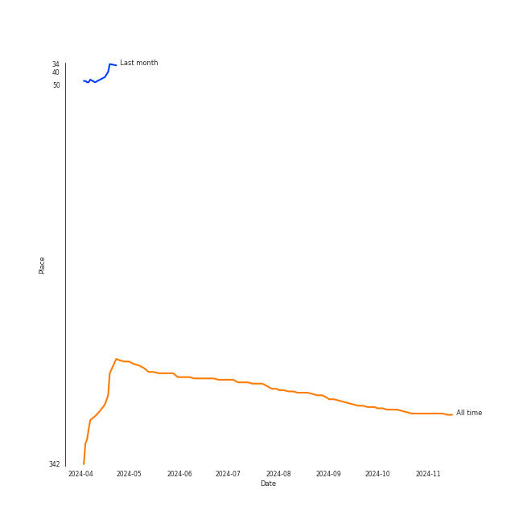
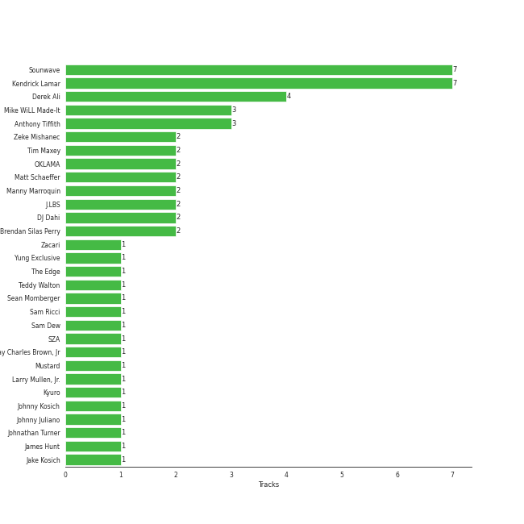

# Kendrick Lamar

[See Track Features](audio_features.md)

[See Clusters](clusters/overview.md)

## Relationships

Kendrick Lamar:
- is also known as OKLAMA

## Artist Rank

## Featured on Playlists
| Art | Tracks | Playlist |
|:---|---:|:---|
|  | 11 | [Hip Hop](../../playlists/hip_hop/overview.md) |
|  | 1 | [Beat Drop!](../../playlists/beat_drop!/overview.md) |
|  | 1 | [Sharon RPD](../../playlists/sharon_rpd/overview.md) |

## Top Albums

| Art | Tracks | 💚 | Album | Release Date | 🔗 |
|:---|---:|---:|:---|:---|:---|
|  | 3 | 3 | DAMN. | 2017-04-14 | [🔗](https://open.spotify.com/album/4eLPsYPBmXABThSJ821sqY) |
|  | 2 | 2 | Mr. Morale & The Big Steppers | 2022-05-13 | [🔗](https://open.spotify.com/album/79ONNoS4M9tfIA1mYLBYVX) |
|  | 1 | 1 | euphoria | 2024-04-30 | [🔗](https://open.spotify.com/album/32bR4LcEc1PvJEhaKoo4ZN) |
|  | 1 | 1 | Not Like Us | 2024-05-04 | [🔗](https://open.spotify.com/album/5JjnoGJyOxfSZUZtk2rRwZ) |
|  | 1 | 1 | Black Panther The Album Music From And Inspired By | 2018-02-09 | [🔗](https://open.spotify.com/album/3pLdWdkj83EYfDN6H2N8MR) |
|  | 1 | 0 | good kid, m.A.A.d city | 2012 | [🔗](https://open.spotify.com/album/6PBZN8cbwkqm1ERj2BGXJ1) |
|  | 1 | 0 | To Pimp A Butterfly | 2015-03-16 | [🔗](https://open.spotify.com/album/7ycBtnsMtyVbbwTfJwRjSP) |
|  | 1 | 0 | Rap Or Go To The League | 2019-03-01 | [🔗](https://open.spotify.com/album/1BR69wIifGZUSimcuTjWVg) |

## Top Record Labels

| Tracks | 💚 | Label |
|---:|---:|:---|
| 7 | 5 | [Aftermath](../../labels/aftermath/overview.md) |
| 2 | 2 | under exclusive license to Interscope Records |
| 2 | 2 | pgLang |
| 2 | 2 | Top Dawg Entertainment |
| 2 | 2 | Kendrick Lamar |
| 2 | 2 | [Interscope Records](../../labels/interscope_records/overview.md) |
| 1 | 1 | DMG) PS |
| 1 | 1 | Black Panther (TDE |
| 1 | 0 | Gamebread |
| 1 | 0 | [Def Jam Recordings](../../labels/def_jam_recordings/overview.md) |

## Genres

- conscious hip hop
- [hip hop](../../genres/hip_hop/overview.md)
- [rap](../../genres/rap/overview.md)
- west coast rap

## Credits

### Credits by Type

| Credit Type | Tracks |
|:---|---:|
| Producer | 2 |
| Songwriter | 6 |

### Production Credits

| Art | Track | Credit Types |
|:---|:---|:---|
|  | DNA. | Songwriter |
|  | LOVE. FEAT. ZACARI. | Songwriter |
|  | HUMBLE. | Songwriter |
|  | All The Stars (with SZA) | Songwriter |
|  | United In Grief | Songwriter, Producer |
|  | Count Me Out | Producer |
|  | Not Like Us | Songwriter |

## Top Producers

| Art | Producer | Tracks | Credit Types |
|:---|:---|---:|:---|
|  | [Kendrick Lamar](overview.md) | 6 | Songwriter |
| | [Sounwave](../../producers/sounwave/overview.md) | 6 | Producer, Songwriter, Arranger |
| | Derek Ali | 3 | Producer |
| | J.LBS | 2 | Producer, Songwriter |
| | [Manny Marroquin](../../producers/manny_marroquin/overview.md) | 2 | Producer |
| | Matt Schaeffer | 2 | Producer, Songwriter |
| | Mike WiLL Made-It | 2 | Producer, Songwriter |
| | OKLAMA | 2 | Producer |
| | Tim Maxey | 2 | Producer, Songwriter |
| | Anthony Tiffith | 2 | Producer, Songwriter |

View all

| Art | Producer | Tracks | Credit Types |
|:---|:---|---:|:---|
| | Cyrus "Nois" Taghipour | 1 | Producer |
| | Beach Noise | 1 | Producer |
| | Johnathan Turner | 1 | Producer |
|  | Zacari | 1 | Songwriter |
| | [Greg Kurstin](../../producers/greg_kurstin/overview.md) | 1 | Producer, Songwriter |
| | Duval Timothy | 1 | Producer, Songwriter |
| | Kyuro | 1 | Producer |
| | Sam Dew | 1 | Songwriter |
| | Zeke Mishanec | 1 | Producer |
| | Ezinma | 1 | Arranger |
| | Johnny Juliano | 1 | Producer |
| | Cardo | 1 | Producer |
| | Mustard | 1 | Producer, Songwriter |
| | DJ Dahi | 1 | Producer |
| | Johnny Kosich | 1 | Producer, Songwriter |
| | Sean Momberger | 1 | Producer |
| | Al Shux | 1 | Producer, Songwriter |
| | Jake Kosich | 1 | Songwriter |
| | Teddy Walton | 1 | Producer, Songwriter |
|  | SZA | 1 | Songwriter |
| | James Hunt | 1 | Producer |
| | Sam Ricci | 1 | Producer |
| | Brendan Silas Perry | 1 | Producer |
| | Ray Charles Brown, Jr | 1 | Producer |
| | Yung Exclusive | 1 | Producer |

## Tracks

| Art | Track | Album | Artists | Label | Rank | 💚 | 🔗 |
|:---|:---|:---|:---|:---|---:|:---|:---|
|  | Money Trees | good kid, m.A.A.d city | [Kendrick Lamar](overview.md), Jay Rock | [Aftermath](../../labels/aftermath) | nan | | [🔗](https://open.spotify.com/track/2HbKqm4o0w5wEeEFXm2sD4) |
|  | Alright | To Pimp A Butterfly | [Kendrick Lamar](overview.md) | [Aftermath](../../labels/aftermath) | nan | | [🔗](https://open.spotify.com/track/3iVcZ5G6tvkXZkZKlMpIUs) |
|  | DNA. | DAMN. | [Kendrick Lamar](overview.md) | [Aftermath](../../labels/aftermath) | nan | 💚 | [🔗](https://open.spotify.com/track/6HZILIRieu8S0iqY8kIKhj) |
|  | HUMBLE. | DAMN. | [Kendrick Lamar](overview.md) | [Aftermath](../../labels/aftermath) | nan | 💚 | [🔗](https://open.spotify.com/track/7KXjTSCq5nL1LoYtL7XAwS) |
|  | LOVE. FEAT. ZACARI. | DAMN. | [Kendrick Lamar](overview.md), Zacari | [Aftermath](../../labels/aftermath) | nan | 💚 | [🔗](https://open.spotify.com/track/6PGoSes0D9eUDeeAafB2As) |
|  | All The Stars (with SZA) | Black Panther The Album Music From And Inspired By | [Kendrick Lamar](overview.md), SZA | Black Panther (TDE/DMG) PS | nan | 💚 | [🔗](https://open.spotify.com/track/3GCdLUSnKSMJhs4Tj6CV3s) |
|  | Momma I Hit A Lick (feat. Kendrick Lamar) | Rap Or Go To The League | 2 Chainz, [Kendrick Lamar](overview.md) | [Gamebread, LLC / Def Jam Recordings](../../labels/def_jam_recordings) | nan | | [🔗](https://open.spotify.com/track/7jKUnzzOGhAlPjr7LkIUlE) |
|  | Count Me Out | Mr. Morale & The Big Steppers | [Kendrick Lamar](overview.md) | Top Dawg Entertainment, [Aftermath](../../labels/aftermath), [Interscope Records](../../labels/interscope_records), pgLang | nan | 💚 | [🔗](https://open.spotify.com/track/6BU1RZexmvJcBjgagVVt3M) |
|  | United In Grief | Mr. Morale & The Big Steppers | [Kendrick Lamar](overview.md) | Top Dawg Entertainment, [Aftermath](../../labels/aftermath), [Interscope Records](../../labels/interscope_records), pgLang | nan | 💚 | [🔗](https://open.spotify.com/track/5Gt9bxniM1SxN61yRzRhXL) |
|  | euphoria | euphoria | [Kendrick Lamar](overview.md) | Kendrick Lamar, under exclusive license to Interscope Records | nan | 💚 | [🔗](https://open.spotify.com/track/77DRzu7ERs0TX3roZcre7Q) |

See all tracks

| Art | Track | Album | Artists | Label | Rank | 💚 | 🔗 |
|:---|:---|:---|:---|:---|---:|:---|:---|
|  | Not Like Us | Not Like Us | [Kendrick Lamar](overview.md) | Kendrick Lamar, under exclusive license to Interscope Records | nan | 💚 | [🔗](https://open.spotify.com/track/6AI3ezQ4o3HUoP6Dhudph3) |

