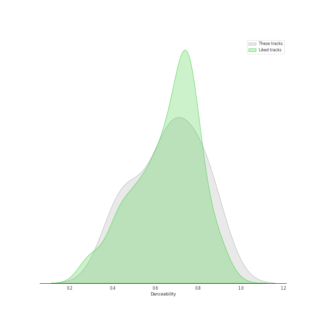
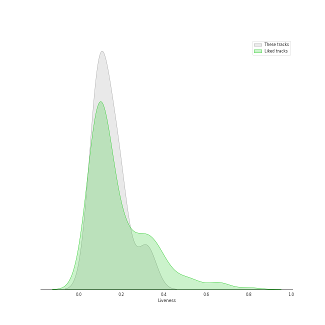
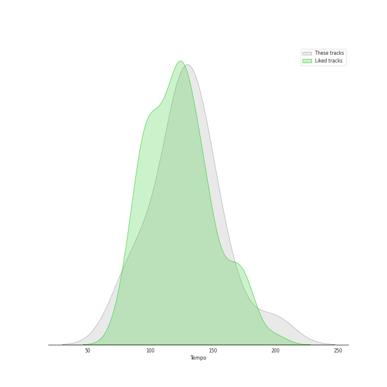

# Audio Features for Kimbra

## Danceability

| 10 most Danceable tracks | 10 least Danceable tracks |
|:---|:---|
| Somebody That I Used To Know (0.864) | Waltz Me to the Grave (0.394) |
| Good Intent (0.851) | foolish thinking (0.416) |
| replay! (0.806) | Like They Do on the TV (0.463) |
| la type (0.773) | Old Flame (0.476) |
| Recovery (0.767) | Plain Gold Ring (0.506) |
| Settle Down (0.763) | Top of the World (0.62) |
| Lightyears (0.682) | The Good War (0.646) |
| Limbo (0.675) | Two Way Street (0.646) |
| Cameo Lover (0.654) | Cameo Lover (0.654) |
| Two Way Street (0.646) | Limbo (0.675) |

## Energy

| 10 most Energetic tracks | 10 least Energetic tracks |
|:---|:---|
| Cameo Lover (0.922) | foolish thinking (0.176) |
| Like They Do on the TV (0.911) | Waltz Me to the Grave (0.352) |
| Recovery (0.8) | Plain Gold Ring (0.39) |
| Top of the World (0.762) | Somebody That I Used To Know (0.495) |
| Good Intent (0.709) | Old Flame (0.51) |
| Two Way Street (0.689) | The Good War (0.584) |
| Lightyears (0.669) | Limbo (0.588) |
| Settle Down (0.666) | replay! (0.612) |
| la type (0.642) | la type (0.642) |
| replay! (0.612) | Settle Down (0.666) |

## Speechiness

| 10 most Speechy tracks | 10 least Speechy tracks |
|:---|:---|
| la type (0.183) | Old Flame (0.0342) |
| Like They Do on the TV (0.134) | The Good War (0.0343) |
| replay! (0.0813) | foolish thinking (0.0366) |
| Recovery (0.0781) | Somebody That I Used To Know (0.037) |
| Limbo (0.0634) | Plain Gold Ring (0.0375) |
| Settle Down (0.0537) | Lightyears (0.0377) |
| Waltz Me to the Grave (0.0522) | Two Way Street (0.0389) |
| Top of the World (0.0507) | Good Intent (0.0408) |
| Cameo Lover (0.0498) | Cameo Lover (0.0498) |
| Good Intent (0.0408) | Top of the World (0.0507) |

## Acousticness

| 10 most Acoustic tracks | 10 least Acoustic tracks |
|:---|:---|
| foolish thinking (0.917) | Recovery (0.00747) |
| Plain Gold Ring (0.9) | Lightyears (0.0114) |
| Somebody That I Used To Know (0.592) | The Good War (0.0208) |
| Waltz Me to the Grave (0.374) | replay! (0.0305) |
| Old Flame (0.288) | la type (0.0685) |
| Good Intent (0.183) | Settle Down (0.0791) |
| Limbo (0.157) | Top of the World (0.11) |
| Cameo Lover (0.156) | Like They Do on the TV (0.11) |
| Two Way Street (0.145) | Two Way Street (0.145) |
| Like They Do on the TV (0.11) | Cameo Lover (0.156) |

## Instrumentalness

| 10 most Instrumental tracks | 10 least Instrumental tracks |
|:---|:---|
| Like They Do on the TV (0.114) | The Good War (0.0) |
| Top of the World (0.0626) | la type (0.0) |
| Lightyears (0.0149) | Cameo Lover (0.0) |
| foolish thinking (0.00957) | Two Way Street (0.0) |
| Recovery (0.00245) | Settle Down (2.98e-06) |
| replay! (0.00234) | Old Flame (3.75e-06) |
| Plain Gold Ring (0.00222) | Good Intent (4.84e-06) |
| Waltz Me to the Grave (0.0014) | Somebody That I Used To Know (0.000138) |
| Limbo (0.000381) | Limbo (0.000381) |
| Somebody That I Used To Know (0.000138) | Waltz Me to the Grave (0.0014) |

## Liveness

| 10 most Live tracks | 10 least Live tracks |
|:---|:---|
| Old Flame (0.305) | replay! (0.063) |
| Good Intent (0.204) | Lightyears (0.0731) |
| Waltz Me to the Grave (0.196) | Settle Down (0.0733) |
| Top of the World (0.188) | The Good War (0.0832) |
| Plain Gold Ring (0.18) | Recovery (0.0893) |
| Limbo (0.16) | Somebody That I Used To Know (0.0992) |
| la type (0.134) | foolish thinking (0.104) |
| Cameo Lover (0.128) | Like They Do on the TV (0.111) |
| Two Way Street (0.121) | Two Way Street (0.121) |
| Like They Do on the TV (0.111) | Cameo Lover (0.128) |

## Valence

| 10 most Happy tracks | 10 least Happy tracks |
|:---|:---|
| Good Intent (0.834) | Waltz Me to the Grave (0.0748) |
| Recovery (0.771) | The Good War (0.0928) |
| la type (0.761) | Old Flame (0.0932) |
| Somebody That I Used To Know (0.719) | Top of the World (0.304) |
| Cameo Lover (0.669) | foolish thinking (0.307) |
| Like They Do on the TV (0.645) | Lightyears (0.328) |
| Two Way Street (0.57) | Plain Gold Ring (0.348) |
| Limbo (0.53) | Settle Down (0.449) |
| replay! (0.457) | replay! (0.457) |
| Settle Down (0.449) | Limbo (0.53) |

## Tempo

| 10 most Fast tracks | 10 least Fast tracks |
|:---|:---|
| Like They Do on the TV (199.23) | Old Flame (77.61) |
| Limbo (165.02) | Plain Gold Ring (85.304) |
| Top of the World (150.039) | Settle Down (93.994) |
| la type (149.062) | Lightyears (110.009) |
| The Good War (145.06) | Two Way Street (111.218) |
| Recovery (138.884) | Good Intent (122.036) |
| Waltz Me to the Grave (129.953) | foolish thinking (124.814) |
| Somebody That I Used To Know (129.057) | Cameo Lover (127.047) |
| replay! (127.996) | replay! (127.996) |
| Cameo Lover (127.047) | Somebody That I Used To Know (129.057) |
