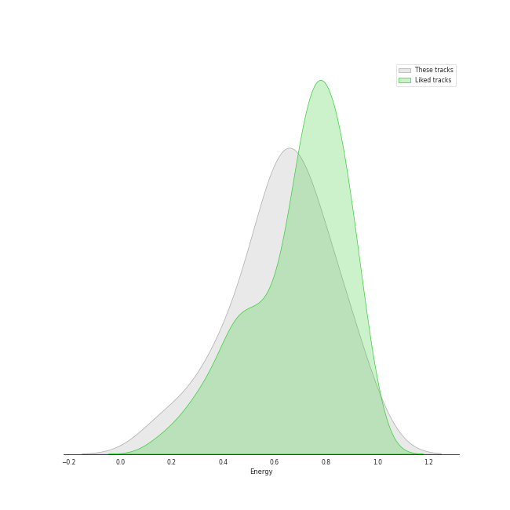
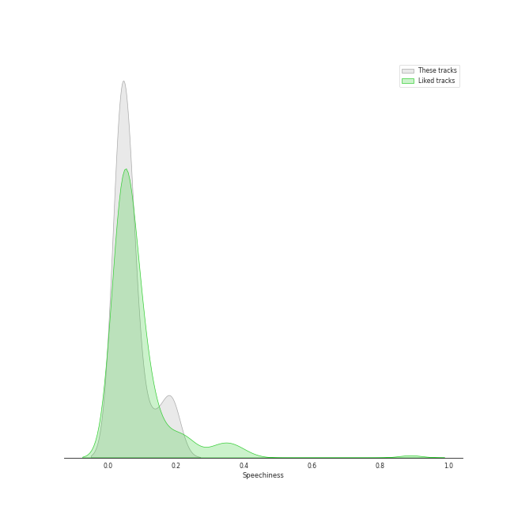
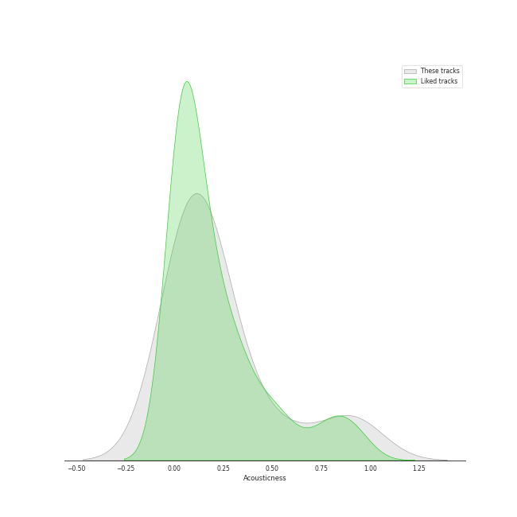
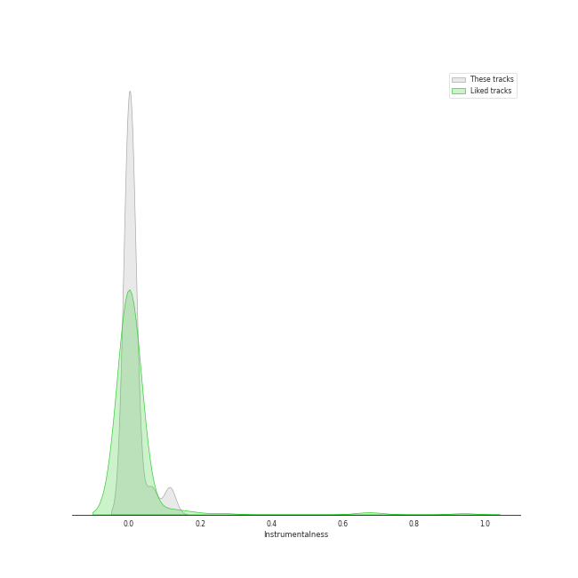
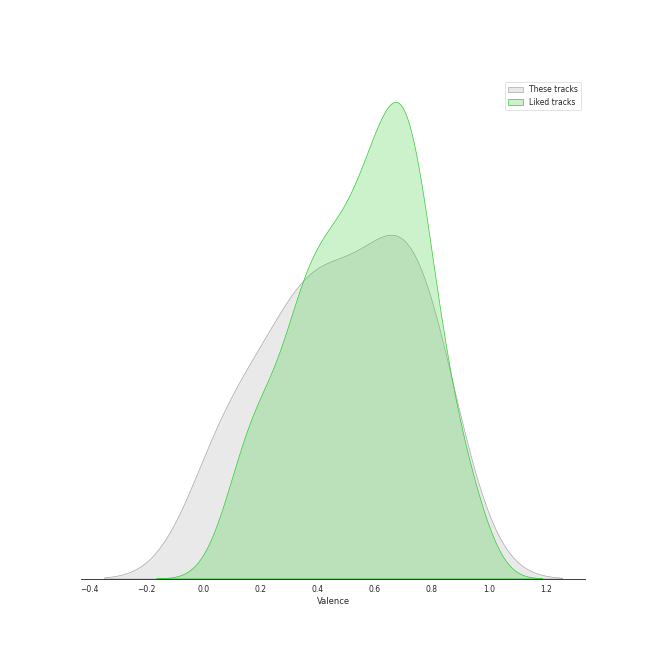

# Audio Features for Kimbra

## Danceability

| ​ | 10 most Danceable tracks | ​​ | 10 least Danceable tracks |
|:---|:---|:---|:---|
|  | Somebody That I Used To Know (0.864) |  | Waltz Me to the Grave (0.394) |
|  | Good Intent (0.851) |  | foolish thinking (0.416) |
|  | replay! (0.806) |  | Like They Do on the TV (0.463) |
|  | la type (0.773) |  | Old Flame (0.476) |
|  | Recovery (0.767) |  | Plain Gold Ring (0.506) |
|  | Settle Down (0.763) |  | Top of the World (0.62) |
|  | Lightyears (0.682) |  | The Good War (0.646) |
|  | Limbo (0.675) |  | Two Way Street (0.646) |
|  | Cameo Lover (0.654) |  | Cameo Lover (0.654) |
|  | Two Way Street (0.646) |  | Limbo (0.675) |

## Energy

| ​ | 10 most Energetic tracks | ​​ | 10 least Energetic tracks |
|:---|:---|:---|:---|
|  | Cameo Lover (0.922) |  | foolish thinking (0.176) |
|  | Like They Do on the TV (0.911) |  | Waltz Me to the Grave (0.352) |
|  | Recovery (0.8) |  | Plain Gold Ring (0.39) |
|  | Top of the World (0.762) |  | Somebody That I Used To Know (0.495) |
|  | Good Intent (0.709) |  | Old Flame (0.51) |
|  | Two Way Street (0.689) |  | The Good War (0.584) |
|  | Lightyears (0.669) |  | Limbo (0.588) |
|  | Settle Down (0.666) |  | replay! (0.612) |
|  | la type (0.642) |  | la type (0.642) |
|  | replay! (0.612) |  | Settle Down (0.666) |

## Speechiness

| ​ | 10 most Speechy tracks | ​​ | 10 least Speechy tracks |
|:---|:---|:---|:---|
|  | la type (0.183) |  | Old Flame (0.0342) |
|  | Like They Do on the TV (0.134) |  | The Good War (0.0343) |
|  | replay! (0.0813) |  | foolish thinking (0.0366) |
|  | Recovery (0.0781) |  | Somebody That I Used To Know (0.037) |
|  | Limbo (0.0634) |  | Plain Gold Ring (0.0375) |
|  | Settle Down (0.0537) |  | Lightyears (0.0377) |
|  | Waltz Me to the Grave (0.0522) |  | Two Way Street (0.0389) |
|  | Top of the World (0.0507) |  | Good Intent (0.0408) |
|  | Cameo Lover (0.0498) |  | Cameo Lover (0.0498) |
|  | Good Intent (0.0408) |  | Top of the World (0.0507) |

## Acousticness

| ​ | 10 most Acoustic tracks | ​​ | 10 least Acoustic tracks |
|:---|:---|:---|:---|
|  | foolish thinking (0.917) |  | Recovery (0.00747) |
|  | Plain Gold Ring (0.9) |  | Lightyears (0.0114) |
|  | Somebody That I Used To Know (0.592) |  | The Good War (0.0208) |
|  | Waltz Me to the Grave (0.374) |  | replay! (0.0305) |
|  | Old Flame (0.288) |  | la type (0.0685) |
|  | Good Intent (0.183) |  | Settle Down (0.0791) |
|  | Limbo (0.157) |  | Top of the World (0.11) |
|  | Cameo Lover (0.156) |  | Like They Do on the TV (0.11) |
|  | Two Way Street (0.145) |  | Two Way Street (0.145) |
|  | Like They Do on the TV (0.11) |  | Cameo Lover (0.156) |

## Instrumentalness

| ​ | 10 most Instrumental tracks | ​​ | 10 least Instrumental tracks |
|:---|:---|:---|:---|
|  | Like They Do on the TV (0.114) |  | The Good War (0.0) |
|  | Top of the World (0.0626) |  | la type (0.0) |
|  | Lightyears (0.0149) |  | Cameo Lover (0.0) |
|  | foolish thinking (0.00957) |  | Two Way Street (0.0) |
|  | Recovery (0.00245) |  | Settle Down (2.98e-06) |
|  | replay! (0.00234) |  | Old Flame (3.75e-06) |
|  | Plain Gold Ring (0.00222) |  | Good Intent (4.84e-06) |
|  | Waltz Me to the Grave (0.0014) |  | Somebody That I Used To Know (0.000138) |
|  | Limbo (0.000381) |  | Limbo (0.000381) |
|  | Somebody That I Used To Know (0.000138) |  | Waltz Me to the Grave (0.0014) |

## Liveness

| ​ | 10 most Live tracks | ​​ | 10 least Live tracks |
|:---|:---|:---|:---|
|  | Old Flame (0.305) |  | replay! (0.063) |
|  | Good Intent (0.204) |  | Lightyears (0.0731) |
|  | Waltz Me to the Grave (0.196) |  | Settle Down (0.0733) |
|  | Top of the World (0.188) |  | The Good War (0.0832) |
|  | Plain Gold Ring (0.18) |  | Recovery (0.0893) |
|  | Limbo (0.16) |  | Somebody That I Used To Know (0.0992) |
|  | la type (0.134) |  | foolish thinking (0.104) |
|  | Cameo Lover (0.128) |  | Like They Do on the TV (0.111) |
|  | Two Way Street (0.121) |  | Two Way Street (0.121) |
|  | Like They Do on the TV (0.111) |  | Cameo Lover (0.128) |

## Valence

| ​ | 10 most Happy tracks | ​​ | 10 least Happy tracks |
|:---|:---|:---|:---|
|  | Good Intent (0.834) |  | Waltz Me to the Grave (0.0748) |
|  | Recovery (0.771) |  | The Good War (0.0928) |
|  | la type (0.761) |  | Old Flame (0.0932) |
|  | Somebody That I Used To Know (0.719) |  | Top of the World (0.304) |
|  | Cameo Lover (0.669) |  | foolish thinking (0.307) |
|  | Like They Do on the TV (0.645) |  | Lightyears (0.328) |
|  | Two Way Street (0.57) |  | Plain Gold Ring (0.348) |
|  | Limbo (0.53) |  | Settle Down (0.449) |
|  | replay! (0.457) |  | replay! (0.457) |
|  | Settle Down (0.449) |  | Limbo (0.53) |

## Tempo

| ​ | 10 most Fast tracks | ​​ | 10 least Fast tracks |
|:---|:---|:---|:---|
|  | Like They Do on the TV (199.23) |  | Old Flame (77.61) |
|  | Limbo (165.02) |  | Plain Gold Ring (85.304) |
|  | Top of the World (150.039) |  | Settle Down (93.994) |
|  | la type (149.062) |  | Lightyears (110.009) |
|  | The Good War (145.06) |  | Two Way Street (111.218) |
|  | Recovery (138.884) |  | Good Intent (122.036) |
|  | Waltz Me to the Grave (129.953) |  | foolish thinking (124.814) |
|  | Somebody That I Used To Know (129.057) |  | Cameo Lover (127.047) |
|  | replay! (127.996) |  | replay! (127.996) |
|  | Cameo Lover (127.047) |  | Somebody That I Used To Know (129.057) |
