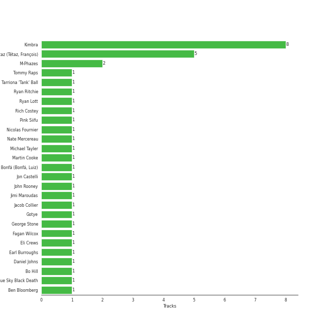

# Kimbra

[See Track Features](audio_features.md)

[See Clusters](clusters/overview.md)

## Artist Rank

## Top Tracks

- Limbo is:
    - the #47 track of the last month
## Featured on Playlists
| Art | Tracks | Playlist |
|:---|---:|:---|
|  | 17 | [Alt-Pop](../../playlists/alt_pop/overview.md) |
|  | 9 | [Singer-Songwriter](../../playlists/singer_songwriter/overview.md) |
|  | 1 | [Pop](../../playlists/pop/overview.md) |
|  | 1 | [Karaoke](../../playlists/karaoke/overview.md) |
|  | 1 | [Tarps](../../playlists/tarps/overview.md) |

## Top Albums

| Art | Tracks | 💚 | Album | Release Date | 🔗 |
|:---|---:|---:|:---|:---|:---|
|  | 7 | 7 | Vows (Deluxe Version) | 2011 | [🔗](https://open.spotify.com/album/6V9rvW05Um5bIHePPfeI8p) |
|  | 5 | 0 | Primal Heart | 2018-04-20 | [🔗](https://open.spotify.com/album/4pj0BkJ7u39i009oqe8V79) |
|  | 3 | 1 | A Reckoning | 2023-01-27 | [🔗](https://open.spotify.com/album/2LXTIciAcMZ6wa96d9sLnM) |
|  | 1 | 1 | The Golden Echo | 2014-08-15 | [🔗](https://open.spotify.com/album/66hoUkjxM7tVQwu7bZocwP) |
|  | 1 | 1 | Aussie Legends | 2019-11-22 | [🔗](https://open.spotify.com/album/3IGRFGa4ErR0CU8aMMrRql) |

## Top Record Labels

| Tracks | 💚 | Label |
|---:|---:|:---|
| 13 | 8 | [Warner Records](../../labels/warner_records/overview.md) |
| 3 | 1 | Kimbra |
| 1 | 1 | UMG Recordings |

## Genres

- bergen indie
- [electropop](../../genres/electropop/overview.md)
- nz pop

## Credits

### Credits by Type

| Credit Type | Tracks |
|:---|---:|
| Lyricist | 7 |
| Producer | 5 |
| Songwriter | 7 |
| Vocal | 1 |

### Production Credits

| Art | Track | Credit Types |
|:---|:---|:---|
|  | Good Intent | Lyricist, Songwriter |
|  | Old Flame | Lyricist, Producer, Songwriter |
|  | Settle Down | Lyricist, Songwriter |
|  | Cameo Lover | Lyricist, Producer, Songwriter |
|  | Two Way Street | Lyricist, Producer, Songwriter |
|  | Waltz Me to the Grave | Lyricist, Producer, Songwriter |
|  | LA Type | Lyricist, Producer, Songwriter |

## Top Producers

| Art | Producer | Tracks | Credit Types |
|:---|:---|---:|:---|
|  | [Kimbra](overview.md) | 7 | Lyricist, Producer, Songwriter |
| | François Tétaz (Tétaz, François) | 5 | Lyricist, Producer, Songwriter |
| | M-Phazes | 2 | Producer |
| | Bo Hill | 1 | Producer |
| | Luiz Bonfá (Bonfá, Luiz) | 1 | Songwriter |
| | Fagan Wilcox | 1 | Producer |
|  | Pink Siifu | 1 | Lyricist, Songwriter |
| | Rich Costey | 1 | Producer |
| | Ryan Ritchie | 1 | Producer |
| | Nicolas Fournier | 1 | Producer |

View all

| Art | Producer | Tracks | Credit Types |
|:---|:---|---:|:---|
| | Nate Mercereau | 1 | Producer, Songwriter |
| | Daniel Johns | 1 | Songwriter |
| | Jon Castelli | 1 | Producer |
| | Michael Tayler | 1 | Producer |
| | Blue Sky Black Death | 1 | Songwriter |
| | George Stone | 1 | Lyricist, Songwriter |
| | John Rooney | 1 | Producer |
|  | Ryan Lott | 1 | Producer |
| | Jimi Maroudas | 1 | Producer |
| | Tommy Raps | 1 | Lyricist, Songwriter |
| | Earl Burroughs | 1 | Songwriter |
| | Martin Cooke | 1 | Producer |
| | Eli Crews | 1 | Producer |
|  | Gotye | 1 | Lyricist, Songwriter |

## Tracks

| Art | Track | Album | Artists | Label | 💚 | 🔗 |
|:---|:---|:---|:---|:---|:---|:---|
|  | Somebody That I Used To Know | Aussie Legends | Gotye, [Kimbra](overview.md) | UMG Recordings, Inc. | 💚 | [🔗](https://open.spotify.com/track/54ZV2zBKOn1EVDUs7Jvf2F) |
|  | Cameo Lover | Vows (Deluxe Version) | [Kimbra](overview.md) | [Warner Records](../../labels/warner_records) | 💚 | [🔗](https://open.spotify.com/track/6mEDMe0zG5pYrsRxizjauk) |
|  | Good Intent | Vows (Deluxe Version) | [Kimbra](overview.md) | [Warner Records](../../labels/warner_records) | 💚 | [🔗](https://open.spotify.com/track/5vLJID1JbJEpYdYLWIGVXf) |
|  | Limbo | Vows (Deluxe Version) | [Kimbra](overview.md) | [Warner Records](../../labels/warner_records) | 💚 | [🔗](https://open.spotify.com/track/6go4VH47IaXtYlTGHizjhm) |
|  | Old Flame | Vows (Deluxe Version) | [Kimbra](overview.md) | [Warner Records](../../labels/warner_records) | 💚 | [🔗](https://open.spotify.com/track/6bGCWZagdKs2yZKt4H3IlV) |
|  | Plain Gold Ring | Vows (Deluxe Version) | [Kimbra](overview.md) | [Warner Records](../../labels/warner_records) | 💚 | [🔗](https://open.spotify.com/track/55RJLcVGohfyfuSP4EyE1I) |
|  | Settle Down | Vows (Deluxe Version) | [Kimbra](overview.md) | [Warner Records](../../labels/warner_records) | 💚 | [🔗](https://open.spotify.com/track/6cdslY3YKjh7pImxFhSBVG) |
|  | Two Way Street | Vows (Deluxe Version) | [Kimbra](overview.md) | [Warner Records](../../labels/warner_records) | 💚 | [🔗](https://open.spotify.com/track/7ptSTFAis4UckLAfUrMfM0) |
|  | Waltz Me to the Grave | The Golden Echo | [Kimbra](overview.md) | [Warner Records](../../labels/warner_records) | 💚 | [🔗](https://open.spotify.com/track/2p7QlaQFpB2YFwdvt2ArtD) |
|  | Lightyears | Primal Heart | [Kimbra](overview.md) | [Warner Records](../../labels/warner_records) | | [🔗](https://open.spotify.com/track/0lArgFRoTvsmrt7A6DzMXL) |

See all tracks

| Art | Track | Album | Artists | Label | 💚 | 🔗 |
|:---|:---|:---|:---|:---|:---|:---|
|  | Like They Do on the TV | Primal Heart | [Kimbra](overview.md) | [Warner Records](../../labels/warner_records) | | [🔗](https://open.spotify.com/track/28FSs3VqsHiEGa8dIfnG2T) |
|  | Recovery | Primal Heart | [Kimbra](overview.md) | [Warner Records](../../labels/warner_records) | | [🔗](https://open.spotify.com/track/0HqtTIH9Eo7IdTiiFvpdjM) |
|  | The Good War | Primal Heart | [Kimbra](overview.md) | [Warner Records](../../labels/warner_records) | | [🔗](https://open.spotify.com/track/3Py6qWHKkcdBEVcYThxhp9) |
|  | Top of the World | Primal Heart | [Kimbra](overview.md) | [Warner Records](../../labels/warner_records) | | [🔗](https://open.spotify.com/track/1Gbdx88ElOui7lczwxGX6m) |
|  | Foolish Thinking | A Reckoning | [Kimbra](overview.md), Ryan Lott | Kimbra | | [🔗](https://open.spotify.com/track/2TVMfEi6tqg5cxrg18n21s) |
|  | LA Type | A Reckoning | [Kimbra](overview.md), Tommy Raps, Pink Siifu | Kimbra | 💚 | [🔗](https://open.spotify.com/track/5itleMdzr78LXcwibYZkwP) |
|  | Replay! | A Reckoning | [Kimbra](overview.md) | Kimbra | | [🔗](https://open.spotify.com/track/4wJq9Vut5WktGLIo02IYA2) |

