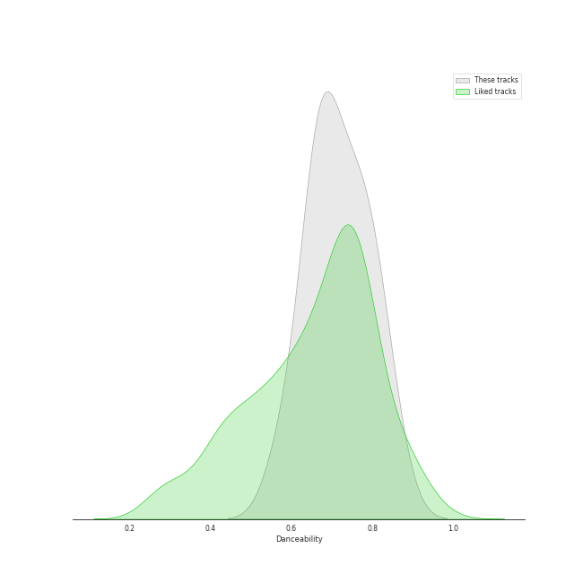
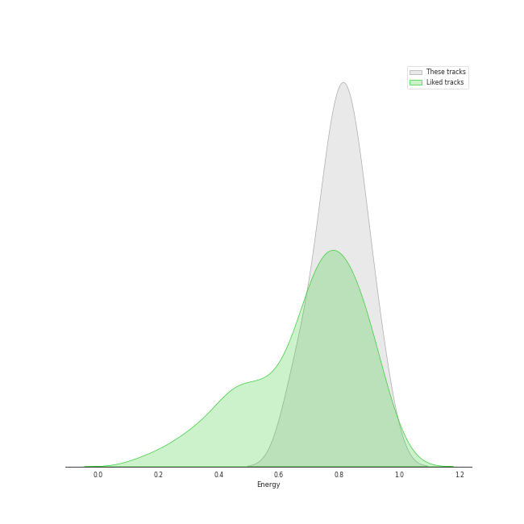
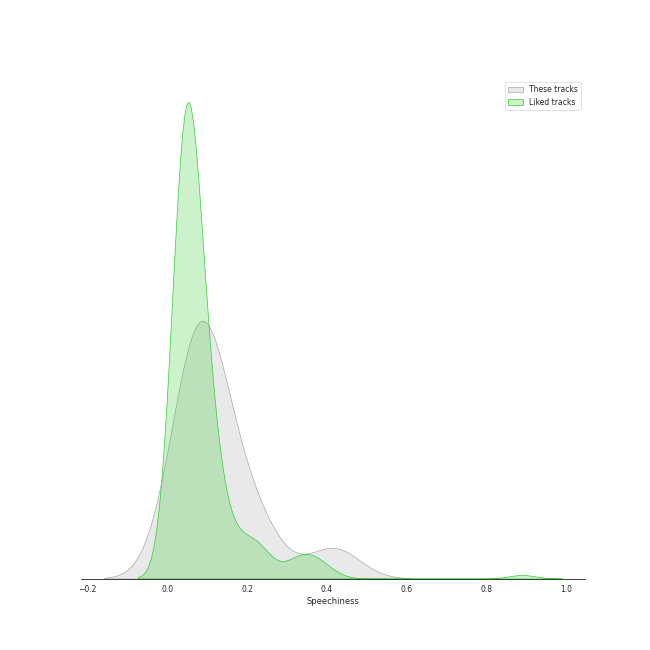
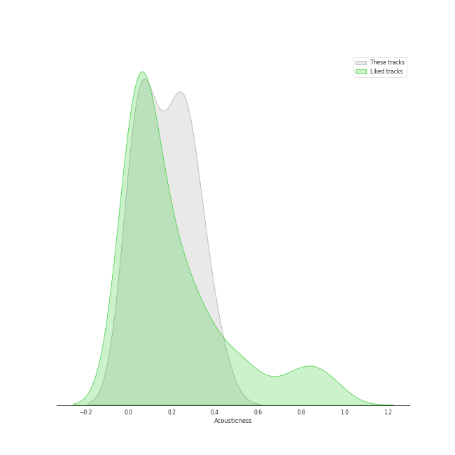
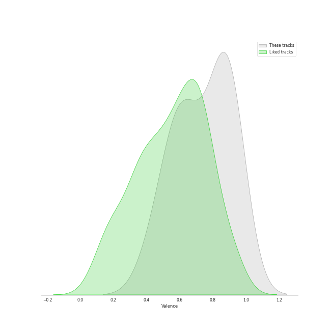
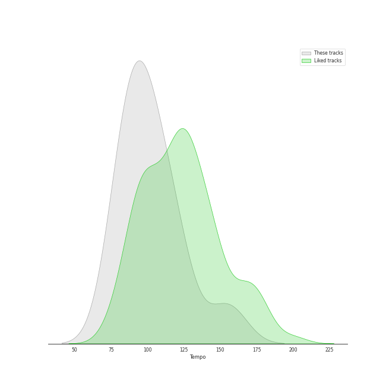

# Track Features for KISS OF LIFE

## Danceability

| ​ | 10 most Danceable tracks | ​​ | 10 least Danceable tracks |
|:---|:---|:---|:---|
|  | Igloo (0.916) |  | Bad News (0.581) |
|  | Get Loud (0.845) |  | Back To Me (0.651) |
|  | Shhh (0.796) |  | Nobody Knows (0.655) |
|  | Midas Touch (0.796) |  | Gentleman (0.662) |
|  | Too Many Alex (0.776) |  | Sugarcoat (NATTY Solo) (0.663) |
|  | No One But Us (0.773) |  | My 808 (0.667) |
|  | Countdown (BELLE Solo) (0.77) |  | Sticky (0.702) |
|  | Te Quiero (0.741) |  | Kitty Cat (JULIE Solo) (0.719) |
|  | R.E.M (0.734) |  | Chemistry (0.721) |
|  | Chemistry (0.721) |  | R.E.M (0.734) |

## Energy

| ​ | 10 most Energetic tracks | ​​ | 10 least Energetic tracks |
|:---|:---|:---|:---|
|  | Too Many Alex (0.951) |  | R.E.M (0.593) |
|  | Gentleman (0.941) |  | Igloo (0.609) |
|  | Midas Touch (0.9) |  | Nobody Knows (0.646) |
|  | Countdown (BELLE Solo) (0.858) |  | No One But Us (0.666) |
|  | Bad News (0.857) |  | Sticky (0.701) |
|  | Get Loud (0.829) |  | Back To Me (0.718) |
|  | Sugarcoat (NATTY Solo) (0.82) |  | Chemistry (0.729) |
|  | My 808 (0.801) |  | Kitty Cat (JULIE Solo) (0.752) |
|  | Te Quiero (0.78) |  | Shhh (0.758) |
|  | Shhh (0.758) |  | Te Quiero (0.78) |

## Speechiness

| ​ | 10 most Speechy tracks | ​​ | 10 least Speechy tracks |
|:---|:---|:---|:---|
|  | Countdown (BELLE Solo) (0.417) |  | Back To Me (0.0353) |
|  | Bad News (0.233) |  | Sugarcoat (NATTY Solo) (0.0362) |
|  | Too Many Alex (0.221) |  | R.E.M (0.0513) |
|  | Igloo (0.217) |  | Chemistry (0.0517) |
|  | Kitty Cat (JULIE Solo) (0.192) |  | Midas Touch (0.052) |
|  | No One But Us (0.183) |  | My 808 (0.062) |
|  | Shhh (0.117) |  | Te Quiero (0.0742) |
|  | Nobody Knows (0.116) |  | Sticky (0.0758) |
|  | Get Loud (0.104) |  | Gentleman (0.103) |
|  | Gentleman (0.103) |  | Get Loud (0.104) |

## Acousticness

| ​ | 10 most Acoustic tracks | ​​ | 10 least Acoustic tracks |
|:---|:---|:---|:---|
|  | R.E.M (0.405) |  | Back To Me (0.0104) |
|  | Sticky (0.391) |  | My 808 (0.0322) |
|  | Te Quiero (0.299) |  | Sugarcoat (NATTY Solo) (0.0339) |
|  | Nobody Knows (0.278) |  | Midas Touch (0.0513) |
|  | Bad News (0.249) |  | Kitty Cat (JULIE Solo) (0.0545) |
|  | Countdown (BELLE Solo) (0.249) |  | Too Many Alex (0.0739) |
|  | Gentleman (0.202) |  | Get Loud (0.0799) |
|  | Chemistry (0.184) |  | No One But Us (0.109) |
|  | Igloo (0.168) |  | Shhh (0.156) |
|  | Shhh (0.156) |  | Igloo (0.168) |

## Instrumentalness

| ​ | 10 most Instrumental tracks | ​​ | 10 least Instrumental tracks |
|:---|:---|:---|:---|
|  | Too Many Alex (6.84e-05) |  | No One But Us (0.0) |
|  | Back To Me (5.02e-05) |  | Sugarcoat (NATTY Solo) (0.0) |
|  | Gentleman (3.27e-05) |  | R.E.M (0.0) |
|  | My 808 (3.24e-05) |  | Midas Touch (0.0) |
|  | Shhh (2.65e-06) |  | Igloo (0.0) |
|  | Get Loud (0.0) |  | Countdown (BELLE Solo) (0.0) |
|  | Bad News (0.0) |  | Sticky (0.0) |
|  | Nobody Knows (0.0) |  | Te Quiero (0.0) |
|  | Kitty Cat (JULIE Solo) (0.0) |  | Chemistry (0.0) |
|  | Chemistry (0.0) |  | Kitty Cat (JULIE Solo) (0.0) |

## Liveness

| ​ | 10 most Live tracks | ​​ | 10 least Live tracks |
|:---|:---|:---|:---|
|  | Countdown (BELLE Solo) (0.376) |  | Get Loud (0.0592) |
|  | No One But Us (0.36) |  | Shhh (0.0622) |
|  | Bad News (0.171) |  | Kitty Cat (JULIE Solo) (0.0685) |
|  | Nobody Knows (0.156) |  | Chemistry (0.0713) |
|  | Te Quiero (0.155) |  | My 808 (0.0724) |
|  | Sticky (0.132) |  | Too Many Alex (0.0738) |
|  | Midas Touch (0.118) |  | Igloo (0.0906) |
|  | Gentleman (0.107) |  | Sugarcoat (NATTY Solo) (0.0974) |
|  | R.E.M (0.104) |  | Back To Me (0.0991) |
|  | Back To Me (0.0991) |  | R.E.M (0.104) |

## Valence

| ​ | 10 most Happy tracks | ​​ | 10 least Happy tracks |
|:---|:---|:---|:---|
|  | Back To Me (0.951) |  | Te Quiero (0.44) |
|  | Gentleman (0.939) |  | R.E.M (0.497) |
|  | Nobody Knows (0.927) |  | Sugarcoat (NATTY Solo) (0.568) |
|  | Get Loud (0.879) |  | My 808 (0.573) |
|  | Bad News (0.879) |  | Sticky (0.595) |
|  | Igloo (0.873) |  | Countdown (BELLE Solo) (0.686) |
|  | Midas Touch (0.854) |  | Kitty Cat (JULIE Solo) (0.694) |
|  | Shhh (0.829) |  | Chemistry (0.737) |
|  | No One But Us (0.806) |  | Too Many Alex (0.767) |
|  | Too Many Alex (0.767) |  | No One But Us (0.806) |

## Tempo

| ​ | 10 most Fast tracks | ​​ | 10 least Fast tracks |
|:---|:---|:---|:---|
|  | Gentleman (155.104) |  | Countdown (BELLE Solo) (79.983) |
|  | Igloo (139.912) |  | Chemistry (80.014) |
|  | R.E.M (137.922) |  | Kitty Cat (JULIE Solo) (82.577) |
|  | Back To Me (125.943) |  | Bad News (83.687) |
|  | Te Quiero (120.037) |  | Nobody Knows (90.055) |
|  | Midas Touch (118.969) |  | Sugarcoat (NATTY Solo) (94.019) |
|  | Get Loud (110.02) |  | My 808 (97.024) |
|  | No One But Us (105.974) |  | Sticky (99.971) |
|  | Too Many Alex (100.03) |  | Shhh (99.98) |
|  | Shhh (99.98) |  | Too Many Alex (100.03) |
