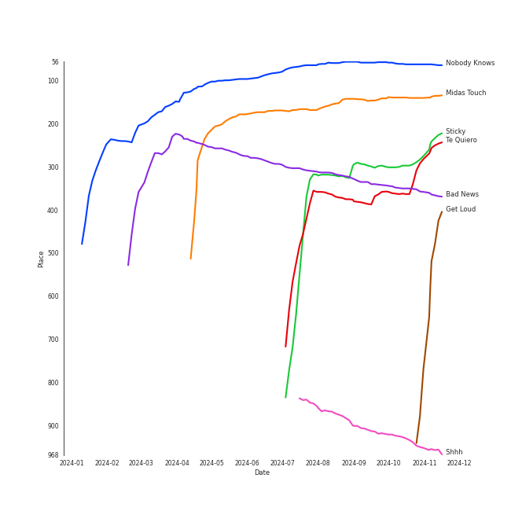
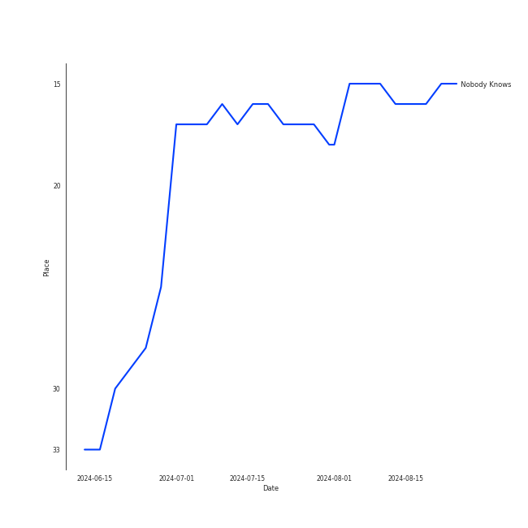
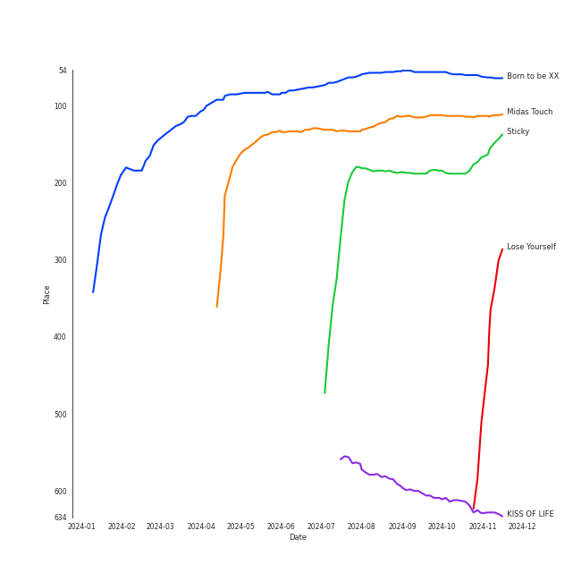

# KISS OF LIFE

[See Track Features](audio_features.md)

[See Clusters](clusters/overview.md)

## Relationships

KISS OF LIFE:
- has member Belle
- has member Julie Han
- has member 하늘 (Haneul)
- has member Natty

## Artist Rank
KISS OF LIFE is currently:
- The #18 artist of the last month
- The #21 artist of the last 6 months
- The #27 artist of the last year
- The #51 artist of all time

## Top Tracks

### Top tracks of all time

Top tracks of the last year over time

Top tracks of the last 6 months over time

## Top Albums

| Art | Rank | Tracks | 💚 | Album | Release Date | 🔗 |
|:---|---:|---:|---:|:---|:---|:---|
|  | 569 | 4 | 3 | KISS OF LIFE | 2023-07-05 | [🔗](https://open.spotify.com/album/5k34rAvlw3WV7Kh6dAZnxG) |
|  | 63 | 4 | 3 | Born to be XX | 2023-11-08 | [🔗](https://open.spotify.com/album/6yDtQxvq1XRC7Y5qtS03Xx) |
|  | 186 | 2 | 1 | Sticky | 2024-07-01 | [🔗](https://open.spotify.com/album/3p68B7ZhETVmNbOov8JcF5) |
|  | 141 | 1 | 1 | Midas Touch | 2024-04-03 | [🔗](https://open.spotify.com/album/1HfTA0xDoZ0mswFO3GB3ef) |

## Featured on Playlists
| Art | Tracks | Playlist |
|:---|---:|:---|
|  | 11 | [K-Pop](../../playlists/k-pop/overview.md) |
|  | 4 | [K-Pop Favorites](../../playlists/k-pop_favorites/overview.md) |
|  | 3 | [Recent Comebacks](../../playlists/recent_comebacks/overview.md) |
|  | 1 | [Funk](../../playlists/funk/overview.md) |
|  | 1 | [Summer](../../playlists/summer/overview.md) |
|  | 1 | [On Repeat](../../playlists/on_repeat/overview.md) |
|  | 1 | [Recommendations for Chris](../../playlists/recommendations_for_chris/overview.md) |

## Top Record Labels

| Tracks | 💚 | Label |
|---:|---:|:---|
| 11 | 8 | [S2 ENTERTAINMENT INC.](../../labels/s2_entertainment_inc_/overview.md) |

## Genres

- [5th gen k-pop](../../genres/5th_gen_k-pop/overview.md)
- [k-pop girl group](../../genres/k-pop_girl_group/overview.md)

## Credits

### Credits by Type

| Credit Type | Tracks |
|:---|---:|
| Performer | 7 |

### Member Credits

| | Belle | Julie Han | Natty | 하늘 (Haneul) |
|:---|---:|---:|---:|---:|
| Lyricist | 4 | 2 | 0 | 0 |
| Songwriter | 4 | 0 | 1 | 0 |
| Vocal | 7 | 5 | 6 | 5 |
### Production Credits

| Art | Track | Members | Credit Types |
|:---|:---|:---|:---|
|  | UNFORGIVEN (feat. Nile Rodgers) | Belle | Lyricist, Songwriter |
|  | Countdown (BELLE Solo) | Belle | Lyricist, Songwriter |
|  | Shhh | Belle, Natty, Julie Han | Lyricist, Songwriter |
|  | Nobody Knows | Julie Han | Lyricist |
| | nan | Belle | Lyricist, Songwriter |

## Top Producers

| Art | Producer | Tracks | Credit Types |
|:---|:---|---:|:---|
| | [조윤경 (Jo, Yoon Kyung)](../../producers/조윤경_(jo,_yoon_kyung)/overview.md) | 3 | Lyricist |
| | Belle | 2 | Lyricist, Songwriter |
| | Rick Bridges | 2 | Lyricist, Songwriter |
| | Julie Han | 2 | Lyricist |
| | PAPRIKAA | 1 | Arranger, Songwriter |
| | Royal Dive | 1 | Arranger, Songwriter |
| | Adam von Mentzer | 1 | Songwriter |
| | Thomas Troelsen | 1 | Arranger, Songwriter |
| | Gabe Saporta | 1 | Songwriter |
| | Chloe Martini | 1 | Arranger, Songwriter |

View all

| Art | Producer | Tracks | Credit Types |
|:---|:---|---:|:---|
| | MNEK | 1 | Songwriter |
| | Natty | 1 | Songwriter |
|  | ADORA | 1 | Songwriter |
| | GEMma | 1 | Lyricist |
| | 임정우 (Im, Jeong-u) | 1 | Songwriter |
| | Shy Carter | 1 | Songwriter |
| | Lindy Robbins | 1 | Songwriter |
| | Strawberrybananaclub | 1 | Arranger, Lyricist, Songwriter |

## Tracks

| Art | Track | Album | Artists | Label | Rank | 💚 | 🔗 |
|:---|:---|:---|:---|:---|---:|:---|:---|
|  | Nobody Knows | Born to be XX | [KISS OF LIFE](overview.md) | [S2 ENTERTAINMENT INC.](../../labels/s2_entertainment_inc_) | 65 | 💚 | [🔗](https://open.spotify.com/track/70efTlnBNM8BvfhfPiqOBN) |
|  | Midas Touch | Midas Touch | [KISS OF LIFE](overview.md) | [S2 ENTERTAINMENT INC.](../../labels/s2_entertainment_inc_) | 187 | 💚 | [🔗](https://open.spotify.com/track/0vaxYDAuAO1nPolC6bQp7V) |
|  | Bad News | Born to be XX | [KISS OF LIFE](overview.md) | [S2 ENTERTAINMENT INC.](../../labels/s2_entertainment_inc_) | 312 | 💚 | [🔗](https://open.spotify.com/track/7AGq5qaaF9awHDaKuCvVjj) |
|  | Sticky | Sticky | [KISS OF LIFE](overview.md) | [S2 ENTERTAINMENT INC.](../../labels/s2_entertainment_inc_) | 321 | 💚 | [🔗](https://open.spotify.com/track/4e1aewX6ATPcdfQIqr7gqO) |
|  | Te Quiero | Sticky | [KISS OF LIFE](overview.md) | [S2 ENTERTAINMENT INC.](../../labels/s2_entertainment_inc_) | 357 | | [🔗](https://open.spotify.com/track/5yilfTuo2JyDZUoBPQ4Vjs) |
|  | Shhh | KISS OF LIFE | [KISS OF LIFE](overview.md) | [S2 ENTERTAINMENT INC.](../../labels/s2_entertainment_inc_) | 853 | 💚 | [🔗](https://open.spotify.com/track/76qqDJijAjFph7sjUxNVG8) |
|  | Countdown (BELLE Solo) | KISS OF LIFE | [KISS OF LIFE](overview.md) | [S2 ENTERTAINMENT INC.](../../labels/s2_entertainment_inc_) | 904 | 💚 | [🔗](https://open.spotify.com/track/3pJbio7BQLvqNne62Xe73I) |
|  | Kitty Cat (JULIE Solo) | KISS OF LIFE | [KISS OF LIFE](overview.md) | [S2 ENTERTAINMENT INC.](../../labels/s2_entertainment_inc_) | 904 | | [🔗](https://open.spotify.com/track/6MiodzZmp1bKamgF3qhmre) |
|  | Sugarcoat (NATTY Solo) | KISS OF LIFE | [KISS OF LIFE](overview.md) | [S2 ENTERTAINMENT INC.](../../labels/s2_entertainment_inc_) | 904 | 💚 | [🔗](https://open.spotify.com/track/0NoeYUnwpb9R26mpylHcR9) |
|  | Gentleman | Born to be XX | [KISS OF LIFE](overview.md) | [S2 ENTERTAINMENT INC.](../../labels/s2_entertainment_inc_) | 904 | 💚 | [🔗](https://open.spotify.com/track/5JjVCxjqX1zwZc5MRa39ly) |

See all tracks

| Art | Track | Album | Artists | Label | Rank | 💚 | 🔗 |
|:---|:---|:---|:---|:---|---:|:---|:---|
|  | My 808 | Born to be XX | [KISS OF LIFE](overview.md) | [S2 ENTERTAINMENT INC.](../../labels/s2_entertainment_inc_) | 904 | | [🔗](https://open.spotify.com/track/4eYHnUeE6mVXKg6S7kOatk) |

