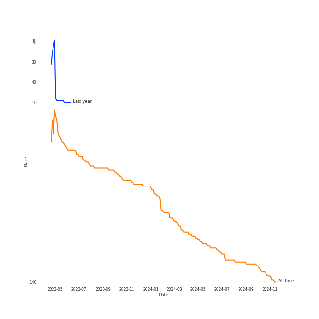
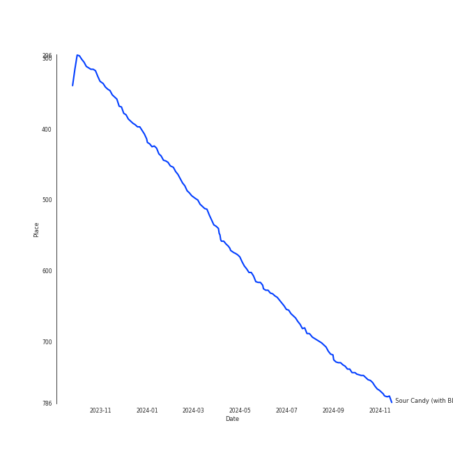
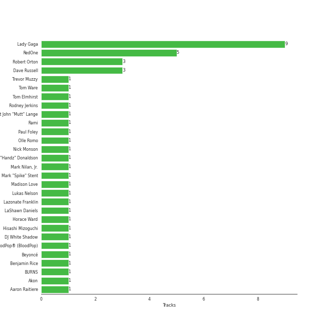

# Lady Gaga

[See Track Features](audio_features.md)

[See Clusters](clusters/overview.md)

## Artist Rank
- The #117 artist overall

## Top Tracks

### Top tracks, aggregated

## Featured on Playlists
| Art | Tracks | Playlist |
|:---|---:|:---|
|  | 14 | [Pop](../../playlists/pop/overview.md) |
|  | 2 | [A-Pop Favorites](../../playlists/a-pop_favorites/overview.md) |
|  | 1 | [K-Pop](../../playlists/k-pop/overview.md) |
|  | 1 | [Workout](../../playlists/workout/overview.md) |

## Top Albums

| Art | Tracks | 💚 | Album | Release Date | 🔗 |
|:---|---:|---:|:---|:---|:---|
|  | 4 | 2 | The Fame | 2008-01-01 | [🔗](https://open.spotify.com/album/1jpUMnKpRlng1OJN7LJauV) |
|  | 2 | 2 | The Fame Monster (Deluxe Edition) | 2009-11-05 | [🔗](https://open.spotify.com/album/6rePArBMb5nLWEaY9aQqL4) |
|  | 2 | 2 | Born This Way | 2011-01-01 | [🔗](https://open.spotify.com/album/2KkMVsxymoNR7hRmBcMttd) |
|  | 2 | 2 | A Star Is Born Soundtrack | 2018-10-05 | [🔗](https://open.spotify.com/album/4sLtOBOzn4s3GDUv3c5oJD) |
|  | 2 | 1 | Chromatica | 2020-05-29 | [🔗](https://open.spotify.com/album/05c49JgPmL4Uz2ZeqRx5SP) |
|  | 1 | 0 | Til It Happens To You | 2015-09-18 | [🔗](https://open.spotify.com/album/00qjYaNSNpQCZHhCpAlH60) |
|  | 1 | 0 | Joanne (Deluxe) | 2016-10-21 | [🔗](https://open.spotify.com/album/2ZUwFxlWo0gwTsvZ6L4Meh) |

## Top Record Labels

| Tracks | 💚 | Label |
|---:|---:|:---|
| 12 | 7 | [Interscope Records](../../labels/interscope_records/overview.md) |
| 2 | 2 | A Star is Born OST |

## Genres

- [art pop](../../genres/art_pop/overview.md)
- [dance pop](../../genres/dance_pop/overview.md)
- [pop](../../genres/pop/overview.md)

## Credits

### Credits by Type

| Credit Type | Tracks |
|:---|---:|
| Arranger | 1 |
| Instrument | 1 |
| Producer | 5 |
| Songwriter | 9 |
| Vocal | 6 |

### Production Credits

| Art | Track | Credit Types |
|:---|:---|:---|
|  | LoveGame | Songwriter |
|  | Just Dance | Songwriter |
|  | Poker Face | Songwriter |
|  | Bad Romance | Songwriter |
|  | Telephone | Producer, Songwriter |
|  | Judas | Producer, Songwriter |
|  | Yoü And I | Producer, Songwriter |
|  | Look What I Found | Arranger, Producer, Songwriter |
|  | La Vie En Rose | Producer |
|  | Sour Candy (with BLACKPINK) | Songwriter |

## Top Producers

| Art | Producer | Tracks | Credit Types |
|:---|:---|---:|:---|
|  | [Lady Gaga](overview.md) | 10 | Songwriter, Producer, Arranger |
| | [RedOne](../../producers/redone/overview.md) | 5 | Producer, Songwriter, Arranger |
| | Robert Orton | 3 | Producer |
| | Dave Russell | 3 | Producer |
| | Tom Elmhirst | 2 | Producer |
| | Benjamin Rice | 2 | Producer |
| | Lazonate Franklin | 1 | Songwriter |
| | Louiguy | 1 | Songwriter |
| | Horace Ward | 1 | Producer |
| | Rami | 1 | Songwriter |

View all

| Art | Producer | Tracks | Credit Types |
|:---|:---|---:|:---|
| | Tom Ware | 1 | Producer |
| | Brian Newman | 1 | Producer |
| | Nick Monson | 1 | Arranger, Producer, Songwriter |
| | Madison Love | 1 | Songwriter |
| | BloodPop® (BloodPop) | 1 | Producer, Songwriter |
| | BURNS | 1 | Producer, Songwriter |
| | Dae Bennett | 1 | Producer |
| | DJ White Shadow | 1 | Producer, Songwriter |
| | Paul Foley | 1 | Producer |
| | Hisashi Mizoguchi | 1 | Producer |
|  | [Beyoncé](../beyoncé/overview.md) | 1 | Songwriter |
| | LaShawn Daniels | 1 | Songwriter |
| | Robert John "Mutt" Lange | 1 | Producer |
| | Rodney Jerkins | 1 | Producer, Songwriter |
| | Édith Piaf (Piaf, Édith) | 1 | Lyricist, Songwriter |
| | Mike "Handz" Donaldson | 1 | Producer |
| | Lukas Nelson | 1 | Songwriter |
| | Trevor Muzzy | 1 | Producer |
| | Mark Nilan, Jr. | 1 | Arranger, Producer, Songwriter |
| | Aaron Raitiere | 1 | Songwriter |
| | [Mark "Spike" Stent](../../producers/mark__spike__stent/overview.md) | 1 | Producer |
| | Akon | 1 | Songwriter |
| | Olle Romo | 1 | Producer |

## Tracks

| Art | Track | Album | Artists | Label | Rank | 💚 | 🔗 |
|:---|:---|:---|:---|:---|---:|:---|:---|
|  | Sour Candy (with BLACKPINK) | Chromatica | [Lady Gaga](overview.md), [BLACKPINK](../blackpink/overview.md) | [Interscope](../../labels/interscope_records) | 395 | 💚 | [🔗](https://open.spotify.com/track/1IWNylpZ477gIVUDpJL66u) |
|  | Judas | Born This Way | [Lady Gaga](overview.md) | [Interscope](../../labels/interscope_records) | 915 | 💚 | [🔗](https://open.spotify.com/track/0QkWikH5Z3U0f79T9iuF6c) |
|  | Bad Romance | The Fame Monster (Deluxe Edition) | [Lady Gaga](overview.md) | [Interscope](../../labels/interscope_records) | 922 | 💚 | [🔗](https://open.spotify.com/track/0SiywuOBRcynK0uKGWdCnn) |
|  | LoveGame | The Fame | [Lady Gaga](overview.md) | [Interscope](../../labels/interscope_records) | 925 | 💚 | [🔗](https://open.spotify.com/track/0TcJ7QWpggdSg8t0fHThHm) |
|  | Til It Happens To You | Til It Happens To You | [Lady Gaga](overview.md) | [Interscope](../../labels/interscope_records) | 954 | | [🔗](https://open.spotify.com/track/0bCCGLHflR08UVA6oJJc8I) |
|  | Look What I Found | A Star Is Born Soundtrack | [Lady Gaga](overview.md) | A Star is Born OST | 1219 | 💚 | [🔗](https://open.spotify.com/track/1l9G7M8gNyQsgOGWZGoQsT) |
|  | Just Dance | The Fame | [Lady Gaga](overview.md), Colby O'Donis | [Interscope](../../labels/interscope_records) | 1480 | | [🔗](https://open.spotify.com/track/2x7MyWybabEz6Y6wvHuwGE) |
|  | La Vie En Rose | A Star Is Born Soundtrack | [Lady Gaga](overview.md) | A Star is Born OST | 1608 | 💚 | [🔗](https://open.spotify.com/track/3WKnfkgwrARwElktHSU5Ik) |
|  | Telephone | The Fame Monster (Deluxe Edition) | [Lady Gaga](overview.md), [Beyoncé](../beyoncé/overview.md) | [Interscope](../../labels/interscope_records) | 1825 | 💚 | [🔗](https://open.spotify.com/track/4TCL0qqKyqsMZml0G3M9IM) |
|  | Poker Face | The Fame | [Lady Gaga](overview.md) | [Interscope](../../labels/interscope_records) | 2052 | 💚 | [🔗](https://open.spotify.com/track/5R8dQOPq8haW94K7mgERlO) |

See all tracks

| Art | Track | Album | Artists | Label | Rank | 💚 | 🔗 |
|:---|:---|:---|:---|:---|---:|:---|:---|
|  | Yoü And I | Born This Way | [Lady Gaga](overview.md) | [Interscope](../../labels/interscope_records) | 2389 | 💚 | [🔗](https://open.spotify.com/track/6rkAY9rk1NTFB94QxG3LJR) |
|  | Paparazzi | The Fame | [Lady Gaga](overview.md) | [Interscope](../../labels/interscope_records) | 2490 | | [🔗](https://open.spotify.com/track/7Hqig8kp32q2Ire3ECQvWM) |
|  | Million Reasons | Joanne (Deluxe) | [Lady Gaga](overview.md) | [Interscope](../../labels/interscope_records) | 2524 | | [🔗](https://open.spotify.com/track/7dZ1Odmx9jWIweQSatnRqo) |
|  | Rain On Me (with Ariana Grande) | Chromatica | [Lady Gaga](overview.md), [Ariana Grande](../ariana_grande/overview.md) | [Interscope](../../labels/interscope_records) | 2550 | | [🔗](https://open.spotify.com/track/7ju97lgwC2rKQ6wwsf9no9) |

