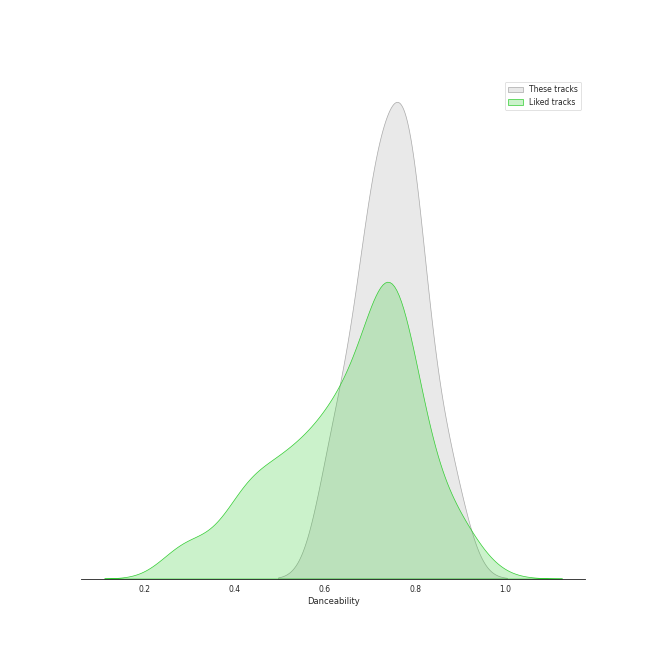
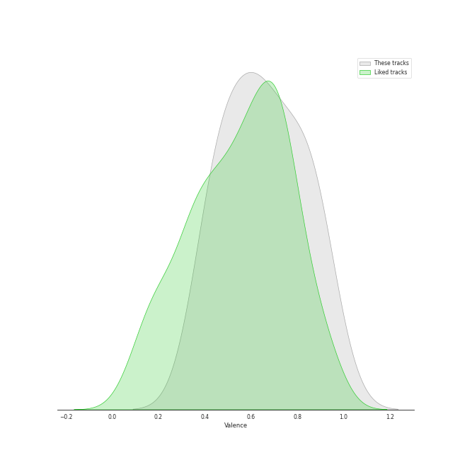
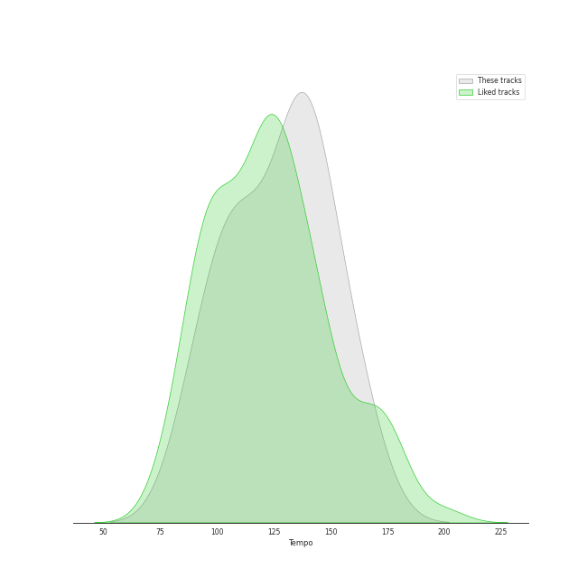

# Audio Features for LE SSERAFIM

## Danceability

| ​ | 10 most Danceable tracks | ​​ | 10 least Danceable tracks |
|:---|:---|:---|:---|
|  | ANTIFRAGILE (0.882) |  | Burn the Bridge (0.532) |
|  | FEARLESS (0.863) |  | FEARNOT (Between you, me and the lamppost) (0.563) |
|  | UNFORGIVEN (feat. Nile Rodgers) (0.795) |  | No Celestial (0.618) |
|  | Blue Flame (0.781) |  | Eve, Psyche & The Bluebeard’s wife (0.663) |
|  | Sour Grapes (0.779) |  | Impurities (0.715) |
|  | Flash Forward (0.773) |  | Fire in the belly (0.716) |
|  | No-Return (Into the unknown) (0.753) |  | No-Return (Into the unknown) (0.753) |
|  | Fire in the belly (0.716) |  | Flash Forward (0.773) |
|  | Impurities (0.715) |  | Sour Grapes (0.779) |
|  | Eve, Psyche & The Bluebeard’s wife (0.663) |  | Blue Flame (0.781) |

## Energy

| ​ | 10 most Energetic tracks | ​​ | 10 least Energetic tracks |
|:---|:---|:---|:---|
|  | Flash Forward (0.879) |  | FEARLESS (0.62) |
|  | UNFORGIVEN (feat. Nile Rodgers) (0.875) |  | FEARNOT (Between you, me and the lamppost) (0.694) |
|  | Eve, Psyche & The Bluebeard’s wife (0.872) |  | No-Return (Into the unknown) (0.717) |
|  | Sour Grapes (0.801) |  | Blue Flame (0.725) |
|  | No Celestial (0.801) |  | Impurities (0.757) |
|  | ANTIFRAGILE (0.797) |  | Burn the Bridge (0.76) |
|  | Fire in the belly (0.779) |  | Fire in the belly (0.779) |
|  | Burn the Bridge (0.76) |  | ANTIFRAGILE (0.797) |
|  | Impurities (0.757) |  | No Celestial (0.801) |
|  | Blue Flame (0.725) |  | Sour Grapes (0.801) |

## Speechiness

| ​ | 10 most Speechy tracks | ​​ | 10 least Speechy tracks |
|:---|:---|:---|:---|
|  | Eve, Psyche & The Bluebeard’s wife (0.2) |  | FEARNOT (Between you, me and the lamppost) (0.0284) |
|  | FEARLESS (0.135) |  | Impurities (0.0373) |
|  | Burn the Bridge (0.113) |  | Flash Forward (0.0391) |
|  | No Celestial (0.0825) |  | Blue Flame (0.0452) |
|  | ANTIFRAGILE (0.0819) |  | Sour Grapes (0.0457) |
|  | No-Return (Into the unknown) (0.0593) |  | UNFORGIVEN (feat. Nile Rodgers) (0.0525) |
|  | Fire in the belly (0.0589) |  | Fire in the belly (0.0589) |
|  | UNFORGIVEN (feat. Nile Rodgers) (0.0525) |  | No-Return (Into the unknown) (0.0593) |
|  | Sour Grapes (0.0457) |  | ANTIFRAGILE (0.0819) |
|  | Blue Flame (0.0452) |  | No Celestial (0.0825) |

## Acousticness

| ​ | 10 most Acoustic tracks | ​​ | 10 least Acoustic tracks |
|:---|:---|:---|:---|
|  | Sour Grapes (0.395) |  | Fire in the belly (0.0106) |
|  | Impurities (0.231) |  | Eve, Psyche & The Bluebeard’s wife (0.0153) |
|  | Flash Forward (0.162) |  | No Celestial (0.0168) |
|  | UNFORGIVEN (feat. Nile Rodgers) (0.111) |  | No-Return (Into the unknown) (0.0267) |
|  | FEARNOT (Between you, me and the lamppost) (0.11) |  | Blue Flame (0.0281) |
|  | ANTIFRAGILE (0.0821) |  | Burn the Bridge (0.0418) |
|  | FEARLESS (0.0508) |  | FEARLESS (0.0508) |
|  | Burn the Bridge (0.0418) |  | ANTIFRAGILE (0.0821) |
|  | Blue Flame (0.0281) |  | FEARNOT (Between you, me and the lamppost) (0.11) |
|  | No-Return (Into the unknown) (0.0267) |  | UNFORGIVEN (feat. Nile Rodgers) (0.111) |

## Instrumentalness

| ​ | 10 most Instrumental tracks | ​​ | 10 least Instrumental tracks |
|:---|:---|:---|:---|
|  | FEARLESS (0.00324) |  | Fire in the belly (0.0) |
|  | UNFORGIVEN (feat. Nile Rodgers) (8.94e-05) |  | FEARNOT (Between you, me and the lamppost) (0.0) |
|  | Burn the Bridge (1.02e-06) |  | No Celestial (0.0) |
|  | Impurities (0.0) |  | Blue Flame (0.0) |
|  | Flash Forward (0.0) |  | Eve, Psyche & The Bluebeard’s wife (0.0) |
|  | Sour Grapes (0.0) |  | ANTIFRAGILE (0.0) |
|  | No-Return (Into the unknown) (0.0) |  | No-Return (Into the unknown) (0.0) |
|  | ANTIFRAGILE (0.0) |  | Sour Grapes (0.0) |
|  | Eve, Psyche & The Bluebeard’s wife (0.0) |  | Flash Forward (0.0) |
|  | Blue Flame (0.0) |  | Impurities (0.0) |

## Liveness

| ​ | 10 most Live tracks | ​​ | 10 least Live tracks |
|:---|:---|:---|:---|
|  | Burn the Bridge (0.318) |  | Fire in the belly (0.0266) |
|  | No-Return (Into the unknown) (0.271) |  | Eve, Psyche & The Bluebeard’s wife (0.0519) |
|  | FEARNOT (Between you, me and the lamppost) (0.157) |  | Impurities (0.0656) |
|  | No Celestial (0.131) |  | Blue Flame (0.0761) |
|  | FEARLESS (0.129) |  | Flash Forward (0.0897) |
|  | ANTIFRAGILE (0.113) |  | UNFORGIVEN (feat. Nile Rodgers) (0.107) |
|  | Sour Grapes (0.108) |  | Sour Grapes (0.108) |
|  | UNFORGIVEN (feat. Nile Rodgers) (0.107) |  | ANTIFRAGILE (0.113) |
|  | Flash Forward (0.0897) |  | FEARLESS (0.129) |
|  | Blue Flame (0.0761) |  | No Celestial (0.131) |

## Valence

| ​ | 10 most Happy tracks | ​​ | 10 least Happy tracks |
|:---|:---|:---|:---|
|  | No-Return (Into the unknown) (0.948) |  | FEARNOT (Between you, me and the lamppost) (0.196) |
|  | Flash Forward (0.839) |  | Burn the Bridge (0.297) |
|  | ANTIFRAGILE (0.824) |  | UNFORGIVEN (feat. Nile Rodgers) (0.375) |
|  | Blue Flame (0.765) |  | FEARLESS (0.432) |
|  | Sour Grapes (0.72) |  | Fire in the belly (0.442) |
|  | No Celestial (0.699) |  | Impurities (0.464) |
|  | Eve, Psyche & The Bluebeard’s wife (0.626) |  | Eve, Psyche & The Bluebeard’s wife (0.626) |
|  | Impurities (0.464) |  | No Celestial (0.699) |
|  | Fire in the belly (0.442) |  | Sour Grapes (0.72) |
|  | FEARLESS (0.432) |  | Blue Flame (0.765) |

## Tempo

| ​ | 10 most Fast tracks | ​​ | 10 least Fast tracks |
|:---|:---|:---|:---|
|  | Burn the Bridge (172.171) |  | Impurities (90.065) |
|  | No-Return (Into the unknown) (157.976) |  | FEARLESS (103.971) |
|  | Eve, Psyche & The Bluebeard’s wife (142.951) |  | UNFORGIVEN (feat. Nile Rodgers) (104.008) |
|  | Sour Grapes (139.998) |  | ANTIFRAGILE (105.025) |
|  | No Celestial (138.028) |  | FEARNOT (Between you, me and the lamppost) (105.976) |
|  | Fire in the belly (119.932) |  | Blue Flame (112.045) |
|  | Flash Forward (114.949) |  | Flash Forward (114.949) |
|  | Blue Flame (112.045) |  | Fire in the belly (119.932) |
|  | FEARNOT (Between you, me and the lamppost) (105.976) |  | No Celestial (138.028) |
|  | ANTIFRAGILE (105.025) |  | Sour Grapes (139.998) |
