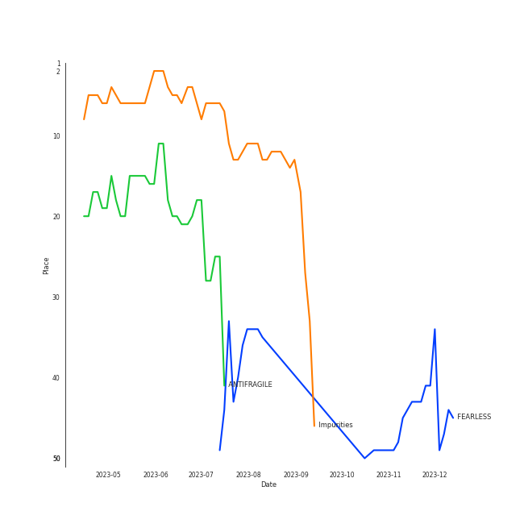
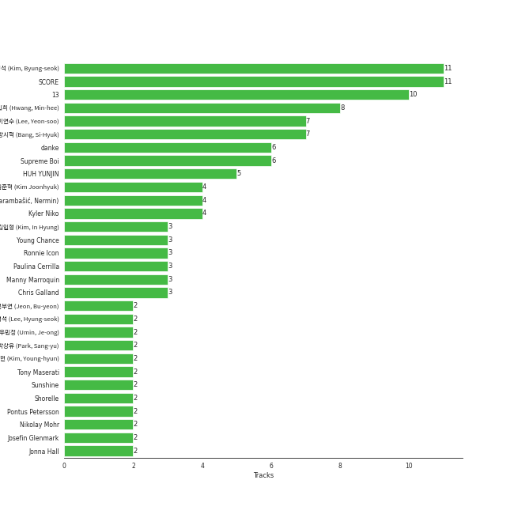

# LE SSERAFIM

[See Track Features](audio_features.md)

[See Clusters](clusters/overview.md)

## Relationships

LE SSERAFIM:
- has member HUH YUNJIN
- has member 홍은채 (Hong, Eunchae)
- has member 中村 一葉 (Kazuha)
- has member 김채원 (Kim, Chae-won)
- has member 김가람 (Kim, Garam)
- has member 宮脇咲良 (Miyawaki, Sakura)

## Artist Rank
LE SSERAFIM is currently:
- The #13 artist of the last month
- The #13 artist of the last 6 months
- The #18 artist of all time

## Top Tracks

- Swan Song is:
    - the #2 track of the last month

### Top tracks of the last 6 months over time

## Featured on Playlists
| Art | Tracks | Playlist |
|:---|---:|:---|
|  | 14 | [K-Pop](../../playlists/k-pop/overview.md) |
|  | 6 | [K-Pop Favorites](../../playlists/k-pop_favorites/overview.md) |
|  | 5 | [Workout](../../playlists/workout/overview.md) |
|  | 3 | [Recent Comebacks](../../playlists/recent_comebacks/overview.md) |
|  | 3 | [Sharon RPD](../../playlists/sharon_rpd/overview.md) |
|  | 3 | [Chill](../../playlists/chill/overview.md) |
|  | 2 | [Summer](../../playlists/summer/overview.md) |
|  | 1 | [K-Pop 101](../../playlists/k-pop_101/overview.md) |
|  | 1 | [Cursed English](../../playlists/cursed_english/overview.md) |
|  | 1 | [Christmas](../../playlists/christmas/overview.md) |

## Top Albums

| Art | Tracks | 💚 | Album | Release Date | 🔗 |
|:---|---:|---:|:---|:---|:---|
|  | 4 | 4 | UNFORGIVEN | 2023-05-01 | [🔗](https://open.spotify.com/album/4Oz7K9DRwwGMN49i4NbVDT) |
|  | 3 | 3 | FEARLESS | 2022-05-02 | [🔗](https://open.spotify.com/album/4Mc7WwYH41hgUWeKX25Sot) |
|  | 3 | 3 | ANTIFRAGILE | 2022-10-17 | [🔗](https://open.spotify.com/album/3u0ggfmK0vjuHMNdUbtaa9) |
|  | 3 | 2 | EASY | 2024-02-19 | [🔗](https://open.spotify.com/album/1YCj4PZi08G20y2ekGKY0C) |
|  | 1 | 1 | Perfect Night | 2023-10-27 | [🔗](https://open.spotify.com/album/6Msc3BwzKZ5f5FXmKuUSu6) |
|  | 1 | 0 | Perfect Night (Holiday Remix) | 2023-11-23 | [🔗](https://open.spotify.com/album/0YaaIvxu7OH0OxUSnM9WFH) |
|  | 1 | 0 | Eve, Psyche & the Bluebeard’s wife (English Ver.) | 2023-07-06 | [🔗](https://open.spotify.com/album/1FoKSB8Kc39zc9exXYtNu8) |

## Top Record Labels

| Tracks | 💚 | Label |
|---:|---:|:---|
| 16 | 13 | [SOURCE MUSIC](../../labels/source_music/overview.md) |

## Genres

- [k-pop girl group](../../genres/k-pop_girl_group/overview.md)

## Credits

### Credits by Type

| Credit Type | Tracks |
|:---|---:|
| Performer | 10 |

### Member Credits

| | HUH YUNJIN | 中村 一葉 (Kazuha) | 宮脇咲良 (Miyawaki, Sakura) | 김가람 (Kim, Garam) | 김채원 (Kim, Chae-won) | 홍은채 (Hong, Eunchae) |
|:---|---:|---:|---:|---:|---:|---:|
| Lyricist | 4 | 0 | 0 | 0 | 1 | 0 |
| Songwriter | 5 | 0 | 0 | 0 | 1 | 0 |
| Vocal | 10 | 10 | 10 | 3 | 10 | 10 |
### Production Credits

| Art | Track | Members | Credit Types |
|:---|:---|:---|:---|
|  | Blue Flame | HUH YUNJIN, 김채원 (Kim, Chae-won) | Lyricist, Songwriter |
|  | No Celestial | HUH YUNJIN | Lyricist, Songwriter |
|  | Impurities | HUH YUNJIN | Lyricist, Songwriter |
|  | Eve, Psyche & The Bluebeard’s wife | HUH YUNJIN | Lyricist, Songwriter |
|  | Perfect Night | HUH YUNJIN | Songwriter |

## Top Producers

| Art | Producer | Tracks | Credit Types |
|:---|:---|---:|:---|
| | [SCORE](../../producers/score/overview.md) | 11 | Songwriter, Arranger, Lyricist, Producer |
| | [김병석 (Kim, Byung-seok)](../../producers/김병석_(kim,_byung-seok)/overview.md) | 11 | Songwriter, Arranger, Lyricist, Producer |
| | 13 | 10 | Producer |
| | 황민희 (Hwang, Min-hee) | 8 | Producer |
| | [방시혁 (Bang, Si-Hyuk)](../../producers/방시혁_(bang,_si-hyuk)/overview.md) | 7 | Songwriter, Lyricist |
| | 이연수 (Lee, Yeon-soo) | 7 | Producer |
| | [Supreme Boi](../../producers/supreme_boi/overview.md) | 6 | Lyricist, Songwriter |
| | [danke](../../producers/danke/overview.md) | 6 | Lyricist, Songwriter |
|  | HUH YUNJIN | 5 | Songwriter, Lyricist |
| | Nermin Harambašić (Harambašić, Nermin) | 4 | Lyricist, Songwriter |

View all

| Art | Producer | Tracks | Credit Types |
|:---|:---|---:|:---|
| | Kyler Niko | 4 | Lyricist, Songwriter |
| | 김준혁 (Kim Joonhyuk) | 4 | Producer |
| | Chris Galland | 3 | Producer |
| | Young Chance | 3 | Lyricist, Songwriter |
| | 김인형 (Kim, In Hyung) | 3 | Lyricist, Songwriter |
| | Paulina Cerrilla | 3 | Lyricist, Songwriter |
| | [Manny Marroquin](../../producers/manny_marroquin/overview.md) | 3 | Producer |
| | Ronnie Icon | 3 | Lyricist, Songwriter |
| | Jonna Hall | 2 | Lyricist, Songwriter |
| | Daniel "Obi" Klein | 2 | Lyricist, Songwriter |
| | 박상유 (Park, Sang-yu) | 2 | Lyricist, Songwriter |
| | Josefin Glenmark | 2 | Lyricist, Songwriter |
| | Nikolay Mohr | 2 | Lyricist, Songwriter |
| | Arineh Karimi | 2 | Lyricist, Songwriter |
| | 전부연 (Jeon, Bu-yeon) | 2 | Producer |
| | 김영현 (Kim, Young-hyun) | 2 | Producer |
| | Pontus Petersson | 2 | Lyricist, Songwriter |
| | BLVSH | 2 | Lyricist, Songwriter |
| | JARO | 2 | Lyricist, Songwriter |
| | Anne Judith Wik | 2 | Lyricist, Songwriter |
| | Sunshine | 2 | Lyricist, Songwriter |
| | [Tony Maserati](../../producers/tony_maserati/overview.md) | 2 | Producer |
| | 우민정 (Umin, Je-ong) | 2 | Producer |
| | 이형석 (Lee, Hyung-seok) | 2 | Lyricist, Songwriter |
| | Charli Taft | 2 | Lyricist, Songwriter |
| | Shorelle | 2 | Lyricist, Songwriter |
| | BENJMN | 2 | Lyricist, Songwriter |
| | [Josh Gudwin](../../producers/josh_gudwin/overview.md) | 1 | Producer |
| | Cazzi Opeia | 1 | Lyricist, Songwriter |
| | James Reynolds | 1 | Producer |
| | Ninos Hanna | 1 | Songwriter |
| | Kayofkaj | 1 | Lyricist, Songwriter |
| | Adam Hawkins | 1 | Producer |
| | Marcus Andersson | 1 | Songwriter |
| | Anders Gukko | 1 | Lyricist, Songwriter |
| | 김채원 (Kim, Chae-won) | 1 | Lyricist, Songwriter |
| | Max Thulin | 1 | Lyricist, Songwriter |
| | emmy kasai. | 1 | Lyricist, Songwriter |
| | Lady V | 1 | Lyricist, Songwriter |
| | 양가영 (Yang, Gayoung) | 1 | Lyricist, Songwriter |
| | Maggie Szabo | 1 | Lyricist, Songwriter |
| | Caroline Gerd Gustavsson | 1 | Lyricist, Songwriter |
| | Yang Ga | 1 | Producer |
| | Maia Wright | 1 | Lyricist, Songwriter |
| | Jorge Luis Perez, Jr. | 1 | Songwriter |
| | Lauren Elizabeth Baker | 1 | Songwriter |
| | 김현수 (Kim, Hyun-soo) | 1 | Producer |
| | Nathalie Blue | 1 | Lyricist, Songwriter |
| | Shintaro Yasuda | 1 | Lyricist, Songwriter |
| | Believve | 1 | Lyricist, Songwriter |
| | Hayes Kramer | 1 | Lyricist, Songwriter |
| | [조윤경 (Jo, Yoon Kyung)](../../producers/조윤경_(jo,_yoon_kyung)/overview.md) | 1 | Lyricist, Songwriter |
| | Isabella Lovestory | 1 | Lyricist, Songwriter |
| | Niklas Jarelius Persson | 1 | Songwriter |
| | Makaila J Garcia | 1 | Lyricist, Songwriter |
| | Lauren Aquilina | 1 | Songwriter |
| | Amanda Ibanez | 1 | Songwriter |
| | Belle | 1 | Lyricist, Songwriter |
| | [John Hanes](../../producers/john_hanes/overview.md) | 1 | Producer |
| | Gusten Dahlqvist | 1 | Lyricist, Songwriter |
| | Bob Horn | 1 | Producer |
| | Zikai | 1 | Songwriter |
| | 김채아 (Kim, Chae-ah) | 1 | Lyricist, Songwriter |
| | poutyface | 1 | Lyricist, Songwriter |
| | Duane Benjamin | 1 | Arranger |
| | Glenda Proby | 1 | Lyricist, Songwriter |
|  | ABIR | 1 | Lyricist, Songwriter |
|  | Destiny Rogers | 1 | Lyricist, Songwriter |
| | Kris Jana | 1 | Lyricist, Songwriter |
| | Feli Ferraro | 1 | Lyricist, Songwriter |
| | Julia Bognar Finnseter | 1 | Lyricist, Songwriter |

## Tracks

| Art | Track | Album | Artists | Label | Score | 💚 | 🔗 |
|:---|:---|:---|:---|:---|---:|:---|:---|
|  | Impurities | ANTIFRAGILE | [LE SSERAFIM](overview.md) | [SOURCE MUSIC](../../labels/source_music) | 12633 | 💚 | [🔗](https://open.spotify.com/track/7F0MuIk5glqtowCUjbn9es) |
|  | ANTIFRAGILE | ANTIFRAGILE | [LE SSERAFIM](overview.md) | [SOURCE MUSIC](../../labels/source_music) | 6069 | 💚 | [🔗](https://open.spotify.com/track/4fsQ0K37TOXa3hEQfjEic1) |
|  | FEARLESS | FEARLESS | [LE SSERAFIM](overview.md) | [SOURCE MUSIC](../../labels/source_music) | 2059 | 💚 | [🔗](https://open.spotify.com/track/296nXCOv97WJNRWzIBQnoj) |
|  | UNFORGIVEN (feat. Nile Rodgers) | UNFORGIVEN | [LE SSERAFIM](overview.md), Nile Rodgers | [SOURCE MUSIC](../../labels/source_music) | 1701 | 💚 | [🔗](https://open.spotify.com/track/51vRumtqbkNW9wrKfESwfu) |
|  | Swan Song | EASY | [LE SSERAFIM](overview.md) | [SOURCE MUSIC](../../labels/source_music) | 423 | 💚 | [🔗](https://open.spotify.com/track/2GquhrcHbl2zOnF5javAFp) |
|  | Perfect Night (Holiday Remix) | Perfect Night (Holiday Remix) | [LE SSERAFIM](overview.md) | [SOURCE MUSIC](../../labels/source_music) | 330 | | [🔗](https://open.spotify.com/track/40CJrEAyXS8qe0BBFbYbJO) |
|  | No-Return (Into the unknown) | UNFORGIVEN | [LE SSERAFIM](overview.md) | [SOURCE MUSIC](../../labels/source_music) | 287 | 💚 | [🔗](https://open.spotify.com/track/6DSGb5CmwHX4pvclq8HUU1) |
|  | Sour Grapes | FEARLESS | [LE SSERAFIM](overview.md) | [SOURCE MUSIC](../../labels/source_music) | 140 | 💚 | [🔗](https://open.spotify.com/track/6wBpO4Xc4YgShnENGSFA1M) |
|  | Fire in the belly | UNFORGIVEN | [LE SSERAFIM](overview.md) | [SOURCE MUSIC](../../labels/source_music) | 132 | 💚 | [🔗](https://open.spotify.com/track/05RlBHEZg1RmL9DnPgv9Qq) |
|  | Perfect Night | Perfect Night | [LE SSERAFIM](overview.md) | [SOURCE MUSIC](../../labels/source_music) | 123 | 💚 | [🔗](https://open.spotify.com/track/74X2u8JMVooG2QbjRxXwR8) |

See all tracks

| Art | Track | Album | Artists | Label | Score | 💚 | 🔗 |
|:---|:---|:---|:---|:---|---:|:---|:---|
|  | No Celestial | ANTIFRAGILE | [LE SSERAFIM](overview.md) | [SOURCE MUSIC](../../labels/source_music) | 102 | 💚 | [🔗](https://open.spotify.com/track/21ApmVGIzIAIDSBdHu6SVt) |
|  | Blue Flame | FEARLESS | [LE SSERAFIM](overview.md) | [SOURCE MUSIC](../../labels/source_music) | 0 | 💚 | [🔗](https://open.spotify.com/track/37YoRLUu1qId0ewavgvnkG) |
|  | Eve, Psyche & The Bluebeard’s wife | UNFORGIVEN | [LE SSERAFIM](overview.md) | [SOURCE MUSIC](../../labels/source_music) | 0 | 💚 | [🔗](https://open.spotify.com/track/4QhnNyKDsAkXPwHkSnuc89) |
|  | Eve, Psyche & the Bluebeard’s wife (English Ver.) | Eve, Psyche & the Bluebeard’s wife (English Ver.) | [LE SSERAFIM](overview.md) | [SOURCE MUSIC](../../labels/source_music) | 0 | | [🔗](https://open.spotify.com/track/1xaLyNaaZC3i5tmaDAWP76) |
|  | EASY | EASY | [LE SSERAFIM](overview.md) | [SOURCE MUSIC](../../labels/source_music) | 0 | 💚 | [🔗](https://open.spotify.com/track/2O4Bb2WCkjlTPO827OnBMI) |
|  | Smart | EASY | [LE SSERAFIM](overview.md) | [SOURCE MUSIC](../../labels/source_music) | 0 | | [🔗](https://open.spotify.com/track/4lR8sYGMGZPvthF2yUfo7T) |

