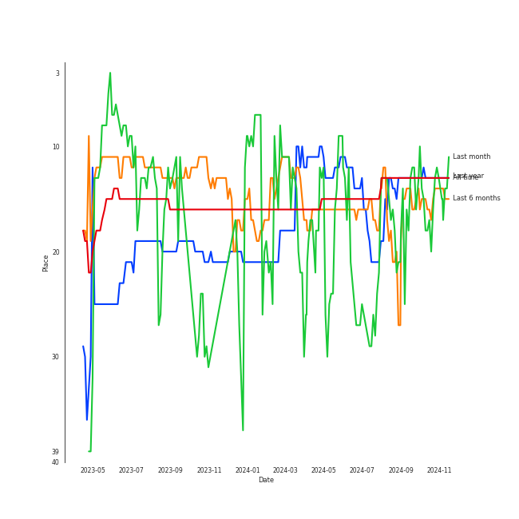
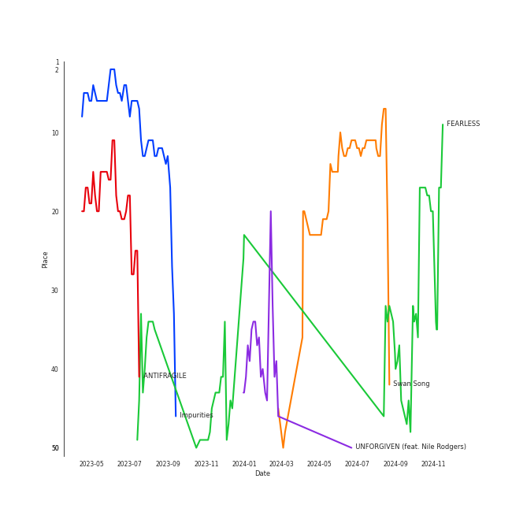

# LE SSERAFIM

[See Track Features](audio_features.md)

[See Clusters](clusters/overview.md)

## Relationships

LE SSERAFIM:
- has member HUH YUNJIN
- has member 홍은채 (Hong, Eunchae)
- has member 中村 一葉 (Kazuha)
- has member 김채원 (Kim, Chae-won)
- has member 김가람 (Kim, Garam)
- has member 宮脇咲良 (Miyawaki, Sakura)

## Artist Rank
LE SSERAFIM is currently:
- The #19 artist of all time
- The #12 artist of the last 6 months

## Top Tracks

### Top tracks of the last 6 months over time

### Top tracks of the last month over time

## Featured on Playlists
| Art | Tracks | Playlist |
|:---|---:|:---|
|  | 10 | [K-Pop](../../playlists/k_pop/overview.md) |
|  | 5 | [K-Pop Favorites](../../playlists/k_pop_favorites/overview.md) |
|  | 5 | [Workout](../../playlists/workout/overview.md) |
|  | 4 | [Recent Comebacks](../../playlists/recent_comebacks/overview.md) |
|  | 3 | [Chill](../../playlists/chill/overview.md) |
|  | 2 | [Summer](../../playlists/summer/overview.md) |
|  | 2 | [Sharon RPD](../../playlists/sharon_rpd/overview.md) |
|  | 1 | [K-Pop 101](../../playlists/k_pop_101/overview.md) |
|  | 1 | [Cursed English](../../playlists/cursed_english/overview.md) |

## Top Albums

| Art | Tracks | 💚 | Album | Release Date | 🔗 |
|:---|---:|---:|:---|:---|:---|
|  | 4 | 4 | UNFORGIVEN | 2023-05-01 | [🔗](https://open.spotify.com/album/4Oz7K9DRwwGMN49i4NbVDT) |
|  | 3 | 3 | FEARLESS | 2022-05-02 | [🔗](https://open.spotify.com/album/4Mc7WwYH41hgUWeKX25Sot) |
|  | 3 | 3 | ANTIFRAGILE | 2022-10-17 | [🔗](https://open.spotify.com/album/3u0ggfmK0vjuHMNdUbtaa9) |
|  | 1 | 0 | Eve, Psyche & the Bluebeard’s wife (English Ver.) | 2023-07-06 | [🔗](https://open.spotify.com/album/1FoKSB8Kc39zc9exXYtNu8) |

## Top Record Labels

| Tracks | 💚 | Label |
|---:|---:|:---|
| 11 | 10 | [SOURCE MUSIC](../../labels/source_music/overview.md) |

## Genres

- [k-pop girl group](../../genres/k_pop_girl_group/overview.md)

## Credits

### Credits by Type

| Credit Type | Tracks |
|:---|---:|
| Performer | 10 |

### Member Credits

| | HUH YUNJIN | 中村 一葉 (Kazuha) | 宮脇咲良 (Miyawaki, Sakura) | 김가람 (Kim, Garam) | 김채원 (Kim, Chae-won) | 홍은채 (Hong, Eunchae) |
|:---|---:|---:|---:|---:|---:|---:|
| Lyricist | 4 | 0 | 0 | 0 | 1 | 0 |
| Songwriter | 4 | 0 | 0 | 0 | 1 | 0 |
| Vocal | 10 | 10 | 10 | 3 | 10 | 10 |
## Tracks

| Art | Track | Album | Artists | Label | 💚 | 🔗 |
|:---|:---|:---|:---|:---|:---|:---|
|  | Blue Flame | FEARLESS | [LE SSERAFIM](overview.md) | [SOURCE MUSIC](../../labels/source_music) | 💚 | [🔗](https://open.spotify.com/track/37YoRLUu1qId0ewavgvnkG) |
|  | FEARLESS | FEARLESS | [LE SSERAFIM](overview.md) | [SOURCE MUSIC](../../labels/source_music) | 💚 | [🔗](https://open.spotify.com/track/296nXCOv97WJNRWzIBQnoj) |
|  | Sour Grapes | FEARLESS | [LE SSERAFIM](overview.md) | [SOURCE MUSIC](../../labels/source_music) | 💚 | [🔗](https://open.spotify.com/track/6wBpO4Xc4YgShnENGSFA1M) |
|  | ANTIFRAGILE | ANTIFRAGILE | [LE SSERAFIM](overview.md) | [SOURCE MUSIC](../../labels/source_music) | 💚 | [🔗](https://open.spotify.com/track/4fsQ0K37TOXa3hEQfjEic1) |
|  | Impurities | ANTIFRAGILE | [LE SSERAFIM](overview.md) | [SOURCE MUSIC](../../labels/source_music) | 💚 | [🔗](https://open.spotify.com/track/7F0MuIk5glqtowCUjbn9es) |
|  | No Celestial | ANTIFRAGILE | [LE SSERAFIM](overview.md) | [SOURCE MUSIC](../../labels/source_music) | 💚 | [🔗](https://open.spotify.com/track/21ApmVGIzIAIDSBdHu6SVt) |
|  | Eve, Psyche & The Bluebeard’s wife | UNFORGIVEN | [LE SSERAFIM](overview.md) | [SOURCE MUSIC](../../labels/source_music) | 💚 | [🔗](https://open.spotify.com/track/4QhnNyKDsAkXPwHkSnuc89) |
|  | Fire in the belly | UNFORGIVEN | [LE SSERAFIM](overview.md) | [SOURCE MUSIC](../../labels/source_music) | 💚 | [🔗](https://open.spotify.com/track/05RlBHEZg1RmL9DnPgv9Qq) |
|  | No-Return (Into the unknown) | UNFORGIVEN | [LE SSERAFIM](overview.md) | [SOURCE MUSIC](../../labels/source_music) | 💚 | [🔗](https://open.spotify.com/track/6DSGb5CmwHX4pvclq8HUU1) |
|  | UNFORGIVEN (feat. Nile Rodgers) | UNFORGIVEN | [LE SSERAFIM](overview.md), Nile Rodgers | [SOURCE MUSIC](../../labels/source_music) | 💚 | [🔗](https://open.spotify.com/track/51vRumtqbkNW9wrKfESwfu) |

See all tracks

| Art | Track | Album | Artists | Label | 💚 | 🔗 |
|:---|:---|:---|:---|:---|:---|:---|
|  | Eve, Psyche & the Bluebeard’s wife (English Ver.) | Eve, Psyche & the Bluebeard’s wife (English Ver.) | [LE SSERAFIM](overview.md) | [SOURCE MUSIC](../../labels/source_music) | | [🔗](https://open.spotify.com/track/1xaLyNaaZC3i5tmaDAWP76) |

