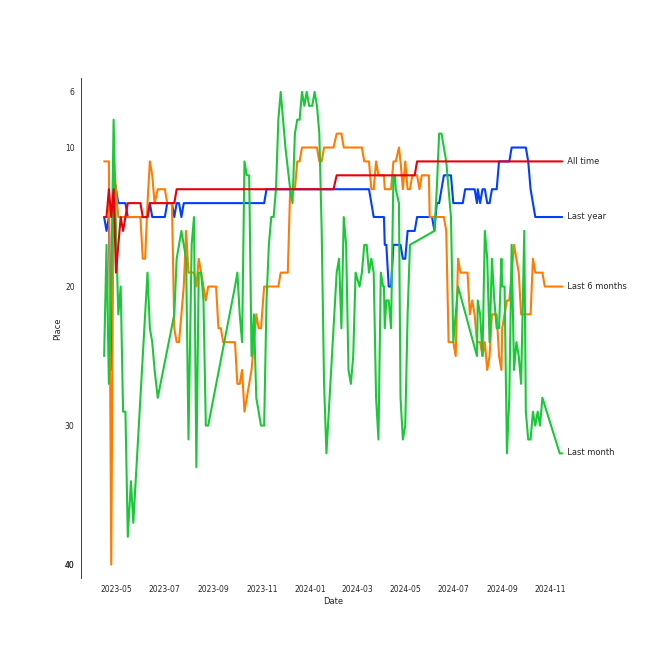
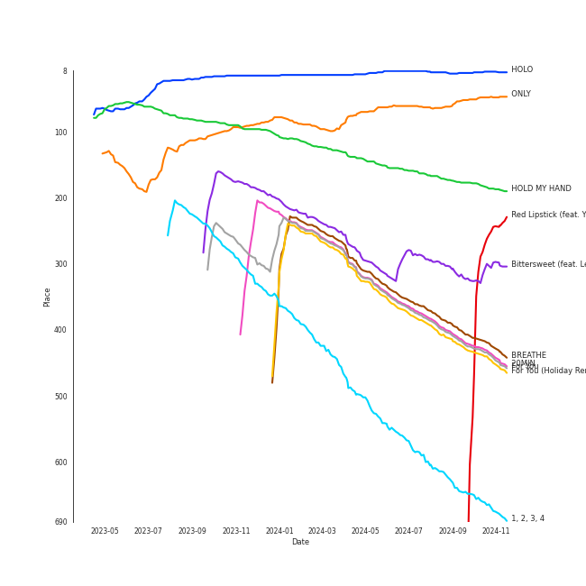
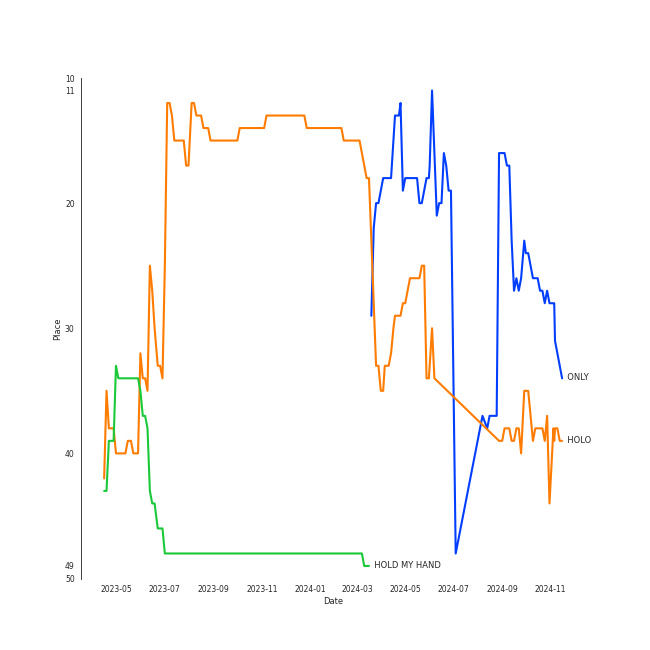
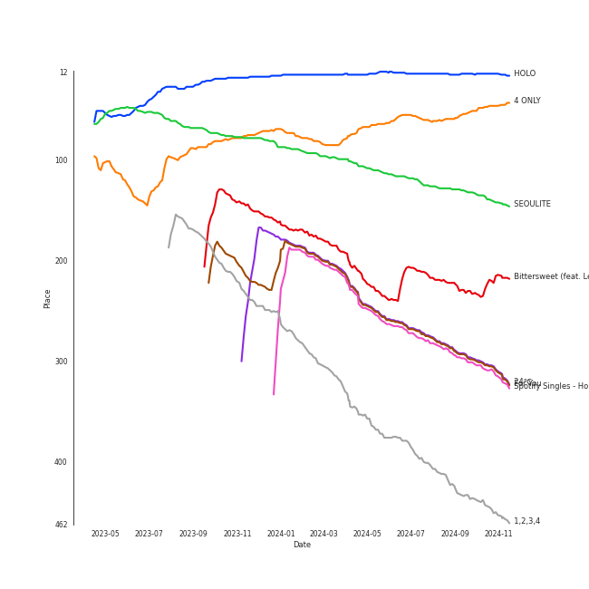

# LeeHi

[See Track Features](audio_features.md)

[See Clusters](clusters/overview.md)

## Artist Rank
LeeHi is currently:
- The #19 artist of the last 6 months
- The #14 artist of the last year
- The #11 artist of all time

## Top Tracks

### Top tracks of all time

Top tracks of the last year over time

Top tracks of the last 6 months over time

## Top Albums

| Art | Rank | Tracks | 💚 | Album | Release Date | 🔗 |
|:---|---:|---:|---:|:---|:---|:---|
|  | 55 | 6 | 6 | 4 ONLY | 2021-09-09 | [🔗](https://open.spotify.com/album/1DKgZeAYrjslAPZVMe6EFt) |
|  | 273 | 4 | 3 | 24℃ | 2019-05-30 | [🔗](https://open.spotify.com/album/5u9CP1NknadV33hZepVEy5) |
|  | 118 | 3 | 3 | SEOULITE | 2016-03-09 | [🔗](https://open.spotify.com/album/2c41Flo2HQgy0A9P3xuSFf) |
|  | 592 | 2 | 2 | First Love | 2013-03-28 | [🔗](https://open.spotify.com/album/74thqvuyVQfosFffvKx2uo) |
|  | 592 | 2 | 1 | SEOULITE | 2016-04-20 | [🔗](https://open.spotify.com/album/3cGyWEJaQlj7kCdKBCOGeb) |
|  | 14 | 1 | 1 | HOLO | 2020-07-23 | [🔗](https://open.spotify.com/album/5xq9sm0jGMMDu5LifpBBo1) |
|  | 274 | 1 | 1 | For You | 2020-12-16 | [🔗](https://open.spotify.com/album/6hiwkmlOoNm8F3UkAZJcEz) |
|  | 212 | 1 | 1 | Bittersweet (feat. LeeHi) | 2021-05-28 | [🔗](https://open.spotify.com/album/6qVk855QPCh57noNeeHMXQ) |
|  | 397 | 1 | 1 | 1,2,3,4 | 2012-10-29 | [🔗](https://open.spotify.com/album/6yYc7Ag6nVB3HVXzLjF9uz) |
|  | 278 | 1 | 0 | Spotify Singles - Holiday | 2021-11-17 | [🔗](https://open.spotify.com/album/5AVL4k3pesuk0jRkTeCOSm) |

See all albums

| Art | Rank | Tracks | 💚 | Album | Release Date | 🔗 |
|:---|---:|---:|---:|:---|:---|:---|
|  | 592 | 1 | 0 | Moonlovers: Scarlet Heart Ryeo (Original Television Soundtrack), Pt 10 | 2016-10-04 | [🔗](https://open.spotify.com/album/1xzKCVdDE3tIXkEGDjLQ7E) |

## Featured on Playlists
| Art | Tracks | Playlist |
|:---|---:|:---|
|  | 22 | [K-Pop-Adjacent](../../playlists/k-pop-adjacent/overview.md) |
|  | 12 | [Chill](../../playlists/chill/overview.md) |
|  | 5 | [K-Pop Favorites](../../playlists/k-pop_favorites/overview.md) |
|  | 4 | [Your Top Songs 2022](../../playlists/your_top_songs_2022/overview.md) |
|  | 4 | [Relax](../../playlists/relax/overview.md) |
|  | 4 | [Recommendations for Jeff](../../playlists/recommendations_for_jeff/overview.md) |
|  | 2 | [Your Top Songs 2023](../../playlists/your_top_songs_2023/overview.md) |
|  | 1 | [Funk](../../playlists/funk/overview.md) |
|  | 1 | [K-Pop](../../playlists/k-pop/overview.md) |
|  | 1 | [Summer](../../playlists/summer/overview.md) |
|  | 1 | [K-Pop 101](../../playlists/k-pop_101/overview.md) |
|  | 1 | [Recommendations for Chris](../../playlists/recommendations_for_chris/overview.md) |
|  | 1 | [Christmas](../../playlists/christmas/overview.md) |

## Top Record Labels

| Tracks | 💚 | Label |
|---:|---:|:---|
| 12 | 10 | [YG Entertainment](../../labels/yg_entertainment/overview.md) |
| 8 | 7 | [Stone Music Entertainment](../../labels/stone_music_entertainment/overview.md) |
| 8 | 7 | [Genie Music Corporation](../../labels/genie_music_corporation/overview.md) |
| 1 | 1 | [PLEDIS Entertainment](../../labels/pledis_entertainment/overview.md) |
| 1 | 1 | AOMG |
| 1 | 0 | CJ E&M MUSIC |

## Genres

- [k-pop](../../genres/k-pop/overview.md)

## Top Producers

| Art | Producer | Tracks | Credit Types |
|:---|:---|---:|:---|
| | Tablo | 2 | Lyricist, Songwriter |
| | JONGHYUN | 1 | Lyricist, Songwriter |
|  | Dok2 | 1 | Lyricist |
| | 안신애 (Wheeler, Shinae An) | 1 | Lyricist, Songwriter |
| | 위프리키 (Wipeuriki) | 1 | Songwriter |

## Tracks

| Art | Track | Album | Artists | Label | Rank | 💚 | 🔗 |
|:---|:---|:---|:---|:---|---:|:---|:---|
|  | HOLO | HOLO | [LeeHi](overview.md) | [Genie Music Corporation](../../labels/genie_music_corporation), [Stone Music Entertainment](../../labels/stone_music_entertainment) | 8 | 💚 | [🔗](https://open.spotify.com/track/4BSluGpjdLQihMmKgHXMxp) |
|  | ONLY | 4 ONLY | [LeeHi](overview.md) | [Genie Music Corporation](../../labels/genie_music_corporation), [Stone Music Entertainment](../../labels/stone_music_entertainment) | 60 | 💚 | [🔗](https://open.spotify.com/track/6TBJkXHPhu3EsMk1bshwuI) |
|  | HOLD MY HAND | SEOULITE | [LeeHi](overview.md) | [YG Entertainment](../../labels/yg_entertainment) | 156 | 💚 | [🔗](https://open.spotify.com/track/7bwSMCwF2C4cK2W97H6oCA) |
|  | Bittersweet (feat. LeeHi) | Bittersweet (feat. LeeHi) | WONWOO, MINGYU, [LeeHi](overview.md) | [PLEDIS Entertainment](../../labels/pledis_entertainment) | 290 | 💚 | [🔗](https://open.spotify.com/track/347PJwH4XqRbeaKaIW9sX3) |
|  | BREATHE | SEOULITE | [LeeHi](overview.md) | [YG Entertainment](../../labels/yg_entertainment) | 364 | 💚 | [🔗](https://open.spotify.com/track/6G4z9WbxyEeWdEQTfShACT) |
|  | 20MIN | 24℃ | [LeeHi](overview.md) | [YG Entertainment](../../labels/yg_entertainment) | 374 | 💚 | [🔗](https://open.spotify.com/track/1Wl9MPBkb50b4uevY6sxkA) |
|  | For You | For You | [LeeHi](overview.md), [Crush](../crush/overview.md) | AOMG | 377 | 💚 | [🔗](https://open.spotify.com/track/0JL7DoEqAUcOntWmBuOSdh) |
|  | For You (Holiday Remix) - Spotify Singles Holiday | Spotify Singles - Holiday | [LeeHi](overview.md) | [Genie Music Corporation](../../labels/genie_music_corporation), [Stone Music Entertainment](../../labels/stone_music_entertainment) | 384 | | [🔗](https://open.spotify.com/track/7I4DnQPWhzZvK79px5UhT5) |
|  | 1, 2, 3, 4 | 1,2,3,4 | [LeeHi](overview.md) | [YG Entertainment](../../labels/yg_entertainment) | 584 | 💚 | [🔗](https://open.spotify.com/track/1MMuD3VaVq7qqfvRgSrbRs) |
|  | Savior (feat. B.I) | 4 ONLY | [LeeHi](overview.md), B.I | [Genie Music Corporation](../../labels/genie_music_corporation), [Stone Music Entertainment](../../labels/stone_music_entertainment) | 832 | 💚 | [🔗](https://open.spotify.com/track/0DYvTdqBqW6erA1a7pFzVo) |

See all tracks

| Art | Track | Album | Artists | Label | Rank | 💚 | 🔗 |
|:---|:---|:---|:---|:---|---:|:---|:---|
|  | It's Over | First Love | [LeeHi](overview.md) | [YG Entertainment](../../labels/yg_entertainment) | 882 | 💚 | [🔗](https://open.spotify.com/track/47PAgx8nAijlmCdJtiq2iE) |
|  | Rose | First Love | [LeeHi](overview.md) | [YG Entertainment](../../labels/yg_entertainment) | 882 | 💚 | [🔗](https://open.spotify.com/track/6MksZu2sx5jzoPszxbRZMw) |
|  | FXXK WIT US | SEOULITE | [LeeHi](overview.md), Dok2 | [YG Entertainment](../../labels/yg_entertainment) | 882 | 💚 | [🔗](https://open.spotify.com/track/6wj3blmFAG2pNWQ40Yuaq8) |
|  | MISSING U | SEOULITE | [LeeHi](overview.md) | [YG Entertainment](../../labels/yg_entertainment) | 882 | 💚 | [🔗](https://open.spotify.com/track/4uk677I1lb0ZPSXGhL2FcA) |
|  | MY STAR | SEOULITE | [LeeHi](overview.md) | [YG Entertainment](../../labels/yg_entertainment) | 882 | | [🔗](https://open.spotify.com/track/42Dl2MOplqImwLoIPMv6Me) |
|  | MY LOVE | Moonlovers: Scarlet Heart Ryeo (Original Television Soundtrack), Pt 10 | [LeeHi](overview.md) | CJ E&M MUSIC | 882 | | [🔗](https://open.spotify.com/track/4PvVKyqJ6pLVi5HKpAjTPc) |
|  | 1, 2 | 24℃ | [LeeHi](overview.md), 최현석 | [YG Entertainment](../../labels/yg_entertainment) | 882 | 💚 | [🔗](https://open.spotify.com/track/2U4292s8Vs8p7rDP8LYr8c) |
|  | NO ONE | 24℃ | [LeeHi](overview.md), B.I | [YG Entertainment](../../labels/yg_entertainment) | 882 | 💚 | [🔗](https://open.spotify.com/track/0iQ7Nc2YhlyGHeUi4R8Gl6) |
|  | NO WAY | 24℃ | [LeeHi](overview.md), G.Soul | [YG Entertainment](../../labels/yg_entertainment) | 882 | | [🔗](https://open.spotify.com/track/0jA0TihvVbPHgrIcHbW1Og) |
|  | Bye | 4 ONLY | [LeeHi](overview.md) | [Genie Music Corporation](../../labels/genie_music_corporation), [Stone Music Entertainment](../../labels/stone_music_entertainment) | 882 | 💚 | [🔗](https://open.spotify.com/track/6ye2BBTpOipvPNjSPxgmRC) |
|  | Intentions | 4 ONLY | [LeeHi](overview.md) | [Genie Music Corporation](../../labels/genie_music_corporation), [Stone Music Entertainment](../../labels/stone_music_entertainment) | 882 | 💚 | [🔗](https://open.spotify.com/track/7IN84szmayzO68enmVmKYv) |
|  | Red Lipstick (feat. Yoonmirae) | 4 ONLY | [LeeHi](overview.md), YOON MIRAE | [Genie Music Corporation](../../labels/genie_music_corporation), [Stone Music Entertainment](../../labels/stone_music_entertainment) | 882 | 💚 | [🔗](https://open.spotify.com/track/7nJc2Oxfn7xRX3eF4hltyl) |
|  | Waterride | 4 ONLY | [LeeHi](overview.md) | [Genie Music Corporation](../../labels/genie_music_corporation), [Stone Music Entertainment](../../labels/stone_music_entertainment) | 882 | 💚 | [🔗](https://open.spotify.com/track/7JXNH2xnA23vsGasejVfWr) |

